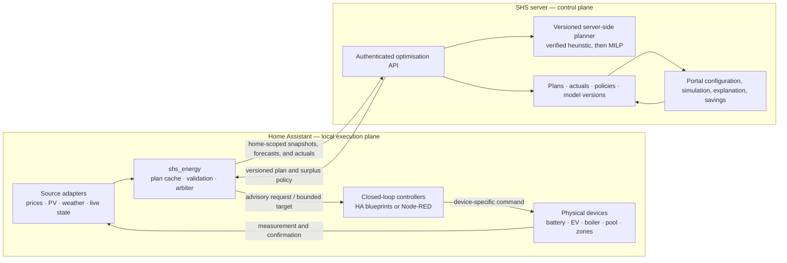
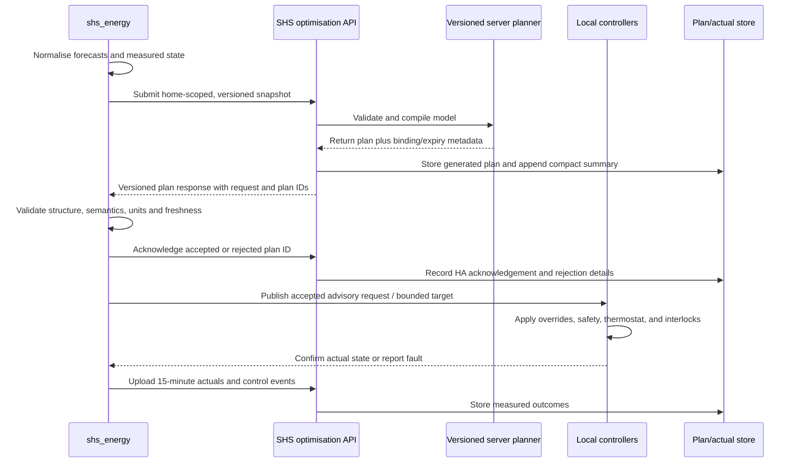
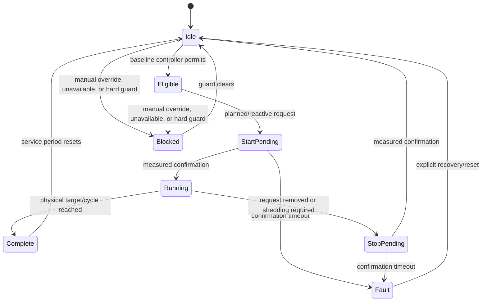

# Energy optimisation architecture

Status: **schema-v6 / marginal-value-planner-v11 state dispatch and versioned quarter-by-quarter decision evidence implemented; private API contract hardening and live commissioning are next; device executors remain**

Date: **2026-08-21**

Latest decisions: **§1.5** (Home Assistant room identity and shared preheating),
**§5.7** (normative private API contract and acknowledgement) and **§8.12.3**
(the plan view as a versioned, quarter-by-quarter audit surface).

Source material: `ENERGY_OPTIMISATION_NOTES.md`, the current portal implementation in
this repository, the current `shs_energy` Home Assistant integration in
`../shs-ha-integration`, and the exported Node-RED flows in
`~/Code/ha/node-red-flows`.

## 1. Decision summary

Build energy optimisation as three layers with deliberately different
responsibilities:

1. **SHS portal and backend — model and plan.** The portal owns the product
   home/device model and policy; Home Assistant owns local entity bindings. The
   portal owns customer preferences, tariffs, scenario simulation,
   calibration, plan history, actuals, and savings reporting. A separate
   server-side deterministic planner owns the first rolling optimisation
   calculation. The React browser application does not run the production
   optimiser. A Python/MILP service remains the planned replacement when the
   device/thermal constraint set outgrows the verified heuristic.
2. **`shs_energy` integration — observe and coordinate locally.** The integration
   normalises Home Assistant entities into one typed contract, sends measured
   state and forecasts to the backend, validates and caches returned plans,
   exposes the current recommendations as Home Assistant entities, runs one
   local surplus/load arbiter, and reports plan-versus-actual data.
3. **Home Assistant controllers — enforce and actuate.** Existing Node-RED flows,
   and later native HA blueprints/controllers, retain manual overrides,
   thermostats, completion detection, equipment interlocks, minimum run times,
   and command confirmation. Optimisation requests permission or a target; it
   does not bypass these controllers.

The server produces a rolling **72-hour look-ahead**, but only the portion backed
by published prices is binding. Later slots are advisory and exist primarily so
the model can value stored electricity and heat across a solar/weather change.
The canonical timestep is **15 minutes**. The server replans from measured state;
the local reactive layer corrects for what actually happens between plans.

The first shadow release simulates the battery, protects an explicit reserve,
optimises discrete pool work, inhibits empirical boiler duty cycles around high
loads, assigns a valid charger current to every planned EV quarter, and plans
room preheating against exact temperature objectives while publishing
opportunity/surplus signals. Device controllers retain their existing
closed-loop logic. EMHASS remains a useful reference and shadow comparator,
not the product runtime.

### 1.1 Implementation checkpoint (2026-08-10)

The initial production-shaped path now resolves the eight defects found in the
static portal prototype:

| Defect | Implemented correction |
|---|---|
| Customer telemetry was compiled into the public JavaScript bundle | Deleted the hard-coded input snapshot. The selected `home_id` now reads a row protected by RLS. Pairing codes and active device tokens are bound to one home. |
| The page was a manually copied snapshot | `shs_energy` now uploads completed 15-minute actuals and requests a fresh rolling plan hourly. The portal shows issue/expiry/source freshness and measured overlays. |
| A/B/C used unequal work and fabricated a final partial day | Services have explicit earliest times and deadlines. Only deadlines inside the horizon create work; all scenarios use the same rounded integer slot count, and end-of-solar metrics omit an unfinished final local day. |
| Pool, boiler and EV used fractional/chattering power and an invented 11 kW EV rate | Pool remains a contiguous whole-slot service. The boiler is now a probability-weighted empirical duty forecast with a separate bounded permit/inhibit control. An EV current controller supplies its reviewed minimum, maximum and step, while the integration applies the installation-wide three-phase 230 V contract; the planner chooses a supported current per 15-minute slot. Phil's 5–16 A range therefore models 3.45–11.04 kW rather than freezing the plan at the entity's instantaneous state. |
| The 80% battery claim was not verified | End-of-solar and terminal SOC are simulation invariants. The 80% target is soft by default so it cannot silently reserve solar and force pool/hot-water work onto night import; explicitly making it hard retains fail-closed infeasibility checks. |
| Export was valued with the import supplier price | SHS fetches spot prices and applies the selected supplier's effective-dated terms. Import and export are separate server-calculated series; Home Assistant price entities are not inputs. |
| One August day was repeated as baseload | Baseload is a weekday/weekend per-local-quarter median of recorder history. Only devices explicitly classified as controllable are subtracted and then added back as individual planner series; every other Energy Dashboard device remains represented by its real use inside baseload. p10/p90 and sample counts remain diagnostic data rather than graph noise. |
| Raw PV forecasts were treated as truth | HA keeps a compact forecast ledger, matches completed slots to actual solar, and publishes lead-day correction factors, sample counts, MAPE and bias. The planner and main graph use one corrected solar forecast; raw provider values remain quality diagnostics only. |

This is deliberately a **shadow/advisory release**. The integration exposes
verified planned-power requests and measured reactive surplus, but it does not
bypass existing thermostats, completion logic, manual overrides or interlocks.

### 1.1.1 Thermal checkpoint (2026-08-12)

The Thermal tab previously reported three rows as permanently blocked, and they
were hardcoded that way: no room temperature, actuator state or outdoor
temperature crossed the integration boundary, so no zone model could exist.
That pipeline now exists end to end — collection (§5.6), storage, and an
empirical per-zone fit (§9.3).

Two decisions were settled in the process and are load-bearing for everything
that follows:

- **The portal owns the room's temperature objectives, not Home Assistant
  schedule helpers** (§5.5). Reading scheduled levels out of local helpers
  would bind the contract to one home's automation conventions and could not
  be offered to other customers.
- **A painted quarter is an objective, not a thermostat band or a prescribed
  heater-on period.** The room must be at that mode's temperature when the
  quarter starts. The planner may heat in preceding setback quarters and is
  therefore free to spread recovery across rooms, prices and available power.

The room schedule editor, data model and planner constraint are now implemented
in §1.5. The setpoint-trajectory executor described in §7.5 remains outstanding.

### 1.2 Configuration and customer capability decision

Planning configuration is now deliberately smaller than reporting
configuration:

- **Off** keeps energy history and tariff exchange active without a planner or
  repair warning.
- **Live / automatic** reads aggregate meters from Home Assistant's Energy
  Dashboard and discovers supported forecasts, battery and EV entities.
- **Live / manual** exposes the same options in small capability-specific steps,
  not one scrolling form.
- **Demo** creates a clearly labelled synthetic plan. The integration refuses
  to expose demo plan slots to executor automations.

Solar, battery, pool, water heating and EV are independent optional
capabilities in snapshot schema 5. A category mapped for reporting is not
assumed controllable. A website-selected device enters the advisory plan as
soon as its local mapping is complete; there is no second enable or
deferrability-confirmation switch. Installation ratings still require measured
or explicitly commissioned values. The current planner only publishes and
visualises schedules: it never calls a Home Assistant actuator.

The GUI is stored as a Home Assistant config entry in
`.storage/core.config_entries`, but that file must never be hand-edited. The
supported machine/AI surface is the read-only
`shs_energy.discover_configuration` action and validated
`shs_energy.apply_configuration` action. This makes MCP-based commissioning
possible without granting an agent arbitrary file access.

For the inspected home, automatic discovery has verified the following source
set:

| Capability | Verified source or value |
|---|---|
| Whole-home energy | Energy Dashboard grid/solar/battery balance, checked against `sensor.sigen_plant_total_load_consumption` |
| PV forecast | Eight `sensor.meteo_solar_production_forecast_estimate_*` entities, 96 timestamped quarter-hours each; home location comes from HA because the entities do not repeat coordinates |
| Price forecasts | SHS `integration-prices` fetches `elprisetjustnu.se` spot intervals and applies the home-profile supplier and bidding area; grid tariffs are then added once per direction |
| Battery | 18.08 kWh, 8.8 kW charge, 9.6 kW discharge, live Sigen SOC, 13.2 kW plant/grid envelope |
| Pool | `sensor.pool_heater_energy` plus `sensor.pool_pump_energy`; active measured power about 3.67 kW; `input_boolean.pool_heating` is the season gate |
| Hot water | `sensor.hot_water_energy`; 3.0 kW installed rating remains an explicit commissioned fact |
| EV | `sensor.car_charging_lifetime_energy`, Tesla cable/SOC/target/energy-remaining entities, and `number.tesla_model_y_charge_current`; its 5 A minimum, 16 A maximum and 1 A step are reviewed from entity attributes. A timezone-aware departure timestamp is optional; without one, the target SOC is planned against the end of the rolling 72-hour horizon |

Pool and water heating are likewise included whenever their website role and
local mapping are ready. There is no user-defined pool service window: the
planner learns the daily pool energy requirement and may place it anywhere in
that local day. Water heating retains its learned full-day duty requirement.
Old inclusion toggles, confirmation values, and pool-window values are archived
during integration upgrade and are not consulted by the runtime.

### 1.3 Portal surface and energy-performance decisions (2026-08-13)

Decisions taken with Phil on 2026-08-13. Recorded here because they change what
the portal is *for*, not just how a screen looks.

#### 1.3.1 The energy-performance page was reporting a fabricated class

The Energiprestanda card showed **class A, 43.9 kWh/m²·år** for a 424 m² house in
Täby. The figure reconciles exactly with `src/lib/energiprestanda.ts`:

```
annualize = 365 / 43 = 8.488
heating 648 + hot water 8480 + cooling 9 + property 1204 = 10,341 kWh
10,341 × 1.8 / 424 = 43.9 kWh/m²  →  48.8% of 90  →  A
```

Working backwards, the window held **76 kWh of heating over 43 days ending
2026-08-11** — late June to mid-August. A pure summer sample was multiplied by
8.5 and presented as an annual heating figure. At this Atemp the class
boundaries sit at heating ≤ 907 kWh (A), ≤ 6,207 (B), ≤ 11,507 (C), ≤ 18,927 (D),
against roughly 10,261 kWh lifetime on electric heaters and 11,443 kWh on
aircon. The honest answer for this house is around C/D.

Five defects, all confirmed by reading the code rather than inferred:

| # | Defect | Location |
|---|---|---|
| 1 | `MIN_COVERAGE_DAYS = 30` plus naive linear `365/n` annualization. Heating is the most seasonal quantity in the building and is extrapolated from the least informative days of the year. | `energiprestanda.ts:36,191` |
| 2 | Two annualization gates differing by 10×, and the weaker one wins. The grid-import estimate refuses to annualize below `MIN_ANNUAL_COVERAGE_DAYS = 300`; the measured path annualizes from 30; `resolveEnergyPerformance` gives measured unconditional precedence. 43 days of summer HA data therefore override a year-plus of Ellevio data. | `energy-usage-series.ts:187`, `energy-performance.ts:139` |
| 3 | Two large errors partly cancelling, which is why the output looked plausible. Heating understated ~20–30×; hot water overstated ~4× (BEN's 20 × Atemp gives 8,480 kWh against ~2,000 kWh/yr measured). 82% of the total is a constant shared by every 424 m² house in Sweden, so the number barely measures the building. | `energiprestanda.ts:225` |
| 4 | The screen contradicts itself: the row is labelled "Heating (degree-day corrected)" while the evidence card says "No degree-day correction". `degreeDayFactor` needs ≥328 days of weather *inside the window*, so it is null and silently becomes ×1. Included posts are annualized, excluded posts are measured, both shown as bare kWh in adjacent columns. | `energiprestanda.ts:199-213`, `EnergiprestandaSection.tsx:379,417` |
| 5 | No geographic adjustment factor in the measured path at all, and Stockholm's 1.0 hardcoded in the estimate. Per BBR 31 (BFS 2024:14) Table 9:2c, F_geo applies to the heating term; the calculation is only valid where F_geo = 1.0. `energyClassForEp` also classifies against a flat 90 while the UI classifies via `smallHouseNewBuildRequirement`; they diverge below 130 m². Dead code today, wrong dead code. | `energiprestanda.ts:66`, `indicative-energy-performance.ts:28` |

Defects 1 and 2 are **deliberate and tested** — `energy-performance.test.ts`
contains `'prefers measured category data over the grid estimate'` and
`'reports medium confidence when category data covers only part of the year'`.
Correcting them changes tested intent; it is not a patch.

#### 1.3.2 Cold start is the primary path, not the fallback

Phil's house is not the normal case. Most customers will have, at best, a
whole-home total — often from a solar inverter's load meter rather than the
utility meter, so understated by whatever the inverter does not see. Per-category
measurement is the exception; **disaggregating a single total against a
reference model is the norm.**

This inverts the precedence in `energy-performance.ts`. The decision:

- Build an **archetype prior library**: expected annual kWh per BEN category,
  keyed on `dwelling_type` × `year_built` band × `heating_types` × climate, from
  published Swedish housing-stock statistics with the source and confidence
  recorded per entry.
- Measured per-category data wins **only at sufficient seasonal coverage**,
  measured as captured heating degree days against the normal year — never as a
  day count.
- Below that, show the prior (or the grid-import estimate where whole-home
  history exists), badged **modelled, not measured**, blending toward measured
  as coverage grows.
- The same layer serves the prospect pitch and the honest partial-year answer
  for a connected customer, so it is built once.

`home_questions` already carries the archetype key: `year_built`,
`dwelling_type`, `heated_boarea_m2`/`heated_biarea_m2`, `heating_types`,
`hot_water_type`, `occupants`, `has_solar`/`has_battery`/`has_ev`, `main_fuse_a`.

#### 1.3.3 Historical backfill is an integration action, not a one-off script

`recorder.purge_keep_days: 30` purges **states**; long-term statistics for
`total_increasing` energy sensors are retained indefinitely at hourly resolution
and are readable through `recorder/statistics_during_period`. A customer's full
history is therefore already available locally.

Decision: implement it as a `shs_energy` backfill action that walks statistics
and posts daily category totals through the existing ingest endpoint, rather
than a bespoke script for one house. Any customer with history benefits, and the
houses that do have category history become the calibration set for §1.3.2's
priors.

#### 1.3.4 The legacy simulator UI is removed

§3.1's limitations table stands, but the conclusion changes: the browser
simulator is not retained as a product surface. The **library** (`simulate-device-day.ts`
and the five device models) is kept for counterfactual and replay work; the tabs
built on it are deleted.

Verified before agreeing to the removal — none of these tables are read by the
planner path:

| Surface | Only consumers | Superseded by |
|---|---|---|
| `HomeDevicesTab`, `AddDeviceModal` (`home_device_assignments`) | `SimulatorTab`, `HomeDevicesTab`, `AddDeviceModal` | `energy_optimisation_devices` from Energy Dashboard discovery |
| `HouseSetupTab` (`energy_home_settings.ua_w_per_k`, `thermal_capacity_class`, `overrides`) | `SimulatorTab`, `HouseSetupTab` | Empirical per-zone fit (§9.3) |
| `TariffPricingTab` (`tariff_instances`, `energy_home_settings.tariff_instance_id`) | `SimulatorTab`, `TariffPricingTab` | `energy_tariff_profiles`/`_settings`/`_versions`, served by `integration-tariff` and edited at Settings → Energy Tariff |

`HouseSetupTab` also edited `home_answers`, but `/portal/home-profile`
(`HomeProfileForm`) loads **all** active `home_questions` and upserts the same
table — a strict superset. Deleting the tab loses no archetype input. That route
must stay reachable: `integration-tariff` reads `home_questions`/`home_answers`
directly, so the home profile is load-bearing for the live integration.

#### 1.3.4a Reference data behind the archetype priors

Implemented in `src/lib/energy-archetypes.ts`. Every number carries a
`provenance` of `published`, `interpolated` or `modelled` and a source string;
nothing in the table is an unattributed guess.

**Source** — Energimyndigheten, *Energistatistik för småhus 2024*, workbook
`smh_2024_tabellverk_v2.xlsx` (2025-06-10), committed to the repository so the
constants can be re-derived. Tables 2.14 (by build year) and 2.15 (by heating
system), both **temperature-corrected**, both heating and hot water only,
excluding household electricity and excluding heat absorbed from ground/air by
heat pumps. That basis is the delivered ("köpt") energy the BBR primary-energy
number is built from. Temperature-corrected is used throughout because a prior
should describe a normal year — the same basis the degree-day normalization
targets.

| Build year | kWh/m² | | Heating system | kWh/m² | ÷ 93.3 |
|---|---|---|---|---|---|
| ≤1940 | 113.6 | | Enbart elvärme (d) | 74.0 | 0.793 |
| 1941–1960 | 93.9 | | Enbart elvärme (v) | 64.8 | 0.695 |
| 1961–1970 | 89.4 | | Berg/jord/sjövärmepump | 50.2 | 0.538 |
| 1971–1980 | 81.1 | | Enbart fjärrvärme | 122.4 | 1.312 |
| 1981–1990 | 94.7 | | Enbart biobränsle | 167.9 | 1.800 |
| 1991–2000 | 98.4 | | Olja | 176.7 | 1.894 |
| 2001–2010 | 82.3 | | **SAMTLIGA** | **93.3** | 1.000 |
| 2011–2020 | 55.5 | | | | |
| 2021– | 40.2 | | | | |

**Two confident assumptions were wrong**, and both are recorded in the module
and pinned by tests so they cannot quietly return:

1. **Energy use is not monotonic in build year.** It falls to 81.1 for
   1971–1980, then *rises* to 94.7 and 98.4 for the 1980s and 1990s. The
   interpolation put 1991–2000 at 72 against a published 98.4 — a 26 kWh/m²
   error, more than a class boundary for a large house. A 1990 house now scores
   worse than a 1975 one, which is counterintuitive and published.
2. **Direct electric heating is *below* the stock average.** The modelled factor
   was 1.35, reasoning that a resistive house buys every kWh of heat it uses.
   Published: 0.793. The physics was right and the baseline was wrong — the
   stock average is dragged up by oil (1.894) and biomass (1.800) homes, and
   electrically heated houses skew newer and better insulated.

**Remaining modelled values**: dwelling-form multipliers; air-air, exhaust-air
and air-water heat pumps, which table 2.15 does not separate (they are electric
heating and sit inside the "enbart elvärme" rows, which already blend homes with
and without them); property energy at 3 kWh/m². The build-year × heating-system
combination is multiplicative, which assumes independence they do not exactly
have — newer homes are likelier to have heat pumps, so some effect is counted
twice. Tables 2.18–2.20 give published joint values but only for bergvärme and
the two electric categories, and are *inklusive hushållsel*, so they are not a
drop-in replacement.

Energimyndigheten also publishes an "uppgift saknas" row at 108.8 — homes with
no recorded build year use well above average. We deliberately use SAMTLIGA
(93.3) instead when build year is unknown: a blank in our questionnaire is not
the same population as a blank in the property register, and assuming the worst
about a prospect's house is not a neutral default.

Reference home (424 m², 43 summer days of category data, prior only): **EP 128.6
→ class E** for a 1975 air-air-heated build, against the 648 kWh of heating and
class A the old page produced. The E is **not a claim about that house** — it is
the prior for an un-upgraded build of that age and size, and **`home_questions`
has no renovation input**, so the prior is structurally pessimistic for an
improved older house. That is the right direction for a prior and is what
blending with measured data exists to correct, but a renovation-year question
would materially sharpen the cold start.

#### 1.3.4a-2 Ground truth: the 2020 energideklaration for the reference home

An official certificate for the reference home (Porfyrvägen 10, Täby;
Energideklarations-ID **1110952**, John Eriksson, Svensk Kvalitetssäkring,
2020-08-27, measurement period 2019-08 → 2020-07) is the first hard validation
of any of this. Every figure below is from that document.

| Field | Value |
|---|---|
| Nybyggnadsår | **1970** |
| Atemp, **measured** (excl. warm garage) | **435 m²** |
| Heating system | Värmepump-luft/luft (el) + el (direktverkande) |
| Ventilation | Självdrag (no heat recovery) |
| El (direktverkande) | 2,200 kWh |
| Värmepump-luft/luft (el) | 8,350 kWh |
| Tappvarmvatten (el) | 6,700 kWh |
| Fastighetsel | **0** |
| Hushållsel (excluded) | 13,050 kWh |
| Sum 1–17 (measured) | 17,250 kWh |
| Byggnadens energianvändning (normal-year) | 19,567 kWh |
| Byggnadens primärenergianvändning | 31,307 kWh |
| **Energiprestanda** | **72 kWh/m²·år → class C** |
| Specifik energianvändning | 45 kWh/m²·år |
| Referensvärde 1 (nybyggnadskrav) | 90 kWh/m²·år |
| **Referensvärde 2 (liknande byggnader)** | **148 kWh/m²·år** |

**Three facts fall straight out of the arithmetic and settle open questions:**

1. **F_geo for Täby is exactly 1.0.** 19,567 × 1.6 = 31,307 to the kWh, so the
   heating term was divided by 1.0. §1.3.1 defect 5 listed F_geo as unknown;
   for this municipality it is now known.
2. **The electricity weighting factor was 1.6, not 1.8.** 31,307 / 19,567 =
   1.6000. BBR 29 (BFS 2020:4) raised it to 1.8 effective 2020-09-01 — three
   days after this certificate was issued. **Any comparison against an older
   declaration must restate it**, or the same house appears to get worse for a
   purely regulatory reason.
3. **72 restated on today's factor is 81 kWh/m² — still class C** (90% of the
   90 requirement).

**Why the portal said E where the certificate said C.** They are not
measurements of the same thing, and the prior is behaving correctly:

| | kWh | vs actual |
|---|---|---|
| Actual heating (normal-year) | 12,867 | — |
| Actual hot water | 6,700 (15.4 kWh/m²) | — |
| Actual fastighetsel | 0 | — |
| **Actual building energy** | **19,567** | — |
| Prior heating | 23,944 | **1.86×** |
| Prior hot water (BEN 20 × Atemp) | 8,700 | 1.30× |
| Prior property energy | 1,305 | ∞ |
| **Prior building energy** | **33,949** | **1.74×** |

The prior gives **140.5 kWh/m²** for this house. Boverket's own *Referensvärde
2, liknande byggnader* on the same certificate is **148**. The prior is within
**5%** of the authority's figure for comparable buildings — it is predicting
"a typical 1970 Täby småhus of this size" accurately. This house measured
**81 kWh/m² restated, i.e. 55% of typical**. It was already an outlier in 2020,
and the improvements since then move it further down, not up.

So the C→E gap is almost entirely *this house being much better than its
cohort*, plus a 1.6→1.8 accounting change. It is exactly the situation the
"modelled, not measured" badge exists for, and it is the strongest possible
argument for the renovation input noted in §1.3.4a.

**Three corrections the certificate forces:**

- **Property energy must be 0 for a detached småhus, not 3 kWh/m².**
  Fastighetsel is common-area/plant electricity; a friliggande småhus has
  none. Note the HA `property_energy` category is a *different* concept and
  must not be mapped onto BBR fastighetsel without thought.
- **BEN's 20 kWh/m² hot-water schablon overstates for large houses.** A
  certified expert recorded 15.4 kWh/m² for this building. It is still the
  regulation-prescribed normalisation and we keep using it, but the page must say so,
  because for a 435 m² house it is 26% of the whole primary-energy number.
- **A measured Atemp should beat our estimate.** Official 435 m² against our
  boarea+biarea estimate of 424 — only 2.5% out, which is reassuring for homes
  with no certificate, but where a certificate exists its Atemp is authoritative.

#### 1.3.4a-3 Energideklaration upload (implemented 2026-08-13)

Certificates are parsed by the **existing** energy-data upload (Energy history →
Data), not a new surface. The uploader already distinguishes grid invoices,
electricity invoices, grid import and whole-home CSVs; a declaration is a fifth
kind. It is tried **before** the invoice parsers, because it is unambiguous to
detect and would otherwise be rejected with a useless `unknown_format`.

| File | Role |
|---|---|
| `src/lib/energy-declaration-parser.ts` | Pure parser. Accepts both the one-page summary and the full declaration. |
| `src/lib/energy-declaration-storage.ts` | Import, fetch latest, and `restatedPrimaryEnergy()`. |
| `supabase/migrations/20260813100000_add_energy_declarations.sql` | Table + `create_energy_declaration` definer function. |

Design points worth keeping:

- **Posts are parsed by number, not label.** Boverket's form numbers its energy
  rows (1)–(19) and those numbers are stable; the labels are translated,
  reordered and footnote-marked between versions. A row printed without a value
  ("Fjärrvärme (1) kWh") must stay *absent* rather than becoming zero, or an
  all-electric house acquires phantom district heating.
- **The weighting factor is taken from the document, not its date.**
  `primary_energy_kwh_per_year / building_energy_kwh_per_year` gives 1.6000 on
  the reference certificate. That is immune to a misparsed date and to
  transitional issuance. The date is the fallback.
- **Only structured data is stored**, matching the invoice behaviour. The PDF is
  not retained.
- **Writes go through a SECURITY DEFINER function** with direct INSERT revoked,
  matching `create_energy_billing_document`. A client must not be able to invent
  a certificate or fabricate an energy class.

One defect worth recording because the live document did not catch it: the
first version of the kWh/år pattern allowed the digit run to start mid-word and
to span a newline, so the footnote marker in "primärenergianvändning**6**" was
read as part of the value — 19,567 became 619,567, which in turn made the
implied weighting factor 0.05. The real PDF happened to lay out in a way that
hid this; the test fixture did not. Anchoring with `(?:^|\s)` and a space-only
inner class fixed it. **The fixture is more adversarial than the source
document, and that is the point of having one.**

#### 1.3.4a-4 Typed events (implemented 2026-08-13)

Events existed as free text on a date, drawn on the charts, entered from a form
buried under a chart in Comparisons. That makes them a caption. They are now an
**input**, because most of what looks wrong in energy data has a mundane
explanation only the customer has: they were away, the heat pump was broken,
someone moved in.

They live at **Energy history → Events**, alongside Data, because they explain
the data. Deliberately *not* added to `home_questions`, which is already
overloaded and is about the building rather than its timeline.

The axis that matters is not the label but the treatment:

| Treatment | Types | Effect |
|---|---|---|
| **Step** | renovation, heating system change, solar/battery installed, major load added/removed, occupancy increase/decrease | Data before the date describes a different house or household. Comparison across it is not like-for-like. Does **not** remove days. |
| **Period** | absence, guests, equipment fault | Those days happened but are unrepresentative. Excluded from anything that fits a model. Carries an end date, enforced by a check constraint. |
| **None** | other | Recorded and drawn, affects no calculation. Every pre-existing untyped note defaults here, so nothing retroactively changes. |

Wired in: `energiprestanda` drops flagged days from both the energy *and* the
degree days (dropping a fortnight's kWh while keeping its cold days would make
a house look worse for having gone away), reports `excludedDayCount`, and the
performance card names the adjustment rather than making it silently.

**A defect this found, and the invariant that now prevents it.** The first
implementation applied a renovation by shifting the effective build year toward
the renovation year — a 1970 house renovated in 1990 was treated as built in
1990. The published band table is **not monotonic** (1981–1990 uses 94.7 kWh/m²
against 89.4 for 1961–1970), so recording a renovation made the rating *worse*:
135.1 → 142.6 kWh/m². The bands describe original construction cohorts, not
renovation states.

A renovation is now a direct reduction in modelled heat demand — physically what
it is, and monotone by construction. The magnitude (15%) is `modelled` and
applied once regardless of how many renovations are recorded.
`heating_system_change` deliberately takes no discount, because the published
per-system factors in `HEATING_SYSTEM_FACTORS` already carry that improvement
and applying both would count it twice. A test now pins the invariant:
**a recorded renovation must never make the modelled rating worse.**

One further test note worth keeping. "Excluding a holiday must not distort the
degree-day ratio" initially failed with a 3.5 kWh/m² swing depending on whether
the excluded fortnight was in winter or summer. That was the *fixture*, not the
code: it used a flat 12 kWh/day of heating, which violates the proportionality
the whole normalization rests on. Under a physical fixture — heating
proportional to degree days — the estimator is unbiased, as it should be.

#### 1.3.4b The staff Device Catalog is removed too

Checked before agreeing: `device_types`, `device_instances`, `device_profiles`
and `performance_data` are read only by the simulator/catalogue components,
`src/lib/simulator/device-bindings.ts`, `src/lib/performance-data.ts`, and the
`delete-customer`/`delete-contact` cleanup functions. Nothing in the planner
path touches them.

The catalogue also holds no data — the Devices list is empty, and the type
taxonomy already contains visible duplicates (Air-Air Heat Pump, Appliance,
Base Load, Electric Heater, EV Charger and Hot Water Heater each appear twice).
There is nothing to preserve.

It is **not** needed for cold start: the archetype layer is building-level
(kWh/m² per BEN category by build year, dwelling form and heating system), not
device-level, and `include_in_standard_home` carries no information while the
device tables are empty.

One caveat for the future: §9.1 assigns device dynamics to "manufacturer
profile, then measured calibration", so a manufacturer-profile store has a
designed role. It should be reintroduced as a fresh design against the schema-5
device contract rather than by preserving this schema.

#### 1.3.4c Implementation status (2026-08-13)

Energy-performance correction and cold-start priors are **implemented**:

| File | Change |
|---|---|
| `src/lib/energy-degree-days.ts` | New. HDD/CDD, normal-year degree days, and `seasonalCoverage()` — the fraction of a normal year's degree days that fell inside the days actually measured. |
| `src/lib/energy-archetypes.ts` | New. Build-year bands, heating-system and dwelling factors, `archetypePrior()`, `disaggregateWholeHome()`, questionnaire normalizers. |
| `src/lib/energiprestanda.ts` | Rewritten. Per-post normalization (heating on HDD, cooling on CDD, property linear, hot water by BEN standard), seasonal-coverage gate, F_geo on the heating term, per-category coverage days, class bands expressed as percentages of the building's own requirement. |
| `src/lib/energy-performance.ts` | Precedence inverted: measured → grid estimate → modelled prior, with blending between the coverage thresholds. Adds `isModelled`, `measuredWeight`, `geographicFactorAssumed`. |
| `src/lib/home-profile-functional-data.ts` | Also reads `year_built`, `dwelling_type`, `heating_types` for the prior. |
| `EnergiprestandaSection.tsx`, `EnergyHistory.tsx` | "Modelled, not measured" badge, a basis message naming what the figure rests on, heating-season coverage replacing the day count, and the degree-day label contradiction removed. |

Thresholds: heating may not be extrapolated below **60%** of a normal year's
heating degree days, stands alone at **90%**, and is blended linearly between.
`MIN_COVERAGE_DAYS = 30` is gone.

Verified by compiling the modules with `tsc` and running the assertions under
Node (Deno is not installable in the agent sandbox; `deno task test` remains the
project runner and both suites are written for it). 28/28 on the performance
pipeline, 17/17 on the archetype table. `tsc --noEmit` and `eslint` are clean.

Effect on the reference home's 43-day summer window:

| | Before | After |
|---|---|---|
| Heating-season coverage | not measured (43/365 = 11.8% of *days*) | **0.97%** of a normal year's degree days |
| Method | `measured_categories` | `insufficient_heating_season` → falls through |
| EP | 43.9 kWh/m² | 128.6 kWh/m² from the prior |
| Class | **A**, "medium confidence" | **E**, "low confidence, modelled not measured" |

With Ellevio history present the live page will resolve to
`estimated_from_grid` rather than the prior. The true answer arrives after a
winter of category data. See §1.3.4a on why the prior reads pessimistically for
this house.

#### 1.3.5 Portal navigation

- The page is renamed **Energy Optimisation / Energioptimering**.
- `LoadShiftTab`'s four `PlanningDimension` values are promoted to top-level
  tabs. The resulting tab set is **ROI · Plan · Power · Thermal · Economics ·
  Storage**, with `Plan` holding the plan header cards (issue time, source,
  cost difference, battery low, validation errors) so the four dimensions are
  charts only.
- Multiple homes remain supported; `HomeSelector` stays.
- `Home Setup`, `Home Devices`, `Tariff & Pricing` and `Simulator` are removed
  per §1.3.4, and the staff `Device Catalog` route per §1.3.4b.
- `/portal/home-profile` and Settings → Energy Tariff must stay reachable —
  they are where the archetype inputs and the real tariff now live.

#### 1.3.5a Navigation restructure (implemented 2026-08-13)

Delivered as decided in §1.3.5:

| Change | Detail |
|---|---|
| Page renamed | **Energy Optimisation / Energioptimering**, in the page, sidebar and customer dashboard card |
| Tabs | **ROI · Plan · Power · Thermal · Economics · Storage** |
| `LoadShiftTab.tsx` → `PlanWorkspace.tsx` | Internal `PlanningDimension` state replaced by a `section: PlanSection` prop |
| Deleted | `SimulatorTab`, `HouseSetupTab`, `HomeDevicesTab`, `TariffPricingTab`, `DeviceCatalogTab`, `DeviceModelsTab`, `DeviceTypesManager`, `HouseModelTab`, `AddDeviceModal`, `DeviceEditorForm`, `CurveUploadModal`, `PerformanceDataEditor`, `PerformanceDataStatus`, `PerformanceCurveChart`, `EnergyVsTempChart`, `LoadCurveChart`, `pages/portal/DeviceCatalog` |
| Also removed | the `/portal/device-catalog` route, its sidebar entry and its dashboard card |
| Retained | `src/lib/simulator/*` for counterfactual/replay work (§3.1), `HomeSelector`, `EmpiricalDeviceModelsCard`, `ROITab` |

Two implementation notes worth keeping:

- **The plan sections render outside `TabsContent`.** `TabsList` is used as a
  segmented control and one `PlanWorkspace` instance is rendered below it. That
  keeps the component mounted across the five plan sections, so switching tabs
  changes a prop rather than remounting and refetching a 72-hour plan. Putting
  each section in its own `TabsContent` would have refetched on every click.
- **Content is split by section, not just the chart.** `Plan` owns the delta and
  KPI grids, plan-versus-actual, and data-source health. Each chart tab shows
  the plan header (status, issue time, With/Without plan toggle) plus its own
  chart, and the thermal readiness panel now lives on `Thermal` where it
  belongs. Validation errors show on every section because they always matter.

**Done in a follow-up commit.** `PlanWorkspace.tsx` went 1,467 → 627 lines:

| File | Holds |
|---|---|
| `plan/types.ts` | shared types, colours, thermal helpers |
| `plan/ui.tsx` | `Kpi`, `DeltaKpi`, `SeriesToggleLegend`, `SourceRow`, `EmptyState` |
| `plan/usePlanModel.ts` | every value the sections derive from one plan row |
| `plan/ThermalReadinessPanel.tsx` | per-zone model readiness |
| `plan/ActualPerformance.tsx` | plan-versus-actual reporting |
| `plan/sections/*Section.tsx` | one component per chart tab |

Series *visibility* deliberately stayed out of the model hook: it is per-section
UI state, so it lives in the section that owns the chart and toggling a series
on Power no longer re-renders Storage. Each section destructures only the model
fields it uses.

Because the app cannot be run from the agent sandbox, equivalence was checked
mechanically: whitespace-normalised diffs of the moved JSX and the derived-state
body against the previous commit are character-identical, the only deliberate
edit being an explicit `'good' | 'bad' | undefined` annotation on `costTone`,
which returning it through an object literal would otherwise widen to `string`.

#### 1.3.6 ROI is rebuilt on the planner

`ROITab` compares `model_runs` rows by `scenario`, but `simulateDeviceDay()` has
no `scenario` input — `SimulatorTab.tsx:477` writes it and nothing reads it. The
dumb/smart comparison runs the same simulation twice, and ROI selects the newest
of each independently, so the two sides need not share tariffs or model version.
Investment costs are hardcoded (50k/15k/299) rather than drawn from SKU/quote
data.

`comparePlans()` already yields the correct deltas (`netCostSekDelta`,
`terminalAdjustedCostSekDelta`). The gap is horizon: 72 hours is not a year.

**Implemented 2026-08-13** in `src/lib/energy-roi.ts` and a rewritten `ROITab`.
Savings now come from `energy_optimisation_plan_runs` — the planner's own
priority-versus-baseline comparison for this home, which is real, specific and
accumulating. Three properties of that data shaped the design:

1. **Runs overlap.** They are issued hourly over a 72-hour horizon, so
   consecutive runs share 71/72 of their window. Averaging *rates* is unbiased,
   but the independent sample is the number of **distinct days**, not runs. The
   UI reports days; a test pins this (240 runs over 10 days must read as 10).
2. **Retention is 30 days** (`prune_energy_optimisation_data`), so a *measured*
   annual saving can never be accumulated. The annual figure is therefore an
   explicit "if this rate held all year" extrapolation, labelled as such on the
   card and in the method note. A durable monthly rollup is the proper fix and
   remains outstanding.
3. **Only `ready` runs count.** An infeasible or incomplete run has no
   meaningful cost to compare and would drag the median.

Below `MIN_DAYS_FOR_OBSERVED_RATE` (7 days) the page states **no figure at all**
and says which of "no plan history" or "too few days" applies. It does not
substitute a modelled number for the customer's own.

#### 1.3.6a The seasonal fixtures found a planner regression

The first plan was to derive the annual figure from the §10.1 seasonal fixtures.
Running them stopped that:

| Fixture | Priority | Baseline | Saving over 72 h |
|---|---|---|---|
| Winter | 154.39 | 160.07 | +5.68 |
| Spring | 55.05 | 63.09 | +8.05 |
| Summer | −10.26 | −0.65 | +9.61 |
| **Autumn** | **112.38** | **99.61** | **−12.77** |

**In the autumn fixture the priority plan costs 12.77 SEK more than its own
baseline**, and both plans end at an identical 55% SOC, so it is not a
terminal-valuation artefact. Weighted by season the reference home's "annual
saving" comes to 313 SEK — a number that would have been presented as a business
case while burying a planner defect inside it.

So the fixtures are **not** used as a customer figure. `seasonalPlannerCheck()`
runs them as a diagnostic, flags any season where the plan loses to its own
baseline, and the ROI page shows that regression explicitly rather than
averaging it away. Investigating the autumn case belongs with the §10.1 autumn
scenario work: "stable seasonal restart, preheating and forecast-error
recovery".

Investment and subscription remain manual inputs, now labelled as example
values rather than presented as if sourced. Pulling them from an accepted quote
is separate work.

#### 1.3.7 Measured history becomes its own tab, and gets a price (2026-08-13)

Decided with Phil on 2026-08-13. The Plan tab carried two charts: the forward
plan and `ActualPerformance`'s trailing 72 hours. They are separated, both get a
1/2/3-day window control, and both gain a per-device table underneath. The
history tab gains window summary cards (grid import, grid export, cost, house
consumption, solar production).

##### 1.3.7.1 The portal has no historical price, and could not derive one honestly

Everything below follows from one gap. The website stores measured energy and
nothing else:

| Store | Holds | Covers |
|---|---|---|
| `energy_optimisation_actual_slots` | kWh per quarter, per category | past, 120-day retention |
| `energy_optimisation_device_slots` | kWh per quarter, per device | past, 120-day retention |
| `energy_optimisation_current.plan` | priced slots | **now → +72 h only** |
| `energy_optimisation_plan_runs` | `summary` jsonb, no slots | past, 30 days |

The plan's prices never overlap the history window, and the plan runs keep no
slot array, so no stored row anywhere prices a past quarter.

Recomputing one in the portal was rejected. The price the planner optimises
against is **all-in** — supplier spot × the effective-dated supplier terms,
plus grid transfer, plus energy tax, plus VAT (`coordinator.py:2141`, summing
`supplier_import` and `grid["import_price_sek_per_kwh"]`). The supplier half is
already shared TypeScript (`_shared/energy-supplier-pricing.ts`), but the grid
half exists only as Python in `tariff.py:_transfer_rate`/`_energy_tax_rate`.
Reimplementing it in TypeScript would create a second pricing implementation
free to drift from the one that actually spent the customer's money, and the
history tab exists precisely to audit that spending. **One price implementation,
and it is the integration's.**

##### 1.3.7.2 Home Assistant sends the price; a new archive stores it

The integration already holds both halves for any timestamp, past or future:
`integration-prices` accepts `from`/`to` and serves historical spot up to 62 days
per request, and grid tariffs are effective-dated and published ahead, so
`current_grid_prices(catalog, when)` resolves a past quarter exactly rather than
predicting it. So the integration sends the number it used.

- New table **`energy_optimisation_price_slots`** — `(home_id, start_ts)` unique,
  all-in import and export price, `source`, 120-day pruning alongside the other
  quarter tables.
- New optional **`price_slots`** array on the ingest payload.

Prices are a separate array rather than two more columns on `actual_slots`, for
three reasons: a price exists for future quarters that have no actuals; the
ingest deliberately refuses actuals older than 8 days to keep the recorder
watermark honest, and a backfill needs a far wider window; and a published price
is a property of a quarter for the home, not of a measurement of it.

**The ingest also archives the snapshot's own priced slots** (`source =
'snapshot'`). The snapshot already carries the same all-in numbers for its
horizon, so this costs nothing, and it means the archive starts filling from the
moment the website deploys rather than waiting on a HACS release. Both writers
produce the same figure by construction — the snapshot's prices *are* the
integration's — so the upsert lets either win and only records which arrived
last.

##### 1.3.7.3 Backfill is an integration action

Phil is tuning the planner and needs to check historical figures now, so the
archive filling forward is not sufficient. `shs_energy.backfill_prices` walks a
requested window, pairs historical supplier prices with the tariff catalogue
quarter by quarter, and pushes them in chunks. It reuses the machinery the
supplier daily-cost backfill already has for 61-day chunked historical fetches
(`coordinator.py:987`).

##### 1.3.7.4 Only grid energy costs money

Solar and battery energy are priced at zero. Panel and cell degradation are real
costs and are deliberately out of scope; the tables say so rather than implying
self-consumption is free in an accounting sense.

Each quarter is decomposed into where the load's energy came from, before any
device sees it. Exported energy is assumed to be solar before it is battery, and
battery charging is assumed to take surplus solar before it takes grid:

```
solarToExport  = min(S, E)
solarToBattery = min(S − solarToExport, Bc)
gridToBattery  = Bc − solarToBattery
solarToLoad    = S − solarToExport − solarToBattery
batteryToLoad  = Bd
gridToLoad     = G − gridToBattery
```

Every device in the quarter then takes a share `e_d / L` of each of
`gridToLoad`, `solarToLoad` and `batteryToLoad`, and is charged
`grid_d × import_price` for that quarter. Four energy columns — **Grid, Solar,
Battery, Total** — plus SEK, sorted by Total descending.

Two rows exist so the columns reconcile against the bill rather than
approximately resembling it:

- **Base load — everything else**, `L − Σ e_d`. Without it the table would omit
  every unmetered device and quietly understate the house.
- **Battery charging**, carrying `gridToBattery` and `solarToBattery`. Grid
  energy that charged the battery is real grid energy on a real invoice; with no
  row to hold it the Grid column would sum to less than the metered import and
  the cost column to less than the bill.

With both rows the Grid column sums to `G` and the cost column to
`Σ G × import_price`, exactly.

**The meter balance residual is shown, not smoothed.** `total_load_kwh` is
derived from the category balance when it is not measured directly
(`coordinator.py:_actual_quarters`), in which case
`gridToLoad + solarToLoad + batteryToLoad = L` identically and the residual is
zero. Where the load is separately metered the two can disagree. That difference
is reported as its own figure rather than scaled away across the devices: this
tab is a debugging surface for the planner, and a scaling factor hiding a broken
category mapping is the exact failure §1.3.1 was written about.

##### 1.3.7.5 A randomised test caught surplus solar being billed as consumption

The fixed unit cases all passed. A property test over 2,000 randomised quarters
did not, and the defect it found is one those cases could not reach.

`total_load_kwh` is derived as `max(0, G + S + Bd − Bc − E)`. When solar exceeds
everything the house consumed, stored and exported — curtailment, or a load
meter reading low — that `max` clamps and the balance identity stops holding
from *above*: the sources exceed the load. The first implementation still
handed every device its share of all three source terms, so each one was
credited with solar that never reached it, and the solar column inflated. Over
the randomised window this came to **358 kWh of fictitious consumption**.

The supply terms are now capped at the reported load, and **only solar and
battery give way**. The grid term must survive intact, because
`grid column = metered import` is the one identity that has to match an invoice.
Whatever is held back is reported as unmatched supply rather than discarded
silently — on this tab that number is a symptom worth reading, not noise.

Two properties are now pinned by test across the randomised window: the grid
column totals the metered import, and the cost column totals
`Σ import × price`. Both to within 0.05 kWh and 0.05 SEK over 2,000 quarters.

##### 1.3.7.6 The backfill moved to the portal, which reverses §1.3.7.1

§1.3.7.1 rejected pricing in the portal because it would mean a second
implementation of the grid tariff. That reasoning was sound and the conclusion
is now overridden, deliberately, for a reason that only appeared in use:
**a backfill that runs in Home Assistant is not a backfill anyone will run.**
The integration action worked, but it put a manual Developer-Tools step between
the customer and a priced history, and it failed opaquely when the data behind
it was missing. The portal owns the surface that shows the gap, so it should own
the button that closes it.

**What actually failed first was data, not code.** `shs_energy.backfill_prices`
returned `502 price_lookup_failed` for every historical date. The Tibber profile
was seeded with a single version valid from **2026-08-13**, and
`integration-prices` resolves supplier terms per day:

```js
const version = versions.find(candidate =>
  candidate.valid_from <= localDate && (!candidate.valid_to || ...));
if (!version) throw new Error(`supplier terms missing for ${localDate}`);
```

so every date before today threw into the catch-all. The grid half was never the
problem — the Ellevio catalogue is effective-dated from 2025-01-01. Three
consequences:

1. **`integration-prices` now separates the cases.** Absent terms return
   **422 `supplier_terms_missing`** naming the date and the earliest terms on
   file; a malformed range returns 400; only a genuine upstream failure is a
   502. The old behaviour cost an afternoon of reading Home Assistant
   tracebacks to learn something the server already knew.
2. **Historical Tibber terms are an explicit assumption.** Revision
   `tibber_se_assumed_from_2025-01-01` carries today's terms backwards, named so
   it can never be mistaken for sourced data, and superseded automatically by
   publishing the real terms. The spot price it multiplies is real per-quarter
   market data, so the error is bounded by the markup — a few öre per kWh, not
   the price itself.
3. **`backfill-energy-prices`** prices a home's window from published spot plus
   the tariff in force, and the History tab offers it exactly where the unpriced
   quarters are counted. It reports which days it skipped and why, rather than
   failing the run — the integration action aborted on its first bad chunk, and
   since chunks ran oldest-first, the one window that would have worked was last
   and never ran.

**The duplicate implementation is answered structurally, not by argument.**
`_shared/energy-grid-pricing.ts` ports only the marginal per-kWh path of
`current_grid_prices` — monthly invoicing, fixed fees and demand charges stay in
the integration alone. `grid-price-parity.fixture.json` holds 17 cases captured
from the Python (band edges, weekends, Christmas Eve, computed Easter dates,
reduced energy tax, VAT-registered export, per-selector transfer, outside the
catalogue) and is **duplicated verbatim in both repositories**, because CI cannot
reach across them. Each repo asserts its own implementation against it, so
changing the calculation in either place fails that repo's suite. The duplication
is the mechanism, not an oversight.

`source` on a price row records which writer produced it — `integration`,
`snapshot` or `portal_backfill` — so if the parity check ever does fail, the
affected quarters can be found rather than guessed at.

### 1.4 The objective past the day-ahead window (2026-08-13)

Decided with Phil on 2026-08-13, after the live plan came back **infeasible**
with `priority: terminal SOC 5.0% is below 20.0%` and a schedule whose second
and third days made no sense — pool-room floor heating in August, and loads
piled into hours nothing justified.

#### 1.4.1 The unpriced two-thirds of the horizon had no objective

Nord Pool publishes day-ahead. The horizon is 72 hours. So **roughly one third of
every plan is priced and two thirds are not**, and this is permanent, not a
fault. Confirmed on the live plan: `binding_until` 2026-08-14T22:00Z against an
`issued_at` of 2026-08-13T21:45Z — about 26 hours priced out of 72. The portal
showing "39.4 kWh grid import · 0.0 priced" is therefore *correct*: the import
all falls in the unpriced tail. That reading was initially mistaken for a
pricing bug, and it is not one.

What the unpriced tail had instead was this, at `energy-optimisation.ts:1148`:

```js
const score = slots[index].binding
  ? solarW / 1_000 * SLOT_HOURS * slots[index].export_price_sek_per_kwh! +
    gridW / 1_000 * SLOT_HOURS * slots[index].import_price_sek_per_kwh!
  : gridW / 100;
```

Three defects in that one fallback:

1. **No time preference.** 03:00 and 18:00 score identically, so a deferrable
   load lands wherever the tie-break puts it.
2. **Linear in power, so no reason to spread.** Splitting a load across four
   slots and dumping it in one score the same. Nothing in the objective has ever
   preferred a flat grid draw.
3. **Not in SEK.** The priced branch is money; this is watts over an arbitrary
   100. The two are compared against each other whenever a service can be placed
   on either side of the day-ahead boundary, and the exchange rate between them
   is meaningless.

#### 1.4.2 One mechanism, not four patches

Phil asked for four things: use solar rather than grid; prefer historically cheap
hours when unpriced; spread grid load to limit peak demand; and export on a price
spike when the energy can be cheaply replaced. These are not four features. They
are four consequences of one missing quantity — **what a kWh is worth in a given
slot** — so the planner gains exactly that:

```
shadowImport(slot) = published import price                      when binding
                   = shapePrior(quarter-of-day) × recentLevel     otherwise
```

- **Solar** already falls out: `gridW` excludes `solarW`, so self-consumption
  wins whenever the shadow price is positive.
- **Time preference** is `shapePrior`.
- **Peak** is a convex adder, below.
- **Export** compares the export price against the *replacement* cost of the
  energy, below.

Everything stays in SEK, so the day-ahead boundary stops being a discontinuity
in the objective.

#### 1.4.3 The shape prior is measured, not assumed

Phil's description — "peaks are usually early morning and late evening" — is
correct and is exactly the kind of claim §1.3.1 exists to warn about: it must not
be hard-coded as a constant. It is **derived from the home's own stored prices**,
which is possible now only because §1.3.7 gave us somewhere to store them:
`energy_optimisation_price_slots` holds real all-in per-quarter prices, and the
backfill fills it 120 days back.

So the prior is a by-quarter-of-day median over the stored archive, normalised to
its own daily mean, computed per home and recomputed as the archive grows.
Properties that matter:

- **Normalised shape × recent level**, not an absolute historical price. Shape is
  stable across seasons in a way that level is not, so a July prior must not
  price a January slot.
- **Weekday and weekend are separate**, matching how the base-load profile is
  already built.
- **One estimator, no tiers and no floor** (rewritten 2026-08-18). This
  originally read "below a coverage floor there is no prior, and the planner
  says so rather than inventing one", on the grounds that a home with three
  days of archive has no business claiming to know its price curve. Both that
  and the two-tier patch that briefly replaced it were wrong, for the same
  reason: the fallback was never *no* claim. It was a **flat** tail, and since
  the planner reasons entirely in shadow prices (`planDispatch` bids against
  them, `batteryValueCurve` is built from them, export replacement cost and
  thermal scoring read them), a flat tail deletes time preference from the
  objective itself. That is a far stronger and worse claim than the weak one
  the floor was protecting against, and it is what every young installation got.

  There is now a single weighted estimate and no branch anywhere on how much
  data exists. Every observation contributes with a weight:

  | Factor | Form | What it buys |
  |---|---|---|
  | Recency | Exponential, 21-day half-life | Three days and three years are the same computation; a tariff change works through in about a month |
  | Day type | Same type 1.0, other type 0.35 | A home that has only seen weekdays still gets a weekend answer, softened, instead of a hole |
  | Season | Gaussian over circular day-of-year, σ 45 days | Last February informs this February once the archive holds one, and is inert before that rather than a separate mode |

  Each observation is divided by its own day's mean before it counts, which is
  what keeps shape separable from level, and thinly sampled quarters shrink
  toward a multiplier of 1 — "no opinion" — so a single day cannot spike.

  The floor under all of it is that **the plan's own published day-ahead window
  is an observation**. A home with an empty archive still has a day of real
  prices in front of it, so a shape can always be estimated from something
  measured. The only remaining unshaped case is a plan carrying no prices at
  all, which is a broken price source rather than a young one.

  Two traps this had to survive, both found by reading the live chart. The
  archive holds *tomorrow's* published prices as well as history, because the
  snapshot carries them and they are stored on ingest — so anything phrased as
  "the most recent days" silently included the days it was about to predict.
  And a part-archived day would let a handful of quarters define their own
  slots outright while contributing nothing to the rest. Observations are
  therefore aged against the snapshot's own capture time, never the wall clock,
  and a day under half archived is dropped entirely.

#### 1.4.4 Peak spreading survives the effektavgift being suspended

The grid tariff currently has no demand charge — `peak_demand_kw: null` on the
live cost sensor — and Phil expects something equivalent to return. The peak term
is therefore added now with a weight that is deliberately small: enough to break
ties toward a flat grid draw, not enough to override a real price difference.
Being **convex** in grid power is what does the work; the magnitude only decides
how much price it is worth trading away. When a demand charge returns, the weight
becomes its actual rate and the mechanism is already in place.

#### 1.4.5 Export is an opportunity cost, not a threshold

Battery export already exists — `battery-export-planner-v6`, gated at
`energy-optimisation.ts:1689` on:

```js
slot.export_price_sek_per_kwh! >= policy.battery_export_min_price_sek_per_kwh
```

A fixed threshold cannot express the condition Phil actually stated, which is
comparative: export when the spike beats **what it will cost to put that energy
back**. That replacement cost is knowable from the plan's own horizon:

```
replacementCost = 0                             when forecast surplus PV will
                                                refill the reserve anyway
                = min(shadowImport over the remaining horizon)
                  / (charge_efficiency × discharge_efficiency)   otherwise
```

Export when `exportPrice > replacementCost`, subject to the existing reserve SOC
floor. The static threshold stays as a hard floor beneath it, because a spike
that beats a cheap tomorrow can still be a bad trade in absolute terms.

This also addresses the infeasible plan. Terminal SOC was violated because
nothing past the priced window valued stored energy, so the battery was worth
draining. Once `shadowImport` extends across the whole horizon, the terminal
valuation the plan already computes has something to price against.

### 1.5 `forecast_w_by_slot` is a command, not a forecast — IMPLEMENTED 2026-08-14

**Status: fixed for setpoint-controlled heating zones.** The empirical profile
remains appropriate for non-thermal devices; it is no longer allowed to become
a room-heating schedule.

#### 1.5.1 Why this outranks the objective

§1.4 changed *when* the planner places load. It cannot change *how much*, and
the numbers that make a plan unreadable are magnitudes:

| Device | Planned, 72 h | Measured, 72 h |
|---|---|---|
| Pool room floor heater | **10.98 kWh** | ≈ 0 |
| Base load — everything else | **67.2 kWh** | 36.6 kWh |
| Car charging | 1.7 kWh | 19.1 kWh |

Floor heating for eleven kilowatt-hours in August is not a scheduling decision.
Nothing in the objective creates load; it only moves it. That number comes from
`device_models[].forecast_w_by_slot` in the snapshot, built by the integration in
`optimisation.py`, and the portal's planner consumes it as given.

**The critical property, in Phil's words: it "is not making a forecast, it is
deciding what controllable loads to actually run."** For a controllable device
the planner does not predict demand and then satisfy it — the forecast *becomes*
the schedule the automations execute. A forecast that says three hours of
basement floor heating is an instruction to run it for three hours. So an error
here is not a cosmetic mis-estimate on a chart; it is the wrong physical
behaviour, and it is why the automations are not wired up yet.

Judging the schedule is impossible until this is right, and no further work on
the objective is worth doing before it.

#### 1.5.2 Where to look

- `custom_components/shs_energy/optimisation.py` — `build_empirical_device_profile()`
  and `build_base_load_profile()`. These produce the per-slot series.
- `OPTIMISATION_PROFILE_DAYS = 10` in `const.py` — the sample window.
- The profile is keyed on weekday/weekend and quarter-of-day, like the price
  shape in §1.4.3.

#### 1.5.3 Questions worth answering first

1. **Is a seasonal load being projected out of season?** A ten-day trimmed mean
   has no notion of "the heating season ended". If the sample window catches any
   heating at all, or a thermostat self-test, it becomes a standing daily
   expectation. Check what the pool room floor heater actually drew over the
   sample window — `sensor.pool_room_floor_heater_energy` — before assuming the
   statistic is wrong; the meter may be reporting something real.
2. **Is a `setpoint` device being modelled as an energy demand at all?** Twelve
   of the seventeen mapped devices are `setpoint`, but they are meters and
   actuators rather than thermal zones. A room's demand is a function of its
   measured temperature, fitted response, outdoor temperature and scheduled
   objective (§9.3), not of what one heater drew last Tuesday. A duty-cycle mean
   is the wrong model for it, and that would explain heaters appearing in an
   August plan.
3. **Why is planned base load 1.8× measured?** Both figures now mean the same
   thing after the device-list fix, so the comparison is finally sound. Suspect
   double counting: `build_base_load_profile` subtracts modelled devices from the
   house total, so a device that is metered but *not* modelled stays inside base
   load while also appearing as its own row.
4. **What should a device with no usable history do?** Silence and a standing
   average are both wrong. A device the planner cannot model should probably be
   excluded from control and left in base load, rather than issued a schedule
   derived from noise.

#### 1.5.4 What actually predicts the five loads (Phil, 2026-08-14)

Recorded verbatim in substance because it is the domain knowledge the statistics
were missing, and it reframes the whole problem.

**Five loads matter. Everything else is base load:**

1. Car charging
2. Water boiler
3. Pool heating
4. Air conditioners
5. Electrical heaters

**Four factors predict them:**

| Factor | Availability |
|---|---|
| Season | Known exactly, free |
| Outdoor temperature | Forecast, already in the snapshot. Kept **separate from season** on purpose — a mild January and a cold May are not their seasons |
| Solar gain (passive heating through glazing) | Derivable from the PV forecast, but needs work: the panels measure *electrical* yield, and what matters here is *thermal* gain into the house. Related but not the same curve |
| **Occupancy** | **Missing. This is the gap.** |

A ten-day trimmed mean of past consumption is a proxy for all four at once and
therefore for none of them. That is the whole defect: `build_empirical_device_profile`
answers "what did this device draw at this quarter last week", when the question
is "what will this room need, given who is home, how cold it is outside and how
much sun is coming through the windows".

##### The occupancy model already exists — in Node-RED

Phil's occupancy model is, in effect, the room heating schedules in Node-RED. It
must not be a runtime dependency — **nothing in the website may call Node-RED** —
but the schedules are the best statement of household routine available and
should be *extracted once* to prime the website's own model.

Shape, from the `cronplus` "Heating Schedule" node:

| Schedule | Cron | Writes |
|---|---|---|
| `morning_high` | `00 5 * * *` | `high-temp` |
| `morning_low` | `30 9 * * *` | `low-temp` |
| `evening_high` | `0 14 * * *` | `high-temp` |
| `evening_low` | `30 21 * * *` | `low-temp` |

So a zone is *occupied-warm* 05:00–09:30 and 14:00–21:30, and setback otherwise.
The thirteen zones each own an `input_text.<zone>_heating_mode`, confirmed live:

`basement_bathroom`, `entrance_hall`, `ground_floor_bathroom`, `kitchen`,
`laundry`, `living_room`, `marks_bedroom`, `master_bathroom`, `master_bedroom`,
`parents_room`, `phils_office`, `sophia_s_bedroom`, `tv_room`

Their states right now are a mix of `off`, `low-temp` and `high-temp`, so the
mode is real, per-zone, and already machine-readable.

**Implemented routine input, replacing the trimmed mean for heating rooms:**

- A per-room weekly **comfort schedule** — quarter-of-day × day-type → one of
  `off` / `low-temp` / `high-temp` — seeded by a one-off import of the cron
  expressions above, then editable in the portal. It is a *household routine*,
  not a device statistic, and is keyed by the stable Home Assistant area ID.
- The room's demand for a slot is then the **thermal model** (§9.3) evaluated
  against that mode's objective and the outdoor forecast — not a historical
  mean. June–August use an explicit heating lockout. Outside that lockout warm
  outdoor air contributes passive heat through the fitted physics, but does not
  falsely claim that a currently cold room is already at its next objective.
- `ble_trilateration` (Phil's work in progress) can later replace the seeded
  schedule with observed room occupancy. The interface should therefore be
  "a per-room occupancy/comfort series", so swapping the source changes nothing
  downstream.

##### What must stay reactive, and must not enter the plan

Some occupancy is unpredictable by construction. These belong to the reactive
controller (§7, **not yet built**) and the planner should not pretend to model
them:

1. **Pool usage.** Only detectable through `sensor.pool_room_th_humidity`: it
   spikes when the cover comes off and falls once the FTX has pulled the
   moisture back out. The existing Node-RED FTX flow already encodes usable
   thresholds — humidity limits scaled by pool-room temperature (>50% above
   24 °C, >60% at 20–24 °C, >70% at 16–20 °C, >80% below 16 °C), a 3-hour
   maximum FTX run, and a `counter.swim_count` incremented on a >65% spike.
   That counter is a genuine occupancy signal and is already being recorded.
2. **Sauna.** Not metered as a device at all, and enormous — unmetered draw has
   been seen spiking to 16 kW, with the low setting around 8 kW. Nothing can
   plan around it; the reactive layer has to absorb it. Worth noting it will
   also corrupt any base-load statistic that includes it, which is an argument
   for fitting base load robustly (median, trimmed) rather than on the mean.
3. **Car usage.** Ordinary departure/return variance.
4. **Away for a few hours.** Phil's existing automation drops every zone to
   `low-temp`. **The reactive controller should deliberately do nothing here.**
   The recovery is the problem, not the setback: every zone returning to
   `high-temp` simultaneously produced a large coincident spike, which mattered
   under effektavgift and matters *more* under 15-minute spot pricing, since the
   return can land on an expensive quarter. Any future handling must stagger the
   recovery, not just trigger it.
5. **Vacation.** The simple case, and the one worth building first: let the house
   fall to a floor (~12 °C), then reheat gradually starting ~48 h before return,
   spreading the recovery to limit peak draw. Needs explicit away-dates as an
   input — which the portal is the natural place to hold.

##### Sequencing this work

1. Fit heating rooms from the thermal model + comfort schedule instead of the
   historical mean. Largest single correction, and it fixes the August floor
   heating outright.
2. Import the Node-RED cron schedules once to seed the comfort schedules.
3. Separate solar *thermal* gain from PV electrical yield.
4. Boiler, pool and EV keep demand-based models (litres, degrees, kWh to
   departure) rather than occupancy schedules — they are services with
   deadlines, which §5.5 already describes.
5. Vacation dates as a portal input; reactive controller later.

#### 1.5.5 Implemented comfort-driven forecast (2026-08-14)

The fix keeps the routine in the portal, Home Assistant identity and telemetry
in the integration, and the fitted physics in the planning edge. Nothing calls
Node-RED at runtime.

**Room identity and configuration**

- Thermal intent is keyed by Home Assistant's stable **area ID**, with the live
  area name retained as its display label. An Energy Dashboard meter is no
  longer treated as a room. Several meters and several heater/climate actuators
  may map to the same room; their energy and rated power are summed for one
  temperature model and one objective.
- Both direct-setpoint devices and on/off room heaters ask for a temperature
  sensor and all controlled heater/climate entities; only the setpoint contract
  additionally offers a direct target entity. The integration derives one
  stable room ID from the actuators' entity or parent-device areas. Save fails
  if an actuator has no area or the actuators span multiple rooms. It no longer
  asks for a duplicate room selector, scheduled comfort/setback helpers or
  reactive manual-override fields. The portal groups every Ready room control
  by that area and shows the complete actuator list beside its schedule.
- An explicit `setpoint` planning role is authoritative regardless of the
  Energy Dashboard category. Heating meters, heat-capable air conditioners and
  pool-room equipment therefore create the same room-owned comfort schedule;
  an inferred `cooling` or `pool_heating` label cannot hide a Ready mapping.
- A `switch_schedule` mapping joins the room model when its category is
  `heating` or `cooling`; this covers resistive heaters and reversible air
  conditioners without turning pool pumps or household switches into rooms.
  Multiple such devices in one area remain one comfort objective.
- The planned-control mappings otherwise use the same smaller contract: switch
  minimum run is optional; availability/season is gone; power is one field that
  accepts either a W/kW entity or reviewed watts; and variable-power control
  uses one number entity plus optional minimum and maximum.
  Entity bounds are proposed automatically, while entered bounds take
  precedence.
- Each device card has its own Save action. Home Assistant validates the card,
  sends the resulting mapping to the server and changes the card to **Ready**
  only from the acknowledged response. Live entity, device and area names are
  uploaded on later exchanges. A complete-inventory marker retires Energy
  Dashboard devices that were removed, while reappearing keys clear retirement;
  renamed devices and rooms therefore update without creating phantom controls.

**The schedule's meaning**

- `energy_optimisation_comfort_schedules` stores one 96-quarter weekday row and
  one weekend row per room, plus its Off, Setback and Comfort temperatures. A
  trigger creates and renames the row from ready room mappings, preserves it
  when another heater joins the room, and keeps it dormant if the final heater
  is retired or temporarily unmapped. Existing rows are seeded once with the Node-RED routine:
  05:00–09:30 and 14:00–21:30 at `high-temp`, `low-temp` otherwise.
- Energy Modeling has a **Comfort** tab. The customer selects a room, chooses an
  Off / Setback / Comfort brush and paints weekday and weekend rows in
  15-minute cells. Tooltips open without a hover delay. Temperatures are
  editable per room, and either day can be copied to the other.
- A yellow Comfort cell is an exact temperature objective, not a command to
  switch heaters on and not a broad comfort band. The room must already have
  reached the configured Comfort temperature when the cell begins. A single
  yellow cell therefore behaves as a 15-minute appointment: recovery may start
  in earlier blue Setback cells, and the next cell's objective governs after
  that instant. Consecutive yellow cells express a period that must remain
  comfortable at each quarter boundary.
- Blue Setback and grey Off cells remain lower temperature objectives, not
  forbidden heating windows. The scheduler may use them for recovery before a
  later yellow deadline. This preserves the freedom needed to stagger rooms
  instead of reproducing Node-RED's simultaneous high/low transitions.

**How room heat enters the shared plan**

- Outside the explicit June–August lockout, the edge joins each room to its
  latest temperature, fitted room-level 1R1C model, summed reviewed heater
  power, portal schedule and slot-aligned outdoor forecast. A backwards pass
  finds the latest physically feasible recovery trajectory. This is the
  unplanned/baseline reference, not the final command.
- The shared electrical planner then moves room heat earlier when doing so
  improves the selected plan's price/solar/peak objective. It evaluates all
  rooms against the same home import envelope and battery reservation, which is
  what permits recovery to be spread across rooms. Moving heat across time
  compensates for thermal decay, so a watt-hour moved earlier is not assumed to
  have identical value at the deadline.
- Every candidate schedule is projected through the fitted room physics. Each
  future quarter must meet its exact temperature objective, heater power cannot
  exceed the combined room rating or grid envelope, and preheating cannot exceed
  the room's Comfort temperature plus the small planner safety ceiling. If
  these constraints cannot all hold, that plan is infeasible rather than
  publishing a plausible-looking but physically false schedule.
- The resulting room wattage is allocated across the room's underlying device
  rows in proportion to reviewed active power, preserving the electrical
  balance and exposing executable per-device requests without inventing a room
  meter.
- Outside summer lockout, a selected room with a missing schedule, stale room
  temperature, untrained model, missing rating, inconsistent mapping or
  incomplete weather horizon fails the plan. It never silently falls back to
  last week's consumption.
- Generated heating device models retain `forecast_method =
  seasonal_heating_lockout_v1` or `thermal_comfort_schedule_v1`; other
  controllable devices carry `empirical_recent_history`. Planned slots also
  carry the authoritative `room_heating_w` map used by the thermal projection.

This version intentionally does **not** derive passive solar heat from the
PV electrical forecast. Outdoor temperature and seasonality are now real
inputs; a calibrated glazing/solar-gain term remains the next thermal-model
increment rather than an invented conversion factor. A `cooling`-category room
control is interpreted as a reversible unit supplying heat because that is the
reviewed installation contract. The heating fit still excludes quarters where
the unit actually cooled; active cooling planning needs its own fitted response
and is not inferred by running the heating model backwards.

#### 1.5.6 Constraint on any fix

The portal validates the snapshot but does not second-guess a thermal result.
The planning edge now converts the integration's room telemetry into validated
`thermal_zones` constraints before hashing and storage. Schema 5 retains each
device's `forecast_w_by_slot` as the unplanned/reference trajectory, with
provenance explicit through `forecast_method`; the shared planner's
`room_heating_w` output is the authoritative room-heating decision. An empirical
3 kW heater series and a comfort/physics-derived constraint are therefore no
longer interchangeable, and a thermal input failure refuses the plan instead of
publishing the empirical series under the thermal method.

### 1.6 First readable plan, and what it shows (2026-08-15)

The plan reached the portal end to end for the first time on 2026-08-15 after
the routing defect in §1.6.2 was cleared. That makes the schedule itself
legible for the first time, and it is not good. Nothing in this section has
been acted on: the scheduler is deliberately untouched until the load model
underneath it is trustworthy, because a plan built on a wrong forecast cannot
be judged.

#### 1.6.1 Observed scheduling defects (Phil, 2026-08-15)

Recorded against the 72-hour plan issued 2026-08-15 22:30, model
`thermal-room-planner-v8`. Horizon days: **day 1 = Sunday 16 Aug, day 2 =
Monday 17 Aug, day 3 = Tuesday 18 Aug.**

| Day | Observation |
|---|---|
| 1 | Pool is **over-scheduled**. Too little of the solar surplus is allowed to reach the house battery, so the house draws grid import overnight to cover what the battery should have carried. Bad scheduling. |
| 2 | Pool is already fully heated and the house battery is fully charged — and the planner **exports the surplus rather than charging the car**. |
| 3 | **No pool heating, no car charging.** House battery charges, and everything else is exported. |

The common thread across all three days is that **export is being chosen over
on-site sinks that still have unmet demand**. An EV below its target SOC and a
pool below its daily requirement are both worth more than the export price in
every hour these plans export, so either the objective is ranking export too
highly, the sinks' remaining demand is not visible to it, or the service
windows have already closed by the time the surplus appears. Day 3 having
neither pool nor car scheduled at all suggests the second: a service whose
requirement is already satisfied on paper generates no demand for the planner
to place, even when the physical device would accept the energy.

This is a scheduling-objective question (§8) and a service-sizing question
(§5.3), not a thermal one. It is written down here rather than fixed because
§1.6.3 shows the forecast feeding it is still wrong on one of the three days.

#### 1.6.2 Why this was not visible before

`_build_services` selected each service by **meter category** and asserted a
fixed category→control-type table, so a pool-room floor heater metered as
`pool_heating` but mapped as a `setpoint` room control raised
`must use switch_schedule control` and the entire plan was abandoned. Routing
now goes through `device_controls.planning_path()`, the single authority on
which planning model owns a device. A category never implies a control
contract.

Two further consequences were fixed with it, both of the same shape:

- A service was sized from its whole meter category, so the pool service
  demanded the daily kWh of the pool room's floor heater as well. Each service
  is now measured from the meters it actually controls.
- The portal's `empiricalDeviceLoads` shared a service's planned watts across
  every model in the category, including one already planned as a thermal
  room, which under-counted total load.

#### 1.6.3 `forecast_w_by_slot` conformance to §1.5 — partial

**Implemented.** The §1.5 headline fix holds. Room-controlled devices no longer
receive an empirical duty-cycle mean: `prepareThermalPlanning` replaces their
`forecast_w_by_slot` with a comfort/physics-derived series and stamps
`forecast_method = thermal_comfort_schedule_v1` (or
`seasonal_heating_lockout_v1` under summer lockout). A missing thermal input
refuses the plan rather than silently reverting to last week's consumption.

**Not implemented: base load.** §1.5.4 says four factors predict the loads —
season, outdoor temperature, solar gain, occupancy — and that a rolling mean is
a proxy for all four and therefore for none. That still describes
`build_base_load_profile()` exactly. It remains a per-quarter median of the
last `OPTIMISATION_PROFILE_DAYS = 10` days, split only by weekday/weekend.

**This explains the day-1 anomaly.** Base load exceeds 4 kW across day 1 while
days 2 and 3 look reasonable. Day 1 is the horizon's only weekend day, and a
ten-day window is a poor weekend sample. For the plan issued 2026-08-15 the
window was 05–15 Aug:

| Day type | Days in window | Applies to |
|---|---|---|
| Weekend | **3** (Sat 8, Sun 9, Sat 15) | Day 1 — Sunday 16 Aug |
| Weekday | **8** (6, 7, 10, 11, 12, 13, 14 …) | Days 2 and 3 |

Each weekend quarter is therefore a median of three values — two of which are
Saturdays — applied to a Sunday. One atypical weekend (guests, sauna, oven,
laundry) becomes the standing expectation for every future weekend quarter,
and there are not enough samples for the median to reject it. The weekday
profile has eight samples and is correspondingly calmer. The same 2–3 sample
weakness applies to `build_empirical_device_profile()`, which is keyed the same
way.

So the reported symptom is not a scheduler fault and not a §1.5 regression: it
is the known base-load defect, made visible now that a plan renders at all.
Raising the sample window would help the arithmetic and would still be the
wrong model — a longer mean is a longer proxy. §1.5.4 remains the target.

**Open, in priority order:**

1. Base load needs a model with the four factors as inputs, not a rolling mean
   keyed on day type. Occupancy is still the missing one (§1.5.4).
2. Until then, weekend quarters should carry their thin evidence honestly —
   the plan already publishes `base_p10_w`/`base_p90_w`, and a three-sample
   weekend band is wide. The portal does not yet show it.
3. Only after 1 is the scheduling critique in §1.6.1 worth acting on.

#### 1.6.4 Base load, first correction (2026-08-16)

The weekday/weekend keying is gone. Both defects above were visible directly in
the plan: because every future weekday drew the same 96-value series, 17 and 18
August were byte-identical, and the weekend profile rested on two Saturdays and
one Sunday.

`build_base_load_model()` replaces `build_base_load_profile()`. Splitting into
seven independent day-of-week profiles would have made the sample problem worse,
so it pools rather than splits: one shared quarter-of-day shape learned from
every day, a scalar level per weekday that needs only a few whole days to
emerge, and a per-quarter deviation held near one until the samples justify it.
Evidence is weighted by recency on a fortnight half-life, and thin cells widen
the published `p10`/`p90` band instead of narrowing it. With a short window
every day collapses to the shared shape, which is no worse than what it
replaced; as history accumulates, real routine separates on its own.

This is a correction to the *statistics*, not the model class. Open item 1
stands: season, outdoor temperature, solar gain and occupancy are still not
inputs, and a better-pooled proxy for four factors is still a proxy. What it
buys is that days now differ for a defensible reason and that thin evidence is
visible rather than hidden.

Two constraints found while making the change, both bearing on what comes next:

- Home Assistant's recorder keeps 5-minute statistics for about ten days, which
  is why the window was ten days. A longer window has to come from the
  portal's own `energy_optimisation_actual_slots` archive, which began on
  2026-08-10 and is therefore still shorter than the recorder's. The estimator
  is written to improve monotonically as that archive deepens; moving it
  server-side is the natural next step, and the per-slot snapshot contract
  already allows it without a contract change.
- There is **no hot-water tank temperature sensor in the house**. The §8.3
  litre-degree utility curve is therefore not implementable for hot water
  today; the boiler must keep its duty-cycle contract with inhibition until
  a tank sensor exists. Pool water temperature, pool heat-pump COP and every
  room temperature *are* measured, so those curves are unblocked.

## 2. Terms

- **Baseline controller:** the normal local schedule, thermostat, occupancy, and
  safety logic that works without SHS optimisation.
- **Plan:** a versioned, time-indexed recommendation calculated from forecasts
  and a measured initial state.
- **Planned control:** use of the current plan's preferred windows, power target,
  setpoint offset, or import envelope.
- **Reactive control:** local allocation or shedding in response to measured
  grid flow, device availability, temperatures, SOC, overrides, or unexpected
  load. It operates inside the plan's policy and hard limits.
- **Executor:** the per-device HA or Node-RED controller that translates an SHS
  request into a device-specific command and confirms the physical result.
- **Hard constraint:** a safety, equipment, legal, or explicitly guaranteed
  customer limit. Optimisation may never violate it.
- **Soft target:** a preferred state that can move within a separately defined
  hard range when another sink is more valuable.

## 3. What exists today

### 3.1 Portal energy modelling

The website now has a separate live shadow-planning view. Its older
device-day/annual simulator remains a useful **forward load simulator**, not an
energy optimiser, and should not be confused with the new server-side planner.

Reusable foundations:

- `device_types`, `device_instances`, `home_device_assignments`, and
  `device_profiles` provide a reusable catalogue, home inventory, and
  performance-profile model.
- `energy_home_settings` stores a home-level UA estimate and overrides.
- `model_runs` snapshots inputs, device bindings, profiles, tariff inputs,
  results, and a daily time series.
- The simulator has five stateful device models:
  `fixed_baseload`, `electric_resistive_thermostat`,
  `air_to_air_heat_pump_inverter`, `fridge_freezer_compressor`, and
  `event_appliance`.
- The heat-pump model already supports COP/capacity curves, two-dimensional
  performance surfaces, modulation, and a startup transient.
- The device-day engine advances at five-minute intervals and emits 15-minute
  load data. It includes a simple per-room 1R1C thermal calculation.
- Manufacturer performance profiles and per-device calibration metadata can be
  stored and resolved.

Material limitations in that legacy simulator:

| Area | Current behaviour | Consequence |
|---|---|---|
| Dumb vs smart | `scenario` is saved to `model_runs`, but is never passed into or read by `simulateDeviceDay()` | A “smart” run has no smart behaviour. The ROI comparison is not evidence of optimisation savings. |
| Mode | `design` uses the selected outdoor temperature; both `typical` and `year` simulate one day at 0 °C | The mode selector does not yet represent typical weather or a chronological year. |
| Annual model | Forty-one independent constant-temperature days are interpolated against monthly mean temperatures | No chronology, solar, weather variability, state carried between days, or price correlation is represented. |
| Prices | The simulator reads legacy scalar fields from `tariff_instances` | It does not use the effective-dated tariff catalogue, spot-price series, separate import/export prices, or actual billing-period peak state. |
| PV/grid/battery | None are in the device-day energy balance | The current simulator cannot model self-consumption, export, battery arbitrage, curtailment, or grid limits. |
| Controls | `controllable` and `priority` are diagnostic metadata. `shiftable` only chooses a chart category | They do not change device timing or resolve concurrency. |
| UI controls | `comfortBand` and `targetPeak` are displayed/snapshotted but do not constrain the simulation | Runs can imply a promise that the engine did not evaluate. |
| Home settings | The simulator preloads indoor temperature, but ignores the saved UA override and thermal-capacity class | The simulator can show an override in setup while calculating with a different building model. |
| Initial state | Every device and room starts from a generated default | Battery SOC, EV SOC/presence, tank/pool/room temperatures, completed cycles, and manual overrides are absent. |
| Building model | UA and thermal mass are divided equally among inferred room keys | Zone heat loss and thermal storage are not physically calibrated. |
| House-model tool | The detailed envelope calculator stores its inputs only in browser `localStorage` and is not connected to a selected home or the simulator | Its more detailed UA calculation is not a production model input. |
| Calibration | Annual device energy is scaled to an override or billing history, but the day shape and peaks remain uncalibrated | Energy totals and network-peak costs can be based on inconsistent scales. Grid import can also be mistaken for whole-home use at a solar home. |
| ROI pairing | ROI independently selects the newest dumb and newest smart run | Even after smart behaviour exists, runs with different inputs, tariffs, or model versions could be compared. |
| Missing data | Binding code guesses values from device names and supplies defaults for UA, prices, setpoints, COP, schedules, and cycles | A run can look precise while depending on unverified assumptions. Production optimisation must fail validation instead. |

The current models should be retained for device physics, scenario replay, and
counterfactual simulation. They should not be extended into a browser-based
production scheduler.

**Superseded 2026-08-13 (§1.3.4):** the *library* is retained on those grounds;
the simulator, house-setup, home-devices and tariff-pricing **tabs** are deleted.
§1.3.4 records the dependency check that made this safe.

### 3.1.1 Plan-facing load model correction

The production planner needs fewer load shapes than the legacy simulator. A
device's electrical shape is one of four plan-facing classes; thermostat,
comfort, storage and deadline state remain separate constraints rather than new
electrical classes.

| Load shape | Electrical forecast while enabled | Typical devices | Initial planner output |
|---|---|---|---|
| Fixed full load | One measured active power for 100% of the requested on-time | Resistive element, fixed-speed pump, simple charger | Run/stop window |
| Variable full load | A measured multi-stage or time-since-start power profile for 100% of the on-time | Dishwasher, washing machine, staged appliance | Start window; local controller owns the non-interruptible cycle |
| Duty cycle | Rated active power multiplied by an empirical probability/duty profile; an enabled device may draw zero | Water boiler, electric radiator, floor heating | Permit/inhibit window; never a forced-on prediction |
| Inverter load | Temperature- and time-since-start-conditioned variable power | High-power heat pump or air conditioner | Bounded setpoint/mode advice plus an expected-power profile |

Low-power refrigerators, freezers and similar compressor loads stay in the
empirical baseload unless their power is material to the connection limit. The
five simulator implementations remain useful ways to simulate the four shapes;
they are not five production scheduling contracts.

Electrical shape and planning authority are independent configuration axes.
Each home-local Energy Dashboard device has a planning role of `base_load` or
`controllable`. Base-load devices still use measured Home Assistant history but
are merged into the aggregate curve and omitted from device legends. A
controllable device is removed from that aggregate and carries one reviewed
control type: on/off schedule, variable power, permit/inhibit or setpoint.
Current-limited equipment uses variable power; Home Assistant determines the
electrical meaning from the mapped number entity. Initial classification is deliberately conservative: hot water,
pool heating and EV charging start with their supported controls; ordinary
household, heating and cooling meters start in base load. The inferred values
are persisted on first discovery and only change when a customer or staff member
selects a different value.

The schema-5 boiler representation corrects the old contiguous fixed-power job.
The controller cannot demand heat and does not know when hot water will be used,
so the boiler contract now:

- remain permitted by default so its own thermostat can maintain service;
- publish explicit inhibit slots around higher-priority pool, EV or unexpected
  high-load periods;
- forecast **expected** electrical power from measured duty behaviour without
  presenting that estimate as a command;
- bound consecutive inhibit time and preserve hygiene/manual overrides locally;
  and
- expose permit/inhibit separately from expected power so zero predicted watts
  can never be confused with loss of planner authority.

The same separation is required for every device: `expected_power_w` describes
the energy balance, while a typed control request describes authority (`run`,
`permit`, `inhibit`, current, or bounded setpoint). A single `boiler_w` field
cannot safely carry both meanings.

Home Assistant already has the authoritative device inventory: the Energy
Dashboard's `device_consumption` entries identify the curated energy statistics.
The integration should learn compact empirical models from recorder data and
publish model evidence, not raw state changes:

1. Resolve each Energy Dashboard device to a stable, home-scoped device key and
   an explicitly reviewed load shape.
2. Aggregate its recorder energy locally into complete 15-minute device slots.
   Retain short transition windows locally when fitting startup behaviour.
3. Fit robust active power, duty probability, time-since-start profile and, for
   material inverter loads, outdoor-temperature bins. Record sample counts,
   quantiles, error and the covered date/temperature range.
4. Upload the compact fitted profile plus recent 15-minute actuals needed for
   drift and plan-versus-actual reporting. Do not upload per-second samples.
5. Persist the fitted profile independently of the simulator UI so an imported
   or integration-learned air-conditioner model cannot disappear when a browser
   session or preview state is reset.

For the observed inverter air-conditioner shape, the first empirical profile
should represent the approximately 2.1 kW startup transient separately from the
roughly 0.6–1.0 kW modulating region, indexed by outdoor temperature and elapsed
run time. Manufacturer COP/capacity data may constrain the fit, but measured
electrical power is the source for the plan graph.

This was delivered as one coordinated, fail-fast schema increment across the
edge planner and `shs_energy`. Schema 5 uses `boiler_expected_w` for the energy
balance and `boiler_permitted` for authority. The Home Assistant request sensor
returns the reviewed rating only while permission is true and reports expected
power separately in its attributes.

### 3.2 Current `shs_energy` integration

The pre-change integration already mapped `total_increasing` energy sensors to
daily categories, backfilled daily totals, downloaded the tariff catalogue,
calculated monthly grid-tariff components locally, and exposed current grid
prices and subscription status.

The implementation in this change adds:

- one-home pairing and token binding, including home-scoped tariff lookup;
- schema 5 with optional solar/battery/device capabilities, fixed-power,
  discrete-current and empirical duty-cycle controls, and explicit
  `live`/`demo` mode;
- automatic aggregate-meter discovery from the Energy Dashboard, plus a short
  multi-step advanced flow and validated AI/MCP actions;
- a strict 15-minute contract for timestamped PV and separate server-owned
  supplier import and export forecasts;
- explicit market area, PV coordinates, source units, freshness, battery/grid
  capabilities, service deadlines, whole-slot minimum runs, and EV state;
- complete aggregate and per-device 15-minute recorder bins, weekday/weekend
  baseload and per-device profiles, daily remaining-service estimates, and
  conservative lead-day PV calibration;
- an hourly 72-hour plan request plus quarter-hour actual upload, with
  whole-home consumption derived from the grid/solar/battery energy balance
  when no separate total meter is configured;
- local cached plan/status, a boiler permit/inhibit request with separate
  expected draw, bounded pool/EV power requests, a dedicated EV current
  target/envelope sensor; and
- a live measured-export signal for a single reactive executor.

It still does not own device actuators, confirmation, thermal state models,
weather-conditioned load, or the central reactive allocator. Those remain
commissioning/product work. The existing daily energy, supplier-cost and tariff
history tables also remain customer-scoped until that older feature is made
multi-home; the new optimisation path itself is home-scoped end to end.
Energy Dashboard devices now retain stable home-local identities, suggested
four-class load characteristics, editable customer/staff planning roles and
control types, and compact 15-minute history. Only controllable devices appear
as individual forecast/actual graph series; all others remain in measured base
load. The first profile is a recent weekday/weekend trimmed mean. Temperature bins and
time-since-start startup fitting for material inverter loads remain the next
accuracy increment; the current implementation does not claim those inputs yet.

### 3.3 Existing local control

The exported Node-RED flows already provide valuable closed-loop behaviour:

- per-zone high, low, sleeping, and temporary setpoints;
- schedules, occupancy modes, and manual overrides;
- thermostat hysteresis and grouped actuators;
- outdoor-aware summer lockout, warm-weather hysteresis, and cold boost; and
- reusable subflows for overrides, timers, schedules, and floor thermostats.

The inspected room flow applies a 0.2 °C hysteresis around the selected room
setpoint, uses the lower of two sensors where a room has two, and re-evaluates
the thermostat periodically. CronPlus schedules deliberately use different
minutes for different rooms, which spreads scheduled transitions, but each room
still decides independently whether it may draw power. Schedule selection,
occupancy/manual policy, thermostat demand and relay actuation are currently
combined inside each room flow.

There is no shared `heat_request`, thermal-debt score, instantaneous heating
budget, or home-wide grant/revoke decision. Consequently, staggering start
times reduces one source of coincidence but cannot prevent several thermostats
calling for heat together after a cold change or setpoint recovery. The January
historic-device snapshot contains coincident demand around 10–11 kW, while the
April and September snapshots have very different dominant loads. Those
single-day screenshots are useful evidence of the coordination problem, but
the underlying recorder series—not screenshots—must be used to fit and verify
the planner.

In the outdoor-aware snapshot, the seasonal rules are hard-coded as June–August
heating lockout, 15/13 °C outdoor-mean hysteresis, and cold boosts below 5 °C and
0 °C. These are useful prototype settings, not yet a product parameter model.
They look backward at a 24-hour mean and cannot distinguish a one-day cold dip
from a sustained cold spell or a warm forecast tomorrow. This seasonal decision
belongs in a weather-aware heat-demand plan, with local hard comfort and frost
limits continuing to override it.

The notes also describe power-confirmed IR control, pool cycle detection, EV
state, and Sigen inverter control. Those IR groups are not in the exported flow
set, so a fresh export is required before treating them as reproducible product
logic.

### 3.4 Corrections and conflicts in the working notes

Later verified observations in the notes supersede the stale “outstanding” list
in section 13: the EMHASS deferrable count was raised to four and dynamic required
hours were implemented earlier in the same document.

The notes also call missing effektavgift attributes an open defect. The current
tariff implementation and published `ellevio-2026-06-01` definition deliberately
contain no demand rule, so `capacity_cost_per_kw`, `demand_charge`, and
`billing_period_peak_kw` being absent is expected for the active revision. The
commercial tariff source should still be rechecked before release, but the model
must not invent a demand charge while the published contract has none.

Finally, “money saved” and the proposed strict ordering “self-consumption first,
balanced load second, cost third” are not equivalent. The EMHASS experiment
already showed that a self-consumption objective can import at the cap because
import has no cost in that objective. Section 8.2 makes the required product
decision explicit.

## 4. Target architecture



### 4.1 Portal and backend responsibilities

The portal/backend owns:

- home identity, location/timezone, grid connection, tariff assignment, and
  subscription entitlement;
- the device inventory, capability model, relationships, performance profiles,
  and customer preferences;
- a commissioning UI showing every required and missing input;
- scenario simulation and historical replay;
- canonical model and policy versions;
- construction of a complete, validated optimisation problem;
- the versioned server-side planner and its future solver infrastructure;
- a versioned current plan, compact immutable run summaries, actuals,
  explanations, and model errors;
- counterfactual baseline and savings calculations; and
- fleet-level monitoring without exposing one customer's data to another.

The browser is a UI over these services. It must not be required to be open for
planning, and it must not receive device tokens or call the solver with
untrusted customer-supplied home IDs.

Supabase Edge Functions remain suitable as the authenticated facade and for
database work. The numerical optimiser should run in a separately deployed
Python container with a pinned solver/runtime. The facade authorises the device
token and home, submits a typed job, and returns or retrieves the result.

The implemented initial service is synchronous and uses a pure, deterministic
TypeScript heuristic in the authenticated edge function. It schedules
contiguous service runs, keeps fixed loads at rated power, and distributes an
EV energy obligation across supported current steps. Every selected current is
converted to watts before battery/grid simulation. Invalid input is rejected;
infeasible output is explicitly marked and cannot become actionable. Requests
are idempotent by `home_id` and `snapshot_id`.
Battery dispatch in this stage is a self-consumption/reserve policy, not a full
price-arbitrage optimiser; the UI labels its terminal-energy adjustment so it
cannot be mistaken for a complete MILP result.
The next solver stage can move the same versioned contract behind a small
FastAPI/Pydantic service with a pinned open-source MILP solver such as HiGHS.
That service must receive a complete snapshot; it must not query Home Assistant
or silently fill missing inputs. If EMHASS formulation code is reused, retain
its MIT attribution and add contract-level regression tests around the adapted
constraints.

### 4.2 Integration responsibilities

The integration owns:

- an explicit one-token-to-one-home binding;
- an automatic options/config flow whose metering source of truth is the HA
  Energy Dashboard, with small manual steps for unusual installations;
- provider adapters that return canonical 15-minute PV, weather, and supplier
  price series regardless of whether the source uses attributes or service
  responses;
- live measurements and state required to seed every stateful device;
- calculation of empirical base load after subtracting only complete device
  series classified as controllable, with those profiles added back exactly
  once by the planner and all non-controllable device use left in base load;
- contract validation, units, UTC timestamp conversion, and source freshness;
- request idempotency, plan polling/refresh, local storage, expiry, and model
  version compatibility;
- Home Assistant entities representing plan health and the **current** request
  for each device;
- one central local reactive allocator so independent loads cannot all claim the
  same surplus;
- actual power/state sampling, command outcome events, and 15-minute aggregation;
  and
- safe disengagement: once a plan is expired or a required sensor is invalid,
  issue no new optimisation request and leave the baseline controller in charge.

A planned-request entity is unavailable when the planner has no authority.
`0 W` is used only inside a valid binding slot to mean an explicit off request;
this distinction prevents an outage from masquerading as a stop command. A
discrete-current EV additionally exposes target, deadline-safe minimum and
hardware maximum amperes. The target is the expected forecast load; the local
controller may move inside the envelope and must account for any resulting
energy deficit before departure. Maximum recovery headroom remains available
through the departure window even when the forecast target finishes early.

The integration does **not** guess a missing installation rating, live state,
price or temperature. A missing device-specific fact makes only that optional
capability ineligible. Product-owned policy defaults are applied at runtime and
persisted when configuration is saved, so an unset optional feature does not
turn the whole integration into a wall of missing internal field names.

The full 72-hour plan should remain in integration storage rather than a large
recorder-backed sensor attribute. HA entities expose plan status, current/next
slot, current opportunity signal, and per-device request/reason.

### 4.3 Local controller responsibilities

Each executor owns:

- manual override precedence;
- equipment safety and hard temperature/SOC limits;
- baseline schedule and occupancy logic;
- thermostat or completion detection;
- coupled equipment such as pool pump plus heater;
- minimum on/off time, quiet hours, rate limits, and anti-chatter hysteresis;
- device-specific service calls and inverter modes;
- command confirmation from measured state/power; and
- a fault result when an expected transition does not occur.

For the prototype, existing Node-RED subflows can implement these adapters. The
customer product should use versioned native HA blueprints or integration-owned
controller entities so Node-RED is not a prerequisite. The integration should
not silently create or edit customer automations. Commissioning should import a
known blueprint and create one visible automation per mapped executor, or allow
an existing Node-RED flow to consume the same request entities.

### 4.4 Supported control boundary by device class

| Device class | Planner output | Reactive/local work | Initial control authority |
|---|---|---|---|
| Battery | Charge/discharge envelope and target SOC trajectory | Clamp to live SOC, inverter limits, reserve, grid mode, and confirmation | Direct bounded target only after shadow validation |
| EV charger | Required energy by deadline plus target/minimum/maximum current for every slot | Presence/SOC check, reactive step adjustment, delivered-energy/deadline guard, confirmation | Advisory current target to EV controller |
| Water boiler | Opportunity windows and normal/soft/hard temperature targets | Thermostat, hygiene cycle, maximum runtime, completion | Permit/request only |
| Pool heating | Opportunity windows and soft/hard water targets | Pump/heater coupling, filtration requirement, seasonal enable (air-source only, §8.14), completion | Permit/request only |
| Resistive room heating | Aggregate heating-power envelope plus per-room comfort band, preheat permission and priority | Home-wide grant allocator, then room thermostat, occupancy, manual override and hard comfort floor | Bounded setpoint/permission advice; never direct relay timing |
| Inverter heat pump/aircon | Mode, bounded setpoint offset, preferred recovery window | Native thermostat, COP/defrost behaviour, minimum run time, IR/power confirmation | Setpoint advice only |
| Duty-cycle appliance | Start-by window or “avoid now” signal | User intent and non-interruptible cycle | Advisory; never force-start initially |
| Fixed baseload | Forecast only | None | No control |

Power shape and stored state are orthogonal. For example, an EV is variable power
with SOC; a boiler is fixed power with temperature; a pool process is coupled
fixed power with temperature and cycle state. Both axes belong in the device
contract.

## 5. Canonical contracts

### 5.1 General rules

- Timestamps are UTC ISO-8601 and slots are half-open `[start, end)` intervals.
- The canonical step is 900 seconds; 23-hour and 25-hour local days are normal.
- Power is watts, energy is watt-hours or explicitly named kWh, temperature is
  °C, SOC is a fraction from 0 to 1, and prices are SEK/kWh.
- Avoid ambiguous signed fields. Publish separate non-negative
  `grid_import_w`/`grid_export_w` and
  `battery_charge_w`/`battery_discharge_w` values.
- The authenticated envelope derives `home_id` from the device token; the
  client cannot choose it. Snapshots carry schema/ID/capture metadata and the
  stored row adds the input hash; plans add model version, issue time and
  validity.
- Arrays must be contiguous, sorted, unique, and the same length over their
  stated overlap. A shorter supplier forecast shortens the binding price
  horizon; it is never extended by repeating a value.
- Every source carries `observed_at` or `issued_at`, `valid_until`, and quality.
- PV location is the configured HA home location. An adapter-provided location,
  when present, must match it; a canonical timestamped-watts provider need not
  duplicate location in every sensor. Import and export adapters independently
  use the same discovered or commissioned `SE1`–`SE4` market area.
- Validation errors name the exact field/device/source. Versioned product
  defaults are allowed only for visible policy/orchestration choices such as
  soft targets, efficiency starting points and normal time windows. Equipment
  ratings, entity bindings, locations and electrical limits are never guessed,
  and the production contract has no legacy aliases.

### 5.2 Home/device capability input

The existing `device_instances.field_values` is suitable for catalogue facts but
should not become an unstructured bucket for control policy and HA entity IDs.
Add explicit, versioned records for:

- **installation capability:** rated/minimum power, modulation steps, usable
  capacity, efficiency, export/grid-charge permissions, supported modes;
- **state model:** state kind, sensor source, valid range, freshness limit;
- **policy:** normal target, soft range, hard range, deadline/window, priority
  rules, manual override semantics;
- **dynamics:** minimum on/off, startup curve, thermal loss/capacity, COP curve;
- **relationships:** coupled-with, mutually-exclusive-with, requires, and
  sequence-after; and
- **HA binding:** measurement, state, completion, availability, actuator, and
  command-confirmation entities/services.

Recommended new stores are `ha_home_bindings`, `ha_device_bindings`,
`energy_control_policies`, and versioned `energy_device_model_parameters`.
`model_runs` remains the offline scenario-run table; it should not be overloaded
as the live plan store.

### 5.3 Optimisation snapshot

Each solve receives:

- the complete validated static capability/policy snapshot;
- live battery, EV, boiler, pool, zone, cycle, availability, and override state;
- PV, outdoor-temperature, all-in import/export price, and base-load forecasts;
- grid import/export limits and, only when present in the tariff contract,
  demand-charge rules plus month-to-date billed peak;
- work already completed in the relevant service period;
- plan-versus-actual state from the preceding slot; and
- the terminal assumptions used beyond the binding horizon.

The deployed boundary accepts snapshot schemas 5 and 6. Schema 5 is the legacy
fixed-block planning contract. Schema 6 adds measured pool state and plans the
battery, connected EV and pool as stateful stores under the shared marginal-value
dispatcher; each generated scenario names those stores in `dispatched_devices`.
Both schemas carry `mode`, an explicit capability map, nullable PV and battery
provenance, a nullable battery model, and typed service controls. A fixed load
declares `fixed_power`; a modulating EV declares `discrete_current` with
minimum/maximum/step amperes, phase count and per-phase voltage. Disabled
capabilities must contribute zero power and cannot appear in a service request.
Only `mode=live` crosses the Home Assistant API. The promotional demo is a
browser-local fixture and is never uploaded or stored as a live plan.

Only snapshot data needed for the solve is uploaded. High-frequency reactive
control remains local; the backend receives 15-minute actuals and discrete
control/fault events.

The implemented storage budget is bounded:

- raw/per-second samples never leave Home Assistant;
- only complete recorder 5-minute statistics are summed locally into at most 96
  unique actual rows per home/day; each request is capped at 192 rows and 1 MB;
- actuals deliberately trail real time by one quarter so recorder statistics can
  settle, and the most recently accepted quarter is re-sent once by idempotent
  upsert so a late category can complete without increasing row count;
- actual quarter-hours have 120-day rolling retention (11,520 rows/home);
- the large 72-hour snapshot and plan overwrite one current row per home;
- only compact run summaries are appended, hourly, with 30-day retention; and
- daily category and billing aggregates continue through the existing nightly
  path and are not duplicated into the optimisation series.

### 5.4 Plan output

A plan contains:

- a 72-hour forecast and confidence/provenance per slot;
- the measured battery source plus the exact battery, grid, service-control,
  minimum-run, deadline, and active-day sample inputs used by the solve;
- a `binding_until` boundary based on exact price availability;
- all-in import/export marginal prices;
- PV and base-load forecasts;
- an import/export envelope and an opportunity rank or marginal value;
- a battery power/SOC plan;
- per-device required service, preferred windows, bounded target/offset, reason,
  and whether the output is binding or advisory; discrete EV slots carry
  target/minimum/maximum current and the power derived from the target;
- an ordered surplus-allocation policy with promotion/demotion conditions;
- expected cost, self-consumption, peak, comfort deviations, terminal state, and
  constraint margins; and
- human-readable reason codes suitable for the portal and HA logbook.

The plan is not a list of unconditional on/off commands.

### 5.5 Comfort band schedule

A heating schedule that names one target temperature per period leaves the
planner nothing to optimise. If a room must be at 21.0 °C at 06:00, there is
exactly one correct answer and load shifting is impossible. The constraint the
portal owns is therefore a **time-varying band**, not a target:

- per zone, a repeating weekly schedule of segments;
- each segment carries `comfort_min_c` and `comfort_max_c`;
- an unoccupied/away profile overrides the weekly schedule;
- a frost floor applies unconditionally and cannot be scheduled away.

The planner may put the zone anywhere inside the band. Everything between the
edges is flexibility it can spend on cheap import, solar surplus or peak
avoidance. Nothing about the band tells it *when* to heat.

This is also where the ecosystem has converged. EMHASS supports both a
per-timestep target (`desired_temperatures`) and a per-timestep `min`/`max`
pair, and has marked the target form legacy, recommending the range precisely
because it "allows the optimizer to float the temperature within this range to
find the cheapest time to operate".

The band belongs to the portal, not to Home Assistant. Reading it from local
helpers would tie the contract to one home's automation conventions —
`input_number` levels selected by a mode string, sleep levels the mapping does
not know about, cold-weather offsets applied in a function node. A portal-owned
band asks Home Assistant only for a room temperature sensor and an actuator,
which every customer with a thermostat can satisfy. Existing local helper
values may be read **once** to seed a zone's initial band so a customer with
many zones does not hand-enter them, but they are not a live input.

Two zone properties travel with the band because they change what a legal
schedule means:

- `sense`: whether the zone can heat, cool, or both. A zone that can only heat
  defends `comfort_min_c` and treats `comfort_max_c` as an overshoot limit; a
  reversible aircon defends both edges actively.
- `recovery_lead_slots`: derived, not entered. A high-mass zone must begin
  recovery well before the band tightens, so its usable shifting window is
  shorter than a low-mass zone's even when the bands are identical.

### 5.6 Thermal observation series

Zone learning consumes a separate quarter-hour series from the electrical
actuals, because a zone sensor can settle after its energy meter and a quarter
that is complete electrically may only later become describable thermally.

Per zone, per quarter: `room_temperature_c` and `actuator_duty`. Per home, per
quarter: `outdoor_temperature_c`. Comfort levels and setpoints are carried when
available but are **context, not fit inputs** — they constrain planning and
draw the chart's band; the physics does not need them, and a row is never
dropped for lacking them.

Cooling is measured but never modelled. A reversible aircon in summer pushes
energy through its meter while the room gets colder, which counted as heating
would ask the fit to explain an impossibility. `hvac_action` is therefore read
for *direction* rather than mere activity, a separate `cooling_duty` is
recorded, and those quarters are dropped from training. Modelling cooling is
out of scope; distinguishing it is not optional.

Heat input is deliberately *not* re-sent. Per-device `device_energy_kwh`
already crosses on the electrical slots and is strictly better than any
state-derived estimate, because it sees an inverter's modulation. `actuator_duty`
corroborates it: it separates "ran briefly at full power" from "ran all quarter
at low output" for zones whose meter is coarse, and marks quarters where the
zone was never called.

Three recorder shapes have to become one grid, and they are not
interchangeable. Room and outdoor temperature are `measurement` sensors with
five-minute `mean` statistics that survive as long as `purge_keep_days`.
Comfort helpers are `input_number`s with no `state_class`, so no statistics
exist for them at all and they must come from state history. Actuator state is
not a number in any form; the useful quantity is the share of the quarter spent
actually running. Both step-function sources are time-weighted rather than
averaged over recorded points, so five `on` rows in one minute cannot outweigh
an `off` that held for the remaining fourteen. A climate entity's `hvac_action`
is authoritative over its mode: a thermostat left in `heat` all night is not a
heater that ran all night.

### 5.7 Private Home Assistant API contract

The Home Assistant boundary is a private client–server API. More precisely,
`shs_energy` is a device client of the SHS backend: Supabase Edge Functions are
the authenticated facade, the planner and database are server components, and
the browser portal is a second client over server-owned state. Home Assistant
does not call the React website, and the website must not be open for planning
to continue.

The current routes are operation-oriented JSON endpoints (`pair-device`,
`integration-status`, `integration-tariff`, `integration-prices`,
`ha-energy-ingest`, and `energy-optimisation-ingest`). That RPC-style shape is
appropriate for one private client; REST resource purity and public service
discovery are not goals. The `/functions/v1` segment in the deployed URL is a
Supabase gateway version, not an SHS API contract version.

The current implementation is not a sufficient contract boundary. TypeScript
interfaces and server validators, the portal's reader, and the integration's
Python validator independently describe the same documents. A schema number
does not prevent those implementations from disagreeing. In particular, a
change can be valid according to the planner's schema-6 tests and still be
refused by a schema-6 integration because no release gate has exercised the
real generated document through the real consumer. Architecture prose and
hand-built examples are useful explanations, but neither is a normative or
executable contract.

The rules in this section are release constraints, not optional future
hardening. No new Home Assistant-facing plan semantics may be deployed until
the canonical schemas and the provider–consumer gate below exist.

#### 5.7.1 One normative contract source

Maintain one versioned OpenAPI 3.1 document with JSON Schema components for
every Home Assistant request, success response and error response. It may stay
private in the source repository or a private contract package; serving public
API documentation is unnecessary. Generated reference documentation is a
view of that source, never a second definition.

The canonical source must define distinct types such as `SnapshotV5`,
`SnapshotV6`, `PlanV5` and `PlanV6`. A type named `V5` whose discriminator
accepts both 5 and 6 hides the exact differences the version is meant to make
visible. The contract must specify required and optional fields, enums, units,
ranges, nullability, timestamp forms, omission-versus-empty semantics, maximum
sizes and whether unknown fields are accepted.

Generate TypeScript types and structural runtime validators for the edge and
portal, and Python types and structural validators for `shs_energy`, from that
source. Domain invariants which JSON Schema cannot express—contiguous UTC
slots, electrical balance, aligned charger increments, equal scenario horizons
and state transitions—remain explicit semantic validators. They must consume
the generated types and run against the shared contract corpus; they must not
silently recreate the structural schema.

#### 5.7.2 Independent version axes and negotiation

Keep four independent identifiers:

- `api_version` versions endpoint envelopes, common errors and acknowledgement
  behaviour;
- `snapshot_schema_version` identifies exactly what Home Assistant sent;
- `plan_schema_version` identifies exactly what Home Assistant must interpret
  and execute; and
- `model_version` identifies the algorithm and decision behaviour for replay
  and comparison, but never acts as a transport compatibility gate.

The integration release version is diagnostic metadata, not the compatibility
decision. Each planning request must declare its snapshot schema and the exact
plan schemas it accepts, for example `accepted_plan_schema_versions: [5, 6]`.
The server must return only one of those versions. The ability to produce a
snapshot version must not be treated as proof that the client understands every
later interpretation of a plan carrying the same number.

A new optional descriptive field with unchanged meaning may remain in the same
schema when readers are required to ignore unknown fields. A new required
field, a changed invariant, or any changed execution meaning requires a new
schema version even when the JSON shape could technically remain unchanged.
An algorithm-only change increments `model_version`, not the plan schema.

`integration-status` must report the server API version, supported snapshot and
plan schemas, the most recent request ID, and any minimum supported contract.
This is compatibility and diagnostics discovery, not a public API catalogue.
When no mutually supported contract exists, return a structured
`client_upgrade_required` response (HTTP 426) instead of emitting a document
the client will later refuse.

#### 5.7.3 Plan lifecycle and acknowledgement

Plan generation, persistence and local acceptance are different states and
must never be collapsed into one "current plan" flag:

1. Home Assistant submits a versioned snapshot and requests a plan.
2. The server validates the snapshot, generates a plan, stores the generated
   run and returns it with `request_id`, `plan_id` and `snapshot_id`.
3. Home Assistant validates the structural and semantic contract.
4. Home Assistant acknowledges `accepted` or `rejected` for that exact plan.
   A rejection carries stable error codes and field paths, not only prose.
5. Only an accepted, unexpired plan is described as executable. The latest
   generated plan may still be displayed for diagnosis, but it is not labelled
   as the plan Home Assistant is executing.

The server therefore records both the latest generated plan and the latest
Home Assistant acknowledgement. The portal must distinguish at least:

- no plan request has arrived;
- the latest ingest or generation failed;
- a plan was generated and is awaiting acknowledgement;
- Home Assistant rejected the generated plan, including its reason;
- Home Assistant accepted the plan and it is executable; and
- the latest generated or accepted plan expired without replacement.

Today the server stores a generated plan before the integration validates the
response, so a local rejection does not itself delete or expire the portal's
copy. Conversely, the portal cannot currently know that Home Assistant rejected
it. An expired stored plan means no later generation successfully replaced it;
an ingest/gateway failure and a client contract rejection are separate faults
and must remain separate in both storage and UI. The portal wording must say
that Home Assistant *requests* plans, the server generates them, and Home
Assistant accepts and executes compatible plans.

#### 5.7.4 Common success and error envelopes

Every endpoint returns the same versioned outer envelope. Errors carry:

- a stable machine-readable `code`;
- a safe human-readable `message`;
- a JSON field `path` where applicable;
- structured `details` for multiple independent failures;
- `retryable`, so the integration can distinguish configuration, compatibility
  and transient infrastructure failures; and
- a `request_id` present in the integration log, portal diagnostics and edge
  logs.

HTTP status still communicates the broad class. The body carries the durable
product meaning. A proxy response without a valid envelope is reported as an
upstream transport failure with its request/correlation headers; it must not be
presented as a planner validation error. Subscription, authentication,
validation, conflict, upgrade-required, rate-limit and internal failures use
documented codes consistently across routes.

#### 5.7.5 Provider–consumer verification and release order

Contract CI must cross the repository boundary. For every supported schema:

1. the real TypeScript planner generates canonical success, incomplete and
   infeasible plans from fixed snapshots;
2. the server validates every emitted response against the canonical schema;
3. the real Python `shs_energy` reader validates those exact generated plans;
4. mutation cases prove that both sides reject the same missing fields, wrong
   units, invalid enums and semantic violations; and
5. the portal reads the same corpus and presents the same generated,
   acknowledged, rejected and expired states.

The corpus must cover every control shape and lifecycle branch, including a
dispatched pool, a dispatched EV with zero charge, a dispatched EV charging at
valid minimum/target/maximum current steps, battery charge and discharge,
duty-cycle inhibition, room heating, stale provenance, an expired plan and an
explicit HA rejection. Hand-written consumer fixtures alone are insufficient:
at least one fixture per branch must be produced by the shipping provider.

Publishing or deploying an edge function that changes an HA-bound schema is
blocked unless the provider suite and the pinned integration consumer suite
both pass. Rollout order is reader first, writer second:

1. publish the canonical contract and generated readers;
2. release an integration that advertises and accepts the new plan schema;
3. observe supported versions from active installations;
4. allow the server to emit the new schema only to clients that advertised it;
5. retain the preceding schema for the declared upgrade window; and
6. retire it deliberately once telemetry shows that the supported population
   has moved, returning `client_upgrade_required` to anything older.

#### 5.7.6 Endpoint cohesion and migration

First describe and test the existing endpoints without changing their runtime
behaviour; mixing a contract migration with a transport redesign would create
another untestable rollout. Once the shared contract and compatibility gate are
live, separate the multiplexed `energy-optimisation-ingest` operation into
cohesive contracts for:

- device-inventory reconciliation and website-owned planning requests;
- quarter-hour telemetry and upload watermarks;
- snapshot-to-plan generation; and
- plan acknowledgement.

Daily billing aggregates, tariff catalogues, supplier prices, pairing and status
remain separate operations. Splitting is justified by retry and ownership
boundaries, not REST aesthetics: a telemetry retry must not accidentally change
device configuration, and a plan rejection must not discard accepted telemetry
watermarks.

## 6. Planned-control scenario

### 6.1 Cadence

Generate a plan:

- when a new day-ahead supplier-price forecast becomes available;
- at least hourly while optimisation is enabled;
- when the integration reports a material state change such as EV arrival,
  changed departure target, manual override, completed pool/boiler service,
  battery SOC drift, or a forecast revision; and
- after a device fault changes the eligible capability set.

Rate-limit event-triggered replans. The integration continues using a plan only
until its explicit expiry; local controllers continue independently.

### 6.2 Planning flow



### 6.3 Priority and conflict order

All executors use the same precedence:

1. physical/electrical safety, equipment hard limits, and island/emergency mode;
2. explicit manual override;
3. hard service commitments such as minimum room temperature, hot-water hygiene,
   pool freeze protection, and EV departure minimum;
4. local reactive correction within the current plan policy;
5. planned preference or target;
6. baseline schedule when no optimisation request applies.

The planner cannot downgrade levels 1–3. The reactive layer may change level 5
when actual conditions differ, but only within the plan's hard envelope.

### 6.4 Executor state machine

Every controlled process should use the same observable state machine, with
device-specific guards:



State changes, guard failures, requests, commands, and confirmations are logged
with reason codes. An IR toggle is not considered successful until measured
power confirms it.

## 7. Reactive-control scenario

Reactive control is one local allocator, not one competing “surplus automation”
per load.

### 7.1 Inputs

- stable measured grid import/export and whole-home load;
- actual PV and battery power/SOC/headroom;
- current plan envelope and surplus policy;
- device presence, state, target, hard limit, completion, and availability;
- manual overrides and baseline-controller eligibility; and
- unexpected high-load events.

Never trigger from the flapping Sigen import binary sensor. Use numeric grid
power with separate import/export thresholds, hysteresis, and a stable duration.

### 7.2 Allocation loop

1. Calculate usable surplus after the battery's current commitment and a
   configurable measurement/error reserve.
2. Filter the policy to locally eligible sinks.
3. Apply promotion/demotion rules from live state. Example: an EV at very low
   SOC and present is promoted; a completed pool cycle is demoted.
4. Allocate to the highest-ranked sink whose minimum stable power fits. A
   variable sink can take the remainder; a binary sink requires its start
   threshold and minimum run commitment.
5. Wait for measured confirmation before allocating the same watts elsewhere.
6. When import exceeds the plan envelope or a large uncontrolled load starts,
   shed controllable sinks in reverse service priority, respecting minimum run
   and hard-service constraints. §7.7 replaces "reverse service priority" with
   the two criteria that order actually needs — response time, and headroom
   within a class — and specifies how such a load is detected when it is
   unmetered, and how the shed loads are returned.
7. Re-evaluate on confirmed transitions and stable material power changes, not
   on every noisy sensor sample.

### 7.3 Solar-cliff policy

For “sunny today, cloudy tomorrow,” the server can promote storage sinks and
raise soft targets because it sees the multi-day forecast. The local allocator
decides whether forecast surplus actually materialises.

- If the EV is absent or already sufficiently charged, battery, hot water, and
  pool thermal storage may move from normal target toward their hard upper
  limits before exporting.
- If the EV is present below its urgent threshold, it is promoted above pool
  comfort. The pool may stop below its normal target but never below its hard
  minimum/freeze constraint.
- If tomorrow becomes sunny in a revised forecast, the promotion disappears on
  the next plan; no local controller needs bespoke forecast logic.

The required policy fields are therefore **normal target, soft range, hard
range, ranking, and conditional promotions**. A single setpoint and integer
priority are insufficient.

### 7.4 Automation packaging

The integration should expose one merged effective request per bound device,
regardless of whether its source is planned, reactive, hard-service recovery,
or load shedding. At minimum, expose:

- requested state or bounded power/setpoint target;
- request source and reason code;
- request/plan expiry;
- eligibility and the guard currently blocking execution; and
- last command/confirmation/fault status.

Provide three versioned executor templates:

1. **Binary process executor** for boiler, pool process, and relays. It consumes
   an on/off request, applies local completion/temperature and minimum-run
   guards, then confirms from power/state.
2. **Variable-power executor** for EV and, after separate commissioning,
   battery/inverter control. For EVs it starts from the planned current, moves
   only in the charger's declared steps inside the slot envelope, and confirms
   the achieved value. Delivered-energy drift is carried into the deadline
   guard and next replan rather than being erased at the slot boundary.
3. **Thermal setpoint executor** for rooms and aircon. It applies only a bounded
   offset or mode request to the existing thermostat/occupancy controller.

The planned trigger is a new valid plan or a slot boundary. The reactive trigger
is a stable material change in grid flow, state, or eligibility. Both update the
same effective request entity; they do not call the physical device in parallel.
The executor alone performs service calls.

During shadow commissioning, Phil's current Node-RED setup remains the reference
controller and receives no actuator request. The target product replaces it
room by room with the integration-owned coordinator and native HA executor only
after temperature demand, overrides, hysteresis, minimum on/off time, relay
confirmation and failure behaviour have equivalent tests. Disable the matching
Node-RED room group before enabling its new executor so two systems can never
command the same relay. The end state has no Node-RED runtime dependency.

For `number.tesla_model_y_charge_current`, the planned automation consumes the
quarter's target amperes. The existing one-minute reactive loop may then raise
or lower that target by 1 A using measured export/import and battery state, but
it clamps to the plan's current envelope and the entity's 5–16 A capability.
Starting, stopping, cable/SOC checks, cooldowns and command confirmation remain
local. A material target-versus-delivered energy difference triggers replanning;
it is not hidden by uploading high-frequency samples.

### 7.5 Coordinated room-heating contract

Room heating needs three nested decisions rather than a choice between a
schedule and a thermostat:

1. **The 15-minute planner sets the envelope.** It forecasts zone heat demand
   from current indoor temperatures, outdoor-temperature/weather forecasts,
   occupancy policy, measured heater power and learned room response. It emits
   an aggregate heating-power cap for each slot, an allowed comfort band and
   optional per-room preheat/relaxation advice. It does not predict or command
   exact relay duty cycles.
2. **One local coordinator allocates the envelope.** Each room reports a heat
   request, measured temperature, target/band, rated power, on/off state,
   minimum on/off timers and a thermal-debt score. The coordinator grants a
   subset of requests that fits the current home/heating power budget, rotates
   equal-priority rooms fairly, and sheds in reverse priority when an
   uncontrolled load appears. A room below its hard comfort or frost limit is a
   hard request, not an optimisation preference.
3. **The existing room thermostat executes a grant.** Sensor selection,
   hysteresis, relay calls, manual overrides, occupancy and command confirmation
   stay local. A grant only permits heat while the thermostat is requesting it;
   it never forces a warm room's relay on.

**Prefer commanding a setpoint trajectory over commanding relays.** Once a zone
has a fitted model, the planner can publish the indoor temperature trajectory
it intends and let the existing thermostat track it, rather than issuing on/off
grants. This is how EMHASS executes its thermal loads, and it has a property
worth more than the extra precision of direct control: a stale plan, an expired
token or a dropped connection degrades to the thermostat holding its last
setpoint, not to a cold house. Direct relay control fails unsafe by default and
needs a watchdog to become safe; setpoint control is safe by construction, and
keeps the local flows as the fallback layer rather than replacing them.

The coordinator should rank requests by a transparent thermal-debt metric such
as temperature deficit relative to the active comfort band, time waiting,
forecast heat loss and room priority. Minimum on/off times and fairness prevent
chatter and starvation. The planner reserves enough aggregate energy over the
horizon; the coordinator owns the unknowable minute-by-minute duty allocation.
Material aggregate heat or temperature drift triggers an early replan.

Shoulder-season control should use a forecast indoor-temperature trajectory or,
initially, forecast heating degree-hours over the next 24–48 hours. A cold
morning followed by a warm day may justify allowing temperature to coast inside
the comfort band; sustained forecast cold justifies recovery or preheating.
This replaces calendar lockouts and backward-looking cutoffs without weakening
hard comfort, frost, manual or sensor-validity constraints.

Peak policy is external to the room algorithm. The tariff catalogue supplies
an effective-dated demand-charge rule and current billing-period reference peak
when one exists; otherwise the same coordinator may enforce only the physical
connection limit or an explicitly configured smoothing target. A future
Ellevio rule change therefore changes planner inputs, not every room flow.

### 7.6 One plan, synchronized explanatory views

Use one **Plan explorer** card with four tabs—Power, Thermal, Economics and
Storage—rather than four unrelated cards or four axes in one crowded plot. The
tabs replace only the chart body; plan selection, With/Without plan scenario,
time range, cursor, selected slot and device selection remain shared. They are
projections of one plan, not separate forecasts:

| View | Default content | Question it answers |
|---|---|---|
| Power and control | Stacked empirical base load plus controllable devices, grid import/export, aggregate room-heating envelope and physical/tariff peak reference | What is expected to draw power, and what is being limited? |
| Thermal | Outdoor forecast, aggregate worst-room comfort margin and the selected room's forecast temperature/comfort band; other rooms appear only on selection | Is heating being delayed safely, and which room needs attention? |
| Economics | All-in import and export prices, incremental peak price when applicable, and shaded planned-action windows | Why is energy being moved to this slot? |
| Storage | Battery SOC, reserve/target band and optionally thermal-service state | What flexibility is being stored or consumed? |

The Power tab is the authoritative electrical balance. Every electrical device
still contributes exactly once to the same load forecast there; changing tabs
does not remove it from the plan. The other tabs expose inputs, constraints and
state trajectories that explain why that electrical load was placed in a slot.
Device visibility remains a Power-tab concern, while selecting a room/device is
carried into the explanatory tabs.

Energy belongs in summary totals and selected-window integrals; instantaneous
series stay in kW. Each slot carries compact reason codes such as `comfort
recovery`, `cheap import`, `solar surplus`, `peak cap`, `battery reserve` or
`manual constraint`. The shared tooltip shows the relevant inputs, binding
constraint, expected incremental cost and rejected alternative. The economics
view therefore explains planner decisions instead of leaving price as an
unconnected secondary graph.

The default overview shows aggregate room heating, not every heater and room
temperature. Selecting the aggregate or a room opens the same plan at room
resolution. This preserves one authoritative plan while allowing both a clean
whole-home explanation and detailed commissioning diagnostics.

### 7.7 The controller defends the plan against loads the plan cannot see (2026-08-28)

Requirements from Phil. §7.1–§7.5 specify the allocator, the executors and the
room coordinator; what follows is the part that decides *when to leave the
plan*, which none of them state.

**The two layers have different clocks, and that is the whole reason both
exist.** The planner reasons in quarter-hours over three days. A kettle, a
toaster, a coffee machine and a dishwasher's heating burst are all shorter than
one of its slots, and none of them is announced. No amount of forecasting
reaches them: they are not badly predicted, they are outside the sampling rate.
The planner owns the horizon; the controller owns the instant. A controller that
tries to re-optimise is duplicating the planner badly, and a planner that tries
to anticipate a kettle is inventing data.

#### 7.7.1 An unplanned load is a residual, not a device

Most of these loads are unmetered and some are unmeterable. The sauna draws at
least 8 kW and appears nowhere except in whole-home consumption; nothing says
what it is, and nothing says how long it will run.

The controller therefore must not try to identify the load. It measures the
**residual**: whole-home consumption minus the plan's own forecast for the
quarter in progress, minus what the controller itself has commanded. Everything
the plan knows about is already in that forecast, so what remains is by
definition what the plan could not see. This is computable from what the
integration already holds — the plan carries `load_w` per slot — and it needs no
new metering anywhere.

Two consequences follow directly:

- **Base-load forecast error is indistinguishable from a small unplanned load,
  and must be.** Both mean the same thing operationally: more power is being
  drawn than the plan reserved. The residual needs a magnitude threshold and a
  stable duration before it acts, on the same grounds §7.1 already gives for
  grid power — never on a single sample.
- **Duration is unknowable and must not be guessed.** The controller commits to
  nothing on the basis of how long it thinks the sauna will run. It responds to
  the residual that exists now and re-evaluates, which is also what makes it
  safe: the worst case of a wrong guess is one more evaluation cycle.

#### 7.7.2 What to shed, and in what order

§8.5 gives a merit order for peak shaving by marginal cost — room heat, then
pool, then EV deferral, then battery, then curtailment. That order is correct
for the planner, which is choosing over hours. The controller is choosing over
seconds, and needs a second criterion the planner never has to think about.

**Response time is a first-class selection criterion.** An electric wall heater
is off the moment its relay opens. A heat pump has a minimum run, a compressor
that dislikes short cycles, and thermal inertia in the loop behind it. When 8 kW
appears without warning, the instrument that can answer in one second is worth
more than the instrument that is marginally cheaper to interrupt. The
controller ranks by **cost of interruption per second of response**, not by cost
of interruption alone, and the two orders are not the same list.

**Within a class, shed what has the most headroom.** §7.5 ranks rooms for
*granting* heat by thermal debt — deficit against the comfort band, time
waiting, forecast loss, priority. Shedding is the mirror image and must use the
same score in reverse: the rooms closest to their targets give up heat first,
because they are the ones that will notice last. Two rooms both inside their
band are not equivalent, and a static per-room priority cannot express which of
them is closer.

**Shed to a budget, not to zero.** The quantity to remove is the overshoot above
the planning ceiling §8.16 asks for — enough to bring the total back under it,
and no more. Shedding every eligible load because one appeared is how a
controller turns an 8 kW event into a cold house.

**Hard constraints are not sheddable at any residual.** A room below its hard
comfort or frost limit is a hard request (§7.5). A store at a safety floor is
not an instrument. The controller reduces what is discretionary and stops.

#### 7.7.3 Restoring is a scheduled act, not the absence of shedding

The event ends when the residual falls back below its threshold for a stable
duration — the same test as entry, and for the same reason.

**Restoration is staged.** Returning every shed load in the same instant
recreates exactly the peak the shedding avoided, in the opposite direction, and
does it at the moment the house is least prepared for it. Loads return in the
order they were shed, spaced so the total stays under the ceiling, and each
respects its own minimum off time.

**And the plan is resumed, not recomputed.** The controller hands each load back
to the schedule it already had. If a deviation was long enough that resuming is
no longer sensible — a pool that lost an hour of a window that has since
closed — the answer is to trigger a replan, not to have the controller invent a
replacement schedule.

#### 7.7.4 Every deviation is reported, and some of them are inputs

A shed load is energy the plan believed would be delivered and which was not.
§7.4 already says this for the EV — "delivered-energy drift is carried into the
deadline guard and next replan rather than being erased at the slot boundary" —
and it generalises: **the controller's deviations are an input to the next plan,
never a silent local correction.** A pool shut down for the sauna is behind on a
window the planner sized; a room that gave up twenty minutes of heat has thermal
debt the next plan has to see. Absorbing that quietly is how the two layers
drift apart until neither is describing the house.

This is also the honest boundary on the controller's authority. It may deviate
from the plan; it may not *replace* it, and the mechanism that keeps that true
is that every deviation shows up in the next snapshot.

#### 7.7.5 Human overrides, and which layer each one belongs to

The controller owns the actuators, so it must expose the override surface. But
overrides are not one thing, and the distinction is architectural rather than
cosmetic: **an override that changes what the plan should have been belongs to
the planner; an override that changes what happens now belongs to the
controller.**

| Example | Belongs to | Why |
|---|---|---|
| "Charge the car to full before 07:00 tomorrow, we are driving" | Planner | This is a deadline and a target — `ev_battery.departure` and its target SOC already exist in the snapshot contract (§5.3). Handling it locally would have the controller fighting a plan built without it |
| "Warmer in this room, now" | Controller | Inside the comfort band it is a bounded setpoint offset the executor already supports (§7.4). It reaches the planner as observed state on the next snapshot |
| "Vacation mode until the 14th" | Planner | A comfort schedule for a date range (§5.5) is what the planner optimises against; expressing it as a standing local override would hide it from every forecast |
| "Do not touch the sauna circuit" | Controller | An eligibility flag on one load. The planner never had it as an instrument |
| "Nothing may be shed this evening" | Controller | A temporary suspension of §7.7.2, with an expiry |

Two rules across all of them:

- **Every override has an expiry, stated when it is set.** A permanent override
  is a configuration change and should be made as one. Overrides that outlive
  their reason are indistinguishable from defects, and they are the most common
  way a planner is blamed for a decision it was not allowed to make.
- **A planner-class override reaches the planner through the snapshot, not
  through the controller's own state.** The contract for a departure or a
  comfort schedule exists; a second private path for the same fact would mean
  two answers to the same question.

#### 7.7.6 Where this lives, and what it needs

The controller belongs in the integration, alongside the executors it drives.
It needs the current plan, the live measurements §7.1 lists, the actuator
bindings each shiftable load already declares in its device mapping, and its own
configuration surface for the overrides above. Nothing in that list is new
infrastructure; what is new is the decision logic between them.

**It is not built, and the sequencing is deliberate.** A controller that
defends a plan is only worth having once the plan is worth defending, and by
Phil's own measure the scheduler does not yet beat the heating controls it would
replace. §8.13 and §8.16 are that work. This section exists so the controller is
specified before it is needed rather than discovered during a cold week.

#### Open questions

- **The residual threshold and its stable duration.** Both are calibratable from
  the home's own history — the distribution of base-load forecast error is
  measurable, and the threshold should sit above its ordinary range rather than
  at a number someone picked.
- **How response time is stated per device class.** §4.4 describes control
  contracts but not how quickly each answers. A relay, a thermostat setpoint and
  an inverter setpoint differ by orders of magnitude, and §7.7.2 ranks on it.
- **Whether the ceiling the controller defends is the planner's or its own.**
  §8.16 asks for a planning ceiling below the fuse. The controller may want a
  slightly higher one, so that ordinary forecast error does not trip shedding
  while a genuine 8 kW event still does.

## 8. Objective function (rewritten 2026-08-16)

This section replaces the earlier priority hierarchy and the
`battery_target_is_hard` policy switch. Both were proxies for optimisation the
planner was not doing. The test applied throughout is: **if a behaviour has to
be written down as a rule, the model is wrong.** Every operating heuristic in
§8.12 is reproduced here as a consequence of one objective, not as a policy.

### 8.1 Why cost minimisation alone is degenerate

Minimising cost subject to service constraints has a trivial solution: turn
everything off. The formulation only becomes well-posed when the *service* is
priced as well as the energy. Every setting a customer would otherwise have to
invent — end-of-day battery SOC, export floor price, reserve SOC, car departure
time, pool daily kWh — exists to patch over that missing half of the objective.

The correction is to maximise value rather than minimise cost, where value is
delivered service minus the energy and wear spent obtaining it.

### 8.2 The objective

Over a receding horizon of slots *t*, and stores *s* (house battery, pool, EV,
hot-water tank, each heated room):

```
maximise   Σ_t [ Σ_s U_s(x_s,t)                     service delivered
                 − c_imp,t · g_imp,t                energy bought
                 + c_exp,t · g_exp,t                energy sold
                 − d_batt · throughput_t            battery wear
                 − Σ_j k_j · start_j,t ]            compressor/relay starts
         − C_peak(P_month)                          capacity charge (§8.5)
         + V_T(x_T, P_month, T)                     value of what is left
```

subject to the physics of each store, the grid import and export limits, and the
device contracts in §5.

Four properties matter more than the algebra:

- **`U_s` is over a physical state, not an energy quantity.** Pool temperature,
  EV range in kilometres, litre-degrees in the tank, room temperature. A
  deferrable load is never "N kWh inside a window"; it is a state that must
  satisfy a requirement when it is actually used. Run duration is an *output*.
- **`U_s` is concave.** The first kWh into an empty store is worth much more
  than the last kWh into a nearly full one. Concavity is what makes marginal
  value well defined, and it is exactly representable as piecewise-linear
  segments, so the whole problem stays a MILP. Sophistication here costs
  nothing in solve time.
- **`V_T` is a value function, not a target.** It prices what the home is left
  holding at the horizon edge, which is the only thing coupling one solve to
  the next.
- **There is no priority ordering anywhere in it.** See §8.9.

### 8.3 The utility curves

These are the irreducible inputs. They are *values*, not schedules, they are
stable over years, and they can be seeded with defaults and then fitted from
overrides (§8.10). There are five.

| Store | Curve is over | Shape | Source |
|---|---|---|---|
| House battery | kWh stored | **Derived, never supplied** — see §8.4 | Computed |
| Pool | Water temperature °C | Rising steeply to the enjoyable band, flat across it, zero above, mildly negative when too warm | Household taste, one curve |
| EV | **Available range in km** | Steeply concave: low SOC is worth a great deal, the top fifth is worth almost nothing without a known trip | Taste + trip history |
| Hot water | Litre-degrees above draw temperature | Steep up to one household's peak draw, flat beyond | Taste, or fitted from draws |
| Room | °C against the comfort schedule (§5.5) | Steep below the objective, flat at and above it, negative when overheated | Comfort schedule + one discomfort price |

Three notes that materially change behaviour:

**The pool is a one-way, lossy store.** Energy in the house battery can serve
any later load; energy in the pool can only ever serve "the pool is warm", and
it leaks at a rate set by air temperature and cover state. Its marginal value
is therefore capped by the utility of pool warmth, which is why the pool should
be charged from surplus that would otherwise export cheaply and should be the
first thing cut when energy is scarce. A soft target in *both* directions falls
straight out of the curve: overheating before a forecast cloudy day is
profitable whenever the marginal utility of the extra degree exceeds the export
price of the energy, and skipping a cloudy day entirely is profitable whenever
it does not.

**The EV curve is defined over range, not SOC.** Stating it in kilometres makes
winter automatic: a learned kWh/km that rises with falling temperature means the
same 60% SOC is worth more in January than in July without any seasonal
parameter. It also explains why charging to the limit from the grid is rarely
correct — the marginal utility of the top segments is below the import price.
For a plug-in hybrid the shortfall price is not a taste at all: it is the petrol
cost per kilometre, which is knowable to two decimals.

**The COP belongs in the physics, not the objective.** An air-to-water pool heat
pump delivers heat at COP(air temperature, water temperature), so the effective
price of pool heat is the electricity price divided by that COP. The rest of
this paragraph is specific to an air-source unit and does not survive the change
to ground-source, where the source temperature is flat across a day and price
becomes the only intraday signal the pool has (§8.14). In spring the
COP varies more across a day than the price does, so "heat the pool when the air
is warm, not when power is cheap" is arithmetic rather than a seasonal rule. The
same physics states when heating stops being worthwhile at all — delivered heat
below the loss rate — which is what the hard-coded June–August room heating
lockout (§1.5.5) is currently standing in for.

### 8.4 The value of stored energy, and the end of the SOC target

The house battery's utility curve is **computed, never configured**. Its
marginal value at the horizon edge is the expected cost of replacing that energy
later: the forecast price distribution beyond *T*, grossed up by round-trip
efficiency, weighted by the probability that free surplus does not arrive first.

Every deleted setting follows from it:

| Deleted setting | Replaced by |
|---|---|
| End-of-solar SOC target | Marginal value of stored energy at *T* |
| `battery_target_is_hard` | Nothing. The trade-off is priced, not switched |
| Battery export minimum price | Export whenever the export price exceeds that marginal value |
| Battery reserve SOC | Outage insurance and peak insurance, both priced (§8.5, §8.6) |
| Pool daily kWh requirement | Pool state, its loss model and its utility curve |
| EV departure time | Learned departure distribution plus the range curve |

"Roughly 10–12 kWh carries a summer night" must never be entered as a number. It
is the point where the marginal value of the battery falls away, and it should
be computed from tonight's base-load forecast — which yields a different and
correct number in January with no seasonal parameter anywhere. The qualifier
"as long as tomorrow's sun reliably refills it" is where the cliff becomes a
slope: the thirteenth kWh is not worthless, it is worth

```
P(tomorrow disappoints) × cost of covering the shortfall
```

so there is no threshold to tune, and no rule to write.

**This is what makes a monthly objective tractable.** With energy-only pricing,
monthly cost is separable across days except through stored state. Get the
marginal value of stored state right at the boundary and a rolling 48–72 h solve
is optimal in expectation over the month. That is a Bellman decomposition, not
an approximation. The rule for horizon length is that it must exceed the time
constant of the slowest store the value function has to see — comfortably true
of the battery at 72 h, and of the pool in summer, but not of a house's thermal
mass in deep winter, where the horizon should extend rather than the value
function absorb it.

### 8.5 Capacity charges: the second state variable

A demand charge is not another term in the sum. **It breaks the separability
that §8.4 depends on**, because monthly cost stops being a function of this
week's decisions alone and becomes a function of the running monthly peak. The
design must carry a second state variable, `P_month`, and a second value
function over it.

Sweden's effektavgift was removed in the June 2026 revision and is expected to
return in some form, driven by the cost-reflective network tariff requirement in
EU electricity market law. **Its exact functional form is not yet known, and the
form matters more than the price.** The requirement is therefore a parameterised
family, not a formula:

| Parameter | Range that must be supported |
|---|---|
| Measurement window | 15 or 60 minutes |
| Statistic | Monthly maximum; mean of the *k* highest, on distinct days; per-day maximum averaged over the month |
| Applicable hours | All hours, or a defined peak window |
| Applicable months | All year, or a winter season |
| Price | SEK per kW of the resulting figure |

The difference is not cosmetic. Under a monthly maximum, one sauna evening
defines the whole month's charge and little else matters. Under a mean of the
three highest hours on distinct days, that same evening costs a third of a step
and the planner has real work to do on the other two. A controller tuned for one
is misconfigured for the other.

The deferral this implies — that nothing about peaks is built until the tariff
is published — is revisited in §8.16, which asks for three peak-shaping
behaviours that are justified by grid headroom and battery physics without any
demand charge at all.

That example also marks the boundary of this section. Short unplanned draws —
sauna, an oven, a guest weekend — are not schedulable and the planner should not
pretend otherwise; they belong to the reactive layer (§7), which is not yet
specified. The only bearing they have here is on how sensitive the resulting
bill is to the tariff's statistic, which is an argument for reading the tariff
carefully when it is published, not for reserving capacity against events the
plan cannot see.

**The marginal cost of a peak is probabilistic, and that is what makes it
schedulable.** Setting a new peak *P* at time *t* only costs anything if no
higher peak occurs in the remainder of the month, so

```
E[marginal cost of raising the peak] = tariff × P(this remains binding)
```

Early in the month that probability is low and headroom is cheap; on the 28th
with the month's peak at 8.2 kW it approaches one and the same kilowatt is worth
the full step. This derives the intuition that peaks matter more later in the
month, and it is computable from the home's own load distribution. It is not a
rule to encode.

**Merit order for peak shaving falls out of the marginal costs**, and is worth
stating because it is unintuitive: room heat first (thermal mass stores at
almost no marginal cost, and shifting it inside the comfort curve is invisible),
then pool (nearly free, one-way), then EV deferral (free while the range curve
is flat), then battery discharge (costs `d_batt` per kWh), then service
curtailment. The battery is *not* the first instrument to reach for.

That order is the planner's, and it ranks by marginal cost alone because the
planner is choosing over hours. The reactive controller is choosing over
seconds and ranks by cost per second of response instead, which is a different
list (§7.7.2).

### 8.6 Heating is the load-balancing instrument — and the main peak risk

Under a capacity charge, household heating becomes the single most important
controllable load, for two opposed reasons.

It is the **cheapest peak-shaving resource available**: the building's thermal
mass is the only store large enough to absorb or shed several kilowatts for
hours without a user-visible service change, and unlike the battery it has no
per-kWh wear cost. Preheating within the comfort curve is close to free.

It is also **the largest single peak risk in the house**. Thirteen zones
recovering from setback at the same instant produce a large coincident draw —
already observed under the old effektavgift and worse under 15-minute settlement
(§1.5.4). This forces a structural requirement:

- Rooms must be optimised **jointly against the shared peak state**, never
  independently against a common envelope. The joint distribution of room draw
  is the quantity being priced.
- **Staggering is a first-class output**, not a smoothing tie-breaker. The
  planner must be free to place recovery for different rooms in different slots,
  which is exactly the freedom the comfort schedule's "Setback cells are not
  forbidden heating windows" rule (§1.5.5) was written to preserve.
- Global events that touch every zone at once — return from away, end of
  vacation setback, morning recovery — are the peak-defining moments and must be
  planned as spread recoveries, not as simultaneous transitions. Reproducing
  Node-RED's synchronous high/low switching would be the worst possible policy
  under a capacity charge.

### 8.7 Uncertainty: why this must be stochastic

Optimising against a point forecast quietly deletes two behaviours the home
depends on.

**Buffer value disappears.** Under a deterministic forecast the battery has no
option value — if the future is known exactly, holding reserve is pure waste, so
the solver drains it every time. The value of keeping charge in hand against a
price spike or a cloudy patch mid-charge exists *only* across scenarios. A
deterministic optimiser will reproduce the depletion behaviour we are trying to
avoid, however good its prices are.

**Flexibility is undervalued.** Shortfall cost is convex, so planning on the
mean systematically understates the cost of being wrong and under-charges every
store. Optimising on the mean is not neutral; it is biased.

The requirements that follow:

- Solve over a modest scenario set for PV and load — a handful is enough to
  restore option value — or at minimum constrain against a pessimistic quantile
  while valuing against the mean.
- Forecast error must be characterised **by lead time**, since near-term
  forecasts are materially better than far-term ones. The far horizon should
  influence `V_T` and almost nothing else; detail out there is noise, and a plan
  that reshuffles hour 40 between solves is behaving correctly.
- Prices beyond the day-ahead window are a *distribution*, not a point. The
  measured price shape (§1.4.3) is the prior; `V_T` must consume the spread, not
  just the central estimate.
- **Only the first slot is a commitment.** Everything beyond it is a value
  estimate. Success is measured as realised cost against the counterfactual, not
  as plan stability between solves.

There is no separate risk-appetite parameter, and there must not be one. Risk
appetite is already expressed as the **steepness of each utility curve**. Room
comfort is near-vertical below its objective — nobody wants to live in a cold
house, and the money available from trading comfort away is negligible against
the annoyance — so in practice it behaves as a hard constraint without being
declared one. The pool is genuinely soft in both directions, and the top of the
EV curve is flat. That variation *is* the risk policy, expressed once per store
in the same units as everything else.

The consequence for the product is worth stating plainly: **savings come from
moving load in time, never from delivering less service.** Any plan that
economises by leaving the house cold has misread its own curve.

### 8.8 Prices

The objective is only as good as its two price series.

- **Import** is all-in: spot, supplier margin, energy transfer fee (often
  time-of-use), energy tax and VAT.
- **Export** is spot plus any network compensation. The microproduction tax
  reduction was **abolished on 1 January 2026** and must not appear anywhere in
  the export price.

VAT applies to import and not to export. That asymmetry is most of why
self-consumption usually beats export, and it is why no separate
self-consumption objective is needed: pricing both sides correctly produces the
preference on its own.

### 8.9 There is no priority stack

The old hierarchy ranked services. That cannot express a reversal, and reversals
are the normal case: the car outranks the pool when it is at 30% SOC and the
pool is warm, and the pool outranks the car when the car is at 80% and the pool
has fallen out of its band. Both follow from comparing two marginal utilities;
neither is expressible as a fixed order.

**Priority is an output.** At any instant the ranking is simply the stores
sorted by marginal value per kWh. The `priority` and `cost` plan variants exist
today because the objective was incomplete; once it is complete they converge,
and the surviving comparison is plan versus measured counterfactual (§8.10).

### 8.10 What must be supplied, learned, and modelled

**Supplied by the household** — values only, no schedules:

- the four service utility curves in §8.3 (the battery's is derived);
- battery degradation cost per kWh of throughput, computed as purchase price
  divided by warranted lifetime throughput. This is what stops a cost-minimising
  solver from taking three shallow cycles a day for twenty öre and consuming the
  warranty;
- shortfall prices where the curve has a floor — of which a plug-in hybrid's is
  simply the petrol cost per kilometre.

**Learned from the home:** PV forecast error by lead time (the calibration data
is already collected); base load against season, outdoor temperature, solar gain
and occupancy (§1.5.4 — occupancy remains the open one); trip distances and
departure times; pool and hot-water usage; EV kWh/km against temperature;
fitted room and pool thermal responses.

Utility curves also need a cold start. Ship defaults, then fit from **revealed
preference**: every manual override is a datum. A customer raising a room at
06:00 is stating that the discomfort price is set too low. After a season of
this the household has configured nothing at all.

**Modelled explicitly:** pool and tank thermodynamics with losses; COP(air,
water) for the pool heat pump; battery efficiency and power limits; total grid
import and export limits; compressor start costs and minimum run and off times.

That last item is worth naming, because it is where §8.7's buffer argument meets
physics. Not wanting to interrupt a pool heating cycle or a car charge is not a
preference — it is a start cost plus a minimum run time. Once both are in the
model, holding battery reserve to ride out a cloud rather than stop a compressor
is something the solver chooses on its own.

Everything in this section is supplied **once**, at commissioning, and then
left alone. That is a hard design constraint rather than an aspiration: the
money available to a household from this system is small compared with the value
of the household's attention, so any parameter needing periodic tuning is a
feature that costs more than it returns. A setting the customer has to revisit
is a defect.

### 8.11 Verification: historical replay before any control

The objective is judged by replay against Phil's own history, across seasons,
before it is allowed to command anything. Three runs over the same period:

1. **Perfect foresight** — the outturn used as the forecast. Not achievable; it
   is the upper bound, and the value of the whole programme is bounded by it.
2. **As-was forecasts** — the PV, weather and price forecasts *as they stood at
   each decision time*, never the outturn. This is the achievable number.
3. **Measured baseline** — what the house actually did and actually cost.

The gap between 3 and 2 is the customer value; the gap between 2 and 1 is what
better forecasting is worth. Reporting only one of these numbers is not a
result.

This requires an **archive of forecasts as issued, by lead time**. The PV
calibration series is the seed of it; weather and price forecasts must be
archived the same way or run 2 is impossible and the exercise degenerates into
run 1.

Periods to replay, chosen for what each one stresses:

| Period | What it tests |
|---|---|
| Deep winter | Import-dominated operation, few cheap windows, whether the battery pays at all, capacity-charge behaviour |
| Spring | Pool COP transition — the season where air temperature outranks price |
| Autumn | Heating restart, shoulder-season base load, the end of the summer lockout |
| Summer | Export decisions, battery sufficiency overnight, pool as a store |

One honesty requirement: the house did not have solar or a battery through the
last winter, so the winter run is a **simulation** against real prices and real
measured base load, not a backtest. It must be labelled as such. Its conclusion
about winter battery value is a modelled result and should be revisited against
the first real winter.

Alongside the seasonal replays, the scenario matrix in §10 remains the synthetic
counterpart: replay establishes whether the objective is *worth* anything,
fixtures establish whether it is *correct*.

### 8.12 Acceptance tests: the operating heuristics must emerge

These are Phil's observed heuristics for how the house actually behaves
(2026-08-16). None of them may be implemented as a rule. Each is an acceptance
test: given the objective, the curves and the physics, the planner must produce
the behaviour **without being told**. A heuristic that has to be coded is a
defect in the formulation, and a heuristic the formulation contradicts is either
a modelling error or a correction to the heuristic — both are findings.

| # | Behaviour that must emerge | Emerges from |
|---|---|---|
| 1 | Self-consume solar by default, but export when the price is high and tomorrow's sun reliably refills the battery | Concave battery value + probabilistic PV forecast (§8.4, §8.7) |
| 2 | Keep a buffer rather than run the battery flat, against price spikes and mid-charge cloud | Scenario-based solve + start costs (§8.7) |
| 3 | Overheat the pool before a forecast cloudy day; cut it short or skip it on a cloudy day when the battery needs the energy | Pool state + one-way lossy store + concave utility (§8.3) — **does not emerge; §8.3's path cannot produce it, see §8.13** |
| 4 | Car outranks pool at low SOC and stops outranking it near full; winter raises the value of the same SOC | Marginal value comparison + utility over range (§8.3, §8.9) |
| 5 | Pool heating tracks air temperature ahead of price in spring, and stops being worthwhile in winter | COP(air, water) in the physics (§8.3) — **air-source only; does not hold for a ground-source unit, see §8.14** |
| 6 | Buy from the grid whenever price is below the marginal utility of a sink; accept expensive imports in winter when no cheaper window exists | The objective itself (§8.2) |
| 7 | Grid-charge the battery only when the intraday spread beats round-trip losses plus wear | `d_batt` + efficiency in the objective (§8.10) |

#### 8.12.1 Implementation status (2026-08-16)

| Piece | State |
|---|---|
| Base load and device forecasts per weekday (§1.6.4) | **Landed.** Integration `0.7.0-beta.17` |
| Forecast archive as issued (§8.11 run 2) | **Landed.** Collecting from first deploy |
| Pool and vehicle as physical state (`store-models.ts`) | **Landed and wired in schema 6** |
| Utility curves, integrals and marginal value (`store-value.ts`) | **Landed and wired in `marginal-value-planner-v11`** |
| Scheduler consuming them | **Landed; exact quarter evidence is published** |
| Capacity-charge state (§8.5) | Not started. The wait on the published tariff is challenged in §8.16: a shadow price on power delivers most of the behaviour before the tariff exists |

Heuristics 1, 4 and 7 are already reproduced as executable tests against
`store-value.ts`, without any rule encoding them. Heuristics 3 and 5 are
reproduced against `store-models.ts`. That is the acceptance criterion in
§8.12 being met at the unit level, not yet in a whole plan.

The gap that qualifier leaves is not academic: a solve contradicting heuristic 3
in both directions shipped without a failing test (§8.13). Unit-level agreement
with `store-models.ts` says the physics is right, which is a different claim from
the plan being right.

#### 8.12.2 The objective has to be legible, not only correct (2026-08-18)

Written after a live plan left a connected car below its own charge limit
unplanned for two days while 66 kWh was exported, and answering *why* took a
replay harness, the Home Assistant history API and most of an afternoon. The
answer was a boolean the system already knew.

**Silence was the defect, not the arithmetic.** `capabilities.ev` was false
because the website had left the charging meter in base load, so no store was
built, no bid was made and no diagnostic row was written. The plan reported
`ready` with no errors and no missing inputs — indistinguishable from a
household that owns no car. Four things follow, all now landed:

| Piece | What it fixes |
|---|---|
| `unplanned_services()` in the integration | Telemetry configured per service and control routed per *meter* can disagree without either side looking wrong alone. Only comparing them makes it visible; it now raises a repair issue rather than nothing |
| Vehicle state carried without the EV capability | State is a *measurement*; a capability is a *control contract*. Requiring them to agree made an unrouted car unrepresentable rather than merely unplanned — the pool already got this right |
| `undispatchedStores()` and the widened `StoreDiagnostic` | A store that loses says what it was worth. A store never built said nothing, so "considered and declined" and "does not exist" looked identical. `marginal_value_sek_per_kwh` is now null rather than zero for a store that never bid, because those are different claims |
| The store-decisions table in the plan view | `store_diagnostics` existed from the first marginal-value plan and was rendered nowhere |

**And a curve nobody can state is not a customer input.** §8.10 requires the
curves to be supplied once and left alone, which is worthless if stating one
requires knowing that a 55 m³ pool takes about 14 kWh per degree. So the editor
now asks for three thresholds in the unit the household thinks in — really want
it below here, would like it around here, do not care above here — and
`value-preferences.ts` supplies the levels from the physics, anchoring the
comfortable point at exactly what the energy to reach it costs. The customer
states *where*; the equipment states *what it is worth*.

Two properties of that parameterisation are worth recording. The thresholds
*are* the breakpoints, so opening the editor and saving without an edit cannot
drift. And a curve the editor did not generate is never reverse-engineered: an
earlier version inferred thresholds from the most valuable interior breakpoint,
which reads the pool default correctly and the vehicle default wrongly, because
the vehicle's second point ends the range-anxiety ramp rather than marking the
wanted band. Defaults are now stated rather than inferred.

Finally, a threshold stays abstract until it does something, so the editor
re-solves the persisted snapshot with the edited curve and reports the
difference in hours, kilowatt-hours, kronor and where each store ends up. It
runs **the planner itself** in the browser — the snapshot every plan was built
from is stored alongside the plan — rather than a second, prettier model free
to disagree with the thing it claims to predict. Both sides of the comparison
are solved locally so the difference is attributable to the one thing that
changed.

**Fixed 2026-08-20 in `marginal-value-planner-v10`.** `batteryValueCurve` now
sorts the covering window's residual imports by shadow price and gives each one
its own stored-energy-equivalent kWh band. The first kWh therefore displaces the
dearest import, while later kWh fall through the actual merit order instead of
inheriting the peak price. The dispatcher also bids at those curve breakpoints
and values the whole proposed move by the integral of the curve; otherwise a
full 15-minute inverter interval could still be priced as though every kWh in
it were the first, dearest one.

The whole-plan regression is the original failure in miniature: one expensive
quarter inside a cheap deficit run followed by a solar day. The planner buys
only the stored energy needed for that quarter and leaves enough capacity for
more than 5 kWh of the following surplus. This pins both symptoms rather than
only the curve's shape in isolation.

**Blockers resolved 2026-08-20.** Schema 6 now carries pool state and vehicle
efficiency, the portal persists and previews the customer utility curves, and
integration 0.8 accepts the schema-6 execution contract. Pool, EV and battery
therefore run through the state dispatcher; the remaining boiler duty-cycle and
room-comfort paths are called out separately wherever their later scheduling
order affects the battery (§8.12.3).

Test 7 also answers the open question about winter battery value quantitatively.
At an 85% round trip the price ratio must exceed about 1.18 on energy alone;
adding a degradation cost in the region of 0.3–0.7 SEK/kWh means a grid-charged
cycle needs an intraday spread of roughly 0.5–1 SEK/kWh to be worth taking. Cold
Swedish winter days routinely clear that and mild ones do not, so the correct
answer is "on some days", computed per day — which is the point. It is an output
of the model, not a parameter of it.

#### 8.12.3 The plan view is the audit surface (2026-08-21)

Price, power and explanation are one decision and must be readable on one time
axis. The separate Economics composite chart duplicated the plan's flows,
duplicated its decision summary and made a reader mentally align two selected
windows. It is removed. The Plan chart owns an explicit **Show prices** overlay:
all-in import/export prices share the quarter grid with PV, load, storage and
grid flow. Solid prices are measured or published; dashed prices are the exact
shadow series used beyond the published day-ahead window. Economics retains the
value-curve editor, which is configuration rather than a second account of the
plan.

The labels must state what the numbers are. Import is the §8.8 all-in **variable
per-kWh** price, not spot alone; fixed monthly charges are excluded because no
schedule can change them. A store's `cheapest_energy_sek_per_kwh` is not
necessarily an import price at all: it is the lowest supply opportunity cost
over the full 72-hour solve—either all-in import where demand exceeds PV, or
forgone all-in export revenue where surplus PV is available. Its initial
marginal bid is also a whole-horizon diagnostic. Neither number is an average
tariff and neither may be presented beside a selected-day quantity as though
the two multiply.

The aggregate “And the grid” prose is replaced by a chronological 15-minute
ledger for the selected planned period. The separate whole-horizon store table
is removed: an initial marginal bid beside a horizon-wide floor cannot explain
which part of a declining curve a sizeable quarter crossed. The ledger is the
single audit surface. A click on a planned chart quarter opens it, scrolls to the
matching ledger row and highlights it.

Browser-written causal prose is forbidden. `decision_diagnostics_version = 2`
on the plan and `decision.schema_version = 1` on every `PlannedSlot` version the
descriptive evidence independently of executable plan schema 6. Version 2 adds
the exact derived home-battery value curve; the quarter arithmetic remains
version 1. Each row now
carries:

- every accepted store allocation, including state before/after, the integral
  curve value of the complete move after timing loss, all-in source cost,
  solar/grid split, wear/start cost, net SEK, allocation order and complete
  minimum-run result;
- the battery's accepted charge/discharge comparison or its exact hold reason,
  including the power tested, retained stored value, avoided import/export
  value and physical bounds;
- the final identity `load + battery charge - PV - battery discharge`, its
  residual import/export and any binding grid limit.

The data is additive descriptive contract data (§5.7.2): Home Assistant ignores
it and continues to validate the schema-6 execution envelope, while the portal
refuses to invent an explanation for an older plan without evidence. One
explicit diagnostic, `load_added_after_dispatch`, records the current ordering
defect where comfort or duty-cycle demand is installed after the store auction;
it says that the resulting import was never offered to the battery rather than
claiming that a battery comparison occurred.

`marginal-value-planner-v11` also fixes four objective defects exposed by making
the evidence concrete:

1. the EV store uses the customer's resolved EV demand-value curve; the live
   planner no longer rebuilds and substitutes a default target curve;
2. every sizeable pool, EV and battery move is valued by the exact curve
   integral, not the first marginal value multiplied by the whole move;
3. a compressor start wins only when the complete minimum-run block clears its
   complete energy and start cost—no unevaluated continuation quarters are
   appended after a single cheap winner;
4. battery discharge covering household load is valued at avoided all-in import,
   while any simultaneous export portion uses the correctly weighted
   import/export value. Export price can no longer make a load-only discharge
   look profitable.

Candidates are ranked by net welfare per kWh with total welfare as the tie-break,
so an 11 kW EV action no longer wins merely because its physical block is larger.
A stale multi-quarter cache entry and sub-microwatt rounding loop that could run
the auction to its iteration cap are fixed; reaching that cap now makes the plan
infeasible instead of publishing a partial answer.

The chart legend is derived from the selected window: a series with no plotted
values is not advertised, including published/modelled price segments outside
that window. Solar, both all-in prices, both grid directions, battery charging
and both SOC lines own reserved semantic colours; the rotating device palette
must not reuse them. The total-consumption overlay is intentionally omitted
because the stacked load already carries it. Battery discharge remains an
explicit positive flow because it is necessary to audit when stored energy is
supplying the plan.

The home-battery curve is no longer an invisible planner intermediate. Every
solve publishes its exact breakpoints, usable-energy origin, starting state,
longest-deficit covering window, forecast surplus, round-trip efficiency and
degradation input. It is read-only and is graphed in **Economics**, beside the
customer-owned pool and EV value curves; it is deliberately not another series
on the Plan power graph. Publishing the derived curve does not turn it into a
customer setting.

Every quarter row ends with a replay download. A quarter cannot be solved by
itself—the auction optimises all 72 hours—so the JSON contains the complete
resolved snapshot, the exact `Date` supplied to `generateOptimisationPlan`, the
exact unrounded 288-quarter shadow-price vector produced by the price-shape
estimator, the generation request identity, the selected scenario and quarter,
and the complete expected planner output. The JSON records the required ISO
string-to-`Date` conversion explicitly. Replaying injects that resolved vector rather than recomputing it from a
price archive that may since have grown. The snapshot is fetched only when the
button is clicked; the portal's 30-second poll must not repeatedly transfer it.
Old current rows are not reconstructed from later database state: replay remains
unavailable until the next solve rolls the row forward, because an approximate
capsule would defeat the purpose of deterministic diagnosis.

### 8.13 Store value must be derived for every buffered store, not only the battery (2026-08-27)

Acceptance test §8.12 #3 — *overheat the pool before a forecast cloudy day; cut
it short or skip it on a cloudy day* — does not pass in a whole plan, and the
emergence path §8.3 claims for it cannot produce it. §8.12 states the test to
apply: a heuristic the formulation contradicts is either a modelling error or a
correction to the heuristic. This one is a modelling error, and it is the same
one in both directions.

Evidence throughout is plan `1bdbb1b1`, snapshot `schema 6`, planner
`marginal-value-planner-v11`, input hash `f4bb6a72d486`, solved
2026-08-27T16:00Z over 288 quarters. Four replay capsules were downloaded from
different quarters of it; all four carry the same input hash and the same
generation request, so they are four windows onto one solve.

#### What the plan did

| Day | PV | Surplus | Import price | Pool got | House exported |
|---|---|---|---|---|---|
| 27 Aug (evening only) | 2.3 kWh | 1.3 kWh | **2.26 mean — dearest in the horizon** | **20.1 kWh** (9.4 from grid, 33.3 SEK) | 0.6 kWh |
| 28 Aug | 32.6 kWh | 25.4 kWh | 1.42 mean | 70.0 kWh | 0.8 kWh |
| 29 Aug (overcast) | 2.2 kWh | 0.0 kWh | 1.51 mean | 0 | 0 |
| 30 Aug | **37.0 kWh** | **30.4 kWh** | 1.39 mean | **0** | **13.6 kWh** |

The heater ran 23.75 hours without interruption from 27 Aug 18:15, through the
dearest quarters in the horizon, and then declined 30 kWh of surplus on the
sunniest day and exported it. Both halves of heuristic #3 failed in one solve.

The refusal on 30 Aug is the sharper of the two, because the pool is at 27.4 °C
at the time — *below* the household's own "really want heat" threshold — and the
energy on offer costs 0.41 SEK/kWh:

```
30/08 12:00   surplus at 0.46 SEK/kWh   pool 27.79 °C   raw bid 5.61   × retention 0.082 = 0.46   marginal
30/08 14:00   surplus at 0.41 SEK/kWh   pool 27.65 °C   raw bid 5.63   × retention 0.055 = 0.31   refused
30/08 16:00   surplus at 0.41 SEK/kWh   pool 27.51 °C   raw bid 5.64   × retention 0.028 = 0.16   refused
```

#### Three findings

**1. §8.4 was implemented for the house battery and for nothing else.**

§8.4 says the battery's curve is computed, never configured, and that its
marginal value is the expected cost of replacing that energy later. That is
built: `deriveBatteryValueCurve` reads the covering window's forward import
prices, the remaining forecast surplus and the expected draw, and returns a
curve derived from them. §8.3 then assigns the pool and the EV *supplied*
curves — "household taste, one curve" — and asserts in the same section that the
two-way soft target "falls straight out of the curve". It does not, because a
supplied curve contains no forecast.

The asymmetry is visible in one row of the plan's own `store_diagnostics`:

| Store | Curve source | Bids | Published price band |
|---|---|---|---|
| Battery | derived from the forecast | **0.93 SEK/kWh** | 0.86 – 2.87 |
| Pool | supplied, static | **7.77 SEK/kWh** | 0.86 – 2.87 |
| EV | supplied, static | 2.70 SEK/kWh | 0.86 – 2.87 |

A derived value lands inside the price band by construction, because it *is* a
price taken from the forecast — which is why the battery shapes correctly and
ends the horizon full. A supplied value lands wherever the customer's thresholds
and the anchoring reference put it, and here it lands 2.6× above the dearest
quarter on the board. A store whose bid exceeds every price in the horizon
cannot express *when*, only *whether*.

This is a class property, not a pool property. The EV carries the same defect
and is merely masked: it sits exactly at its own 80 % cap, so it had no room to
bid at all.

**2. The steep segment of a preference curve is the operating point, not an
exception.**

`curveFromPreference` pins the *comfortable* threshold at what the energy costs
and the *urgent* threshold at `URGENT_MULTIPLE = 3` times that, so that "the
steep segment clears the dearest hour a household would ever face". Against this
home's anchoring reference of 2.51 SEK/kWh all-in, urgent is 7.52 SEK/kWh, and
the dearest hour the household actually faced was 2.87. The multiple is applied
to a *typical* all-in price and compared against *actual* all-in prices, so it
clears the dearest hour by a factor, not by a margin.

That would still be tolerable if the steep segment were rare. It is not. A 55 m³
pool holds 63.97 kWh per °C and rests well below 28 °C in late August, so
`urgent_below = 28` describes the pool's normal state rather than an exception.
The observed trajectory over four unheated days (24–27 Aug) is 28.50 → 26.86 °C.
The steep segment is where the pool lives.

That trajectory is an observation, not a fit. Those four days are the
air-to-water heat pump's removal, and `sensor.pool_pump_energy` falls from
0.8–2.3 kWh/day to 0.14 and then 0 across them, so circulation had stopped and
the water-temperature probe is not reliably reading bulk water. It is enough to
say the seeded `SEEDED_POOL_LOSS_KW_PER_K = 0.35` is roughly double what the
pool actually did — 0.35 kW/K predicts about 1.1 °C/day against the 0.55 °C/day
observed — and not enough to replace it. A defensible loss fit needs circulation
running, and has to wait for the ground-source unit now replacing it.

**3. The retention weighting is an anti-deferral tax roughly ten times larger
than any price signal.**

The pool store is given `usage_weight` uniform across the horizon and no
terminal weight, so `retentionBySlot` values a unit of heat by the number of
remaining usage occasions. Across this horizon that runs **0.81 at the start to
0.08 at the end**. Heat bought on the last day is discounted tenfold against
identical heat bought on the first.

This is a defensible model of *continuously consumed* warmth and it is the exact
opposite of what §8.12 #3 requires. Deferring to a cheaper day is penalised
harder than any intraday or interday price difference can compensate for, and
banking against a cloudy day fails whenever the cloudy day is near the horizon
edge. Since the horizon rolls, "the day after tomorrow" is permanently
half-discarded.

The battery is exempt by construction: `retention_per_slot: 1`,
`usage_weight` all zero, `terminal_weight: 1`. Its stored energy is worth the
same whenever it is put in, and its terminal state carries value past *T*. That
is the §8.4 treatment, and it is why the battery can bank and the pool cannot.

#### The experiment that separates physics from value model

Three solves of the same snapshot. The middle row corrects only the physics; the
last row corrects only the value model on top of it.

| | Pool energy | Ends at | Pool energy cost | House import | House export | 27 Aug (dearest) | 30 Aug (sunniest) |
|---|---|---|---|---|---|---|---|
| As shipped | 90.1 kWh | 27.36 °C | 111.6 SEK | 86.4 kWh | 15.0 kWh | 20.1 kWh | 0 |
| Lower loss coefficient only | 78.8 kWh | 28.89 °C | 100.8 SEK | 74.8 kWh | 14.3 kWh | 20.1 kWh | 0 |
| Loss + value model | 81.3 kWh | **29.65 °C** | **59.0 SEK** | **57.2 kWh** | **1.2 kWh** | **1.4 kWh** (all solar) | **21.0 kWh** (20.6 solar) |

Correcting the physics alone changes *how much* and not *when*: the 27 Aug
evening block and the 30 Aug refusal are unchanged to the tenth of a kWh. The
timing is governed entirely by the value model. That is also why the provisional
loss coefficient above does not weaken the finding — every row shares the same
value model or the same physics, and the two effects separate cleanly.

The last row was produced by rescaling the pool curve and carrying its retention
past the horizon edge (`terminal_weight` set to the discounted tail of an
indefinitely repeating usage weight, 2.538, with the curve rescaled by the
inverse so the effective bid was unchanged). It is an experiment, not a proposed
design — the numbers are not the finding. The finding is that both halves of
heuristic #3 appear as soon as the anti-deferral tax is removed, and that they
appear while delivering *more* heat, a pool 2.3 °C warmer, and roughly a third
of the energy cost.

#### What this requires

1. **Every buffered store's marginal value is derived from the forecast**, on
   the §8.4 pattern already built for the battery. For the pool the quantity is
   the cost of obtaining the same stored heat at the best remaining opportunity,
   net of the surplus still forecast to arrive, discounted by the heat actually
   retained until it is wanted. "Tomorrow is sunnier" then lowers today's bid and
   "the next two days are overcast" raises it, with no rule for either — which is
   the test §8 sets for itself.

2. **The customer's three thresholds become a constraint and a shortfall price,
   not the bid.** "At least 28 °C by Saturday afternoon" is a comfort constraint
   the plan must satisfy; what it is worth paying to get there is the forecast's
   business. The present formulation conflates *I want it warm* with *I will pay
   7.52 SEK/kWh for it*, and that conflation is finding 2. The editor built in
   §8.12.2 stays; what changes is what its output is used for.

3. **Terminal value must carry past the horizon for every store, not only the
   battery.** A value function that decays to zero at *T* discards the last day
   of every rolling solve, which contradicts the Bellman decomposition §8.4
   relies on to make the monthly objective tractable.

4. **Scope is buffered stores only** — pool, EV, house battery. Hot water and
   room heat are deadline and comfort problems, not storage-arbitrage problems,
   and keep their existing contracts: the boiler's duty-cycle permit/inhibit
   (§1.6.4) and the rooms' comfort-band constraints (§5.5, §7.5). Deferral there
   is a comfort question, not a price question, and must not inherit this
   treatment.

#### Open questions

- **The covering window for a leaky store.** The battery derives its value over
  the longest single deficit run — one night. A pool leaks continuously and its
  relevant window is closer to *until the next dependable surplus*, which is
  longer and forecast-dependent. Choosing this window is most of the work.
- **How the comfort constraint and the derived value compose** when they
  disagree: a pool below its constraint with no affordable window in the horizon
  must do something, and "buy at any price" is the current answer by default
  rather than by design.
- **What the customer curve editor becomes** once its output is a constraint.
  The three thresholds remain the right thing to ask for; the shortfall price is
  a fourth number nobody can state and should be derived.

#### Two secondary defects found in the same replay, recorded separately

Neither changes the decisions above — both were patched out and re-run with
byte-identical plans — but both are wrong and both distort the published
evidence §8.12.2 exists to provide.

| Defect | Effect |
|---|---|
| `recostSlot` counts battery discharge as spare PV (`pv_w + returnedW − fixed_load_w`) and prices the resulting charge at the *export* price | During 07:15–08:15 on 28 Aug — the four dearest quarters of the day — the pool books all 3500 W as solar at 1.09 SEK/kWh while PV is 693–1135 W and the import price is 2.15. The battery is emptied into the heat pump and the transfer is booked at a price neither side pays. `returnedW` belongs in `headroomW`, which is a feasibility question; it does not belong in a cost |
| The pool store declares neither `min_power_w` nor `power_step_w` | The pool heat pump is `switch_schedule` at 3429 W with a four-quarter minimum run, but the auction may bid it at any power from zero. Latent while the curve dominates and every bid is full power; the moment the bid stops dominating the plan schedules 38 W, 59 W and 340 W tracking PV, which the hardware cannot execute. This blocks finding 1's fix rather than merely accompanying it |

Also: `StoreDiagnostic.reason` has no case for a store at its own state cap and
falls through to `outbid`. The EV in this plan is exactly at its 80 % target and
had no room to bid; the plan says it lost an auction it never entered. This is
the §8.12.2 distinction — *considered and declined* against *could not
participate* — one level further in.

#### Acceptance tests to add to §8.12

| # | Behaviour that must emerge | Emerges from |
|---|---|---|
| 8 | Skip a dear evening entirely when the next two days carry enough forecast surplus to reach the same state, and reach it | Derived store value over the forecast (§8.13) |
| 9 | Absorb surplus that would otherwise export, ahead of a forecast overcast day, in proportion to how dear the replacement energy will be | The same derived value, in the other direction |

Both are whole-plan tests. Heuristic #3 is currently reproduced only at the unit
level against `store-models.ts` (§8.12.1), which is why a plan contradicting it
in both directions shipped without a failing test.

#### Implementation status (2026-08-27), and what the fix actually was

`marginal-value-planner-v12`. Three changes, none of them the derived curve this
section asked for.

| Piece | State |
|---|---|
| Findings 2 and 3, the value model | **Landed.** The stored preference curve is re-stated against the horizon's own prices at plan time, and pool heat is valued as state carried to the horizon edge instead of by how much of the horizon remains |
| The pool's power contract | **Landed.** `min_power_w` equals `max_power_w`, and both come from the service's declared `fixed_power` rather than a seeded constant |
| Finding 1, a curve derived on the §8.4 pattern | **Not landed.** See below — the anchoring is a cheaper approximation and its limit is known |
| `recostSlot` counting battery discharge as spare PV | Not started |
| `StoreDiagnostic.reason` for a store at its state cap | Not started |
| The EV carrying the same defect | Not started |

Against capsule `1bdbb1b1`, all four quarters:

| | Pool | Ends at | Pool energy cost | House import | House export | 27 Aug (dearest) | 30 Aug (sunniest) |
|---|---|---|---|---|---|---|---|
| v11 | 90.1 kWh | 27.36 °C | 111.6 SEK | 86.4 kWh | 15.0 kWh | 20.1 kWh | 0 |
| v12 | 124.8 kWh | **29.48 °C** | 119.6 SEK | 101.7 kWh | **1.9 kWh** | **0** | **43.2 kWh** (26.2 solar) |

Both halves of §8.12 #3 now appear. The plan buys *more* pool energy and ends
2.1 °C warmer, which is the point: the objective was never to heat less, only to
heat where it is cheap. Whole-plan net cost falls from 97.3 SEK to 68.7.

**What the fix was.** Not a new value function — a correction to where an
existing one is evaluated. `curveFromPreference` already converts three
thresholds into money using a reference price, and §8.10's rule is that the
customer states where the thresholds are and the arithmetic states what they are
worth. The arithmetic was being done once, in the browser, against whatever price
was showing when the editor was last opened, and frozen into the stored curve.
Doing it at plan time against the horizon makes the same three thresholds and the
same `URGENT_MULTIPLE` land where they were always meant to: urgent moves from
7.52 SEK/kWh, nearly three times the dearest quarter on the board, to 2.78, which
is what "clears the dearest hour a household would ever face" means.

The reference is the cheapest tenth of the horizon rather than its middle,
because `curveFromPreference` defines the comfortable threshold as the price a
store will still pay while declining an expensive hour. That is the price of
cheap grid, and a low quantile is where it lives.

**The limit of doing it this way.** The anchor reads the *price* of cheap energy
and not *how much* of it there is, so a horizon with one cheap quarter and a
horizon with fifty anchor identically. A curve built the way `deriveBatteryValueCurve`
builds one — over the merit order of the energy actually available — would not
have that blind spot, and finding 1 still stands. `CHEAP_PRICE_QUANTILE = 0.1` is
also calibrated against a single horizon; the two acceptance tests below hold it
in place, but a quantile is a weaker thing than a merit order and should be
replaced by one rather than tuned.

**Two existing tests changed, and neither was adjusted to pass.**

The fixture in "the plan explains why each store bought what it did" held its air
at 22 °C against 30.15 °C water, so over 72 hours the pool lost 3.4 °C into the
steep part of its curve. Buying cheap surplus to prevent that is correct, and the
test only ever passed because `retentionBySlot` discounted the far end of the
horizon to nothing. Its subject is the diagnostic, so the air now sits at the
water temperature and the decay it was never testing is gone.

Acceptance tests 8 and 9 from the table above are added, both whole-plan, both
carrying the reference home's actual stored curve so that what they exercise is
the anchoring rather than a convenient fixture.

### 8.14 The pool heat pump changes type, and the model must tier rather than move (2026-08-27)

The reference installation's pool heat pump is being replaced: air-to-water out,
a Nibe S1256 13 kW ground-source unit in, driven over Modbus TCP and also
pre-heating the water feeding the existing electric boiler. `switch.pool_heater` last ran 23 Aug 12:34–16:12 and has been
off since, with `unavailable` transitions on 25 and 27 Aug; circulation stopped
with it, `sensor.pool_pump_energy` falling from 0.8–2.3 kWh/day to 0.14 and then
0. `pool_model` is null throughout, so every plan in this period uses the seeded
air-to-water figures for a machine that is not there.

The air-to-water model is not obsolete — it is the more common installation and
stays a first-class supported case. What has gone is the ability to *validate*
it here, because this was the only pool in the fleet exercising it. Both facts
have to be built for, and they pull in opposite directions: the new model needs
writing, and the old one needs freezing before it rots.

#### What actually changes in the physics

| | Air-to-water | Ground-source |
|---|---|---|
| COP depends on | Air temperature, water temperature | **Brine/ground-loop temperature**, water temperature |
| Source temperature over a day | Swings 12 °C in late August | Effectively flat |
| Source temperature over a season | Follows the weather | Drifts slowly as heat is extracted |
| Below about 12 °C air | Efficiency collapses; `cutout_air_c: 8` returns zero output | **No cutout** |
| Operating season here | Shut down Sept/Oct, restarted April/May | **Year round** |

Two consequences that are not re-tuning.

**One heuristic disappears and one becomes the whole game.** §8.3 argues that
"in spring the COP varies more across a day than the price does, so heating when
the air is warm rather than when power is cheap emerges from the arithmetic",
and §8.12 #5 makes that an acceptance test. Both are true of an air-source unit
and false of a ground-source one: with a flat source temperature the COP no
longer varies across a day at all, and **price becomes the only intraday signal
the pool has**. Everything in §8.13 about the pool being unable to see price
therefore stops being one defect among several and becomes the entire value of
planning the pool.

**The season the planner was never asked about is now the important one.** A
year-round pool in this climate is probably the largest controllable load in the
house, and its hardest months are the ones with volatile prices and almost no
surplus. That is where §8.13's cross-day deferral pays most, and where its open
question is hardest: "how long until the next dependable free top-up" is a clean
question in August and close to meaningless in December. The winter form of the
pool's covering window is likely not about surplus at all — it is about the
cheapest window in a price forecast that does not extend that far, which is the
same terminal-value problem as §8.13 finding 3 in a harsher form.

#### Requirement: the model tiers, it does not move

`SEEDED_POOL_HEAT_PUMP` is air-shaped in every parameter — `rated_air_c`,
`cop_per_air_c`, `cutout_air_c` — and `poolCop(model, airC, waterC)` and
`stepPoolTemperature(model, waterC, airC, electricalW)` both take air as the
single source temperature. Replacing those values in place would delete the
air-to-water model. What is needed instead:

| Piece | Change |
|---|---|
| `PoolHeatPumpModel` | Becomes a tagged union on `source: "air" \| "ground"`, each variant carrying its own rating point and slope |
| `poolCop` | Dispatches on the tag. The ground variant has no cutout and no air term |
| `stepPoolTemperature` | Signature change, not a parameter swap: the pool still *loses* heat to air while now *gaining* it from the ground loop, and one `airC` argument currently serves both roles |
| `pool-training.ts` | Fits a different regressor set per variant. `MIN_AIR_SPREAD_C` is an air-only identifiability gate; the ground variant needs a brine-spread gate or none |
| Snapshot | Carries the installed type. This is a commissioning fact, §9.1 "hard installation" class — not inferable and not a customer preference |

#### Requirement: the fit needs an epoch boundary, before the new unit runs

`TRAINING_WINDOW_DAYS = 21` with `REFIT_INTERVAL_HOURS = 24`. Once the new unit
starts, every daily refit for three weeks will regress across air-to-water
samples, an outage with circulation stopped, and ground-source samples as though
they described one machine.

It will not fail loudly. `MIN_POOL_FIT_R2 = 0.4` is easy to clear because the
cooling term explains most of the variance unaided, so the blend will return a
`rated_cop` and a `cop_per_air_c` for a machine that does not exist, be stored,
and be consumed by the planner. That is precisely the failure
`MIN_HEATED_POOL_SAMPLES` was introduced to prevent, restated at the level of
the window rather than the sample count: **worse than a refusal, because it
looks like an answer.**

The fix is a recorded commissioning instant per home, before which heat-pump
samples are excluded from the fit. Two details:

- The **loss** fit may span the boundary — loss is a property of the pool, not of
  the machine heating it — but must exclude quarters where circulation stopped,
  because an uncirculated pool's temperature probe is not reading bulk water
  (§8.13).
- `TRAINING_WINDOW_DAYS` currently lives in `thermal-training.ts` and is shared
  with the room fit. A pool-specific window cannot be set without splitting it.

#### Requirement: freeze the air-to-water model against fixtures

This home can no longer exercise the air-to-water path, so from commissioning
onward the only evidence that model still works is a fixture. The data is not at
risk — `energy_optimisation_pool_slots` is retained 1095 days and
`energy_optimisation_device_slots` 400 days, so the whole air-to-water era is
already archived at quarter resolution — which makes this a data-selection task
rather than a race against Home Assistant's ten-day recorder.

A fixture is only useful if it pins the behaviours that distinguish the model.
At minimum it needs windows covering: a spring day where COP varies more than
price and heating follows air rather than tariff (§8.12 #5); a cold window where
delivered heat falls below the loss rate and heating correctly stops; and a
mid-season window with heating, circulation and a clean temperature trajectory
from which `fitPoolModel` returns an accepted fit. These belong with the §10.1
canonical seasonal fixtures.

#### One machine, two sinks: the meter stops meaning what it meant

The unit is a **Nibe S1256 13 kW**, and it will heat the pool *and* pre-heat the
water feeding the existing electric boiler. The boiler needs no new model for
that — see below — but the pool's does, because the measurement underneath it
changes meaning.

`sensor.pool_heater_energy` is a three-phase Shelly on the heater supply. Today
it measures one machine doing one job. Pointed at the S1256 it measures one
machine doing two, and nothing in the snapshot distinguishes them.

`fitPoolModel` regresses pool temperature rise against that meter's energy. Any
quarter where the compressor was making hot water instead contributes
electricity with no corresponding temperature rise, so the fitted COP comes out
**too low**, and — as with the epoch blend above — it clears `MIN_POOL_FIT_R2`
anyway because the cooling term carries the variance. A confident wrong answer,
again.

Two further consequences of one compressor serving several demands:

- **The pool's available power is not a nameplate.** Nibe's internal logic
  prioritises hot water. A pool store declaring a constant `max_power_w` claims
  capacity the unit will not always give it.
- **The control contract moves.** The air-to-water unit was `switch_schedule`:
  the planner closed a relay. The S1256 is driven over Modbus TCP, and the
  planner's lever becomes *block, and nudge setpoints* — the unit chooses within
  what it is allowed. §4.4 already specifies pool heating as *permit/request
  only*, so this is not a new row in that table: it is the implementation, which
  went to direct relay scheduling, being forced back to what the table always
  said. §4.4's "seasonal enable" for this class is air-source reasoning and does
  not survive either.

The fix for the first is a register rather than a model. The S-series publishes
which demand the compressor is currently serving, which turns "was this
quarter's electricity pool heat or hot water?" from a confound into a regressor.
Securing that register is therefore a precondition for fitting the ground
variant at all, not a nicety.

#### The boiler needs no model change, and will retrain itself

Pre-heating reduces what the boiler must supply, and the existing contract
absorbs that without alteration. The boiler's whole forecast in capsule
`1bdbb1b1` is about 2.0 kWh/day (1.07 / 2.06 / 1.98 / 1.27 across the four
days), declared deferrable under a 20-quarter inhibit cap. Halving it saves
roughly a kilowatt-hour a day, which is inside the noise of everything else in
the plan, and `forecast_method: empirical_recent_history` over a 10-day window
means the reduction is learned rather than configured.

The one predictable artefact is the boiler's own version of the epoch problem:
for about a fortnight after commissioning the planner will reserve hot-water
energy that is no longer needed. At this magnitude that is worth knowing so it
is not diagnosed as a defect, and not worth code.

Worth one check at the same time: 2.0 kWh/day is low for household hot water —
some 38 minutes of a 3.1 kW element. If the meter mapping is catching only part
of the boiler, then both the saving and the baseline it is measured against are
understated.

#### Commissioning checklist, and what still cannot be settled

The integration path is Modbus TCP into Home Assistant's `nibe_heatpump`, which
supports the S-series. The cloud path exists and should not be used for control.
Pool registers on Nibe come from an accessory rather than the base unit, so
their presence is a question for the installer and not an assumption.

Each row below is a model requirement first and a register second; the register
names are the expected shape and must be confirmed against the live map.

| What the model needs | Expected source | Consequence if absent |
|---|---|---|
| COP source term, replacing air temperature | Brine in / out (BT10, BT11) | Ground variant degrades to a constant COP with an assumed seasonal drift |
| Pool water temperature | Pool sensor (BT51), pool accessory only | Keeps `sensor.filtered_pool_water_temperature`; check which is authoritative rather than carrying both |
| **Which demand the compressor is serving** | Priority / operating-mode register | The COP fit cannot separate pool heat from hot water, per the section above |
| Whether the compressor modulates | Compressor frequency | The pool is a variable-power store, which promotes §8.13's `min_power_w` / `power_step_w` omission from latent to load-bearing |
| Electrical input | Unit-reported power if present | Keep the Shelly on the supply; note it measures both sinks either way |
| Control: pool | Pool start/stop setpoints, pool activation | No pool actuation at all |
| Control: block | External adjustment / blocking registers | The planner has no lever, and the pool leaves the dispatch |

What genuinely cannot be settled yet is how the unit behaves when the planner
and its own controller disagree — whether a block is honoured immediately, how
long a demand it has already started will run, and whether setpoint nudges are
rate-limited. That is the difference between commanding a device and influencing
one, and it determines whether the pool can stay a dispatched store or has to
become a permission contract like the boiler.

#### Until commissioning

`capabilities.pool` is still true and the pool is still the top bidder in every
solve — 7.77 SEK/kWh against a price band topping out at 2.87 (§8.13) — so it
outbids the house battery and the car for a heat pump that is physically being
removed, and the plan in capsule `1bdbb1b1` schedules 90 kWh into it. The pool
should be marked out of service for the duration. The capability is built in the
integration rather than the edge functions, so this is an integration-side
change; §8.12.2's rule applies to how it is reported, which is that a pool
withdrawn for works and a home with no pool must not look the same in the plan.

#### Implementation status (2026-08-27)

| Piece | State |
|---|---|
| Epoch boundary on the pool fit | **Landed.** `heat_pump_epoch_start` on `energy_optimisation_pool_model`; `poolTrainingWindowStartMs` clamps the rolling window to it and `poolRefitIsDue` forces a refit when an epoch is recorded after the standing fit, so stating a changeover takes effect at once rather than up to a day later |
| Air-source physics pinned at plan level | **Landed.** Two tests in `energy-optimisation.test.ts`: below `cutout_air_c` no price makes pool heat schedulable, and the pool's published marginal value tracks COP(air) exactly. These are the air-only behaviours a careless tiering can drop while every ground test still passes |
| Model tiering | Not started |
| Ground variant and its fit | Blocked on the register map |

The epoch is set by staff, per home, as a timestamp. Nothing infers it: detecting
a machine change from its own output is the kind of rule §8 refuses to write.
Until one is recorded the rolling window stands alone, which is every home that
has never had a changeover.

`TRAINING_WINDOW_DAYS` was left shared with the room fit. Clamping to an epoch
needs no pool-specific window length, and splitting the constant to express one
would have been a change without a reason.

Two corrections to what this section asked for before it was built.

**The air-to-water model is better protected than "only a fixture" suggested.**
`pool-training.test.ts` simulates history from a known pool and requires
`fitPoolModel` to recover the parameters that produced it, and
`store-models.test.ts` already pins the cut-out, the COP slope and the
delivered-heat comparison that heuristic 5 rests on. What none of them could
catch is the air path being lost between the model and the schedule, which is
what the two new plan-level tests close. A captured real-data fixture is still
worth having and is not urgent: `energy_optimisation_pool_slots` retains 1095
days and `energy_optimisation_device_slots` 400, so the whole air-to-water
season is archived at quarter resolution and is not going anywhere. It should be
built from that archive rather than scraped back out of Home Assistant, whose
five-minute statistics carry ±0.05 °C of noise against a signal of roughly
0.02 °C per quarter.

**A defect of the same family is already live, and predates the changeover.**
`refitPoolModel` takes every meter whose category is `pool_heating` and sums
them into the heat pump's electrical energy. On the reference home that is three
meters: the heat pump, the circulation pump and the pool *room* floor heater.
The pump alone clears `HEATED_SLOT_MIN_KWH` — 412 W for a quarter is 0.103 kWh —
so pump-only quarters count as heated samples in which energy went in and the
water did not warm, inflating `heated_sample_count` on evidence that is not
heating and biasing the fitted COP down. This is "one machine, two sinks" above,
arriving early and by a different route; a category is not a control contract.

### 8.15 A validator may only fail a plan against a constraint the planner was given (2026-08-28)

`infeasible` is in this document, and it means one of two things: the stated
constraints could not all hold — §6's room projection, where comfort, heater
rating and thermal physics have no common solution — or a required input was
missing or stale, where the plan refuses "instead of publishing a partial
answer" (§8.12.3). Both are claims about the *inputs*. Neither is a claim about
the planner's own output being unsatisfactory to the planner.

To that, the post-plan validation adds a third, legitimate kind: a self-check
that the schedule it just built is physically coherent. Energy balances at every
quarter, no simultaneous import and export, nothing unserved, the EV inside its
current envelope, simulated service load equal to delivered. Those fire only
when the planner has a bug, and marking the output infeasible is exactly right.

**The rule the third kind implies, and which was broken.** A validator may fail
a plan only against something the optimiser was actually constrained by.
Checking a target the optimiser was never told about does not discover an
infeasibility; it manufactures one, and it is unfalsifiable — no plan can pass a
test the search space was never restricted to satisfy.

The service checks obey this. `min_run_slots`, run contiguity, the duty-cycle
inhibit cap and delivered-versus-required are all contracts the block scheduler
is built to honour, and each is skipped for a device the dispatch owns
(`schedule.dispatched.has(service.device)`), because a dispatched store has no
block to reconcile. `battery_target_is_hard` obeys it too, and says so where it
is written: "A hard SOC target is meaningless once the battery bids by marginal
value: the trade-off is priced rather than switched (§8.4), and enforcing a
target on top would override the very comparison that replaced it."

`terminal_soc_min` was the one exception, and it was the strongest form of the
error: not merely unenforced for the dispatched case but **unenforced
everywhere**. It appears in the snapshot contract and in the post-plan check and
in no optimiser. The battery store's floor is `min_state: 0`, which is
`min_soc` — so the auction was free to end anywhere above 5% and was then failed
for ending below 20%.

Live plan `3ebf8f4d`, 2026-08-28: a battery at **15.9%** against a 20% reserve.
The plan raised it to **17.9%** and reported itself infeasible for the
improvement. The state it was judged on was the one it inherited, and the only
plan that could have passed was one that force-charged at any price — the hard
target §8.4 deleted. All three scenarios carried the same error, so the whole
plan showed as infeasible in the portal.

**Resolved** by extending the existing exemption rather than inventing a new
mechanism: a dispatched battery carries its terminal state at
`terminal_weight: 1` against a curve derived from the forecast (§8.4), so where
it ends *is* the priced answer. Nothing is hidden — `policy.terminal_soc_min`
and `summary.battery_soc_end` are both published, so a surface that wants to
show "17.9% against a 20% reserve" has both numbers. What it no longer is, is a
verdict. No decision changed: the schedules are identical either side of the
fix, which is what distinguishes removing a false verdict from changing a plan,
and why `model_version` does not move.

The block-model path keeps the check. That battery is given no terminal value
either, so there the floor is the only thing that reports a plan ending low —
weaker than pricing it, and the reason schema 5 is legacy.

**Still open, deliberately.** The reserve is now unenforced *and* unpriced for a
dispatched battery, which is honest but incomplete: §8.4's table promises
"Battery reserve SOC → outage insurance and peak insurance, both priced", and
neither is built. Pricing it needs the value of not being empty, which is the
same figure §8.13's open questions call a shortfall price and the same one
nobody can state. Until it exists, `min_soc` is the only real floor — and it is
a real one, imposed on every quarter rather than checked afterwards.

### 8.16 The plan must shape power, not only energy (2026-08-28)

Requirements from Phil, heading into the first winter this planner will run. The
short form: the objective in §8.2 prices *energy* and treats *power* as nothing
but a constraint to stay under. Every behaviour below is about power, and none
of them can emerge from an objective that does not price it.

#### What the current planner does

Live plan `0a8116dd`, 2026-08-28, an ordinary late-summer horizon:

| | |
|---|---|
| Battery charged | 11.5 kWh across 25 quarters |
| Of those, at full 8.8 kW | 3 |
| Grid import, peak | **13.07 kW** against a 13.2 kW limit |
| Grid import, mean | 1.74 kW |

A peak-to-mean ratio of 7.5:1, and the peak is battery charging: at 08-29 00:00
the battery draws 8.25 kW on top of a 4.82 kW house load and uses 99% of the
grid connection in one quarter.

A synthetic Swedish winter — no PV at all, 2.5–6 kW of heating, a real day/night
price spread — is worse and shows why this gets more serious rather than less:

| | |
|---|---|
| Battery | 20% → **98.8%**, charged in **7 quarters** at up to 8.8 kW |
| Grid import, peak | **13.20 kW** — the import limit exactly |
| Grid import, mean | 3.81 kW |
| Covering window | **all 288 quarters, 273 kWh** |
| Discharge | **none, in any quarter** |

Two things there are structural rather than incidental. The covering window
`deriveBatteryValueCurve` computes is "the longest single deficit run", which
assumes a surplus eventually interrupts it; with no solar there is never a
surplus, so the window degenerates to the entire horizon and the whole battery
is priced against the dearest 17 kWh of three days. And the battery buys 15 kWh
and returns none of it — worth its own investigation, because a battery that
only ever accumulates saves nothing.

#### Requirement 1 — charging spreads across the window it is drawn from

Given *n* quarters at a comparable price and no competing scheduled load, a
charge of *E* kWh is drawn as evenly as the hardware allows across the *n*,
rather than at maximum power across the fewest quarters that fit.

**This does not follow from the current objective, and saying so matters.**
Under energy-only pricing, spreading is at best free and usually slightly
dearer: concentrating on the cheapest quarters of a window is what an energy
objective *should* do, and the planner is not malfunctioning when it does. The
requirement is therefore a statement that power has a price the objective is
not yet carrying. Three sources of that price, in descending order of how well
we can currently quantify them:

- **The demand charge (§8.5).** The clearest and the one that is not yet
  billable. Everything below stands without it.
- **Headroom against forecast error (§8.7).** A quarter at 99% of the grid
  connection has no margin for the base-load forecast being wrong or for the
  unplanned draw §8.5 sets aside — the sauna, the oven, the guest weekend. The
  plan does not merely risk a fuse; it spends the whole safety margin buying
  something it could have bought slightly later for nearly the same money.
- **The physics the model currently cannot see.** A battery charged at 8.8 kW
  is less efficient and wears faster than the same energy at 4.4 kW.
  `charge_efficiency` and `degradation_sek_per_kwh` are both constants, so the
  model is blind to C-rate. Were they rate-dependent, spreading would fall out
  of the arithmetic with no rule written anywhere — which is the test §8 sets
  itself, and the reason this is the preferred route rather than a smoothing
  penalty bolted on.

#### Requirement 2 — one whole-home power envelope, below the fuse

The planner already shares a whole-home envelope: `headroomW` gives each
candidate `import_limit + pv + returned − fixed_load − occupied`, so the battery
cannot charge into power another load has taken. What is missing is that the
envelope is the *physical* limit. A configurable planning ceiling, below the
fuse, must bound the same sum — so that when heating draws 10 kW the battery
sees what is left of the ceiling, not what is left of the connection.

Stated as a ceiling on the total, never as a per-device cap: capping the battery
alone would leave the same peak reachable by two other loads, and the quantity
the tariff and the fuse both care about is the sum.

#### Requirement 3 — what an empty battery costs is derived from the forecast draw

Already the design (§8.4) and already built: `batteryValueCurve` prices stored
energy at the merit order of the imports it displaces, so "how full" is answered
by filling until the marginal value falls below the price of charging, not by a
target. Two gaps stop it working in winter.

**The covering window has no winter form.** "The longest single deficit run"
means "one night" only because a surplus ends it. With no solar it is the whole
horizon, the whole battery is valued against the dearest hours in three days,
and the curve loses the discrimination that makes it useful — it says *full*
under nearly every condition. The winter question is not "when does the sun
next refill this" but "what is the dearest stretch this charge can realistically
cover before it can next be recharged cheaply", and that is a different window.

**And it must not degenerate at the horizon edge.** A 72-hour horizon in
December sees perhaps two price cycles. The terminal value has to carry the
reserve beyond it, or each plan ends with a battery whose remaining charge is
worth whatever the last quarter says.

#### Requirement 4 — discharge spreads when the store cannot cover the peak

When forecast demand across a dear window exceeds what the battery holds, the
discharge is spread to reduce the maximum import across that window, rather than
spent dearest-quarter-first until empty.

**This is requirement 1 seen from the other side, and it has the same
prerequisite.** Dearest-first is what minimises energy cost, and it is what the
marginal auction correctly does today. Spreading trades a little energy cost for
a lower peak, and the exchange rate between those is exactly the price of power
that requirement 1 also needs. One mechanism answers both; two separate
smoothing rules would be the wrong shape.

Worth stating explicitly because it is counter-intuitive: with 10 kWh against a
20 kWh evening, the right answer is *not* to run the battery flat over the
dearest half. It is to cover about half of every quarter, so the grid draw is
halved throughout rather than eliminated then doubled.

#### What this asks for, in one line

A price on power, alongside the price on energy, carried by the objective rather
than by four behavioural rules. §8.5 already specifies the mechanism — a second
state variable and a second value function — and defers it until the tariff is
published. **That deferral is what needs revisiting**, because three of the four
behaviours above are wanted before any effektavgift returns and are justified by
headroom and physics without it. A shadow price on power, small and stated,
produces all of them; when the tariff arrives it replaces the shadow price and
nothing else changes.

#### Acceptance tests to add to §8.12

| # | Behaviour that must emerge | Emerges from |
|---|---|---|
| 10 | A charge that fits in four quarters at full power is spread across the whole comparably-priced window when nothing else competes for it | A priced peak, or C-rate-dependent efficiency and wear (§8.16) |
| 11 | Battery charge power falls as other scheduled load rises, keeping the total under a stated ceiling rather than under the fuse | One whole-home envelope at the planning ceiling |
| 12 | With no solar in the horizon, the battery still charges to a level set by the dearest stretch it can cover — not to full, and not to a target | A covering window with a winter form (§8.4, §8.16) |
| 13 | A battery too small to cover a dear evening halves the draw across all of it rather than eliminating the draw across part of it | The same priced peak as #10 |

#### Open questions

- **What is a kilowatt of peak worth before the tariff exists?** A shadow price
  large enough to spread and small enough not to distort energy decisions. It
  can be calibrated against the last published effektavgift, or set so that the
  spreading it induces costs a stated fraction of a percent of the bill. It must
  be published in the plan like every other derived figure, because a number
  nobody can see is a number nobody can argue with.
- **What replaces "the longest deficit run" in winter?** The candidate is the
  dearest contiguous stretch the battery could cover between two chances to
  recharge cheaply, which needs the recharge opportunity defined — the same
  question §8.13 leaves open for the pool, in a different unit.
- **Why does the winter probe never discharge?** It buys 15 kWh and returns
  none. Whether that is the terminal value making holding free, wear tipping a
  near-break-even trade, or a defect, is not yet established and should be
  before any of the above is built on top of it.

## 9. Parameter model

### 9.1 Parameter classes and ownership

| Class | Examples | Source/owner | Can be learned? |
|---|---|---|---|
| Hard installation | Fuse/import/export limit, rated power, battery min/max SOC, inverter modes, actuator relationship | Staff commissioning + integration verification | No |
| Customer policy | Comfort targets/ranges, EV target SOC and optional departure, quiet hours, reserve preference | Customer/staff in portal | No; suggestions only |
| Live state | SOC, temperatures, presence, cycle complete, override, availability, work completed | Integration from HA | No substitution |
| Forecast | PV, outdoor temperature, base load, import/export prices | Integration adapters + server models | Bias/error can be learned |
| Device dynamics | COP, modulation, startup, efficiency, thermal capacity/loss, power curve | Manufacturer profile, then measured calibration | Yes, within validated bounds |
| Market/tariff | Effective version, price series, demand rule, month peak | Portal catalogue + integration recorder | No |
| Orchestration | 15-minute step, 72-hour look-ahead, binding horizon, replan thresholds | SHS model version | Product-controlled |

### 9.2 Minimum device specifications

**Battery/inverter**

- usable capacity, current measured SOC, min/max/backup reserve;
- maximum charge/discharge power as a function of SOC if applicable;
- charge/discharge efficiency and optional cycle-wear valuation;
- grid-charge, export, and island-mode permissions;
- plant import/export limit and unambiguous command sign/mode mapping; and
- write confirmation and recovery behaviour.

**EV/charger**

- presence/cable state, SOC source and freshness, and usable remaining energy;
- a mapped EV energy meter whenever EV scheduling is enabled, so historical EV
  demand can be removed from base load before a new EV service is added;
- target SOC, optional departure deadline (rolling-horizon end when absent),
  and urgent threshold;
- charger current steps and vehicle limit; three 230 V phases and 92% charging
  efficiency are integration invariants, while usable capacity is derived from
  live remaining energy and SOC;
- customer force-charge/manual semantics; and
- behaviour when SOC is unavailable but the vehicle is connected. This must be
  an explicit policy, not a guessed SOC.

**Hot water**

- heater power, tank temperature or a validated energy-to-state estimator;
- normal target, hard minimum/maximum, hygiene/legionella requirement;
- standing loss/usable thermal capacity, occupancy demand pattern;
- minimum run/off time and completion sensor; and
- whether interruption is permitted once heating starts.

**Pool**

- seasonal enabled/closed state, water target and hard bounds;
- pool volume/thermal capacity, heat loss, cover state if available;
- pump filtration requirement distinct from heating requirement;
- pump/heater coupling and confirmation; and
- freeze, flow, and equipment protection constraints.

**Thermal zones and aircon**

- zone-specific temperature sensors, UA, thermal capacity, and heater mapping;
- occupancy-specific normal target plus soft/hard bands;
- rated resistive power or heat-pump input/capacity surface;
- minimum modulation, start/stop/defrost behaviour, and operating cutoffs;
- heating/cooling mode and seasonal transition policy; and
- manual override precedence and expiry.

**Base load and event appliances**

- base load excluding all separately modelled loads;
- weekday/weekend/occupancy/weather features and adequate history;
- event cycle stages, interruptibility, allowed/start-by windows, and user
  intent; and
- metering boundaries that prevent aggregate plus child double counting.

### 9.3 Empirical thermal zone model

Zone thermal properties are **derived from history, not entered**. This is the
main reason to build this rather than deploy an existing optimiser: EMHASS
requires `heating_rate` and `cooling_constant` to be hand-tuned per zone and
suggests 5.0 and 0.1 as starting points. A portal that already stores
per-device quarter-hour energy and room temperature can fit them, and re-fit as
the house changes.

Empirically estimating heat loss is also the right way to size heating cycles.
"How much energy does this room need to reach 21 °C by 06:30, and when must
that start?" is answerable from a fitted zone and unanswerable from a rated
wattage.

The model is the standard first-order (1R1C) lumped-capacitance zone, written
in EMHASS's parameterisation so a fitted zone stays portable:

```
T[k+1] = T[k] + a·P[k]·Δt − γ·Δt·(T[k] − T_out[k]) + g·Δt
```

`a` is temperature rise per watt-hour, `γ` the cooling constant per hour per °C
of difference, `g` a background gain. EMHASS's `heating_rate` is `a·P_nom` and
its `cooling_constant` is `γ`. Physical quantities follow: `C = 1/a` is the
lumped heat capacity, `UA = γ·C` the envelope loss coefficient, and `1/γ` the
time constant.

Fitting is ordinary least squares on the difference equation, regressing the
observed rate of change on heat input, outdoor difference and a constant.

**Two failure modes make the naive form wrong, and both are systematic.**

The first is omitting `g`. A house is heated by far more than its heaters —
appliances, lighting, cooking, refrigeration, occupants at roughly 100 W each,
and window solar gain. Computing `UA = Q/ΔT` from heating energy alone
attributes the whole indoor-outdoor difference to the heaters, when the
envelope was really losing heater output *plus* all of that. The result is a
heat loss coefficient that is too low, every time. Carrying `g` as a free
parameter lets the regression discover those gains instead of folding them into
the loss term.

The second is the steady-state assumption. `UA = Q/ΔT` holds only when the zone
is neither warming nor cooling. On any real day some energy goes into the
structure rather than through the walls, so a warming day overstates `UA` and a
cooling day understates it. This bites hardest exactly where deep setback is
used, because that is when storage does the most work. Regressing the rate of
change keeps that term in `a`, where it belongs.

A related trap appears when splitting envelope loss between air-exposed and
ground-coupled surfaces. Apportioning measured heat by *area* fraction and then
dividing by each path's ΔT is circular: how heat divides depends on each path's
`U×A`, which is the unknown. The honest form,
`Q = UA_air·ΔT_air + UA_ground·ΔT_ground`, is unidentifiable from one day but
identifiable across many, because air temperature swings while ground
temperature barely moves. Independent variation is what separates the
coefficients, and only a multi-day fit can exploit it.

Seasonality is a permanent property of the fit, not a bootstrap problem. The
rolling window drains of heated quarters every spring and refills every autumn,
and in between it holds enough samples to solve while carrying almost no
heating information. Such a window is not rank-deficient, so it produces a
heating gain resting on a handful of quarters, usually alongside a healthy R²
because the loss term explains most of the variance unaided. A minimum count of
genuinely heated quarters is therefore required in addition to a minimum sample
count.

Rejections are ordered so configuration faults are diagnosed before data
sufficiency: a room sensor tracking outdoor air is wrong no matter what the
season is doing, and reporting "not enough heating" would send someone looking
in the wrong place. Only a configuration fault is surfaced as blocked; waiting
for the heating season is surfaced as waiting, because it needs no action.

**A fit is refused rather than published with a caveat** when there is too
little history, when too little of it was heated, when the design is
rank-deficient (a zone whose heater never
ran cannot identify a heating gain), when the fit is poor, when a coefficient
is non-physical, or when the room sensor tracks outdoor air closely enough that
it is evidently not measuring a room. A refused zone reports why.

Fixed COP values deserve specific care. Heat-pump COP falls as it gets colder,
so a constant assumption biases in a way that *correlates with the regressor*,
which is systematic error rather than scatter. Reversible units also record
cooling energy through the same meter, which must not be added as heat.

Scheduled band control produces unusually good identification data. A zone held
flat by a thermostat deadband barely moves, and small excursions buried in
sensor noise identify the parameters poorly. Long free-cooling coasts give a
clean read on `γ`; hard full-duty recoveries give a clean read on `a`.

### 9.4 Per-zone mass and why one strategy does not fit a house

Setback saves energy because it lowers the *average* indoor temperature, and
loss is `UA·(T_in − T_out)` integrated over time. It is not because a heater
running at 100% for a short block is more efficient than one cycling at partial
duty — a resistive element is 100% efficient either way, and the same delivered
heat costs the same. Getting the mechanism right matters, because it predicts
where the strategy stops working:

- **Low-mass zones** (wall panel convectors) recover fast, so deep setback is
  nearly free and the shifting window is wide.
- **High-mass zones** (concrete floor heating) recover slowly. Recovery must
  start long before the band tightens, which shrinks the window the planner can
  shift within and can make a shallower band cheaper overall.
- **Inverter heat pumps and aircon** break the resistive intuition entirely.
  COP varies with load and outdoor temperature, and many units are *more*
  efficient at partial load. Deep setback followed by hard recovery delivers
  the most heat at high output, possibly at a colder hour, and can lose to a
  shallower band.

The same house therefore wants opposite strategies in different rooms, which is
why per-zone `a`, `γ` and recovery lead are fitted individually rather than one
whole-house figure being applied everywhere.

## 10. Seasonal and condition scenario matrix

### 10.1 Canonical 72-hour seasonal fixtures

Maintain four deterministic mock snapshots of exactly 288 quarter-hours. Each
uses the same home/device capabilities and initial-state contract so changes in
planner output are attributable to the seasonal inputs rather than a different
inventory.

| Fixture | Forecast character | Primary behaviour under test |
|---|---|---|
| Winter | Little PV, sustained cold, high room-heat demand, coincident thermostat requests and volatile prices | Comfort preservation, fair heating allocation, peak limiting and recovery |
| Spring | A cold first day followed by a 10–20 °C warm-up, increasing PV and moderate prices | Avoid unnecessary reheating before forecast warmth without violating comfort |
| Summer | High/uncertain PV, pool and EV demand, hot-water duty cycles, no comfort heating | Surplus allocation, battery headroom, pool/EV deadlines and boiler inhibition |
| Autumn | Falling temperature, cloud fronts, intermittent heating restart and evening price peaks | Stable seasonal restart, preheating and forecast-error recovery |

The current schema can already mock PV, empirical base load, import/export
prices, battery/grid state, EV, pool, hot-water services and fixed empirical
device forecasts over those 288 slots. It cannot yet evaluate coordinated room
heating: a generic controllable `device_model` is currently an exogenous
`forecast_w_by_slot`, not a scheduling decision. Marking a heater controllable
therefore exposes its series but does not optimize its thermostat or timing.

Before the fixtures can make honest room-heating claims, add a thermal-zone
contract containing, per zone:

- current indoor temperature and timestamped outdoor-temperature forecast;
- occupancy-dependent preferred, soft and hard comfort bands by slot;
- heater rated power, actuator/confirmation identity and minimum on/off time;
- either calibrated heat-loss/thermal-capacity parameters or a versioned
  empirical temperature-response model with confidence; and
- room priority plus the whole-home heating/grid power envelope.

The planner output then includes aggregate heating power, per-zone expected
temperature/heat energy, comfort margin and reason codes. Seasonal fixtures can
be built concurrently with that contract and must be run in shadow/historical
replay before any relay executor is enabled.

### 10.2 Condition scenario matrix

Yes: more scenarios are required before parameters or control policy can be
considered complete. Tests should assert invariants and direction of behaviour,
not one brittle exact schedule.

| Scenario | Essential setup | Expected behaviour / invariant | Parameters exercised |
|---|---|---|---|
| Sunny summer, EV away | Battery near target, pool below normal target, large midday surplus | Charge useful electrical/thermal storage toward hard limits; export only after eligible sinks are satisfied | PV bias, pool loss/capacity, battery headroom, soft/hard targets |
| Sunny today, rainy tomorrow | More surplus than normal daily needs | Pre-charge/preheat according to future avoided import and terminal value | 72 h forecast, terminal state, thermal storage |
| Sunny summer, EV home below urgent SOC | Same as above with low-SOC connected EV | EV is conditionally promoted; pool may undershoot normal target but not hard minimum | EV urgency/deadline, conditional ranking |
| Cloudy today, sunny tomorrow | Low current PV, high forecast PV | Avoid unnecessary grid-funded overshoot today; preserve room for tomorrow's PV | Forecast confidence, terminal capacity |
| Flat-price summer | No economic time spread | Avoid gratuitous switching and peaks; satisfy service with simple stable operation | Tie-breakers, hysteresis |
| Negative or extreme prices | Very low/negative import or unusually valuable export | Respect hard limits and use actual economics; do not assume export is always last | Objective policy, battery wear, grid permissions |
| Dark deep winter | Near-zero PV, high heat demand, varying prices | Maintain hard comfort; use battery/thermal flexibility without inventing solar work | COP, zone UA/C, reserve, base-load forecast |
| Extreme cold / heat-pump cutoff | Outdoor temperature near device limit | Preserve comfort with available sources; never schedule unavailable capacity | Capacity curve, backup heat, hard comfort |
| Cold but sunny winter | PV coincides with heating and low COP | Allocate PV using actual source efficiency and zone need | COP surface, resistive-vs-HP choice |
| Shoulder season with rapid weather change | Heating demand toggles around cutoff | Replan without chatter; manual and occupancy rules remain authoritative | Seasonal thresholds, hysteresis, forecast error |
| Heatwave / active cooling | High indoor temperature and strong PV | Hard maximum indoor temperature outranks savings; pre-cooling only inside comfort policy | Cooling model, occupancy, soft/hard band |
| Pool closed / freeze protection | Pool season disabled or cold equipment space | No comfort heating when closed; mandatory protection still runs | Seasonal enable, hard safety rule |
| EV absent, then arrives late | Original plan assumed no EV | Arrival triggers bounded replan; no phantom EV work before presence | Live availability, replan trigger |
| Boiler/pool already complete | Daily service was completed before replan | Required remaining service is zero; no duplicate run | State-derived requirement |
| Unexpected stove/sauna load | Large uncontrolled load starts during planned charging | Shed lowest-priority controllable load and stay inside connection envelope | Import envelope, reverse priority, confirmation |
| Near a real monthly demand peak | Effective tariff has a demand rule and month peak is known | Value only the incremental new billed peak; existing peak is sunk | Tariff rule, month-to-date peak |
| Sensor unavailable/stale | SOC, temperature, price, or power source expires | Affected device becomes ineligible; no guessed value; repair/status explains why | Freshness, safe disengagement |
| Actuator fails to change state | Command sent but power/state does not confirm | Enter fault, stop reallocating assumed watts, notify, replan without device | Confirmation timeout, fault state |
| Manual override/vacation | User changes local mode | Manual state wins immediately and is included in the next snapshot | Precedence, override expiry |
| DST transition | 23- or 25-hour local day | UTC slots remain contiguous and no service is duplicated or omitted | Time contract, daily reset semantics |
| Forecast miss | Planned sun does not arrive, or surplus exceeds forecast | Local allocator corrects within hard policy; material drift triggers replan | Reactive reserve, deviation threshold |

For each scenario, record at least energy balance, cost, import peak, export,
self-consumption, comfort violations, unmet service, switching count, final
states, and all reason codes.

## 11. Missing information and specifications

### 11.1 Must be decided before any production control

1. **Objective policy:** ~~resolve the self-consumption-versus-money
   conflict~~. **Resolved 2026-08-16** by the rewritten section 8: service is
   priced alongside energy, self-consumption stops being a competing objective,
   and the `battery_target_is_hard` switch is deleted rather than answered.
   What remains is to elicit the five utility curves (§8.3) and the degradation
   cost, and to complete the seasonal replay in §8.11 before any control.
2. **Multiple-instance policy:** token/read/plan binding to one `home_id` is
   implemented; still define whether multiple HA instances may represent one
   home and which instance is authoritative.
3. **Control authority:** confirm that optimisation is advisory for thermal and
   service loads, and define when battery direct control is permitted.
4. **Global precedence:** approve the conflict order in section 6.3 and define
   what “manual override” means for every device.
5. **Connection constraints:** confirm real import/export limits, whether the
   temporary 5 kW EMHASS cap should disappear, and whether any device-level
   concurrency exclusions exist. Phase balancing remains out of scope.
6. **Tariff truth:** verify the active commercial tariff publication. The code
   correctly models no demand charge from June 2026; future rules must arrive as
   effective-dated versions rather than assumptions.
7. **Battery policy:** reserve, grid charging/export permission, cycle-wear
   treatment, terminal SOC value, and behaviour in backup/island mode.
8. **Required state sources:** identify reliable tank/pool/zone temperature,
   EV SOC/presence, completion, power, and actuator-confirmation entities.
9. **Soft versus hard targets:** define normal, acceptable, and inviolable limits
   for EV, hot water, pool, and each thermal zone.
10. **Failure behaviour:** approve plan expiry, stale-sensor, failed-command,
    backend-unavailable, and partial-forecast behaviour. No hidden fallback
    numbers are allowed.
11. **Privacy/retention:** approve uploading 15-minute home and device aggregates,
    retention duration, customer disclosure, and deletion/export behaviour.
12. **Baseline/savings method:** define the clean pre-control period and the
    counterfactual method. The current dumb/smart ROI runs are not valid for this.

### 11.2 Needed to parameterise Phil's house

- the Energy Dashboard and current planner source inventory is now reconciled;
  actuator, availability and command-confirmation bindings remain for each
  executor;
- meter-boundary reconciliation, including the negative unmetered helper and
  the unidentified Shelly channel;
- battery capacity/power/SOC sources are verified; usable-vs-rated capacity,
  efficiency calibration, reserve policy and Sigen write-mode semantics remain;
- EV charge-current granularity and live power are verified; an optional
  explicit departure timestamp and SOC reliability remain commissioning
  decisions;
- boiler tank state, hard temperature bounds, losses, and hygiene policy;
- pool water state, cover/season policy, loss model, filtration requirement,
  and hard bounds;
- zone-specific heat loss and thermal capacity are now fitted per zone from
  collected history rather than split equally (§9.3); what remains is enough
  accumulated observation for each zone to pass the fit's acceptance checks,
  and a comfort band per zone to constrain planning;
- heat-pump/aircon measured input curves, mode, defrost/startup behaviour, and
  consistent IR power thresholds;
- at least a full heating season of base-load and zone response history, or an
  explicit lower-confidence commissioning model until that history exists;
- live commissioning evidence for the SHS supplier-price and PV adapters,
  including source-freshness and publication-gap behaviour; and
- a current export of all Node-RED control, pool, EV, IR, and override flows.

### 11.3 Forecast horizon specification

The requested three-day horizon needs an explicit uncertainty rule because
exact spot prices do not cover all 72 hours. Recommended:

- `binding_until`: end of the exact overlapping import/export price series;
- later slots: advisory weather/PV/load plus a documented price forecast or
  terminal value;
- only the first binding slot is executed before the next regular replan; and
- the portal visibly distinguishes exact, forecast, and missing data.

Without this distinction a three-day schedule has false precision.

## 12. Data model changes

The bounded-volume exchange implemented now adds:

- `home_id` to pairing codes and device tokens with a database consistency
  constraint and server-side ownership check;
- `energy_optimisation_actual_slots`, unique by home/start, for sparse completed
  quarter-hours with 120-day retention;
- `energy_optimisation_current`, one overwritten full snapshot/plan per home;
  and
- `energy_optimisation_plan_runs`, compact summaries/errors only, with 30-day
  retention.

This deliberately avoids appending roughly 250–500 kB of repeated 72-hour JSON
every hour. The exact current plan is explainable; historical evaluation uses
the compact run summary plus actual slots. If regulatory/product audit later
requires every historical slot, archive a compressed daily plan artefact in
object storage rather than duplicating rolling horizons in PostgreSQL.

Before multi-home energy-history/billing is enabled, also add `home_id` to the
older category readings, supplier costs, and tariff calculations and update
those screens to select a home. They remain customer-scoped today.

The control-product stages still need:

- `ha_home_bindings` for source adapters and whole-home entities;
- `ha_device_bindings` for device state/measurement/actuator/confirmation maps;
- `energy_control_policies` for versioned normal/soft/hard targets and rules;
- `energy_device_model_parameters` for versioned installed and calibrated model
  values plus provenance/confidence;
- `energy_control_events` for request/command/confirmation/fault/reason events;
  and
- a model-evaluation record linking baseline, plan, actual, model version, and
  forecast error.

The full current plan is mutable by design and bounded; its immutable compact
run record is not. The integration accepts only a verified, unexpired plan for
its bound home.

## 13. Implementation sequence

### Phase 0 — specification and truth cleanup

- Resolve every item in section 11.1.
- Mark current portal smart/dumb ROI as experimental or disable it until the
  scenarios actually differ.
- Remove production-path guessed defaults and define the canonical contracts.
- Bind HA tokens and data to homes.
- Reconcile the tariff note with the intentional June 2026 no-demand revision.

Exit criterion: a commissioning report can say **ready** or name every missing
field without running a guessed model.

### Phase 1 — observe-only data plane

- Expose 15-minute resolution in the integration options flow.
- Implement canonical supplier, PV, weather, base-load, and live-state adapters.
- Add all-in import/export forecast entities using only the series overlap.
- Add device bindings and upload 15-minute actuals/control state.
- Store baseline data before enabling any optimiser command.

Exit criterion: 30 consecutive days have complete, balanced, home-scoped inputs
and explainable gaps; no control has changed.

### Phase 2 — server planner in shadow mode (initial heuristic implemented)

- Run the verified edge heuristic now; deploy the Python/MILP optimiser behind
  the same typed API when thermal/device constraints require it.
- Start with battery physics, grid balance, prices, PV/base-load forecast,
  import/export envelopes, opportunity ranking, and surplus policy.
- Seed every solve from measured state and produce 72-hour/15-minute plans.
- Compare plans against EMHASS and replay historical seasonal fixtures.
- Persist plan-versus-actual and explanations.

Exit criterion: energy balance and all hard constraints pass, stale/missing data
fails loudly, and shadow results beat the agreed baseline without execution.

### Phase 3 — planned advisory control

- Add per-device request entities and executor blueprints/adapters.
- Start with boiler and coupled pool heating under local termination, then EV.
- Keep thermal zones advisory through bounded setpoint changes.
- Commission battery direct control separately after inverter write/confirmation
  tests and reserve/island behaviour are approved.

Exit criterion: every command is confirmed, every rejected request has a reason,
and baseline/manual control remains independently operable.

### Phase 4 — reactive allocation and shedding

- Implement the single local allocator, power hysteresis, confirmation-aware
  allocation, and reverse-priority shedding.
- Validate the two solar-cliff cases, unexpected-load case, and forecast misses.
- Add event-triggered replanning with rate limits.

Exit criterion: no double allocation, no oscillation, and no connection/comfort
hard-limit violation in replay and live commissioning.

### Phase 5 — heating-season models and calibration

- Collect quarter-hour thermal observations and fit zone `a`/`γ` from them
  (§5.6, §9.3). **Done**; zones accumulate history until they pass the fit's
  acceptance checks.
- Build the comfort-band schedule editor and data model (§5.5), seeded once
  from existing local helper values. **Next.**
- Consume the band as a planner constraint, and publish a setpoint trajectory
  rather than relay grants (§7.5).
- Fit base-load forecasts, HP/COP behaviour, and device completion/loss models
  from actuals.
- Add winter, shoulder-season, cooling, and DST scenario fixtures.
- Replace one-house Node-RED assumptions with versioned product parameters and
  native HA controller templates.

Exit criterion: model error and comfort/service metrics meet agreed thresholds
across representative seasonal conditions.

### Phase 6 — customer value and fleet operation

- Calculate transparent counterfactual savings with uncertainty.
- Show planned versus actual energy, money, comfort, and reasons in the portal.
- Add model-drift, stale-source, failed-command, and fleet health monitoring.
- Roll out by device class and home cohort with explicit enablement.

## 14. Verification strategy

Use four complementary levels:

1. **Contract tests:** units, signs, UTC/DST, slot overlap, freshness, missing
   fields, plan expiry, idempotency, and schema/model version rejection.
2. **Model tests:** battery conservation, SOC bounds, device state transitions,
   thermal balance, coupling/exclusion/sequencing, and terminal state.
3. **Scenario/replay tests:** every row in section 10 using synthetic fixtures
   and selected historical days from each season.
4. **Live shadow/commissioning:** compare forecast, plan, actual, baseline, and
   command confirmation before enabling each executor.

Required invariants include:

- per-slot electrical energy balances within a stated tolerance;
- no power, SOC, temperature, service, availability, or relationship constraint
  is violated;
- required work is derived from live state and cannot become phantom demand;
- a missing source never becomes a plausible numeric value;
- one watt of surplus is allocated at most once;
- expired plans issue no new optimisation requests;
- manual override changes local behaviour without waiting for the backend; and
- every action can be reconstructed from plan version, inputs, policy, reason,
  command, and measured result.

## 15. Immediate next actions

1. Freeze new Home Assistant-facing plan semantics except for correcting the
   current rejected-plan defect. Capture the six existing Home Assistant
   endpoints in the normative OpenAPI/JSON Schema source defined by §5.7,
   including the generated-plan and Home Assistant acknowledgement lifecycle.
2. Generate the TypeScript and Python structural readers, build the shared
   provider-produced contract corpus, and make both repositories' CI required
   deployment gates. The first regression fixture must be a schema-6 dispatched
   EV charging at valid minimum/target/maximum current steps.
3. Add explicit accepted-plan-version negotiation, the common error envelope
   and request IDs before the next plan-schema change. Then add plan
   acknowledgement so the portal can distinguish generation failure, HA
   rejection and ordinary expiry.
4. Deploy the migration, edge functions and portal to the test environment;
   install the matching integration build and pair it to the intended home.
5. Install the current matching integration build, run **Live / automatic**,
   then apply the two explicit installed ratings that discovery cannot infer
   while equipment is off: 3.0 kW boiler and the confirmed pool rating if its
   commissioning measurement is unavailable.
6. Keep the 80% end-of-solar target as a priced preference during shadow mode;
   make it hard only after replay demonstrates that the resulting displaced
   loads and imports match the intended customer promise.
7. Obtain a fresh Node-RED export and create one visible, confirmation-aware
   executor per device that consumes the planned and reactive request entities.
8. Capture at least 30 observe-only days, reconcile the model against HA's
   Energy dashboard, and publish forecast-versus-actual error by source.
9. Build and replay the seasonal/condition fixtures in section 10 before fitting
   thermal, pool, boiler or weather-sensitive parameters or enabling control.

The central architectural principle is: **the server decides what energy is
valuable and when; the home decides whether a device may safely act right now.**
