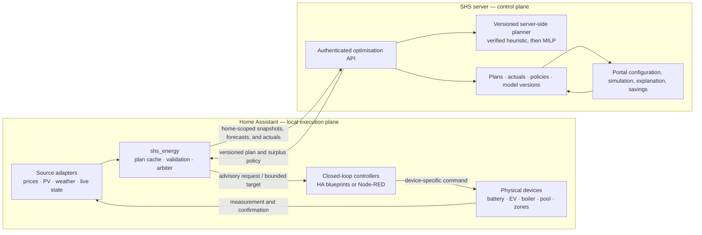
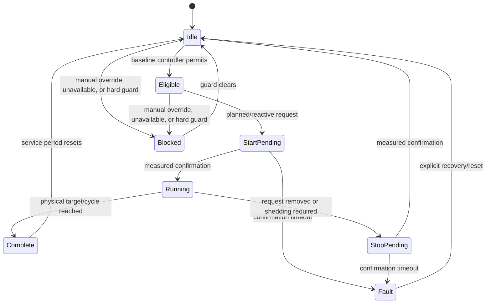

# Energy optimisation architecture

Status: **schema-v5 controllable-device selection, empirical history and duty-cycle permit path implemented; deployment, live commissioning and device executors remain**

Date: **2026-08-11**

Source material: `ENERGY_OPTIMISATION_NOTES.md`, the current portal implementation in
this repository, the current `shs_energy` Home Assistant integration in
`../shs-ha-integration`, and the exported Node-RED flows in
`~/Code/ha/node-red-flows`.

## 1. Decision summary

Build energy optimisation as three layers with deliberately different
responsibilities:

1. **SHS portal and backend — model and plan.** The portal owns the product
   home/device model and policy; Home Assistant owns local entity bindings. The
   portal owns customer preferences, tariffs, scenario simulation,
   calibration, plan history, actuals, and savings reporting. A separate
   server-side deterministic planner owns the first rolling optimisation
   calculation. The React browser application does not run the production
   optimiser. A Python/MILP service remains the planned replacement when the
   device/thermal constraint set outgrows the verified heuristic.
2. **`shs_energy` integration — observe and coordinate locally.** The integration
   normalises Home Assistant entities into one typed contract, sends measured
   state and forecasts to the backend, validates and caches returned plans,
   exposes the current recommendations as Home Assistant entities, runs one
   local surplus/load arbiter, and reports plan-versus-actual data.
3. **Home Assistant controllers — enforce and actuate.** Existing Node-RED flows,
   and later native HA blueprints/controllers, retain manual overrides,
   thermostats, completion detection, equipment interlocks, minimum run times,
   and command confirmation. Optimisation requests permission or a target; it
   does not bypass these controllers.

The server produces a rolling **72-hour look-ahead**, but only the portion backed
by published prices is binding. Later slots are advisory and exist primarily so
the model can value stored electricity and heat across a solar/weather change.
The canonical timestep is **15 minutes**. The server replans from measured state;
the local reactive layer corrects for what actually happens between plans.

The first shadow release simulates the battery, protects an explicit reserve,
optimises discrete pool work, inhibits empirical boiler duty cycles around high loads, and assigns a valid charger current to
every planned EV quarter while publishing opportunity/surplus signals.
Price-led battery grid charging/export and thermal state optimisation belong to
the next solver stage. Device controllers retain their existing closed-loop
logic. EMHASS remains a useful reference and shadow comparator, not the product
runtime.

### 1.1 Implementation checkpoint (2026-08-10)

The initial production-shaped path now resolves the eight defects found in the
static portal prototype:

| Defect | Implemented correction |
|---|---|
| Customer telemetry was compiled into the public JavaScript bundle | Deleted the hard-coded input snapshot. The selected `home_id` now reads a row protected by RLS. Pairing codes and active device tokens are bound to one home. |
| The page was a manually copied snapshot | `shs_energy` now uploads completed 15-minute actuals and requests a fresh rolling plan hourly. The portal shows issue/expiry/source freshness and measured overlays. |
| A/B/C used unequal work and fabricated a final partial day | Services have explicit earliest times and deadlines. Only deadlines inside the horizon create work; all scenarios use the same rounded integer slot count, and end-of-solar metrics omit an unfinished final local day. |
| Pool, boiler and EV used fractional/chattering power and an invented 11 kW EV rate | Pool remains a contiguous whole-slot service. The boiler is now a probability-weighted empirical duty forecast with a separate bounded permit/inhibit control. An EV current controller declares its minimum, maximum, step, phases and voltage; the planner chooses a supported current per 15-minute slot. Phil's 5–16 A three-phase range therefore models 3.45–11.04 kW rather than freezing the plan at the entity's instantaneous state. |
| The 80% battery claim was not verified | End-of-solar and terminal SOC are simulation invariants. The 80% target is soft by default so it cannot silently reserve solar and force pool/hot-water work onto night import; explicitly making it hard retains fail-closed infeasibility checks. |
| Export was valued with the import supplier price | Import and export are separate required timestamped entities, each combined with the correct grid direction. The integration rejects using the same entity for both. |
| One August day was repeated as baseload | Baseload is a weekday/weekend per-local-quarter median of recorder history. Only devices explicitly classified as controllable are subtracted and then added back as individual planner series; every other Energy Dashboard device remains represented by its real use inside baseload. p10/p90 and sample counts remain diagnostic data rather than graph noise. |
| Raw PV forecasts were treated as truth | HA keeps a compact forecast ledger, matches completed slots to actual solar, and publishes lead-day correction factors, sample counts, MAPE and bias. The planner and main graph use one corrected solar forecast; raw provider values remain quality diagnostics only. |

This is deliberately a **shadow/advisory release**. The integration exposes
verified planned-power requests and measured reactive surplus, but it does not
bypass existing thermostats, completion logic, manual overrides or interlocks.

### 1.1.1 Thermal checkpoint (2026-08-12)

The Thermal tab previously reported three rows as permanently blocked, and they
were hardcoded that way: no room temperature, actuator state or outdoor
temperature crossed the integration boundary, so no zone model could exist.
That pipeline now exists end to end — collection (§5.6), storage, and an
empirical per-zone fit (§9.3).

Two decisions were settled in the process and are load-bearing for everything
that follows:

- **The portal owns the comfort band, not Home Assistant** (§5.5). Reading
  scheduled levels out of local helpers would bind the contract to one home's
  automation conventions and could not be offered to other customers.
- **The band is time-varying, not a target.** A single scheduled setpoint per
  period leaves the planner no freedom; a min/max band per period is what makes
  load shifting possible at all.

Still outstanding before any thermal control is advisory-safe: the comfort-band
schedule editor and its data model, the planner constraint that consumes it,
and the setpoint-trajectory executor described in §7.5.

### 1.2 Configuration and customer capability decision

Planning configuration is now deliberately smaller than reporting
configuration:

- **Off** keeps energy history and tariff exchange active without a planner or
  repair warning.
- **Live / automatic** reads aggregate meters from Home Assistant's Energy
  Dashboard and discovers supported forecasts, battery and EV entities.
- **Live / manual** exposes the same options in small capability-specific steps,
  not one scrolling form.
- **Demo** creates a clearly labelled synthetic plan. The integration refuses
  to expose demo plan slots to executor automations.

Solar, battery, pool, water heating and EV are independent optional
capabilities in snapshot schema 5. A category mapped for reporting is not
assumed controllable. Installation ratings still require measured or explicitly
commissioned values; product defaults are limited to policy/orchestration facts
such as 15-minute slots, efficiency starting values, and default time windows.

The GUI is stored as a Home Assistant config entry in
`.storage/core.config_entries`, but that file must never be hand-edited. The
supported machine/AI surface is the read-only
`shs_energy.discover_configuration` action and validated
`shs_energy.apply_configuration` action. This makes MCP-based commissioning
possible without granting an agent arbitrary file access.

For the inspected home, automatic discovery has verified the following source
set:

| Capability | Verified source or value |
|---|---|
| Whole-home energy | Energy Dashboard grid/solar/battery balance, checked against `sensor.sigen_plant_total_load_consumption` |
| PV forecast | Eight `sensor.meteo_solar_production_forecast_estimate_*` entities, 96 timestamped quarter-hours each; home location comes from HA because the entities do not repeat coordinates |
| Price forecasts | Tibber `get_prices` supplies import energy; Nord Pool `get_prices_for_date` supplies SE3 export spot; SHS grid tariffs are then added once per direction |
| Battery | 18.08 kWh, 8.8 kW charge, 9.6 kW discharge, live Sigen SOC, 13.2 kW plant/grid envelope |
| Pool | `sensor.pool_heater_energy` plus `sensor.pool_pump_energy`; active measured power about 3.67 kW; `input_boolean.pool_heating` is the season gate |
| Hot water | `sensor.hot_water_energy`; 3.0 kW installed rating remains an explicit commissioned fact |
| EV | `sensor.car_charging_lifetime_energy`, Tesla cable/SOC/target/energy-remaining entities, and `number.tesla_model_y_charge_current`; its 5 A minimum, 16 A maximum and 1 A step are read from entity attributes. No departure entity exists, so the next configured default departure time is used |

## 2. Terms

- **Baseline controller:** the normal local schedule, thermostat, occupancy, and
  safety logic that works without SHS optimisation.
- **Plan:** a versioned, time-indexed recommendation calculated from forecasts
  and a measured initial state.
- **Planned control:** use of the current plan's preferred windows, power target,
  setpoint offset, or import envelope.
- **Reactive control:** local allocation or shedding in response to measured
  grid flow, device availability, temperatures, SOC, overrides, or unexpected
  load. It operates inside the plan's policy and hard limits.
- **Executor:** the per-device HA or Node-RED controller that translates an SHS
  request into a device-specific command and confirms the physical result.
- **Hard constraint:** a safety, equipment, legal, or explicitly guaranteed
  customer limit. Optimisation may never violate it.
- **Soft target:** a preferred state that can move within a separately defined
  hard range when another sink is more valuable.

## 3. What exists today

### 3.1 Portal energy modelling

The website now has a separate live shadow-planning view. Its older
device-day/annual simulator remains a useful **forward load simulator**, not an
energy optimiser, and should not be confused with the new server-side planner.

Reusable foundations:

- `device_types`, `device_instances`, `home_device_assignments`, and
  `device_profiles` provide a reusable catalogue, home inventory, and
  performance-profile model.
- `energy_home_settings` stores a home-level UA estimate and overrides.
- `model_runs` snapshots inputs, device bindings, profiles, tariff inputs,
  results, and a daily time series.
- The simulator has five stateful device models:
  `fixed_baseload`, `electric_resistive_thermostat`,
  `air_to_air_heat_pump_inverter`, `fridge_freezer_compressor`, and
  `event_appliance`.
- The heat-pump model already supports COP/capacity curves, two-dimensional
  performance surfaces, modulation, and a startup transient.
- The device-day engine advances at five-minute intervals and emits 15-minute
  load data. It includes a simple per-room 1R1C thermal calculation.
- Manufacturer performance profiles and per-device calibration metadata can be
  stored and resolved.

Material limitations in that legacy simulator:

| Area | Current behaviour | Consequence |
|---|---|---|
| Dumb vs smart | `scenario` is saved to `model_runs`, but is never passed into or read by `simulateDeviceDay()` | A “smart” run has no smart behaviour. The ROI comparison is not evidence of optimisation savings. |
| Mode | `design` uses the selected outdoor temperature; both `typical` and `year` simulate one day at 0 °C | The mode selector does not yet represent typical weather or a chronological year. |
| Annual model | Forty-one independent constant-temperature days are interpolated against monthly mean temperatures | No chronology, solar, weather variability, state carried between days, or price correlation is represented. |
| Prices | The simulator reads legacy scalar fields from `tariff_instances` | It does not use the effective-dated tariff catalogue, spot-price series, separate import/export prices, or actual billing-period peak state. |
| PV/grid/battery | None are in the device-day energy balance | The current simulator cannot model self-consumption, export, battery arbitrage, curtailment, or grid limits. |
| Controls | `controllable` and `priority` are diagnostic metadata. `shiftable` only chooses a chart category | They do not change device timing or resolve concurrency. |
| UI controls | `comfortBand` and `targetPeak` are displayed/snapshotted but do not constrain the simulation | Runs can imply a promise that the engine did not evaluate. |
| Home settings | The simulator preloads indoor temperature, but ignores the saved UA override and thermal-capacity class | The simulator can show an override in setup while calculating with a different building model. |
| Initial state | Every device and room starts from a generated default | Battery SOC, EV SOC/presence, tank/pool/room temperatures, completed cycles, and manual overrides are absent. |
| Building model | UA and thermal mass are divided equally among inferred room keys | Zone heat loss and thermal storage are not physically calibrated. |
| House-model tool | The detailed envelope calculator stores its inputs only in browser `localStorage` and is not connected to a selected home or the simulator | Its more detailed UA calculation is not a production model input. |
| Calibration | Annual device energy is scaled to an override or billing history, but the day shape and peaks remain uncalibrated | Energy totals and network-peak costs can be based on inconsistent scales. Grid import can also be mistaken for whole-home use at a solar home. |
| ROI pairing | ROI independently selects the newest dumb and newest smart run | Even after smart behaviour exists, runs with different inputs, tariffs, or model versions could be compared. |
| Missing data | Binding code guesses values from device names and supplies defaults for UA, prices, setpoints, COP, schedules, and cycles | A run can look precise while depending on unverified assumptions. Production optimisation must fail validation instead. |

The current models should be retained for device physics, scenario replay, and
counterfactual simulation. They should not be extended into a browser-based
production scheduler.

### 3.1.1 Plan-facing load model correction

The production planner needs fewer load shapes than the legacy simulator. A
device's electrical shape is one of four plan-facing classes; thermostat,
comfort, storage and deadline state remain separate constraints rather than new
electrical classes.

| Load shape | Electrical forecast while enabled | Typical devices | Initial planner output |
|---|---|---|---|
| Fixed full load | One measured active power for 100% of the requested on-time | Resistive element, fixed-speed pump, simple charger | Run/stop window |
| Variable full load | A measured multi-stage or time-since-start power profile for 100% of the on-time | Dishwasher, washing machine, staged appliance | Start window; local controller owns the non-interruptible cycle |
| Duty cycle | Rated active power multiplied by an empirical probability/duty profile; an enabled device may draw zero | Water boiler, electric radiator, floor heating | Permit/inhibit window; never a forced-on prediction |
| Inverter load | Temperature- and time-since-start-conditioned variable power | High-power heat pump or air conditioner | Bounded setpoint/mode advice plus an expected-power profile |

Low-power refrigerators, freezers and similar compressor loads stay in the
empirical baseload unless their power is material to the connection limit. The
five simulator implementations remain useful ways to simulate the four shapes;
they are not five production scheduling contracts.

Electrical shape and planning authority are independent configuration axes.
Each home-local Energy Dashboard device has a planning role of `base_load` or
`controllable`. Base-load devices still use measured Home Assistant history but
are merged into the aggregate curve and omitted from device legends. A
controllable device is removed from that aggregate and carries one reviewed
control type: on/off schedule, variable power, permit/inhibit, setpoint or
current limit. Initial classification is deliberately conservative: hot water,
pool heating and EV charging start with their supported controls; ordinary
household, heating and cooling meters start in base load. The inferred values
are persisted on first discovery and only change when a customer or staff member
selects a different value.

The schema-5 boiler representation corrects the old contiguous fixed-power job.
The controller cannot demand heat and does not know when hot water will be used,
so the boiler contract now:

- remain permitted by default so its own thermostat can maintain service;
- publish explicit inhibit slots around higher-priority pool, EV or unexpected
  high-load periods;
- forecast **expected** electrical power from measured duty behaviour without
  presenting that estimate as a command;
- bound consecutive inhibit time and preserve hygiene/manual overrides locally;
  and
- expose permit/inhibit separately from expected power so zero predicted watts
  can never be confused with loss of planner authority.

The same separation is required for every device: `expected_power_w` describes
the energy balance, while a typed control request describes authority (`run`,
`permit`, `inhibit`, current, or bounded setpoint). A single `boiler_w` field
cannot safely carry both meanings.

Home Assistant already has the authoritative device inventory: the Energy
Dashboard's `device_consumption` entries identify the curated energy statistics.
The integration should learn compact empirical models from recorder data and
publish model evidence, not raw state changes:

1. Resolve each Energy Dashboard device to a stable, home-scoped device key and
   an explicitly reviewed load shape.
2. Aggregate its recorder energy locally into complete 15-minute device slots.
   Retain short transition windows locally when fitting startup behaviour.
3. Fit robust active power, duty probability, time-since-start profile and, for
   material inverter loads, outdoor-temperature bins. Record sample counts,
   quantiles, error and the covered date/temperature range.
4. Upload the compact fitted profile plus recent 15-minute actuals needed for
   drift and plan-versus-actual reporting. Do not upload per-second samples.
5. Persist the fitted profile independently of the simulator UI so an imported
   or integration-learned air-conditioner model cannot disappear when a browser
   session or preview state is reset.

For the observed inverter air-conditioner shape, the first empirical profile
should represent the approximately 2.1 kW startup transient separately from the
roughly 0.6–1.0 kW modulating region, indexed by outdoor temperature and elapsed
run time. Manufacturer COP/capacity data may constrain the fit, but measured
electrical power is the source for the plan graph.

This was delivered as one coordinated, fail-fast schema increment across the
edge planner and `shs_energy`. Schema 5 uses `boiler_expected_w` for the energy
balance and `boiler_permitted` for authority. The Home Assistant request sensor
returns the reviewed rating only while permission is true and reports expected
power separately in its attributes.

### 3.2 Current `shs_energy` integration

The pre-change integration already mapped `total_increasing` energy sensors to
daily categories, backfilled daily totals, downloaded the tariff catalogue,
calculated monthly grid-tariff components locally, and exposed current grid
prices and subscription status.

The implementation in this change adds:

- one-home pairing and token binding, including home-scoped tariff lookup;
- schema 5 with optional solar/battery/device capabilities, fixed-power,
  discrete-current and empirical duty-cycle controls, and explicit
  `live`/`demo` mode;
- automatic aggregate-meter discovery from the Energy Dashboard, plus a short
  multi-step advanced flow and validated AI/MCP actions;
- a strict 15-minute contract for timestamped PV and separate supplier import
  and export forecasts;
- explicit market area, PV coordinates, source units, freshness, battery/grid
  capabilities, service deadlines, whole-slot minimum runs, and EV state;
- complete aggregate and per-device 15-minute recorder bins, weekday/weekend
  baseload and per-device profiles, daily remaining-service estimates, and
  conservative lead-day PV calibration;
- an hourly 72-hour plan request plus quarter-hour actual upload, with
  whole-home consumption derived from the grid/solar/battery energy balance
  when no separate total meter is configured;
- local cached plan/status, a boiler permit/inhibit request with separate
  expected draw, bounded pool/EV power requests, a dedicated EV current
  target/envelope sensor; and
- a live measured-export signal for a single reactive executor.

It still does not own device actuators, confirmation, thermal state models,
weather-conditioned load, or the central reactive allocator. Those remain
commissioning/product work. The existing daily energy, supplier-cost and tariff
history tables also remain customer-scoped until that older feature is made
multi-home; the new optimisation path itself is home-scoped end to end.
Energy Dashboard devices now retain stable home-local identities, suggested
four-class load characteristics, editable customer/staff planning roles and
control types, and compact 15-minute history. Only controllable devices appear
as individual forecast/actual graph series; all others remain in measured base
load. The first profile is a recent weekday/weekend trimmed mean. Temperature bins and
time-since-start startup fitting for material inverter loads remain the next
accuracy increment; the current implementation does not claim those inputs yet.

### 3.3 Existing local control

The exported Node-RED flows already provide valuable closed-loop behaviour:

- per-zone high, low, sleeping, and temporary setpoints;
- schedules, occupancy modes, and manual overrides;
- thermostat hysteresis and grouped actuators;
- outdoor-aware summer lockout, warm-weather hysteresis, and cold boost; and
- reusable subflows for overrides, timers, schedules, and floor thermostats.

The inspected room flow applies a 0.2 °C hysteresis around the selected room
setpoint, uses the lower of two sensors where a room has two, and re-evaluates
the thermostat periodically. CronPlus schedules deliberately use different
minutes for different rooms, which spreads scheduled transitions, but each room
still decides independently whether it may draw power. Schedule selection,
occupancy/manual policy, thermostat demand and relay actuation are currently
combined inside each room flow.

There is no shared `heat_request`, thermal-debt score, instantaneous heating
budget, or home-wide grant/revoke decision. Consequently, staggering start
times reduces one source of coincidence but cannot prevent several thermostats
calling for heat together after a cold change or setpoint recovery. The January
historic-device snapshot contains coincident demand around 10–11 kW, while the
April and September snapshots have very different dominant loads. Those
single-day screenshots are useful evidence of the coordination problem, but
the underlying recorder series—not screenshots—must be used to fit and verify
the planner.

In the outdoor-aware snapshot, the seasonal rules are hard-coded as June–August
heating lockout, 15/13 °C outdoor-mean hysteresis, and cold boosts below 5 °C and
0 °C. These are useful prototype settings, not yet a product parameter model.
They look backward at a 24-hour mean and cannot distinguish a one-day cold dip
from a sustained cold spell or a warm forecast tomorrow. This seasonal decision
belongs in a weather-aware heat-demand plan, with local hard comfort and frost
limits continuing to override it.

The notes also describe power-confirmed IR control, pool cycle detection, EV
state, and Sigen inverter control. Those IR groups are not in the exported flow
set, so a fresh export is required before treating them as reproducible product
logic.

### 3.4 Corrections and conflicts in the working notes

Later verified observations in the notes supersede the stale “outstanding” list
in section 13: the EMHASS deferrable count was raised to four and dynamic required
hours were implemented earlier in the same document.

The notes also call missing effektavgift attributes an open defect. The current
tariff implementation and published `ellevio-2026-06-01` definition deliberately
contain no demand rule, so `capacity_cost_per_kw`, `demand_charge`, and
`billing_period_peak_kw` being absent is expected for the active revision. The
commercial tariff source should still be rechecked before release, but the model
must not invent a demand charge while the published contract has none.

Finally, “money saved” and the proposed strict ordering “self-consumption first,
balanced load second, cost third” are not equivalent. The EMHASS experiment
already showed that a self-consumption objective can import at the cap because
import has no cost in that objective. Section 8.2 makes the required product
decision explicit.

## 4. Target architecture



### 4.1 Portal and backend responsibilities

The portal/backend owns:

- home identity, location/timezone, grid connection, tariff assignment, and
  subscription entitlement;
- the device inventory, capability model, relationships, performance profiles,
  and customer preferences;
- a commissioning UI showing every required and missing input;
- scenario simulation and historical replay;
- canonical model and policy versions;
- construction of a complete, validated optimisation problem;
- the versioned server-side planner and its future solver infrastructure;
- a versioned current plan, compact immutable run summaries, actuals,
  explanations, and model errors;
- counterfactual baseline and savings calculations; and
- fleet-level monitoring without exposing one customer's data to another.

The browser is a UI over these services. It must not be required to be open for
planning, and it must not receive device tokens or call the solver with
untrusted customer-supplied home IDs.

Supabase Edge Functions remain suitable as the authenticated facade and for
database work. The numerical optimiser should run in a separately deployed
Python container with a pinned solver/runtime. The facade authorises the device
token and home, submits a typed job, and returns or retrieves the result.

The implemented initial service is synchronous and uses a pure, deterministic
TypeScript heuristic in the authenticated edge function. It schedules
contiguous service runs, keeps fixed loads at rated power, and distributes an
EV energy obligation across supported current steps. Every selected current is
converted to watts before battery/grid simulation. Invalid input is rejected;
infeasible output is explicitly marked and cannot become actionable. Requests
are idempotent by `home_id` and `snapshot_id`.
Battery dispatch in this stage is a self-consumption/reserve policy, not a full
price-arbitrage optimiser; the UI labels its terminal-energy adjustment so it
cannot be mistaken for a complete MILP result.
The next solver stage can move the same versioned contract behind a small
FastAPI/Pydantic service with a pinned open-source MILP solver such as HiGHS.
That service must receive a complete snapshot; it must not query Home Assistant
or silently fill missing inputs. If EMHASS formulation code is reused, retain
its MIT attribution and add contract-level regression tests around the adapted
constraints.

### 4.2 Integration responsibilities

The integration owns:

- an explicit one-token-to-one-home binding;
- an automatic options/config flow whose metering source of truth is the HA
  Energy Dashboard, with small manual steps for unusual installations;
- provider adapters that return canonical 15-minute PV, weather, and supplier
  price series regardless of whether the source uses attributes or service
  responses;
- live measurements and state required to seed every stateful device;
- calculation of empirical base load after subtracting only complete device
  series classified as controllable, with those profiles added back exactly
  once by the planner and all non-controllable device use left in base load;
- contract validation, units, UTC timestamp conversion, and source freshness;
- request idempotency, plan polling/refresh, local storage, expiry, and model
  version compatibility;
- Home Assistant entities representing plan health and the **current** request
  for each device;
- one central local reactive allocator so independent loads cannot all claim the
  same surplus;
- actual power/state sampling, command outcome events, and 15-minute aggregation;
  and
- safe disengagement: once a plan is expired or a required sensor is invalid,
  issue no new optimisation request and leave the baseline controller in charge.

A planned-request entity is unavailable when the planner has no authority.
`0 W` is used only inside a valid binding slot to mean an explicit off request;
this distinction prevents an outage from masquerading as a stop command. A
discrete-current EV additionally exposes target, deadline-safe minimum and
hardware maximum amperes. The target is the expected forecast load; the local
controller may move inside the envelope and must account for any resulting
energy deficit before departure. Maximum recovery headroom remains available
through the departure window even when the forecast target finishes early.

The integration does **not** guess a missing installation rating, live state,
price or temperature. A missing device-specific fact makes only that optional
capability ineligible. Product-owned policy defaults are applied at runtime and
persisted when configuration is saved, so an unset optional feature does not
turn the whole integration into a wall of missing internal field names.

The full 72-hour plan should remain in integration storage rather than a large
recorder-backed sensor attribute. HA entities expose plan status, current/next
slot, current opportunity signal, and per-device request/reason.

### 4.3 Local controller responsibilities

Each executor owns:

- manual override precedence;
- equipment safety and hard temperature/SOC limits;
- baseline schedule and occupancy logic;
- thermostat or completion detection;
- coupled equipment such as pool pump plus heater;
- minimum on/off time, quiet hours, rate limits, and anti-chatter hysteresis;
- device-specific service calls and inverter modes;
- command confirmation from measured state/power; and
- a fault result when an expected transition does not occur.

For the prototype, existing Node-RED subflows can implement these adapters. The
customer product should use versioned native HA blueprints or integration-owned
controller entities so Node-RED is not a prerequisite. The integration should
not silently create or edit customer automations. Commissioning should import a
known blueprint and create one visible automation per mapped executor, or allow
an existing Node-RED flow to consume the same request entities.

### 4.4 Supported control boundary by device class

| Device class | Planner output | Reactive/local work | Initial control authority |
|---|---|---|---|
| Battery | Charge/discharge envelope and target SOC trajectory | Clamp to live SOC, inverter limits, reserve, grid mode, and confirmation | Direct bounded target only after shadow validation |
| EV charger | Required energy by deadline plus target/minimum/maximum current for every slot | Presence/SOC check, reactive step adjustment, delivered-energy/deadline guard, confirmation | Advisory current target to EV controller |
| Water boiler | Opportunity windows and normal/soft/hard temperature targets | Thermostat, hygiene cycle, maximum runtime, completion | Permit/request only |
| Pool heating | Opportunity windows and soft/hard water targets | Pump/heater coupling, filtration requirement, seasonal enable, completion | Permit/request only |
| Resistive room heating | Aggregate heating-power envelope plus per-room comfort band, preheat permission and priority | Home-wide grant allocator, then room thermostat, occupancy, manual override and hard comfort floor | Bounded setpoint/permission advice; never direct relay timing |
| Inverter heat pump/aircon | Mode, bounded setpoint offset, preferred recovery window | Native thermostat, COP/defrost behaviour, minimum run time, IR/power confirmation | Setpoint advice only |
| Duty-cycle appliance | Start-by window or “avoid now” signal | User intent and non-interruptible cycle | Advisory; never force-start initially |
| Fixed baseload | Forecast only | None | No control |

Power shape and stored state are orthogonal. For example, an EV is variable power
with SOC; a boiler is fixed power with temperature; a pool process is coupled
fixed power with temperature and cycle state. Both axes belong in the device
contract.

## 5. Canonical contracts

### 5.1 General rules

- Timestamps are UTC ISO-8601 and slots are half-open `[start, end)` intervals.
- The canonical step is 900 seconds; 23-hour and 25-hour local days are normal.
- Power is watts, energy is watt-hours or explicitly named kWh, temperature is
  °C, SOC is a fraction from 0 to 1, and prices are SEK/kWh.
- Avoid ambiguous signed fields. Publish separate non-negative
  `grid_import_w`/`grid_export_w` and
  `battery_charge_w`/`battery_discharge_w` values.
- The authenticated envelope derives `home_id` from the device token; the
  client cannot choose it. Snapshots carry schema/ID/capture metadata and the
  stored row adds the input hash; plans add model version, issue time and
  validity.
- Arrays must be contiguous, sorted, unique, and the same length over their
  stated overlap. A shorter supplier forecast shortens the binding price
  horizon; it is never extended by repeating a value.
- Every source carries `observed_at` or `issued_at`, `valid_until`, and quality.
- PV location is the configured HA home location. An adapter-provided location,
  when present, must match it; a canonical timestamped-watts provider need not
  duplicate location in every sensor. Import and export adapters independently
  use the same discovered or commissioned `SE1`–`SE4` market area.
- Validation errors name the exact field/device/source. Versioned product
  defaults are allowed only for visible policy/orchestration choices such as
  soft targets, efficiency starting points and normal time windows. Equipment
  ratings, entity bindings, locations and electrical limits are never guessed,
  and the production contract has no legacy aliases.

### 5.2 Home/device capability input

The existing `device_instances.field_values` is suitable for catalogue facts but
should not become an unstructured bucket for control policy and HA entity IDs.
Add explicit, versioned records for:

- **installation capability:** rated/minimum power, modulation steps, usable
  capacity, efficiency, export/grid-charge permissions, supported modes;
- **state model:** state kind, sensor source, valid range, freshness limit;
- **policy:** normal target, soft range, hard range, deadline/window, priority
  rules, manual override semantics;
- **dynamics:** minimum on/off, startup curve, thermal loss/capacity, COP curve;
- **relationships:** coupled-with, mutually-exclusive-with, requires, and
  sequence-after; and
- **HA binding:** measurement, state, completion, availability, actuator, and
  command-confirmation entities/services.

Recommended new stores are `ha_home_bindings`, `ha_device_bindings`,
`energy_control_policies`, and versioned `energy_device_model_parameters`.
`model_runs` remains the offline scenario-run table; it should not be overloaded
as the live plan store.

### 5.3 Optimisation snapshot

Each solve receives:

- the complete validated static capability/policy snapshot;
- live battery, EV, boiler, pool, zone, cycle, availability, and override state;
- PV, outdoor-temperature, all-in import/export price, and base-load forecasts;
- grid import/export limits and, only when present in the tariff contract,
  demand-charge rules plus month-to-date billed peak;
- work already completed in the relevant service period;
- plan-versus-actual state from the preceding slot; and
- the terminal assumptions used beyond the binding horizon.

Schema 3 carries `mode`, an explicit capability map, nullable PV and battery
provenance, a nullable battery model, and a typed service control. A fixed load
declares `fixed_power`; a modulating EV declares `discrete_current` with
minimum/maximum/step amperes, phase count and per-phase voltage. Disabled
capabilities must contribute zero power and cannot appear in a service request.
Demo sources are marked `synthetic` and are accepted only when `mode=demo`.

Only snapshot data needed for the solve is uploaded. High-frequency reactive
control remains local; the backend receives 15-minute actuals and discrete
control/fault events.

The implemented storage budget is bounded:

- raw/per-second samples never leave Home Assistant;
- only complete recorder 5-minute statistics are summed locally into at most 96
  unique actual rows per home/day; each request is capped at 192 rows and 1 MB;
- actuals deliberately trail real time by one quarter so recorder statistics can
  settle, and the most recently accepted quarter is re-sent once by idempotent
  upsert so a late category can complete without increasing row count;
- actual quarter-hours have 120-day rolling retention (11,520 rows/home);
- the large 72-hour snapshot and plan overwrite one current row per home;
- only compact run summaries are appended, hourly, with 30-day retention; and
- daily category and billing aggregates continue through the existing nightly
  path and are not duplicated into the optimisation series.

### 5.4 Plan output

A plan contains:

- a 72-hour forecast and confidence/provenance per slot;
- the measured battery source plus the exact battery, grid, service-control,
  minimum-run, deadline, and active-day sample inputs used by the solve;
- a `binding_until` boundary based on exact price availability;
- all-in import/export marginal prices;
- PV and base-load forecasts;
- an import/export envelope and an opportunity rank or marginal value;
- a battery power/SOC plan;
- per-device required service, preferred windows, bounded target/offset, reason,
  and whether the output is binding or advisory; discrete EV slots carry
  target/minimum/maximum current and the power derived from the target;
- an ordered surplus-allocation policy with promotion/demotion conditions;
- expected cost, self-consumption, peak, comfort deviations, terminal state, and
  constraint margins; and
- human-readable reason codes suitable for the portal and HA logbook.

The plan is not a list of unconditional on/off commands.

### 5.5 Comfort band schedule

A heating schedule that names one target temperature per period leaves the
planner nothing to optimise. If a room must be at 21.0 °C at 06:00, there is
exactly one correct answer and load shifting is impossible. The constraint the
portal owns is therefore a **time-varying band**, not a target:

- per zone, a repeating weekly schedule of segments;
- each segment carries `comfort_min_c` and `comfort_max_c`;
- an unoccupied/away profile overrides the weekly schedule;
- a frost floor applies unconditionally and cannot be scheduled away.

The planner may put the zone anywhere inside the band. Everything between the
edges is flexibility it can spend on cheap import, solar surplus or peak
avoidance. Nothing about the band tells it *when* to heat.

This is also where the ecosystem has converged. EMHASS supports both a
per-timestep target (`desired_temperatures`) and a per-timestep `min`/`max`
pair, and has marked the target form legacy, recommending the range precisely
because it "allows the optimizer to float the temperature within this range to
find the cheapest time to operate".

The band belongs to the portal, not to Home Assistant. Reading it from local
helpers would tie the contract to one home's automation conventions —
`input_number` levels selected by a mode string, sleep levels the mapping does
not know about, cold-weather offsets applied in a function node. A portal-owned
band asks Home Assistant only for a room temperature sensor and an actuator,
which every customer with a thermostat can satisfy. Existing local helper
values may be read **once** to seed a zone's initial band so a customer with
many zones does not hand-enter them, but they are not a live input.

Two zone properties travel with the band because they change what a legal
schedule means:

- `sense`: whether the zone can heat, cool, or both. A zone that can only heat
  defends `comfort_min_c` and treats `comfort_max_c` as an overshoot limit; a
  reversible aircon defends both edges actively.
- `recovery_lead_slots`: derived, not entered. A high-mass zone must begin
  recovery well before the band tightens, so its usable shifting window is
  shorter than a low-mass zone's even when the bands are identical.

### 5.6 Thermal observation series

Zone learning consumes a separate quarter-hour series from the electrical
actuals, because a zone sensor can settle after its energy meter and a quarter
that is complete electrically may only later become describable thermally.

Per zone, per quarter: `room_temperature_c` and `actuator_duty`. Per home, per
quarter: `outdoor_temperature_c`. Comfort levels and setpoints are carried when
available but are **context, not fit inputs** — they constrain planning and
draw the chart's band; the physics does not need them, and a row is never
dropped for lacking them.

Cooling is measured but never modelled. A reversible aircon in summer pushes
energy through its meter while the room gets colder, which counted as heating
would ask the fit to explain an impossibility. `hvac_action` is therefore read
for *direction* rather than mere activity, a separate `cooling_duty` is
recorded, and those quarters are dropped from training. Modelling cooling is
out of scope; distinguishing it is not optional.

Heat input is deliberately *not* re-sent. Per-device `device_energy_kwh`
already crosses on the electrical slots and is strictly better than any
state-derived estimate, because it sees an inverter's modulation. `actuator_duty`
corroborates it: it separates "ran briefly at full power" from "ran all quarter
at low output" for zones whose meter is coarse, and marks quarters where the
zone was never called.

Three recorder shapes have to become one grid, and they are not
interchangeable. Room and outdoor temperature are `measurement` sensors with
five-minute `mean` statistics that survive as long as `purge_keep_days`.
Comfort helpers are `input_number`s with no `state_class`, so no statistics
exist for them at all and they must come from state history. Actuator state is
not a number in any form; the useful quantity is the share of the quarter spent
actually running. Both step-function sources are time-weighted rather than
averaged over recorded points, so five `on` rows in one minute cannot outweigh
an `off` that held for the remaining fourteen. A climate entity's `hvac_action`
is authoritative over its mode: a thermostat left in `heat` all night is not a
heater that ran all night.

## 6. Planned-control scenario

### 6.1 Cadence

Generate a plan:

- when a new day-ahead supplier-price forecast becomes available;
- at least hourly while optimisation is enabled;
- when the integration reports a material state change such as EV arrival,
  changed departure target, manual override, completed pool/boiler service,
  battery SOC drift, or a forecast revision; and
- after a device fault changes the eligible capability set.

Rate-limit event-triggered replans. The integration continues using a plan only
until its explicit expiry; local controllers continue independently.

### 6.2 Planning flow

```mermaid
sequenceDiagram
    participant HA as shs_energy
    participant API as SHS optimisation API
    participant Solver as Versioned server planner
    participant Ctrl as Local controllers
    participant DB as Plan/actual store

    HA->>HA: Normalise forecasts and measured state
    HA->>API: Submit home-scoped, versioned snapshot
    API->>Solver: Validate and compile model
    Solver-->>API: Return plan plus binding/expiry metadata
    API->>DB: Overwrite current full plan; append compact summary
    API-->>HA: Authorised plan response
    HA->>HA: Validate slots, units, home, version, freshness
    HA->>Ctrl: Publish current advisory request / bounded target
    Ctrl->>Ctrl: Apply overrides, safety, thermostat, and interlocks
    Ctrl-->>HA: Confirm actual state or report fault
    HA->>API: Upload 15-minute actuals and control events
    API->>DB: Store measured outcomes
```

### 6.3 Priority and conflict order

All executors use the same precedence:

1. physical/electrical safety, equipment hard limits, and island/emergency mode;
2. explicit manual override;
3. hard service commitments such as minimum room temperature, hot-water hygiene,
   pool freeze protection, and EV departure minimum;
4. local reactive correction within the current plan policy;
5. planned preference or target;
6. baseline schedule when no optimisation request applies.

The planner cannot downgrade levels 1–3. The reactive layer may change level 5
when actual conditions differ, but only within the plan's hard envelope.

### 6.4 Executor state machine

Every controlled process should use the same observable state machine, with
device-specific guards:



State changes, guard failures, requests, commands, and confirmations are logged
with reason codes. An IR toggle is not considered successful until measured
power confirms it.

## 7. Reactive-control scenario

Reactive control is one local allocator, not one competing “surplus automation”
per load.

### 7.1 Inputs

- stable measured grid import/export and whole-home load;
- actual PV and battery power/SOC/headroom;
- current plan envelope and surplus policy;
- device presence, state, target, hard limit, completion, and availability;
- manual overrides and baseline-controller eligibility; and
- unexpected high-load events.

Never trigger from the flapping Sigen import binary sensor. Use numeric grid
power with separate import/export thresholds, hysteresis, and a stable duration.

### 7.2 Allocation loop

1. Calculate usable surplus after the battery's current commitment and a
   configurable measurement/error reserve.
2. Filter the policy to locally eligible sinks.
3. Apply promotion/demotion rules from live state. Example: an EV at very low
   SOC and present is promoted; a completed pool cycle is demoted.
4. Allocate to the highest-ranked sink whose minimum stable power fits. A
   variable sink can take the remainder; a binary sink requires its start
   threshold and minimum run commitment.
5. Wait for measured confirmation before allocating the same watts elsewhere.
6. When import exceeds the plan envelope or a large uncontrolled load starts,
   shed controllable sinks in reverse service priority, respecting minimum run
   and hard-service constraints.
7. Re-evaluate on confirmed transitions and stable material power changes, not
   on every noisy sensor sample.

### 7.3 Solar-cliff policy

For “sunny today, cloudy tomorrow,” the server can promote storage sinks and
raise soft targets because it sees the multi-day forecast. The local allocator
decides whether forecast surplus actually materialises.

- If the EV is absent or already sufficiently charged, battery, hot water, and
  pool thermal storage may move from normal target toward their hard upper
  limits before exporting.
- If the EV is present below its urgent threshold, it is promoted above pool
  comfort. The pool may stop below its normal target but never below its hard
  minimum/freeze constraint.
- If tomorrow becomes sunny in a revised forecast, the promotion disappears on
  the next plan; no local controller needs bespoke forecast logic.

The required policy fields are therefore **normal target, soft range, hard
range, ranking, and conditional promotions**. A single setpoint and integer
priority are insufficient.

### 7.4 Automation packaging

The integration should expose one merged effective request per bound device,
regardless of whether its source is planned, reactive, hard-service recovery,
or load shedding. At minimum, expose:

- requested state or bounded power/setpoint target;
- request source and reason code;
- request/plan expiry;
- eligibility and the guard currently blocking execution; and
- last command/confirmation/fault status.

Provide three versioned executor templates:

1. **Binary process executor** for boiler, pool process, and relays. It consumes
   an on/off request, applies local completion/temperature and minimum-run
   guards, then confirms from power/state.
2. **Variable-power executor** for EV and, after separate commissioning,
   battery/inverter control. For EVs it starts from the planned current, moves
   only in the charger's declared steps inside the slot envelope, and confirms
   the achieved value. Delivered-energy drift is carried into the deadline
   guard and next replan rather than being erased at the slot boundary.
3. **Thermal setpoint executor** for rooms and aircon. It applies only a bounded
   offset or mode request to the existing thermostat/occupancy controller.

The planned trigger is a new valid plan or a slot boundary. The reactive trigger
is a stable material change in grid flow, state, or eligibility. Both update the
same effective request entity; they do not call the physical device in parallel.
The executor alone performs service calls.

During shadow commissioning, Phil's current Node-RED setup remains the reference
controller and receives no actuator request. The target product replaces it
room by room with the integration-owned coordinator and native HA executor only
after temperature demand, overrides, hysteresis, minimum on/off time, relay
confirmation and failure behaviour have equivalent tests. Disable the matching
Node-RED room group before enabling its new executor so two systems can never
command the same relay. The end state has no Node-RED runtime dependency.

For `number.tesla_model_y_charge_current`, the planned automation consumes the
quarter's target amperes. The existing one-minute reactive loop may then raise
or lower that target by 1 A using measured export/import and battery state, but
it clamps to the plan's current envelope and the entity's 5–16 A capability.
Starting, stopping, cable/SOC checks, cooldowns and command confirmation remain
local. A material target-versus-delivered energy difference triggers replanning;
it is not hidden by uploading high-frequency samples.

### 7.5 Coordinated room-heating contract

Room heating needs three nested decisions rather than a choice between a
schedule and a thermostat:

1. **The 15-minute planner sets the envelope.** It forecasts zone heat demand
   from current indoor temperatures, outdoor-temperature/weather forecasts,
   occupancy policy, measured heater power and learned room response. It emits
   an aggregate heating-power cap for each slot, an allowed comfort band and
   optional per-room preheat/relaxation advice. It does not predict or command
   exact relay duty cycles.
2. **One local coordinator allocates the envelope.** Each room reports a heat
   request, measured temperature, target/band, rated power, on/off state,
   minimum on/off timers and a thermal-debt score. The coordinator grants a
   subset of requests that fits the current home/heating power budget, rotates
   equal-priority rooms fairly, and sheds in reverse priority when an
   uncontrolled load appears. A room below its hard comfort or frost limit is a
   hard request, not an optimisation preference.
3. **The existing room thermostat executes a grant.** Sensor selection,
   hysteresis, relay calls, manual overrides, occupancy and command confirmation
   stay local. A grant only permits heat while the thermostat is requesting it;
   it never forces a warm room's relay on.

**Prefer commanding a setpoint trajectory over commanding relays.** Once a zone
has a fitted model, the planner can publish the indoor temperature trajectory
it intends and let the existing thermostat track it, rather than issuing on/off
grants. This is how EMHASS executes its thermal loads, and it has a property
worth more than the extra precision of direct control: a stale plan, an expired
token or a dropped connection degrades to the thermostat holding its last
setpoint, not to a cold house. Direct relay control fails unsafe by default and
needs a watchdog to become safe; setpoint control is safe by construction, and
keeps the local flows as the fallback layer rather than replacing them.

The coordinator should rank requests by a transparent thermal-debt metric such
as temperature deficit relative to the active comfort band, time waiting,
forecast heat loss and room priority. Minimum on/off times and fairness prevent
chatter and starvation. The planner reserves enough aggregate energy over the
horizon; the coordinator owns the unknowable minute-by-minute duty allocation.
Material aggregate heat or temperature drift triggers an early replan.

Shoulder-season control should use a forecast indoor-temperature trajectory or,
initially, forecast heating degree-hours over the next 24–48 hours. A cold
morning followed by a warm day may justify allowing temperature to coast inside
the comfort band; sustained forecast cold justifies recovery or preheating.
This replaces calendar lockouts and backward-looking cutoffs without weakening
hard comfort, frost, manual or sensor-validity constraints.

Peak policy is external to the room algorithm. The tariff catalogue supplies
an effective-dated demand-charge rule and current billing-period reference peak
when one exists; otherwise the same coordinator may enforce only the physical
connection limit or an explicitly configured smoothing target. A future
Ellevio rule change therefore changes planner inputs, not every room flow.

### 7.6 One plan, synchronized explanatory views

Use one **Plan explorer** card with four tabs—Power, Thermal, Economics and
Storage—rather than four unrelated cards or four axes in one crowded plot. The
tabs replace only the chart body; plan selection, With/Without plan scenario,
time range, cursor, selected slot and device selection remain shared. They are
projections of one plan, not separate forecasts:

| View | Default content | Question it answers |
|---|---|---|
| Power and control | Stacked empirical base load plus controllable devices, grid import/export, aggregate room-heating envelope and physical/tariff peak reference | What is expected to draw power, and what is being limited? |
| Thermal | Outdoor forecast, aggregate worst-room comfort margin and the selected room's forecast temperature/comfort band; other rooms appear only on selection | Is heating being delayed safely, and which room needs attention? |
| Economics | All-in import and export prices, incremental peak price when applicable, and shaded planned-action windows | Why is energy being moved to this slot? |
| Storage | Battery SOC, reserve/target band and optionally thermal-service state | What flexibility is being stored or consumed? |

The Power tab is the authoritative electrical balance. Every electrical device
still contributes exactly once to the same load forecast there; changing tabs
does not remove it from the plan. The other tabs expose inputs, constraints and
state trajectories that explain why that electrical load was placed in a slot.
Device visibility remains a Power-tab concern, while selecting a room/device is
carried into the explanatory tabs.

Energy belongs in summary totals and selected-window integrals; instantaneous
series stay in kW. Each slot carries compact reason codes such as `comfort
recovery`, `cheap import`, `solar surplus`, `peak cap`, `battery reserve` or
`manual constraint`. The shared tooltip shows the relevant inputs, binding
constraint, expected incremental cost and rejected alternative. The economics
view therefore explains planner decisions instead of leaving price as an
unconnected secondary graph.

The default overview shows aggregate room heating, not every heater and room
temperature. Selecting the aggregate or a room opens the same plan at room
resolution. This preserves one authoritative plan while allowing both a clean
whole-home explanation and detailed commissioning diagnostics.

## 8. Objective function

### 8.1 Recommended hierarchy

Use hard constraints first, then a cost-aligned objective:

1. satisfy safety and hard service constraints;
2. minimise expected total customer cost: imports minus exports plus any
   tariff-defined demand cost, explicitly configured degradation cost, and a
   quantified penalty for deviation inside each soft comfort/service range; and
3. among economically near-equivalent plans, avoid unnecessary import peaks,
   switching, and loss of terminal flexibility.

Self-consumption does not need an independent first-priority objective when
import and export are priced correctly: consuming a solar kWh instead of
exporting it is valued by the actual avoided-import versus forgone-export
spread. Thermal preheating is valuable when it avoids forecast future imports,
not merely because it consumes PV.

### 8.2 Policy is explicit per home

The notes state a strict “self-consumption, then balance, then cost” hierarchy.
That conflicts with the stated customer value and can choose a more expensive
plan. The contract therefore records `battery_target_is_hard` rather than
silently choosing an interpretation:

- **Cost-led:** minimise the real bill with hard service constraints and use
  balance/self-consumption as tie-breakers and explanatory metrics; or
- **Hard reserve:** define a quantified battery target, its allowed cost premium,
  and exceptions for negative/high export prices, battery wear, and future
  service needs.

Both are shown for commissioning comparison. The integration executes only the
configured priority policy and only when its target verifies; it never selects
whichever chart happens to look cheapest. Do not expose EMHASS's raw `profit`,
`cost`, and `self-consumption` modes to customers.

No demand-charge term is included unless the effective tariff version contains
one. A general import envelope and smoothing tie-breaker may still protect the
connection and reduce avoidable spikes, but must not be presented as a billed
effektavgift.

## 9. Parameter model

### 9.1 Parameter classes and ownership

| Class | Examples | Source/owner | Can be learned? |
|---|---|---|---|
| Hard installation | Fuse/import/export limit, rated power, battery min/max SOC, inverter modes, actuator relationship | Staff commissioning + integration verification | No |
| Customer policy | Comfort targets/ranges, EV departure target, pool season, quiet hours, reserve preference | Customer/staff in portal | No; suggestions only |
| Live state | SOC, temperatures, presence, cycle complete, override, availability, work completed | Integration from HA | No substitution |
| Forecast | PV, outdoor temperature, base load, import/export prices | Integration adapters + server models | Bias/error can be learned |
| Device dynamics | COP, modulation, startup, efficiency, thermal capacity/loss, power curve | Manufacturer profile, then measured calibration | Yes, within validated bounds |
| Market/tariff | Effective version, price series, demand rule, month peak | Portal catalogue + integration recorder | No |
| Orchestration | 15-minute step, 72-hour look-ahead, binding horizon, replan thresholds | SHS model version | Product-controlled |

### 9.2 Minimum device specifications

**Battery/inverter**

- usable capacity, current measured SOC, min/max/backup reserve;
- maximum charge/discharge power as a function of SOC if applicable;
- charge/discharge efficiency and optional cycle-wear valuation;
- grid-charge, export, and island-mode permissions;
- plant import/export limit and unambiguous command sign/mode mapping; and
- write confirmation and recovery behaviour.

**EV/charger**

- presence/cable state, SOC source and freshness, usable battery capacity;
- a mapped EV energy meter whenever EV scheduling is enabled, so historical EV
  demand can be removed from base load before a new EV service is added;
- minimum departure SOC, preferred target, deadline, and urgent threshold;
- charger phase/current steps, maximum power, efficiency, and vehicle limit;
- customer force-charge/manual semantics; and
- behaviour when SOC is unavailable but the vehicle is connected. This must be
  an explicit policy, not a guessed SOC.

**Hot water**

- heater power, tank temperature or a validated energy-to-state estimator;
- normal target, hard minimum/maximum, hygiene/legionella requirement;
- standing loss/usable thermal capacity, occupancy demand pattern;
- minimum run/off time and completion sensor; and
- whether interruption is permitted once heating starts.

**Pool**

- seasonal enabled/closed state, water target and hard bounds;
- pool volume/thermal capacity, heat loss, cover state if available;
- pump filtration requirement distinct from heating requirement;
- pump/heater coupling and confirmation; and
- freeze, flow, and equipment protection constraints.

**Thermal zones and aircon**

- zone-specific temperature sensors, UA, thermal capacity, and heater mapping;
- occupancy-specific normal target plus soft/hard bands;
- rated resistive power or heat-pump input/capacity surface;
- minimum modulation, start/stop/defrost behaviour, and operating cutoffs;
- heating/cooling mode and seasonal transition policy; and
- manual override precedence and expiry.

**Base load and event appliances**

- base load excluding all separately modelled loads;
- weekday/weekend/occupancy/weather features and adequate history;
- event cycle stages, interruptibility, allowed/start-by windows, and user
  intent; and
- metering boundaries that prevent aggregate plus child double counting.

### 9.3 Empirical thermal zone model

Zone thermal properties are **derived from history, not entered**. This is the
main reason to build this rather than deploy an existing optimiser: EMHASS
requires `heating_rate` and `cooling_constant` to be hand-tuned per zone and
suggests 5.0 and 0.1 as starting points. A portal that already stores
per-device quarter-hour energy and room temperature can fit them, and re-fit as
the house changes.

Empirically estimating heat loss is also the right way to size heating cycles.
"How much energy does this room need to reach 21 °C by 06:30, and when must
that start?" is answerable from a fitted zone and unanswerable from a rated
wattage.

The model is the standard first-order (1R1C) lumped-capacitance zone, written
in EMHASS's parameterisation so a fitted zone stays portable:

```
T[k+1] = T[k] + a·P[k]·Δt − γ·Δt·(T[k] − T_out[k]) + g·Δt
```

`a` is temperature rise per watt-hour, `γ` the cooling constant per hour per °C
of difference, `g` a background gain. EMHASS's `heating_rate` is `a·P_nom` and
its `cooling_constant` is `γ`. Physical quantities follow: `C = 1/a` is the
lumped heat capacity, `UA = γ·C` the envelope loss coefficient, and `1/γ` the
time constant.

Fitting is ordinary least squares on the difference equation, regressing the
observed rate of change on heat input, outdoor difference and a constant.

**Two failure modes make the naive form wrong, and both are systematic.**

The first is omitting `g`. A house is heated by far more than its heaters —
appliances, lighting, cooking, refrigeration, occupants at roughly 100 W each,
and window solar gain. Computing `UA = Q/ΔT` from heating energy alone
attributes the whole indoor-outdoor difference to the heaters, when the
envelope was really losing heater output *plus* all of that. The result is a
heat loss coefficient that is too low, every time. Carrying `g` as a free
parameter lets the regression discover those gains instead of folding them into
the loss term.

The second is the steady-state assumption. `UA = Q/ΔT` holds only when the zone
is neither warming nor cooling. On any real day some energy goes into the
structure rather than through the walls, so a warming day overstates `UA` and a
cooling day understates it. This bites hardest exactly where deep setback is
used, because that is when storage does the most work. Regressing the rate of
change keeps that term in `a`, where it belongs.

A related trap appears when splitting envelope loss between air-exposed and
ground-coupled surfaces. Apportioning measured heat by *area* fraction and then
dividing by each path's ΔT is circular: how heat divides depends on each path's
`U×A`, which is the unknown. The honest form,
`Q = UA_air·ΔT_air + UA_ground·ΔT_ground`, is unidentifiable from one day but
identifiable across many, because air temperature swings while ground
temperature barely moves. Independent variation is what separates the
coefficients, and only a multi-day fit can exploit it.

Seasonality is a permanent property of the fit, not a bootstrap problem. The
rolling window drains of heated quarters every spring and refills every autumn,
and in between it holds enough samples to solve while carrying almost no
heating information. Such a window is not rank-deficient, so it produces a
heating gain resting on a handful of quarters, usually alongside a healthy R²
because the loss term explains most of the variance unaided. A minimum count of
genuinely heated quarters is therefore required in addition to a minimum sample
count.

Rejections are ordered so configuration faults are diagnosed before data
sufficiency: a room sensor tracking outdoor air is wrong no matter what the
season is doing, and reporting "not enough heating" would send someone looking
in the wrong place. Only a configuration fault is surfaced as blocked; waiting
for the heating season is surfaced as waiting, because it needs no action.

**A fit is refused rather than published with a caveat** when there is too
little history, when too little of it was heated, when the design is
rank-deficient (a zone whose heater never
ran cannot identify a heating gain), when the fit is poor, when a coefficient
is non-physical, or when the room sensor tracks outdoor air closely enough that
it is evidently not measuring a room. A refused zone reports why.

Fixed COP values deserve specific care. Heat-pump COP falls as it gets colder,
so a constant assumption biases in a way that *correlates with the regressor*,
which is systematic error rather than scatter. Reversible units also record
cooling energy through the same meter, which must not be added as heat.

Scheduled band control produces unusually good identification data. A zone held
flat by a thermostat deadband barely moves, and small excursions buried in
sensor noise identify the parameters poorly. Long free-cooling coasts give a
clean read on `γ`; hard full-duty recoveries give a clean read on `a`.

### 9.4 Per-zone mass and why one strategy does not fit a house

Setback saves energy because it lowers the *average* indoor temperature, and
loss is `UA·(T_in − T_out)` integrated over time. It is not because a heater
running at 100% for a short block is more efficient than one cycling at partial
duty — a resistive element is 100% efficient either way, and the same delivered
heat costs the same. Getting the mechanism right matters, because it predicts
where the strategy stops working:

- **Low-mass zones** (wall panel convectors) recover fast, so deep setback is
  nearly free and the shifting window is wide.
- **High-mass zones** (concrete floor heating) recover slowly. Recovery must
  start long before the band tightens, which shrinks the window the planner can
  shift within and can make a shallower band cheaper overall.
- **Inverter heat pumps and aircon** break the resistive intuition entirely.
  COP varies with load and outdoor temperature, and many units are *more*
  efficient at partial load. Deep setback followed by hard recovery delivers
  the most heat at high output, possibly at a colder hour, and can lose to a
  shallower band.

The same house therefore wants opposite strategies in different rooms, which is
why per-zone `a`, `γ` and recovery lead are fitted individually rather than one
whole-house figure being applied everywhere.

## 10. Seasonal and condition scenario matrix

### 10.1 Canonical 72-hour seasonal fixtures

Maintain four deterministic mock snapshots of exactly 288 quarter-hours. Each
uses the same home/device capabilities and initial-state contract so changes in
planner output are attributable to the seasonal inputs rather than a different
inventory.

| Fixture | Forecast character | Primary behaviour under test |
|---|---|---|
| Winter | Little PV, sustained cold, high room-heat demand, coincident thermostat requests and volatile prices | Comfort preservation, fair heating allocation, peak limiting and recovery |
| Spring | A cold first day followed by a 10–20 °C warm-up, increasing PV and moderate prices | Avoid unnecessary reheating before forecast warmth without violating comfort |
| Summer | High/uncertain PV, pool and EV demand, hot-water duty cycles, no comfort heating | Surplus allocation, battery headroom, pool/EV deadlines and boiler inhibition |
| Autumn | Falling temperature, cloud fronts, intermittent heating restart and evening price peaks | Stable seasonal restart, preheating and forecast-error recovery |

The current schema can already mock PV, empirical base load, import/export
prices, battery/grid state, EV, pool, hot-water services and fixed empirical
device forecasts over those 288 slots. It cannot yet evaluate coordinated room
heating: a generic controllable `device_model` is currently an exogenous
`forecast_w_by_slot`, not a scheduling decision. Marking a heater controllable
therefore exposes its series but does not optimize its thermostat or timing.

Before the fixtures can make honest room-heating claims, add a thermal-zone
contract containing, per zone:

- current indoor temperature and timestamped outdoor-temperature forecast;
- occupancy-dependent preferred, soft and hard comfort bands by slot;
- heater rated power, actuator/confirmation identity and minimum on/off time;
- either calibrated heat-loss/thermal-capacity parameters or a versioned
  empirical temperature-response model with confidence; and
- room priority plus the whole-home heating/grid power envelope.

The planner output then includes aggregate heating power, per-zone expected
temperature/heat energy, comfort margin and reason codes. Seasonal fixtures can
be built concurrently with that contract and must be run in shadow/historical
replay before any relay executor is enabled.

### 10.2 Condition scenario matrix

Yes: more scenarios are required before parameters or control policy can be
considered complete. Tests should assert invariants and direction of behaviour,
not one brittle exact schedule.

| Scenario | Essential setup | Expected behaviour / invariant | Parameters exercised |
|---|---|---|---|
| Sunny summer, EV away | Battery near target, pool below normal target, large midday surplus | Charge useful electrical/thermal storage toward hard limits; export only after eligible sinks are satisfied | PV bias, pool loss/capacity, battery headroom, soft/hard targets |
| Sunny today, rainy tomorrow | More surplus than normal daily needs | Pre-charge/preheat according to future avoided import and terminal value | 72 h forecast, terminal state, thermal storage |
| Sunny summer, EV home below urgent SOC | Same as above with low-SOC connected EV | EV is conditionally promoted; pool may undershoot normal target but not hard minimum | EV urgency/deadline, conditional ranking |
| Cloudy today, sunny tomorrow | Low current PV, high forecast PV | Avoid unnecessary grid-funded overshoot today; preserve room for tomorrow's PV | Forecast confidence, terminal capacity |
| Flat-price summer | No economic time spread | Avoid gratuitous switching and peaks; satisfy service with simple stable operation | Tie-breakers, hysteresis |
| Negative or extreme prices | Very low/negative import or unusually valuable export | Respect hard limits and use actual economics; do not assume export is always last | Objective policy, battery wear, grid permissions |
| Dark deep winter | Near-zero PV, high heat demand, varying prices | Maintain hard comfort; use battery/thermal flexibility without inventing solar work | COP, zone UA/C, reserve, base-load forecast |
| Extreme cold / heat-pump cutoff | Outdoor temperature near device limit | Preserve comfort with available sources; never schedule unavailable capacity | Capacity curve, backup heat, hard comfort |
| Cold but sunny winter | PV coincides with heating and low COP | Allocate PV using actual source efficiency and zone need | COP surface, resistive-vs-HP choice |
| Shoulder season with rapid weather change | Heating demand toggles around cutoff | Replan without chatter; manual and occupancy rules remain authoritative | Seasonal thresholds, hysteresis, forecast error |
| Heatwave / active cooling | High indoor temperature and strong PV | Hard maximum indoor temperature outranks savings; pre-cooling only inside comfort policy | Cooling model, occupancy, soft/hard band |
| Pool closed / freeze protection | Pool season disabled or cold equipment space | No comfort heating when closed; mandatory protection still runs | Seasonal enable, hard safety rule |
| EV absent, then arrives late | Original plan assumed no EV | Arrival triggers bounded replan; no phantom EV work before presence | Live availability, replan trigger |
| Boiler/pool already complete | Daily service was completed before replan | Required remaining service is zero; no duplicate run | State-derived requirement |
| Unexpected stove/sauna load | Large uncontrolled load starts during planned charging | Shed lowest-priority controllable load and stay inside connection envelope | Import envelope, reverse priority, confirmation |
| Near a real monthly demand peak | Effective tariff has a demand rule and month peak is known | Value only the incremental new billed peak; existing peak is sunk | Tariff rule, month-to-date peak |
| Sensor unavailable/stale | SOC, temperature, price, or power source expires | Affected device becomes ineligible; no guessed value; repair/status explains why | Freshness, safe disengagement |
| Actuator fails to change state | Command sent but power/state does not confirm | Enter fault, stop reallocating assumed watts, notify, replan without device | Confirmation timeout, fault state |
| Manual override/vacation | User changes local mode | Manual state wins immediately and is included in the next snapshot | Precedence, override expiry |
| DST transition | 23- or 25-hour local day | UTC slots remain contiguous and no service is duplicated or omitted | Time contract, daily reset semantics |
| Forecast miss | Planned sun does not arrive, or surplus exceeds forecast | Local allocator corrects within hard policy; material drift triggers replan | Reactive reserve, deviation threshold |

For each scenario, record at least energy balance, cost, import peak, export,
self-consumption, comfort violations, unmet service, switching count, final
states, and all reason codes.

## 11. Missing information and specifications

### 11.1 Must be decided before any production control

1. **Objective policy:** resolve the self-consumption-versus-money conflict in
   section 8.
2. **Multiple-instance policy:** token/read/plan binding to one `home_id` is
   implemented; still define whether multiple HA instances may represent one
   home and which instance is authoritative.
3. **Control authority:** confirm that optimisation is advisory for thermal and
   service loads, and define when battery direct control is permitted.
4. **Global precedence:** approve the conflict order in section 6.3 and define
   what “manual override” means for every device.
5. **Connection constraints:** confirm real import/export limits, whether the
   temporary 5 kW EMHASS cap should disappear, and whether any device-level
   concurrency exclusions exist. Phase balancing remains out of scope.
6. **Tariff truth:** verify the active commercial tariff publication. The code
   correctly models no demand charge from June 2026; future rules must arrive as
   effective-dated versions rather than assumptions.
7. **Battery policy:** reserve, grid charging/export permission, cycle-wear
   treatment, terminal SOC value, and behaviour in backup/island mode.
8. **Required state sources:** identify reliable tank/pool/zone temperature,
   EV SOC/presence, completion, power, and actuator-confirmation entities.
9. **Soft versus hard targets:** define normal, acceptable, and inviolable limits
   for EV, hot water, pool, and each thermal zone.
10. **Failure behaviour:** approve plan expiry, stale-sensor, failed-command,
    backend-unavailable, and partial-forecast behaviour. No hidden fallback
    numbers are allowed.
11. **Privacy/retention:** approve uploading 15-minute home and device aggregates,
    retention duration, customer disclosure, and deletion/export behaviour.
12. **Baseline/savings method:** define the clean pre-control period and the
    counterfactual method. The current dumb/smart ROI runs are not valid for this.

### 11.2 Needed to parameterise Phil's house

- the Energy Dashboard and current planner source inventory is now reconciled;
  actuator, availability and command-confirmation bindings remain for each
  executor;
- meter-boundary reconciliation, including the negative unmetered helper and
  the unidentified Shelly channel;
- battery capacity/power/SOC sources are verified; usable-vs-rated capacity,
  efficiency calibration, reserve policy and Sigen write-mode semantics remain;
- EV charge-current granularity and live power are verified; charge efficiency,
  default-departure policy and SOC reliability remain commissioning decisions;
- boiler tank state, hard temperature bounds, losses, and hygiene policy;
- pool water state, cover/season policy, loss model, filtration requirement,
  and hard bounds;
- zone-specific heat loss and thermal capacity are now fitted per zone from
  collected history rather than split equally (§9.3); what remains is enough
  accumulated observation for each zone to pass the fit's acceptance checks,
  and a comfort band per zone to constrain planning;
- heat-pump/aircon measured input curves, mode, defrost/startup behaviour, and
  consistent IR power thresholds;
- at least a full heating season of base-load and zone response history, or an
  explicit lower-confidence commissioning model until that history exists;
- live commissioning evidence for the implemented Tibber, Nord Pool and PV
  adapters, including source-freshness and publication-gap behaviour; and
- a current export of all Node-RED control, pool, EV, IR, and override flows.

### 11.3 Forecast horizon specification

The requested three-day horizon needs an explicit uncertainty rule because
exact spot prices do not cover all 72 hours. Recommended:

- `binding_until`: end of the exact overlapping import/export price series;
- later slots: advisory weather/PV/load plus a documented price forecast or
  terminal value;
- only the first binding slot is executed before the next regular replan; and
- the portal visibly distinguishes exact, forecast, and missing data.

Without this distinction a three-day schedule has false precision.

## 12. Data model changes

The bounded-volume exchange implemented now adds:

- `home_id` to pairing codes and device tokens with a database consistency
  constraint and server-side ownership check;
- `energy_optimisation_actual_slots`, unique by home/start, for sparse completed
  quarter-hours with 120-day retention;
- `energy_optimisation_current`, one overwritten full snapshot/plan per home;
  and
- `energy_optimisation_plan_runs`, compact summaries/errors only, with 30-day
  retention.

This deliberately avoids appending roughly 250–500 kB of repeated 72-hour JSON
every hour. The exact current plan is explainable; historical evaluation uses
the compact run summary plus actual slots. If regulatory/product audit later
requires every historical slot, archive a compressed daily plan artefact in
object storage rather than duplicating rolling horizons in PostgreSQL.

Before multi-home energy-history/billing is enabled, also add `home_id` to the
older category readings, supplier costs, and tariff calculations and update
those screens to select a home. They remain customer-scoped today.

The control-product stages still need:

- `ha_home_bindings` for source adapters and whole-home entities;
- `ha_device_bindings` for device state/measurement/actuator/confirmation maps;
- `energy_control_policies` for versioned normal/soft/hard targets and rules;
- `energy_device_model_parameters` for versioned installed and calibrated model
  values plus provenance/confidence;
- `energy_control_events` for request/command/confirmation/fault/reason events;
  and
- a model-evaluation record linking baseline, plan, actual, model version, and
  forecast error.

The full current plan is mutable by design and bounded; its immutable compact
run record is not. The integration accepts only a verified, unexpired plan for
its bound home.

## 13. Implementation sequence

### Phase 0 — specification and truth cleanup

- Resolve every item in section 11.1.
- Mark current portal smart/dumb ROI as experimental or disable it until the
  scenarios actually differ.
- Remove production-path guessed defaults and define the canonical contracts.
- Bind HA tokens and data to homes.
- Reconcile the tariff note with the intentional June 2026 no-demand revision.

Exit criterion: a commissioning report can say **ready** or name every missing
field without running a guessed model.

### Phase 1 — observe-only data plane

- Expose 15-minute resolution in the integration options flow.
- Implement canonical supplier, PV, weather, base-load, and live-state adapters.
- Add all-in import/export forecast entities using only the series overlap.
- Add device bindings and upload 15-minute actuals/control state.
- Store baseline data before enabling any optimiser command.

Exit criterion: 30 consecutive days have complete, balanced, home-scoped inputs
and explainable gaps; no control has changed.

### Phase 2 — server planner in shadow mode (initial heuristic implemented)

- Run the verified edge heuristic now; deploy the Python/MILP optimiser behind
  the same typed API when thermal/device constraints require it.
- Start with battery physics, grid balance, prices, PV/base-load forecast,
  import/export envelopes, opportunity ranking, and surplus policy.
- Seed every solve from measured state and produce 72-hour/15-minute plans.
- Compare plans against EMHASS and replay historical seasonal fixtures.
- Persist plan-versus-actual and explanations.

Exit criterion: energy balance and all hard constraints pass, stale/missing data
fails loudly, and shadow results beat the agreed baseline without execution.

### Phase 3 — planned advisory control

- Add per-device request entities and executor blueprints/adapters.
- Start with boiler and coupled pool heating under local termination, then EV.
- Keep thermal zones advisory through bounded setpoint changes.
- Commission battery direct control separately after inverter write/confirmation
  tests and reserve/island behaviour are approved.

Exit criterion: every command is confirmed, every rejected request has a reason,
and baseline/manual control remains independently operable.

### Phase 4 — reactive allocation and shedding

- Implement the single local allocator, power hysteresis, confirmation-aware
  allocation, and reverse-priority shedding.
- Validate the two solar-cliff cases, unexpected-load case, and forecast misses.
- Add event-triggered replanning with rate limits.

Exit criterion: no double allocation, no oscillation, and no connection/comfort
hard-limit violation in replay and live commissioning.

### Phase 5 — heating-season models and calibration

- Collect quarter-hour thermal observations and fit zone `a`/`γ` from them
  (§5.6, §9.3). **Done**; zones accumulate history until they pass the fit's
  acceptance checks.
- Build the comfort-band schedule editor and data model (§5.5), seeded once
  from existing local helper values. **Next.**
- Consume the band as a planner constraint, and publish a setpoint trajectory
  rather than relay grants (§7.5).
- Fit base-load forecasts, HP/COP behaviour, and device completion/loss models
  from actuals.
- Add winter, shoulder-season, cooling, and DST scenario fixtures.
- Replace one-house Node-RED assumptions with versioned product parameters and
  native HA controller templates.

Exit criterion: model error and comfort/service metrics meet agreed thresholds
across representative seasonal conditions.

### Phase 6 — customer value and fleet operation

- Calculate transparent counterfactual savings with uncertainty.
- Show planned versus actual energy, money, comfort, and reasons in the portal.
- Add model-drift, stale-source, failed-command, and fleet health monitoring.
- Roll out by device class and home cohort with explicit enablement.

## 14. Verification strategy

Use four complementary levels:

1. **Contract tests:** units, signs, UTC/DST, slot overlap, freshness, missing
   fields, plan expiry, idempotency, and schema/model version rejection.
2. **Model tests:** battery conservation, SOC bounds, device state transitions,
   thermal balance, coupling/exclusion/sequencing, and terminal state.
3. **Scenario/replay tests:** every row in section 10 using synthetic fixtures
   and selected historical days from each season.
4. **Live shadow/commissioning:** compare forecast, plan, actual, baseline, and
   command confirmation before enabling each executor.

Required invariants include:

- per-slot electrical energy balances within a stated tolerance;
- no power, SOC, temperature, service, availability, or relationship constraint
  is violated;
- required work is derived from live state and cannot become phantom demand;
- a missing source never becomes a plausible numeric value;
- one watt of surplus is allocated at most once;
- expired plans issue no new optimisation requests;
- manual override changes local behaviour without waiting for the backend; and
- every action can be reconstructed from plan version, inputs, policy, reason,
  command, and measured result.

## 15. Immediate next actions

1. Deploy the migration, edge functions and portal to the test environment;
   install the matching integration build and pair it to the intended home.
2. Install integration `0.6.0-beta.2`, run **Live / automatic**, then apply the
   two explicit installed ratings that discovery cannot infer while equipment
   is off: 3.0 kW boiler and the confirmed pool rating if its commissioning
   measurement is unavailable.
3. Keep the 80% end-of-solar target as a priced preference during shadow mode;
   make it hard only after replay demonstrates that the resulting displaced
   loads and imports match the intended customer promise.
4. Obtain a fresh Node-RED export and create one visible, confirmation-aware
   executor per device that consumes the planned and reactive request entities.
5. Capture at least 30 observe-only days, reconcile the model against HA's
   Energy dashboard, and publish forecast-versus-actual error by source.
6. Build and replay the seasonal/condition fixtures in section 10 before fitting
   thermal, pool, boiler or weather-sensitive parameters or enabling control.

The central architectural principle is: **the server decides what energy is
valuable and when; the home decides whether a device may safely act right now.**
