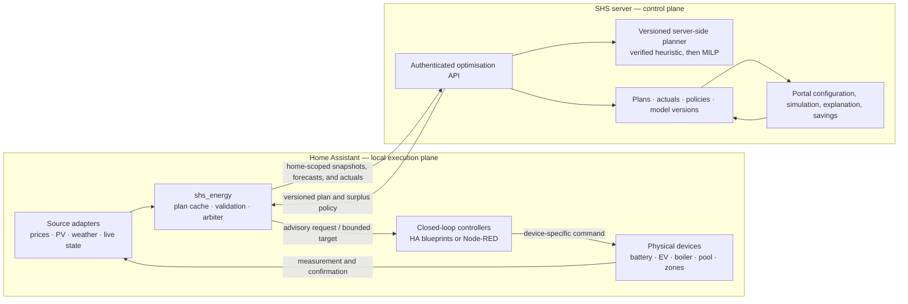
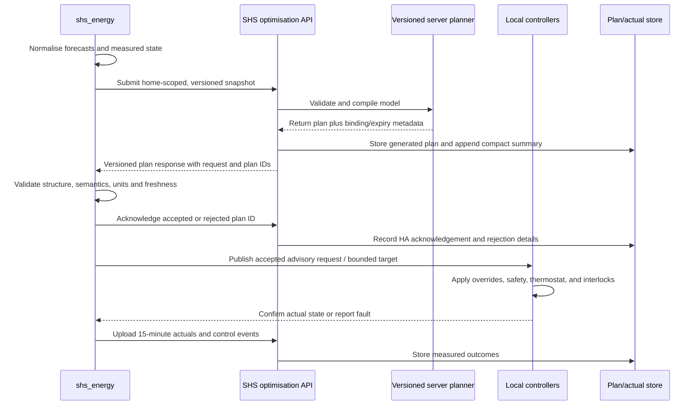
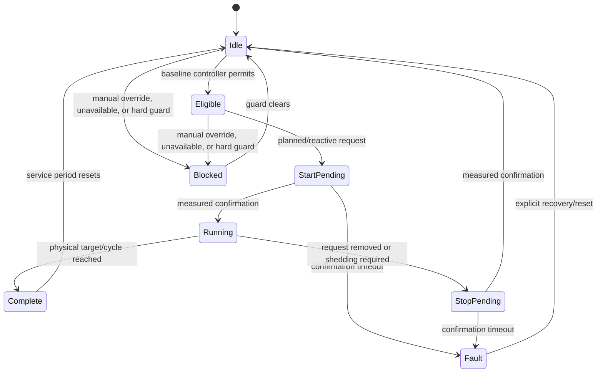

# Historical record: Contracts And Controls

[Architecture index](../../../ENERGY_OPTIMISATION_ARCHITECTURE.md) · [History index](README.md)

> **Historical evidence, not current requirements.** This is a preserved part of the pre-split document, including superseded claims, old implementation statuses, and unresolved experiments. The current topic specifications linked from the architecture index take precedence. References to deployed behaviour describe the date of the original entry, not a fresh verification.

<!-- BEGIN PRESERVED SOURCE -->

## 2. Terms

- **Baseline controller:** the normal local schedule, thermostat, occupancy, and
  safety logic that works without SHS optimisation.
- **Plan:** a versioned, time-indexed recommendation calculated from forecasts
  and a measured initial state.
- **Planned control:** use of the current plan's preferred windows, power target,
  setpoint offset, or import envelope.
- **Reactive control:** local allocation or shedding in response to measured
  grid flow, device availability, temperatures, SOC, overrides, or unexpected
  load. It operates inside the plan's policy and hard limits.
- **Executor:** the per-device HA or Node-RED controller that translates an SHS
  request into a device-specific command and confirms the physical result.
- **Hard constraint:** a safety, equipment, legal, or explicitly guaranteed
  customer limit. Optimisation may never violate it.
- **Soft target:** a preferred state that can move within a separately defined
  hard range when another sink is more valuable.

## 3. What exists today

### 3.1 Portal energy modelling

The website now has a separate live shadow-planning view. Its older
device-day/annual simulator remains a useful **forward load simulator**, not an
energy optimiser, and should not be confused with the new server-side planner.

Reusable foundations:

- `device_types`, `device_instances`, `home_device_assignments`, and
  `device_profiles` provide a reusable catalogue, home inventory, and
  performance-profile model.
- `energy_home_settings` stores a home-level UA estimate and overrides.
- `model_runs` snapshots inputs, device bindings, profiles, tariff inputs,
  results, and a daily time series.
- The simulator has five stateful device models:
  `fixed_baseload`, `electric_resistive_thermostat`,
  `air_to_air_heat_pump_inverter`, `fridge_freezer_compressor`, and
  `event_appliance`.
- The heat-pump model already supports COP/capacity curves, two-dimensional
  performance surfaces, modulation, and a startup transient.
- The device-day engine advances at five-minute intervals and emits 15-minute
  load data. It includes a simple per-room 1R1C thermal calculation.
- Manufacturer performance profiles and per-device calibration metadata can be
  stored and resolved.

Material limitations in that legacy simulator:

| Area | Current behaviour | Consequence |
|---|---|---|
| Dumb vs smart | `scenario` is saved to `model_runs`, but is never passed into or read by `simulateDeviceDay()` | A “smart” run has no smart behaviour. The ROI comparison is not evidence of optimisation savings. |
| Mode | `design` uses the selected outdoor temperature; both `typical` and `year` simulate one day at 0 °C | The mode selector does not yet represent typical weather or a chronological year. |
| Annual model | Forty-one independent constant-temperature days are interpolated against monthly mean temperatures | No chronology, solar, weather variability, state carried between days, or price correlation is represented. |
| Prices | The simulator reads legacy scalar fields from `tariff_instances` | It does not use the effective-dated tariff catalogue, spot-price series, separate import/export prices, or actual billing-period peak state. |
| PV/grid/battery | None are in the device-day energy balance | The current simulator cannot model self-consumption, export, battery arbitrage, curtailment, or grid limits. |
| Controls | `controllable` and `priority` are diagnostic metadata. `shiftable` only chooses a chart category | They do not change device timing or resolve concurrency. |
| UI controls | `comfortBand` and `targetPeak` are displayed/snapshotted but do not constrain the simulation | Runs can imply a promise that the engine did not evaluate. |
| Home settings | The simulator preloads indoor temperature, but ignores the saved UA override and thermal-capacity class | The simulator can show an override in setup while calculating with a different building model. |
| Initial state | Every device and room starts from a generated default | Battery SOC, EV SOC/presence, tank/pool/room temperatures, completed cycles, and manual overrides are absent. |
| Building model | UA and thermal mass are divided equally among inferred room keys | Zone heat loss and thermal storage are not physically calibrated. |
| House-model tool | The detailed envelope calculator stores its inputs only in browser `localStorage` and is not connected to a selected home or the simulator | Its more detailed UA calculation is not a production model input. |
| Calibration | Annual device energy is scaled to an override or billing history, but the day shape and peaks remain uncalibrated | Energy totals and network-peak costs can be based on inconsistent scales. Grid import can also be mistaken for whole-home use at a solar home. |
| ROI pairing | ROI independently selects the newest dumb and newest smart run | Even after smart behaviour exists, runs with different inputs, tariffs, or model versions could be compared. |
| Missing data | Binding code guesses values from device names and supplies defaults for UA, prices, setpoints, COP, schedules, and cycles | A run can look precise while depending on unverified assumptions. Production optimisation must fail validation instead. |

The current models should be retained for device physics, scenario replay, and
counterfactual simulation. They should not be extended into a browser-based
production scheduler.

**Superseded 2026-08-13 ([§1.3.4](portal-and-reporting.md#legacy-section-1.3.4)):** the *library* is retained on those grounds;
the simulator, house-setup, home-devices and tariff-pricing **tabs** are deleted.
[§1.3.4](portal-and-reporting.md#legacy-section-1.3.4) records the dependency check that made this safe.

### 3.1.1 Plan-facing load model correction

The production planner needs fewer load shapes than the legacy simulator. A
device's electrical shape is one of four plan-facing classes; thermostat,
comfort, storage and deadline state remain separate constraints rather than new
electrical classes.

| Load shape | Electrical forecast while enabled | Typical devices | Initial planner output |
|---|---|---|---|
| Fixed full load | One measured active power for 100% of the requested on-time | Resistive element, fixed-speed pump, simple charger | Run/stop window |
| Variable full load | A measured multi-stage or time-since-start power profile for 100% of the on-time | Dishwasher, washing machine, staged appliance | Start window; local controller owns the non-interruptible cycle |
| Duty cycle | Rated active power multiplied by an empirical probability/duty profile; an enabled device may draw zero | Water boiler, electric radiator, floor heating | Permit/inhibit window; never a forced-on prediction |
| Inverter load | Temperature- and time-since-start-conditioned variable power | High-power heat pump or air conditioner | Bounded setpoint/mode advice plus an expected-power profile |

Low-power refrigerators, freezers and similar compressor loads stay in the
empirical baseload unless their power is material to the connection limit. The
five simulator implementations remain useful ways to simulate the four shapes;
they are not five production scheduling contracts.

Electrical shape and planning authority are independent configuration axes.
Each home-local Energy Dashboard device has a planning role of `base_load` or
`controllable`. Base-load devices still use measured Home Assistant history but
are merged into the aggregate curve and omitted from device legends. A
controllable device is removed from that aggregate and carries one reviewed
control type: on/off schedule, variable power, permit/inhibit or setpoint.
Current-limited equipment uses variable power; Home Assistant determines the
electrical meaning from the mapped number entity. Initial classification is deliberately conservative: hot water,
pool heating and EV charging start with their supported controls; ordinary
household, heating and cooling meters start in base load. The inferred values
are persisted on first discovery and only change when a customer or staff member
selects a different value.

The schema-5 boiler representation corrects the old contiguous fixed-power job.
The controller cannot demand heat and does not know when hot water will be used,
so the boiler contract now:

- remain permitted by default so its own thermostat can maintain service;
- publish explicit inhibit slots around higher-priority pool, EV or unexpected
  high-load periods;
- forecast **expected** electrical power from measured duty behaviour without
  presenting that estimate as a command;
- bound consecutive inhibit time and preserve hygiene/manual overrides locally;
  and
- expose permit/inhibit separately from expected power so zero predicted watts
  can never be confused with loss of planner authority.

The same separation is required for every device: `expected_power_w` describes
the energy balance, while a typed control request describes authority (`run`,
`permit`, `inhibit`, current, or bounded setpoint). A single `boiler_w` field
cannot safely carry both meanings.

Home Assistant already has the authoritative device inventory: the Energy
Dashboard's `device_consumption` entries identify the curated energy statistics.
The integration should learn compact empirical models from recorder data and
publish model evidence, not raw state changes:

1. Resolve each Energy Dashboard device to a stable, home-scoped device key and
   an explicitly reviewed load shape.
2. Aggregate its recorder energy locally into complete 15-minute device slots.
   Retain short transition windows locally when fitting startup behaviour.
3. Fit robust active power, duty probability, time-since-start profile and, for
   material inverter loads, outdoor-temperature bins. Record sample counts,
   quantiles, error and the covered date/temperature range.
4. Upload the compact fitted profile plus recent 15-minute actuals needed for
   drift and plan-versus-actual reporting. Do not upload per-second samples.
5. Persist the fitted profile independently of the simulator UI so an imported
   or integration-learned air-conditioner model cannot disappear when a browser
   session or preview state is reset.

For the observed inverter air-conditioner shape, the first empirical profile
should represent the approximately 2.1 kW startup transient separately from the
roughly 0.6–1.0 kW modulating region, indexed by outdoor temperature and elapsed
run time. Manufacturer COP/capacity data may constrain the fit, but measured
electrical power is the source for the plan graph.

This was delivered as one coordinated, fail-fast schema increment across the
edge planner and `shs_energy`. Schema 5 uses `boiler_expected_w` for the energy
balance and `boiler_permitted` for authority. The Home Assistant request sensor
returns the reviewed rating only while permission is true and reports expected
power separately in its attributes.

### 3.2 Current `shs_energy` integration

The pre-change integration already mapped `total_increasing` energy sensors to
daily categories, backfilled daily totals, downloaded the tariff catalogue,
calculated monthly grid-tariff components locally, and exposed current grid
prices and subscription status.

The implementation in this change adds:

- one-home pairing and token binding, including home-scoped tariff lookup;
- schema 5 with optional solar/battery/device capabilities, fixed-power,
  discrete-current and empirical duty-cycle controls, and explicit
  `live`/`demo` mode;
- automatic aggregate-meter discovery from the Energy Dashboard, plus a short
  multi-step advanced flow and validated AI/MCP actions;
- a strict 15-minute contract for timestamped PV and separate server-owned
  supplier import and export forecasts;
- explicit market area, PV coordinates, source units, freshness, battery/grid
  capabilities, service deadlines, whole-slot minimum runs, and EV state;
- complete aggregate and per-device 15-minute recorder bins, weekday/weekend
  baseload and per-device profiles, daily remaining-service estimates, and
  conservative lead-day PV calibration;
- an hourly 72-hour plan request plus quarter-hour actual upload, with
  whole-home consumption derived from the grid/solar/battery energy balance
  when no separate total meter is configured;
- local cached plan/status, a boiler permit/inhibit request with separate
  expected draw, bounded pool/EV power requests, a dedicated EV current
  target/envelope sensor; and
- a live measured-export signal for a single reactive executor.

It still does not own device actuators, confirmation, thermal state models,
weather-conditioned load, or the central reactive allocator. Those remain
commissioning/product work. The existing daily energy, supplier-cost and tariff
history tables also remain customer-scoped until that older feature is made
multi-home; the new optimisation path itself is home-scoped end to end.
Energy Dashboard devices now retain stable home-local identities, suggested
four-class load characteristics, editable customer/staff planning roles and
control types, and compact 15-minute history. Only controllable devices appear
as individual forecast/actual graph series; all others remain in measured base
load. The first profile is a recent weekday/weekend trimmed mean. Temperature bins and
time-since-start startup fitting for material inverter loads remain the next
accuracy increment; the current implementation does not claim those inputs yet.

### 3.3 Existing local control

The exported Node-RED flows already provide valuable closed-loop behaviour:

- per-zone high, low, sleeping, and temporary setpoints;
- schedules, occupancy modes, and manual overrides;
- thermostat hysteresis and grouped actuators;
- outdoor-aware summer lockout, warm-weather hysteresis, and cold boost; and
- reusable subflows for overrides, timers, schedules, and floor thermostats.

The inspected room flow applies a 0.2 °C hysteresis around the selected room
setpoint, uses the lower of two sensors where a room has two, and re-evaluates
the thermostat periodically. CronPlus schedules deliberately use different
minutes for different rooms, which spreads scheduled transitions, but each room
still decides independently whether it may draw power. Schedule selection,
occupancy/manual policy, thermostat demand and relay actuation are currently
combined inside each room flow.

There is no shared `heat_request`, thermal-debt score, instantaneous heating
budget, or home-wide grant/revoke decision. Consequently, staggering start
times reduces one source of coincidence but cannot prevent several thermostats
calling for heat together after a cold change or setpoint recovery. The January
historic-device snapshot contains coincident demand around 10–11 kW, while the
April and September snapshots have very different dominant loads. Those
single-day screenshots are useful evidence of the coordination problem, but
the underlying recorder series—not screenshots—must be used to fit and verify
the planner.

In the outdoor-aware snapshot, the seasonal rules are hard-coded as June–August
heating lockout, 15/13 °C outdoor-mean hysteresis, and cold boosts below 5 °C and
0 °C. These are useful prototype settings, not yet a product parameter model.
They look backward at a 24-hour mean and cannot distinguish a one-day cold dip
from a sustained cold spell or a warm forecast tomorrow. This seasonal decision
belongs in a weather-aware heat-demand plan, with local hard comfort and frost
limits continuing to override it.

The notes also describe power-confirmed IR control, pool cycle detection, EV
state, and Sigen inverter control. Those IR groups are not in the exported flow
set, so a fresh export is required before treating them as reproducible product
logic.

### 3.4 Corrections and conflicts in the working notes

Later verified observations in the notes supersede the stale “outstanding” list
in section 13: the EMHASS deferrable count was raised to four and dynamic required
hours were implemented earlier in the same document.

The notes also call missing effektavgift attributes an open defect. The current
tariff implementation and published `ellevio-2026-06-01` definition deliberately
contain no demand rule, so `capacity_cost_per_kw`, `demand_charge`, and
`billing_period_peak_kw` being absent is expected for the active revision. The
commercial tariff source should still be rechecked before release, but the model
must not invent a demand charge while the published contract has none.

Finally, “money saved” and the proposed strict ordering “self-consumption first,
balanced load second, cost third” are not equivalent. The EMHASS experiment
already showed that a self-consumption objective can import at the cap because
import has no cost in that objective. Section 8.2 makes the required product
decision explicit.

## 4. Target architecture

### 4.1 Portal and backend responsibilities

The portal/backend owns:

- home identity, location/timezone, grid connection, tariff assignment, and
  subscription entitlement;
- the device inventory, capability model, relationships, performance profiles,
  and customer preferences;
- a commissioning UI showing every required and missing input;
- scenario simulation and historical replay;
- canonical model and policy versions;
- construction of a complete, validated optimisation problem;
- the versioned server-side planner and its future solver infrastructure;
- a versioned current plan, compact immutable run summaries, actuals,
  explanations, and model errors;
- counterfactual baseline and savings calculations; and
- fleet-level monitoring without exposing one customer's data to another.

The browser is a UI over these services. It must not be required to be open for
planning, and it must not receive device tokens or call the solver with
untrusted customer-supplied home IDs.

Supabase Edge Functions remain suitable as the authenticated facade and for
database work. The numerical optimiser should run in a separately deployed
Python container with a pinned solver/runtime. The facade authorises the device
token and home, submits a typed job, and returns or retrieves the result.

The implemented initial service is synchronous and uses a pure, deterministic
TypeScript heuristic in the authenticated edge function. It schedules
contiguous service runs, keeps fixed loads at rated power, and distributes an
EV energy obligation across supported current steps. Every selected current is
converted to watts before battery/grid simulation. Invalid input is rejected;
infeasible output is explicitly marked and cannot become actionable. Requests
are idempotent by `home_id` and `snapshot_id`.
Battery dispatch in this stage is a self-consumption/reserve policy, not a full
price-arbitrage optimiser; the UI labels its terminal-energy adjustment so it
cannot be mistaken for a complete MILP result.
The next solver stage can move the same versioned contract behind a small
FastAPI/Pydantic service with a pinned open-source MILP solver such as HiGHS.
That service must receive a complete snapshot; it must not query Home Assistant
or silently fill missing inputs. If EMHASS formulation code is reused, retain
its MIT attribution and add contract-level regression tests around the adapted
constraints.

### 4.2 Integration responsibilities

The integration owns:

- an explicit one-token-to-one-home binding;
- an automatic options/config flow whose metering source of truth is the HA
  Energy Dashboard, with small manual steps for unusual installations;
- provider adapters that return canonical 15-minute PV, weather, and supplier
  price series regardless of whether the source uses attributes or service
  responses;
- live measurements and state required to seed every stateful device;
- calculation of empirical base load after subtracting only complete device
  series classified as controllable, with those profiles added back exactly
  once by the planner and all non-controllable device use left in base load;
- contract validation, units, UTC timestamp conversion, and source freshness;
- request idempotency, plan polling/refresh, local storage, expiry, and model
  version compatibility;
- Home Assistant entities representing plan health and the **current** request
  for each device;
- one central local reactive allocator so independent loads cannot all claim the
  same surplus;
- actual power/state sampling, command outcome events, and 15-minute aggregation;
  and
- safe disengagement: once a plan is expired or a required sensor is invalid,
  issue no new optimisation request and leave the baseline controller in charge.

A planned-request entity is unavailable when the planner has no authority.
`0 W` is used only inside a valid binding slot to mean an explicit off request;
this distinction prevents an outage from masquerading as a stop command. A
discrete-current EV additionally exposes target, deadline-safe minimum and
hardware maximum amperes. The target is the expected forecast load; the local
controller may move inside the envelope and must account for any resulting
energy deficit before departure. Maximum recovery headroom remains available
through the departure window even when the forecast target finishes early.

The integration does **not** guess a missing installation rating, live state,
price or temperature. A missing device-specific fact makes only that optional
capability ineligible. Product-owned policy defaults are applied at runtime and
persisted when configuration is saved, so an unset optional feature does not
turn the whole integration into a wall of missing internal field names.

The full 72-hour plan should remain in integration storage rather than a large
recorder-backed sensor attribute. HA entities expose plan status, current/next
slot, current opportunity signal, and per-device request/reason.

### 4.3 Local controller responsibilities

Each executor owns:

- manual override precedence;
- equipment safety and hard temperature/SOC limits;
- baseline schedule and occupancy logic;
- thermostat or completion detection;
- coupled equipment such as pool pump plus heater;
- minimum on/off time, quiet hours, rate limits, and anti-chatter hysteresis;
- device-specific service calls and inverter modes;
- command confirmation from measured state/power; and
- a fault result when an expected transition does not occur.

For the prototype, existing Node-RED subflows can implement these adapters. The
customer product should use versioned native HA blueprints or integration-owned
controller entities so Node-RED is not a prerequisite. The integration should
not silently create or edit customer automations. Commissioning should import a
known blueprint and create one visible automation per mapped executor, or allow
an existing Node-RED flow to consume the same request entities.

### 4.4 Supported control boundary by device class

| Device class | Planner output | Reactive/local work | Initial control authority |
|---|---|---|---|
| Battery | Charge/discharge envelope and target SOC trajectory | Clamp to live SOC, inverter limits, reserve, grid mode, and confirmation | Direct bounded target only after shadow validation |
| EV charger | Required energy by deadline plus target/minimum/maximum current for every slot | Presence/SOC check, reactive step adjustment, delivered-energy/deadline guard, confirmation | Advisory current target to EV controller |
| Water boiler | Opportunity windows and normal/soft/hard temperature targets | Thermostat, hygiene cycle, maximum runtime, completion | Permit/request only |
| Pool heating | Opportunity windows and soft/hard water targets | Pump/heater coupling, filtration requirement, seasonal enable (air-source only, [§8.14](planner-experiments.md#legacy-section-8.14)), completion | Permit/request only |
| Resistive room heating | Aggregate heating-power envelope plus per-room comfort band, preheat permission and priority | Home-wide grant allocator, then room thermostat, occupancy, manual override and hard comfort floor | Bounded setpoint/permission advice; never direct relay timing |
| Inverter heat pump/aircon | Mode, bounded setpoint offset, preferred recovery window | Native thermostat, COP/defrost behaviour, minimum run time, IR/power confirmation | Setpoint advice only |
| Duty-cycle appliance | Start-by window or “avoid now” signal | User intent and non-interruptible cycle | Advisory; never force-start initially |
| Fixed baseload | Forecast only | None | No control |

Power shape and stored state are orthogonal. For example, an EV is variable power
with SOC; a boiler is fixed power with temperature; a pool process is coupled
fixed power with temperature and cycle state. Both axes belong in the device
contract.

## 5. Canonical contracts

### 5.1 General rules

- Timestamps are UTC ISO-8601 and slots are half-open `[start, end)` intervals.
- The canonical step is 900 seconds; 23-hour and 25-hour local days are normal.
- Power is watts, energy is watt-hours or explicitly named kWh, temperature is
  °C, SOC is a fraction from 0 to 1, and prices are SEK/kWh.
- Avoid ambiguous signed fields. Publish separate non-negative
  `grid_import_w`/`grid_export_w` and
  `battery_charge_w`/`battery_discharge_w` values.
- The authenticated envelope derives `home_id` from the device token; the
  client cannot choose it. Snapshots carry schema/ID/capture metadata and the
  stored row adds the input hash; plans add model version, issue time and
  validity.
- Arrays must be contiguous, sorted, unique, and the same length over their
  stated overlap. A shorter supplier forecast shortens the binding price
  horizon; it is never extended by repeating a value.
- Every source carries `observed_at` or `issued_at`, `valid_until`, and quality.
- PV location is the configured HA home location. An adapter-provided location,
  when present, must match it; a canonical timestamped-watts provider need not
  duplicate location in every sensor. Import and export adapters independently
  use the same discovered or commissioned `SE1`–`SE4` market area.
- Validation errors name the exact field/device/source. Versioned product
  defaults are allowed only for visible policy/orchestration choices such as
  soft targets, efficiency starting points and normal time windows. Equipment
  ratings, entity bindings, locations and electrical limits are never guessed,
  and the production contract has no legacy aliases.

### 5.2 Home/device capability input

The existing `device_instances.field_values` is suitable for catalogue facts but
should not become an unstructured bucket for control policy and HA entity IDs.
Add explicit, versioned records for:

- **installation capability:** rated/minimum power, modulation steps, usable
  capacity, efficiency, export/grid-charge permissions, supported modes;
- **state model:** state kind, sensor source, valid range, freshness limit;
- **policy:** normal target, soft range, hard range, deadline/window, priority
  rules, manual override semantics;
- **dynamics:** minimum on/off, startup curve, thermal loss/capacity, COP curve;
- **relationships:** coupled-with, mutually-exclusive-with, requires, and
  sequence-after; and
- **HA binding:** measurement, state, completion, availability, actuator, and
  command-confirmation entities/services.

Recommended new stores are `ha_home_bindings`, `ha_device_bindings`,
`energy_control_policies`, and versioned `energy_device_model_parameters`.
`model_runs` remains the offline scenario-run table; it should not be overloaded
as the live plan store.

### 5.3 Optimisation snapshot

Each solve receives:

- the complete validated static capability/policy snapshot;
- live battery, EV, boiler, pool, zone, cycle, availability, and override state;
- PV, outdoor-temperature, all-in import/export price, and base-load forecasts;
- grid import/export limits and, only when present in the tariff contract,
  demand-charge rules plus month-to-date billed peak;
- work already completed in the relevant service period;
- plan-versus-actual state from the preceding slot; and
- the terminal assumptions used beyond the binding horizon.

The deployed boundary accepts snapshot schemas 5 and 6. Schema 5 is the legacy
fixed-block planning contract. Schema 6 adds measured pool state and plans the
battery, connected EV and pool as stateful stores under the shared marginal-value
dispatcher; each generated scenario names those stores in `dispatched_devices`.
Both schemas carry `mode`, an explicit capability map, nullable PV and battery
provenance, a nullable battery model, and typed service controls. A fixed load
declares `fixed_power`; a modulating EV declares `discrete_current` with
minimum/maximum/step amperes, phase count and per-phase voltage. Disabled
capabilities must contribute zero power and cannot appear in a service request.
Only `mode=live` crosses the Home Assistant API. The promotional demo is a
browser-local fixture and is never uploaded or stored as a live plan.

Only snapshot data needed for the solve is uploaded. High-frequency reactive
control remains local; the backend receives 15-minute actuals and discrete
control/fault events.

The implemented storage budget is bounded:

- raw/per-second samples never leave Home Assistant;
- only complete recorder 5-minute statistics are summed locally into at most 96
  unique actual rows per home/day; each request is capped at 192 rows and 1 MB;
- actuals deliberately trail real time by one quarter so recorder statistics can
  settle, and the most recently accepted quarter is re-sent once by idempotent
  upsert so a late category can complete without increasing row count;
- actual quarter-hours have 120-day rolling retention (11,520 rows/home);
- the large 72-hour snapshot and plan overwrite one current row per home;
- only compact run summaries are appended, hourly, with 30-day retention; and
- daily category and billing aggregates continue through the existing nightly
  path and are not duplicated into the optimisation series.

### 5.4 Plan output

A plan contains:

- a 72-hour forecast and confidence/provenance per slot;
- the measured battery source plus the exact battery, grid, service-control,
  minimum-run, deadline, and active-day sample inputs used by the solve;
- a `binding_until` boundary based on exact price availability;
- all-in import/export marginal prices;
- PV and base-load forecasts;
- an import/export envelope and an opportunity rank or marginal value;
- a battery power/SOC plan;
- per-device required service, preferred windows, bounded target/offset, reason,
  and whether the output is binding or advisory; discrete EV slots carry
  target/minimum/maximum current and the power derived from the target;
- an ordered surplus-allocation policy with promotion/demotion conditions;
- expected cost, self-consumption, peak, comfort deviations, terminal state, and
  constraint margins; and
- human-readable reason codes suitable for the portal and HA logbook.

The plan is not a list of unconditional on/off commands.

### 5.5 Comfort band schedule

A heating schedule that names one target temperature per period leaves the
planner nothing to optimise. If a room must be at 21.0 °C at 06:00, there is
exactly one correct answer and load shifting is impossible. The constraint the
portal owns is therefore a **time-varying band**, not a target:

- per zone, a repeating weekly schedule of segments;
- each segment carries `comfort_min_c` and `comfort_max_c`;
- an unoccupied/away profile overrides the weekly schedule;
- a frost floor applies unconditionally and cannot be scheduled away.

The planner may put the zone anywhere inside the band. Everything between the
edges is flexibility it can spend on cheap import, solar surplus or peak
avoidance. Nothing about the band tells it *when* to heat.

This is also where the ecosystem has converged. EMHASS supports both a
per-timestep target (`desired_temperatures`) and a per-timestep `min`/`max`
pair, and has marked the target form legacy, recommending the range precisely
because it "allows the optimizer to float the temperature within this range to
find the cheapest time to operate".

The band belongs to the portal, not to Home Assistant. Reading it from local
helpers would tie the contract to one home's automation conventions —
`input_number` levels selected by a mode string, sleep levels the mapping does
not know about, cold-weather offsets applied in a function node. A portal-owned
band asks Home Assistant only for a room temperature sensor and an actuator,
which every customer with a thermostat can satisfy. Existing local helper
values may be read **once** to seed a zone's initial band so a customer with
many zones does not hand-enter them, but they are not a live input.

Two zone properties travel with the band because they change what a legal
schedule means:

- `sense`: whether the zone can heat, cool, or both. A zone that can only heat
  defends `comfort_min_c` and treats `comfort_max_c` as an overshoot limit; a
  reversible aircon defends both edges actively.
- `recovery_lead_slots`: derived, not entered. A high-mass zone must begin
  recovery well before the band tightens, so its usable shifting window is
  shorter than a low-mass zone's even when the bands are identical.

### 5.6 Thermal observation series

Zone learning consumes a separate quarter-hour series from the electrical
actuals, because a zone sensor can settle after its energy meter and a quarter
that is complete electrically may only later become describable thermally.

Per zone, per quarter: `room_temperature_c` and `actuator_duty`. Per home, per
quarter: `outdoor_temperature_c`. Comfort levels and setpoints are carried when
available but are **context, not fit inputs** — they constrain planning and
draw the chart's band; the physics does not need them, and a row is never
dropped for lacking them.

Cooling is measured but never modelled. A reversible aircon in summer pushes
energy through its meter while the room gets colder, which counted as heating
would ask the fit to explain an impossibility. `hvac_action` is therefore read
for *direction* rather than mere activity, a separate `cooling_duty` is
recorded, and those quarters are dropped from training. Modelling cooling is
out of scope; distinguishing it is not optional.

Heat input is deliberately *not* re-sent. Per-device `device_energy_kwh`
already crosses on the electrical slots and is strictly better than any
state-derived estimate, because it sees an inverter's modulation. `actuator_duty`
corroborates it: it separates "ran briefly at full power" from "ran all quarter
at low output" for zones whose meter is coarse, and marks quarters where the
zone was never called.

Three recorder shapes have to become one grid, and they are not
interchangeable. Room and outdoor temperature are `measurement` sensors with
five-minute `mean` statistics that survive as long as `purge_keep_days`.
Comfort helpers are `input_number`s with no `state_class`, so no statistics
exist for them at all and they must come from state history. Actuator state is
not a number in any form; the useful quantity is the share of the quarter spent
actually running. Both step-function sources are time-weighted rather than
averaged over recorded points, so five `on` rows in one minute cannot outweigh
an `off` that held for the remaining fourteen. A climate entity's `hvac_action`
is authoritative over its mode: a thermostat left in `heat` all night is not a
heater that ran all night.

### 5.7 Private Home Assistant API contract

The Home Assistant boundary is a private client–server API. More precisely,
`shs_energy` is a device client of the SHS backend: Supabase Edge Functions are
the authenticated facade, the planner and database are server components, and
the browser portal is a second client over server-owned state. Home Assistant
does not call the React website, and the website must not be open for planning
to continue.

The current routes are operation-oriented JSON endpoints (`pair-device`,
`integration-status`, `integration-tariff`, `integration-prices`,
`ha-energy-ingest`, and `energy-optimisation-ingest`). That RPC-style shape is
appropriate for one private client; REST resource purity and public service
discovery are not goals. The `/functions/v1` segment in the deployed URL is a
Supabase gateway version, not an SHS API contract version.

The current implementation is not a sufficient contract boundary. TypeScript
interfaces and server validators, the portal's reader, and the integration's
Python validator independently describe the same documents. A schema number
does not prevent those implementations from disagreeing. In particular, a
change can be valid according to the planner's schema-6 tests and still be
refused by a schema-6 integration because no release gate has exercised the
real generated document through the real consumer. Architecture prose and
hand-built examples are useful explanations, but neither is a normative or
executable contract.

The rules in this section are release constraints, not optional future
hardening. No new Home Assistant-facing plan semantics may be deployed until
the canonical schemas and the provider–consumer gate below exist.

#### 5.7.1 One normative contract source

Maintain one versioned OpenAPI 3.1 document with JSON Schema components for
every Home Assistant request, success response and error response. It may stay
private in the source repository or a private contract package; serving public
API documentation is unnecessary. Generated reference documentation is a
view of that source, never a second definition.

The canonical source must define distinct types such as `SnapshotV5`,
`SnapshotV6`, `PlanV5` and `PlanV6`. A type named `V5` whose discriminator
accepts both 5 and 6 hides the exact differences the version is meant to make
visible. The contract must specify required and optional fields, enums, units,
ranges, nullability, timestamp forms, omission-versus-empty semantics, maximum
sizes and whether unknown fields are accepted.

Generate TypeScript types and structural runtime validators for the edge and
portal, and Python types and structural validators for `shs_energy`, from that
source. Domain invariants which JSON Schema cannot express—contiguous UTC
slots, electrical balance, aligned charger increments, equal scenario horizons
and state transitions—remain explicit semantic validators. They must consume
the generated types and run against the shared contract corpus; they must not
silently recreate the structural schema.

#### 5.7.2 Independent version axes and negotiation

Keep four independent identifiers:

- `api_version` versions endpoint envelopes, common errors and acknowledgement
  behaviour;
- `snapshot_schema_version` identifies exactly what Home Assistant sent;
- `plan_schema_version` identifies exactly what Home Assistant must interpret
  and execute; and
- `model_version` identifies the algorithm and decision behaviour for replay
  and comparison, but never acts as a transport compatibility gate.

The integration release version is diagnostic metadata, not the compatibility
decision. Each planning request must declare its snapshot schema and the exact
plan schemas it accepts, for example `accepted_plan_schema_versions: [5, 6]`.
The server must return only one of those versions. The ability to produce a
snapshot version must not be treated as proof that the client understands every
later interpretation of a plan carrying the same number.

A new optional descriptive field with unchanged meaning may remain in the same
schema when readers are required to ignore unknown fields. A new required
field, a changed invariant, or any changed execution meaning requires a new
schema version even when the JSON shape could technically remain unchanged.
An algorithm-only change increments `model_version`, not the plan schema.

`integration-status` must report the server API version, supported snapshot and
plan schemas, the most recent request ID, and any minimum supported contract.
This is compatibility and diagnostics discovery, not a public API catalogue.
When no mutually supported contract exists, return a structured
`client_upgrade_required` response (HTTP 426) instead of emitting a document
the client will later refuse.

#### 5.7.3 Plan lifecycle and acknowledgement

Plan generation, persistence and local acceptance are different states and
must never be collapsed into one "current plan" flag:

1. Home Assistant submits a versioned snapshot and requests a plan.
2. The server validates the snapshot, generates a plan, stores the generated
   run and returns it with `request_id`, `plan_id` and `snapshot_id`.
3. Home Assistant validates the structural and semantic contract.
4. Home Assistant acknowledges `accepted` or `rejected` for that exact plan.
   A rejection carries stable error codes and field paths, not only prose.
5. Only an accepted, unexpired plan is described as executable. The latest
   generated plan may still be displayed for diagnosis, but it is not labelled
   as the plan Home Assistant is executing.

The server therefore records both the latest generated plan and the latest
Home Assistant acknowledgement. The portal must distinguish at least:

- no plan request has arrived;
- the latest ingest or generation failed;
- a plan was generated and is awaiting acknowledgement;
- Home Assistant rejected the generated plan, including its reason;
- Home Assistant accepted the plan and it is executable; and
- the latest generated or accepted plan expired without replacement.

Today the server stores a generated plan before the integration validates the
response, so a local rejection does not itself delete or expire the portal's
copy. Conversely, the portal cannot currently know that Home Assistant rejected
it. An expired stored plan means no later generation successfully replaced it;
an ingest/gateway failure and a client contract rejection are separate faults
and must remain separate in both storage and UI. The portal wording must say
that Home Assistant *requests* plans, the server generates them, and Home
Assistant accepts and executes compatible plans.

#### 5.7.4 Common success and error envelopes

Every endpoint returns the same versioned outer envelope. Errors carry:

- a stable machine-readable `code`;
- a safe human-readable `message`;
- a JSON field `path` where applicable;
- structured `details` for multiple independent failures;
- `retryable`, so the integration can distinguish configuration, compatibility
  and transient infrastructure failures; and
- a `request_id` present in the integration log, portal diagnostics and edge
  logs.

HTTP status still communicates the broad class. The body carries the durable
product meaning. A proxy response without a valid envelope is reported as an
upstream transport failure with its request/correlation headers; it must not be
presented as a planner validation error. Subscription, authentication,
validation, conflict, upgrade-required, rate-limit and internal failures use
documented codes consistently across routes.

#### 5.7.5 Provider–consumer verification and release order

Contract CI must cross the repository boundary. For every supported schema:

1. the real TypeScript planner generates canonical success, incomplete and
   infeasible plans from fixed snapshots;
2. the server validates every emitted response against the canonical schema;
3. the real Python `shs_energy` reader validates those exact generated plans;
4. mutation cases prove that both sides reject the same missing fields, wrong
   units, invalid enums and semantic violations; and
5. the portal reads the same corpus and presents the same generated,
   acknowledged, rejected and expired states.

The corpus must cover every control shape and lifecycle branch, including a
dispatched pool, a dispatched EV with zero charge, a dispatched EV charging at
valid minimum/target/maximum current steps, battery charge and discharge,
duty-cycle inhibition, room heating, stale provenance, an expired plan and an
explicit HA rejection. Hand-written consumer fixtures alone are insufficient:
at least one fixture per branch must be produced by the shipping provider.

Publishing or deploying an edge function that changes an HA-bound schema is
blocked unless the provider suite and the pinned integration consumer suite
both pass. Rollout order is reader first, writer second:

1. publish the canonical contract and generated readers;
2. release an integration that advertises and accepts the new plan schema;
3. observe supported versions from active installations;
4. allow the server to emit the new schema only to clients that advertised it;
5. retain the preceding schema for the declared upgrade window; and
6. retire it deliberately once telemetry shows that the supported population
   has moved, returning `client_upgrade_required` to anything older.

#### 5.7.6 Endpoint cohesion and migration

First describe and test the existing endpoints without changing their runtime
behaviour; mixing a contract migration with a transport redesign would create
another untestable rollout. Once the shared contract and compatibility gate are
live, separate the multiplexed `energy-optimisation-ingest` operation into
cohesive contracts for:

- device-inventory reconciliation and website-owned planning requests;
- quarter-hour telemetry and upload watermarks;
- snapshot-to-plan generation; and
- plan acknowledgement.

Daily billing aggregates, tariff catalogues, supplier prices, pairing and status
remain separate operations. Splitting is justified by retry and ownership
boundaries, not REST aesthetics: a telemetry retry must not accidentally change
device configuration, and a plan rejection must not discard accepted telemetry
watermarks.

## 6. Planned-control scenario

### 6.1 Cadence

Generate a plan:

- when a new day-ahead supplier-price forecast becomes available;
- at least hourly while optimisation is enabled;
- when the integration reports a material state change such as EV arrival,
  changed departure target, manual override, completed pool/boiler service,
  battery SOC drift, or a forecast revision; and
- after a device fault changes the eligible capability set.

Rate-limit event-triggered replans. The integration continues using a plan only
until its explicit expiry; local controllers continue independently.

### 6.2 Planning flow

### 6.3 Priority and conflict order

All executors use the same precedence:

1. physical/electrical safety, equipment hard limits, and island/emergency mode;
2. explicit manual override;
3. hard service commitments such as minimum room temperature, hot-water hygiene,
   pool freeze protection, and EV departure minimum;
4. local reactive correction within the current plan policy;
5. planned preference or target;
6. baseline schedule when no optimisation request applies.

The planner cannot downgrade levels 1–3. The reactive layer may change level 5
when actual conditions differ, but only within the plan's hard envelope.

### 6.4 Executor state machine

Every controlled process should use the same observable state machine, with
device-specific guards:

State changes, guard failures, requests, commands, and confirmations are logged
with reason codes. An IR toggle is not considered successful until measured
power confirms it.

## 7. Reactive-control scenario

Reactive control is one local allocator, not one competing “surplus automation”
per load.

### 7.1 Inputs

- stable measured grid import/export and whole-home load;
- actual PV and battery power/SOC/headroom;
- current plan envelope and surplus policy;
- device presence, state, target, hard limit, completion, and availability;
- manual overrides and baseline-controller eligibility; and
- unexpected high-load events.

Never trigger from the flapping Sigen import binary sensor. Use numeric grid
power with separate import/export thresholds, hysteresis, and a stable duration.

### 7.2 Allocation loop

1. Calculate usable surplus after the battery's current commitment and a
   configurable measurement/error reserve.
2. Filter the policy to locally eligible sinks.
3. Apply promotion/demotion rules from live state. Example: an EV at very low
   SOC and present is promoted; a completed pool cycle is demoted.
4. Allocate to the highest-ranked sink whose minimum stable power fits. A
   variable sink can take the remainder; a binary sink requires its start
   threshold and minimum run commitment.
5. Wait for measured confirmation before allocating the same watts elsewhere.
6. When import exceeds the plan envelope or a large uncontrolled load starts,
   shed controllable sinks in reverse service priority, respecting minimum run
   and hard-service constraints. [§7.7](contracts-and-controls.md#legacy-section-7.7) replaces "reverse service priority" with
   the two criteria that order actually needs — response time, and headroom
   within a class — and specifies how such a load is detected when it is
   unmetered, and how the shed loads are returned.
7. Re-evaluate on confirmed transitions and stable material power changes, not
   on every noisy sensor sample.

### 7.3 Solar-cliff policy

For “sunny today, cloudy tomorrow,” the server can promote storage sinks and
raise soft targets because it sees the multi-day forecast. The local allocator
decides whether forecast surplus actually materialises.

- If the EV is absent or already sufficiently charged, battery, hot water, and
  pool thermal storage may move from normal target toward their hard upper
  limits before exporting.
- If the EV is present below its urgent threshold, it is promoted above pool
  comfort. The pool may stop below its normal target but never below its hard
  minimum/freeze constraint.
- If tomorrow becomes sunny in a revised forecast, the promotion disappears on
  the next plan; no local controller needs bespoke forecast logic.

The required policy fields are therefore **normal target, soft range, hard
range, ranking, and conditional promotions**. A single setpoint and integer
priority are insufficient.

### 7.4 Automation packaging

The integration should expose one merged effective request per bound device,
regardless of whether its source is planned, reactive, hard-service recovery,
or load shedding. At minimum, expose:

- requested state or bounded power/setpoint target;
- request source and reason code;
- request/plan expiry;
- eligibility and the guard currently blocking execution; and
- last command/confirmation/fault status.

Provide three versioned executor templates:

1. **Binary process executor** for boiler, pool process, and relays. It consumes
   an on/off request, applies local completion/temperature and minimum-run
   guards, then confirms from power/state.
2. **Variable-power executor** for EV and, after separate commissioning,
   battery/inverter control. For EVs it starts from the planned current, moves
   only in the charger's declared steps inside the slot envelope, and confirms
   the achieved value. Delivered-energy drift is carried into the deadline
   guard and next replan rather than being erased at the slot boundary.
3. **Thermal setpoint executor** for rooms and aircon. It applies only a bounded
   offset or mode request to the existing thermostat/occupancy controller.

The planned trigger is a new valid plan or a slot boundary. The reactive trigger
is a stable material change in grid flow, state, or eligibility. Both update the
same effective request entity; they do not call the physical device in parallel.
The executor alone performs service calls.

During shadow commissioning, Phil's current Node-RED setup remains the reference
controller and receives no actuator request. The target product replaces it
room by room with the integration-owned coordinator and native HA executor only
after temperature demand, overrides, hysteresis, minimum on/off time, relay
confirmation and failure behaviour have equivalent tests. Disable the matching
Node-RED room group before enabling its new executor so two systems can never
command the same relay. The end state has no Node-RED runtime dependency.

For `number.tesla_model_y_charge_current`, the planned automation consumes the
quarter's target amperes. The existing one-minute reactive loop may then raise
or lower that target by 1 A using measured export/import and battery state, but
it clamps to the plan's current envelope and the entity's 5–16 A capability.
Starting, stopping, cable/SOC checks, cooldowns and command confirmation remain
local. A material target-versus-delivered energy difference triggers replanning;
it is not hidden by uploading high-frequency samples.

### 7.5 Coordinated room-heating contract

Room heating needs three nested decisions rather than a choice between a
schedule and a thermostat:

1. **The 15-minute planner sets the envelope.** It forecasts zone heat demand
   from current indoor temperatures, outdoor-temperature/weather forecasts,
   occupancy policy, measured heater power and learned room response. It emits
   an aggregate heating-power cap for each slot, an allowed comfort band and
   optional per-room preheat/relaxation advice. It does not predict or command
   exact relay duty cycles.
2. **One local coordinator allocates the envelope.** Each room reports a heat
   request, measured temperature, target/band, rated power, on/off state,
   minimum on/off timers and a thermal-debt score. The coordinator grants a
   subset of requests that fits the current home/heating power budget, rotates
   equal-priority rooms fairly, and sheds in reverse priority when an
   uncontrolled load appears. A room below its hard comfort or frost limit is a
   hard request, not an optimisation preference.
3. **The existing room thermostat executes a grant.** Sensor selection,
   hysteresis, relay calls, manual overrides, occupancy and command confirmation
   stay local. A grant only permits heat while the thermostat is requesting it;
   it never forces a warm room's relay on.

**Prefer commanding a setpoint trajectory over commanding relays.** Once a zone
has a fitted model, the planner can publish the indoor temperature trajectory
it intends and let the existing thermostat track it, rather than issuing on/off
grants. This is how EMHASS executes its thermal loads, and it has a property
worth more than the extra precision of direct control: a stale plan, an expired
token or a dropped connection degrades to the thermostat holding its last
setpoint, not to a cold house. Direct relay control fails unsafe by default and
needs a watchdog to become safe; setpoint control is safe by construction, and
keeps the local flows as the fallback layer rather than replacing them.

The coordinator should rank requests by a transparent thermal-debt metric such
as temperature deficit relative to the active comfort band, time waiting,
forecast heat loss and room priority. Minimum on/off times and fairness prevent
chatter and starvation. The planner reserves enough aggregate energy over the
horizon; the coordinator owns the unknowable minute-by-minute duty allocation.
Material aggregate heat or temperature drift triggers an early replan.

Shoulder-season control should use a forecast indoor-temperature trajectory or,
initially, forecast heating degree-hours over the next 24–48 hours. A cold
morning followed by a warm day may justify allowing temperature to coast inside
the comfort band; sustained forecast cold justifies recovery or preheating.
This replaces calendar lockouts and backward-looking cutoffs without weakening
hard comfort, frost, manual or sensor-validity constraints.

Peak policy is external to the room algorithm. The tariff catalogue supplies
an effective-dated demand-charge rule and current billing-period reference peak
when one exists; otherwise the same coordinator may enforce only the physical
connection limit or an explicitly configured smoothing target. A future
Ellevio rule change therefore changes planner inputs, not every room flow.

### 7.6 One plan, synchronized explanatory views

Use one **Plan explorer** card with four tabs—Power, Thermal, Economics and
Storage—rather than four unrelated cards or four axes in one crowded plot. The
tabs replace only the chart body; plan selection, With/Without plan scenario,
time range, cursor, selected slot and device selection remain shared. They are
projections of one plan, not separate forecasts:

| View | Default content | Question it answers |
|---|---|---|
| Power and control | Stacked empirical base load plus controllable devices, grid import/export, aggregate room-heating envelope and physical/tariff peak reference | What is expected to draw power, and what is being limited? |
| Thermal | Outdoor forecast, aggregate worst-room comfort margin and the selected room's forecast temperature/comfort band; other rooms appear only on selection | Is heating being delayed safely, and which room needs attention? |
| Economics | All-in import and export prices, incremental peak price when applicable, and shaded planned-action windows | Why is energy being moved to this slot? |
| Storage | Battery SOC, reserve/target band and optionally thermal-service state | What flexibility is being stored or consumed? |

The Power tab is the authoritative electrical balance. Every electrical device
still contributes exactly once to the same load forecast there; changing tabs
does not remove it from the plan. The other tabs expose inputs, constraints and
state trajectories that explain why that electrical load was placed in a slot.
Device visibility remains a Power-tab concern, while selecting a room/device is
carried into the explanatory tabs.

Energy belongs in summary totals and selected-window integrals; instantaneous
series stay in kW. Each slot carries compact reason codes such as `comfort
recovery`, `cheap import`, `solar surplus`, `peak cap`, `battery reserve` or
`manual constraint`. The shared tooltip shows the relevant inputs, binding
constraint, expected incremental cost and rejected alternative. The economics
view therefore explains planner decisions instead of leaving price as an
unconnected secondary graph.

The default overview shows aggregate room heating, not every heater and room
temperature. Selecting the aggregate or a room opens the same plan at room
resolution. This preserves one authoritative plan while allowing both a clean
whole-home explanation and detailed commissioning diagnostics.

### 7.7 The controller defends the plan against loads the plan cannot see (2026-08-28)

Requirements from Phil. [§7.1](contracts-and-controls.md#legacy-section-7.1)–[§7.5](contracts-and-controls.md#legacy-section-7.5) specify the allocator, the executors and the
room coordinator; what follows is the part that decides *when to leave the
plan*, which none of them state.

**The two layers have different clocks, and that is the whole reason both
exist.** The planner reasons in quarter-hours over three days. A kettle, a
toaster, a coffee machine and a dishwasher's heating burst are all shorter than
one of its slots, and none of them is announced. No amount of forecasting
reaches them: they are not badly predicted, they are outside the sampling rate.
The planner owns the horizon; the controller owns the instant. A controller that
tries to re-optimise is duplicating the planner badly, and a planner that tries
to anticipate a kettle is inventing data.

#### 7.7.1 An unplanned load is a residual, not a device

Most of these loads are unmetered and some are unmeterable. The sauna draws at
least 8 kW and appears nowhere except in whole-home consumption; nothing says
what it is, and nothing says how long it will run.

The controller therefore must not try to identify the load. It measures the
**residual**: whole-home consumption minus the plan's own forecast for the
quarter in progress, minus what the controller itself has commanded. Everything
the plan knows about is already in that forecast, so what remains is by
definition what the plan could not see. This is computable from what the
integration already holds — the plan carries `load_w` per slot — and it needs no
new metering anywhere.

Two consequences follow directly:

- **Base-load forecast error is indistinguishable from a small unplanned load,
  and must be.** Both mean the same thing operationally: more power is being
  drawn than the plan reserved. The residual needs a magnitude threshold and a
  stable duration before it acts, on the same grounds [§7.1](contracts-and-controls.md#legacy-section-7.1) already gives for
  grid power — never on a single sample.
- **Duration is unknowable and must not be guessed.** The controller commits to
  nothing on the basis of how long it thinks the sauna will run. It responds to
  the residual that exists now and re-evaluates, which is also what makes it
  safe: the worst case of a wrong guess is one more evaluation cycle.

#### 7.7.2 What to shed, and in what order

[§8.5](objective-foundations.md#legacy-section-8.5) gives a merit order for peak shaving by marginal cost — room heat, then
pool, then EV deferral, then battery, then curtailment. That order is correct
for the planner, which is choosing over hours. The controller is choosing over
seconds, and needs a second criterion the planner never has to think about.

**Response time is a first-class selection criterion.** An electric wall heater
is off the moment its relay opens. A heat pump has a minimum run, a compressor
that dislikes short cycles, and thermal inertia in the loop behind it. When 8 kW
appears without warning, the instrument that can answer in one second is worth
more than the instrument that is marginally cheaper to interrupt. The
controller ranks by **cost of interruption per second of response**, not by cost
of interruption alone, and the two orders are not the same list.

**Within a class, shed what has the most headroom.** [§7.5](contracts-and-controls.md#legacy-section-7.5) ranks rooms for
*granting* heat by thermal debt — deficit against the comfort band, time
waiting, forecast loss, priority. Shedding is the mirror image and must use the
same score in reverse: the rooms closest to their targets give up heat first,
because they are the ones that will notice last. Two rooms both inside their
band are not equivalent, and a static per-room priority cannot express which of
them is closer.

**Shed to a budget, not to zero.** The quantity to remove is the overshoot above
the planning ceiling [§8.16](planner-experiments.md#legacy-section-8.16) asks for — enough to bring the total back under it,
and no more. Shedding every eligible load because one appeared is how a
controller turns an 8 kW event into a cold house.

**Hard constraints are not sheddable at any residual.** A room below its hard
comfort or frost limit is a hard request ([§7.5](contracts-and-controls.md#legacy-section-7.5)). A store at a safety floor is
not an instrument. The controller reduces what is discretionary and stops.

#### 7.7.3 Restoring is a scheduled act, not the absence of shedding

The event ends when the residual falls back below its threshold for a stable
duration — the same test as entry, and for the same reason.

**Restoration is staged.** Returning every shed load in the same instant
recreates exactly the peak the shedding avoided, in the opposite direction, and
does it at the moment the house is least prepared for it. Loads return in the
order they were shed, spaced so the total stays under the ceiling, and each
respects its own minimum off time.

**And the plan is resumed, not recomputed.** The controller hands each load back
to the schedule it already had. If a deviation was long enough that resuming is
no longer sensible — a pool that lost an hour of a window that has since
closed — the answer is to trigger a replan, not to have the controller invent a
replacement schedule.

#### 7.7.4 Every deviation is reported, and some of them are inputs

A shed load is energy the plan believed would be delivered and which was not.
[§7.4](contracts-and-controls.md#legacy-section-7.4) already says this for the EV — "delivered-energy drift is carried into the
deadline guard and next replan rather than being erased at the slot boundary" —
and it generalises: **the controller's deviations are an input to the next plan,
never a silent local correction.** A pool shut down for the sauna is behind on a
window the planner sized; a room that gave up twenty minutes of heat has thermal
debt the next plan has to see. Absorbing that quietly is how the two layers
drift apart until neither is describing the house.

This is also the honest boundary on the controller's authority. It may deviate
from the plan; it may not *replace* it, and the mechanism that keeps that true
is that every deviation shows up in the next snapshot.

#### 7.7.5 Human overrides, and which layer each one belongs to

The controller owns the actuators, so it must expose the override surface. But
overrides are not one thing, and the distinction is architectural rather than
cosmetic: **an override that changes what the plan should have been belongs to
the planner; an override that changes what happens now belongs to the
controller.**

| Example | Belongs to | Why |
|---|---|---|
| "Charge the car to full before 07:00 tomorrow, we are driving" | Planner | This is a deadline and a target — `ev_battery.departure` and its target SOC already exist in the snapshot contract ([§5.3](contracts-and-controls.md#legacy-section-5.3)). Handling it locally would have the controller fighting a plan built without it |
| "Warmer in this room, now" | Controller | Inside the comfort band it is a bounded setpoint offset the executor already supports ([§7.4](contracts-and-controls.md#legacy-section-7.4)). It reaches the planner as observed state on the next snapshot |
| "Vacation mode until the 14th" | Planner | A comfort schedule for a date range ([§5.5](contracts-and-controls.md#legacy-section-5.5)) is what the planner optimises against; expressing it as a standing local override would hide it from every forecast |
| "Do not touch the sauna circuit" | Controller | An eligibility flag on one load. The planner never had it as an instrument |
| "Nothing may be shed this evening" | Controller | A temporary suspension of [§7.7.2](contracts-and-controls.md#legacy-section-7.7.2), with an expiry |

Two rules across all of them:

- **Every override has an expiry, stated when it is set.** A permanent override
  is a configuration change and should be made as one. Overrides that outlive
  their reason are indistinguishable from defects, and they are the most common
  way a planner is blamed for a decision it was not allowed to make.
- **A planner-class override reaches the planner through the snapshot, not
  through the controller's own state.** The contract for a departure or a
  comfort schedule exists; a second private path for the same fact would mean
  two answers to the same question.

#### 7.7.6 Where this lives, and what it needs

The controller belongs in the integration, alongside the executors it drives.
It needs the current plan, the live measurements [§7.1](contracts-and-controls.md#legacy-section-7.1) lists, the actuator
bindings each shiftable load already declares in its device mapping, and its own
configuration surface for the overrides above. Nothing in that list is new
infrastructure; what is new is the decision logic between them.

**It is not built, and the sequencing is deliberate.** A controller that
defends a plan is only worth having once the plan is worth defending, and by
Phil's own measure the scheduler does not yet beat the heating controls it would
replace. [§8.13](planner-experiments.md#legacy-section-8.13) and [§8.16](planner-experiments.md#legacy-section-8.16) are that work. This section exists so the controller is
specified before it is needed rather than discovered during a cold week.

#### Open questions

- **The residual threshold and its stable duration.** Both are calibratable from
  the home's own history — the distribution of base-load forecast error is
  measurable, and the threshold should sit above its ordinary range rather than
  at a number someone picked.
- **How response time is stated per device class.** [§4.4](contracts-and-controls.md#legacy-section-4.4) describes control
  contracts but not how quickly each answers. A relay, a thermostat setpoint and
  an inverter setpoint differ by orders of magnitude, and [§7.7.2](contracts-and-controls.md#legacy-section-7.7.2) ranks on it.
- **Whether the ceiling the controller defends is the planner's or its own.**
  [§8.16](planner-experiments.md#legacy-section-8.16) asks for a planning ceiling below the fuse. The controller may want a
  slightly higher one, so that ordinary forecast error does not trip shedding
  while a genuine 8 kW event still does.

<!-- END PRESERVED SOURCE -->
