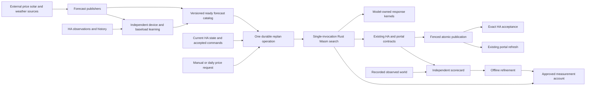

# Planner redesign for evolving scorecards and faster replanning

Proposed design, 6 October; revised 7 October 2026 after independent GPT-6 Astra (high effort) and Claude Opus (high effort) reviews of the hosted Edge execution, forecast, model and command-lock requirements. Compatibility decisions clarified by the user on 7 October: remove cost-value curves, their related UI and the entire “Build a plan” schedule editor; source pool heater settings independently of comfort preferences. Design review only; product code, deployed planning and HA behaviour are unchanged.

Build a **measurement-driven household planner**: one model-owned physical evaluator, one explicit preference account, and a bounded search over complete coordinated schedules. Compile the solver and authoritative device-response kernels from Rust to WebAssembly and run one complete solve inside a hosted Supabase Edge Function. No external native worker or resident daemon is part of the deployment. Read a ready, immutable forecast bundle and fresh current device state once per job. Keep planner-bench as the independent test of what the selected schedule achieves.

The purpose is to make adding a measurement and improving a planner two small, visible changes, rather than spreading new preferences through valuation curves, bidding, settlement and response ranking. The execution redesign addresses a separate problem: repeated transport and reconstruction of the growing solve state.

## Requirements incorporated on 7 October

| Requirement | Design decision | Acceptance evidence |
| --- | --- | --- |
| Fast execution | Rust-to-Wasm inside hosted Supabase Edge Functions; TypeScript handler and Python HA integration remain | Complete handler below the hosted CPU/memory limits, with score quality and cold/warm delivery measured |
| Equal manual/automatic replanning | One admission, capture, queue, solve, publication and acceptance operation; origin is audit information | Same snapshot and resource grant produce the same result and latency under price bursts, including event-driven discovery on an open page |
| No history in planning | Independent learning and forecast publishers; planning reads ready artifacts and current state only | Fail the planning-path test on any Recorder/history/training/external forecast call |
| Less than 10 seconds | Click through updated plan and completion toast, including exact HA acceptance | Browser-to-HA end-to-end timing, including queue, notification delivery and rendering |
| UI scope | Remove cost-value curves, related UI and the “Build a plan” tab as explicitly requested; preserve remaining screens/interactions and approved invisible refresh; publish pool preference independently of heater settings | Remaining screens/interactions and planner-bench pass E2E checks; retired editor navigation is absent; versioned portal/HA contracts preserve exact command semantics |
| Independent device models | Model-owned learning, autonomous forecasts and controlled-response kernels, separately versioned from search | Add/tune a model without editing preference/search logic; support 20–30 model types |
| First-hour consistency | Hard command lock for the next hour from the HA-accepted plan; softer decreasing continuity beyond it | Byte/semantic command comparison across initial-state and forecast changes, for both triggers |
| Pool preference and equipment settings | Read the heater’s start/stop settings as device-model inputs; retain independent comfort targets; remove the invented target-plus-two cutoff | Device/HA/chart parity at 28°C start, 34°C stop and 30/30.5°C preference, including native restart behavior and changed settings |

The user explicitly clarified that the hour is a **command lock during every replan**, not a cooldown between replans. A further manual request can run immediately. Ordinary state deviations change predicted outcomes, not those locked commands. The 10-second requirement supersedes the earlier handoff's withdrawn timing target; neither the speed target nor the original 200-point gain has been demonstrated.

## Usage from the caller

The public interfaces hide solver phases, physical indexes and storage representation. These are proposed APIs, not existing functions.

```ts
// Public caller: both triggers enter the same operation.
await jobs.request({ home, trigger: { kind: "manual", requestId } });
await jobs.request({ home, trigger: { kind: "dailyPrices", releaseId } });
// Same current-state capture, ready forecast read, first-hour lock, queue policy,
// compute recipe, exact acknowledgement and published contract. The manual
// endpoint still returns its existing request receipt promptly.

// Background owners: neither operation is called by jobs.request.
await forecasts.refresh(changedSourceRevision);
await deviceModels.observe(recentCompletedObservations);
// They publish model/forecast artifacts and a coherent ready bundle atomically.

// One-shot Edge handler owns claim, complete compute and publication.
await jobs.executeAttempt({ jobId });
// Read the pinned bundle and captured state once; one Rust-to-Wasm solve;
// certify, materialize existing contracts, publish with the current fence.
// Durable admission dispatches immediately; neither HA nor browser polling
// advances solver steps. Duplicate invocations recover the same receipt.

// Offline: all contenders see the same causal inputs and independent card.
const report = await experiments.compare({
  study: frozenStudy,
  contenders: [currentPlanner, candidatePlanner],
  resources: identicalMeasuredBudget,
});
// Full per-case/per-rule/per-quarter contributions, including opposing triggers,
// observed service/cash/inventory, feasibility, CPU/RSS and termination.
```

## Why the current shape makes tuning difficult

The current planner represents preferences through static marginal-value curves and spreads their effects across bids, adjoints, settlement, transfer search and whole-profile comparisons. Changing one account requires several paths to remain equivalent. New scorecard preferences may be non-smooth or depend on an entire sequence; they do not naturally fit that representation.

The experiment evidence distinguishes objective mismatch from search coverage. Across the 85 recorded overlap witnesses, legal rescheduling saves approximately 13.13 SEK billed energy but loses 185.91 SEK of the current EV held-service utility and adds 19.40 SEK of shaping/ramp preference. Finding that alternative more efficiently would still not make the current objective select it.

On the frozen 11 cases, the baseline is **569 points and 110.918 seconds of total local solver time across all 11 cases**. The corrected whole-profile thermal DP experiment reached **594 points and 115.221 seconds total across those cases**, with zero physical violations. Its earlier 598 result had a quadratic-cost error. These measurements establish neither the requested 200-point gain nor an acceptable replacement.

Replanning also has an execution problem independent of policy. The measured successful live run took about 6 minutes 58 seconds to HA acceptance: 282 worker calls, about 997 MB of worker request bodies, 133 MB across batch loads and a 5.87 MB completed-result ledger. The 317.2 seconds attributed to worker calls includes network and parsing; it is not measured CPU demand. See the [replanning handoff](/Users/phil/Code/shs/smart-home-solutions-t-by/docs/energy-optimisation/replanning-handoff-2026-10.md).

## Have all existing problems been addressed?

The design covers the known causes, but **it does not yet prove their remediation**. It removes the continuation ledger by construction; its policy/search, background publishers and complete delivery path still require implementation and measurement. The original gain of at least 200 points and the new less-than-ten-second requirement both remain unmet.

| Existing problem | Design response | Remaining evidence or limitation |
| --- | --- | --- |
| Hundreds of HTTP calls and growing solve-state transport | One admitted problem, one complete Wasm invocation, one selected result | Measure real input/output bytes and whole-handler cost |
| Historical analysis and fitting in HA capture | Background publishers; event-maintained native state; current-only capture | Prove all capture/admission/solve paths make zero historical or forecast-regeneration calls, including startup |
| Preferences scattered across curves and search phases | One versioned complete-plan measurement account | Finish the rule-by-rule causal mapping and independently check account parity |
| Individually losing changes conceal jointly better schedules | Coordinated profile/window search over coupled owners | Prove search quality at the deployed work grant, rather than a longer offline budget |
| Polls advance solve work; lost replies create uncertainty | Immediate durable dispatch; immutable jobs, claims, fences and exact receipts | New dispatcher and recovery tests; recovery beyond ten seconds is a recorded miss |
| Slow plan publication and historical portal reads | Compact selected artifacts and precomputed display deltas | Size the actual consumed payload; measure publication, delta-read and rendering latency |
| Automatic results discovered by idle polling | Approved invisible event-driven refresh for HA and browser | Measure delivery under cold starts, in-flight reads, reconnects and daily-price bursts |
| Model duplication and baseload double counting | Model-owned kernels/forecasts; one physical-owner and electrical basis | Port every supported device/authority path and qualify 20–30 model types |
| Near-term command churn and renewed service grace | Hard accepted-command hour; anchored service episodes; softer later continuity | Test changed states and retries; partial/missing prior coverage remains an explicit availability limitation |
| Old workbench objective and pool target/stop coupling | Remove the entire schedule editor and curves; explicit comfort target and separately sourced hardware settings | Design decisions resolved; qualify remaining plan/bill views, planner-bench and hardware/model/HA parity |
| Supabase CPU ceiling and correlated cold-start/fleet contention | Qualified one-shot work grant and equal dispatch/resources for both triggers | Complete handler CPU/memory/bundle and full-path burst qualification are unproved |
| Claimed improvement hides opposing triggers or wasted energy | Independent frozen card, all per-rule/per-quarter contributions and service/bill/inventory checks | 769 points is unachieved; holdout and anti-waste qualification are required |

The recorded study has 3,168 case-quarters, including 50 quarters with opposing contributions and a net zero score. Diagnose the individual contributions throughout the whole horizon; selecting only negative or nonzero quarters would miss evidence. Neither changing language nor removing network overhead fixes objective mismatch on its own.

## Shape and ownership



There are six substantial owners, plus the benchmark. The two forecast/model owners operate independently of individual planning requests:

| Owner | Knowledge and invariants it owns |
| --- | --- |
| Forecast catalog and baseload publisher | External forecast retrieval, baseload learning/calibration, versioned ready coverage, dependency provenance and meter-basis/exclusion manifests |
| Device models | Learning from HA, autonomous behavior forecasts, controlled-response physics, native memory, command vocabulary and model versioning |
| Household model | Ready-input conversion, physical-owner groups, shared reservoirs/resources, electrical balance, configured permissions/limits, fixed commands/bookings and trajectory composition through model-owned kernels |
| Preference account | Approved service and timing preferences, units, aggregation/order, episode anchors, useful inventory and complete-plan explanations |
| Household search | Complete working schedules, coordinated neighborhoods, proposal/repair, incremental evaluation, selected incumbent, deterministic work budget and per-attempt state |
| Planning jobs | Admission, receipt order, claims/fences, queue fairness, one-shot Edge execution, retry identity, artifacts, publication and exact HA acknowledgement |
| Planner-bench | Frozen studies, independent measured-world replay, scoring cards, alternative witnesses, comparison and offline tuning |

Each device model exposes one owned step transition including native response memory; whole-profile projection folds that same transition. The household model composes those transitions and owns their shared physical resources. Heat-pump startup, auxiliary draw and shared reservoirs must not acquire a second simulator inside search. A physical plant can have several entities and services but has one native state and one electrical draw. Resource incidence is keyed by physical owner, not entity ID. Duty-cycle boiler, room-heating and other currently supported services retain their existing permission, forecast and booking semantics. Coverage of those paths is a migration gate; converting a supported controllable service into a fixed load to improve timing is not permitted.

## Language and execution target: hosted Supabase Edge Functions

The user selected **hosted Supabase Edge Functions** on 7 October. This supersedes the separate native-server/resident-worker proposal. Rust remains the source language for the solver and model kernels, compiled to WebAssembly and invoked by a small TypeScript handler. HA remains Python. There is no external compute provider or native production executable.

Supabase supports Rust-to-Wasm modules. Its current hosted limits include **2 seconds CPU per request**, **256 MB memory**, worker wall-clock lifetime of 150 seconds on Free or 400 seconds on paid plans, and deployment bundles of 20 MB through the CLI or 5 MB through the API. Web Workers and multithreaded native libraries are unavailable. The long wall-clock limit permits I/O; it is not permission for a long CPU solve. [Wasm support](https://supabase.com/docs/guides/functions/wasm), [runtime limits](https://supabase.com/docs/guides/functions/limits).

Run the complete solver as a single-threaded, portable Wasm core. Bind once per whole problem/result; there are no JavaScript calls or RPCs per device, quarter, model transition or candidate. Device models remain independently owned Rust crates/parameter packages linked into that core. The registry is not a list of services the solver must contact.

Bundle the module with the function and measure cold compilation/instantiation, decoding, model preparation, search, certification and result encoding together. A warm isolate may retain an immutable compiled module or version-keyed immutable forecast data as an optimization. Correctness, recovery and timing qualification cannot assume isolate reuse, local resident state, sticky routing or a warmed device/model cache. Mutable Wasm instances and buffers are attempt-local and must not leak between homes or concurrently handled requests. Include V8, JS inputs/outputs and duplicate ABI buffers in total memory; the Wasm heap alone is not the 256 MB footprint.

Choose release optimizations through paired measurements. Native local Rust builds may serve as offline reference/profiling tools, not another live engine. Compare the deployable Wasm implementation with the equivalent uninterrupted TypeScript workload under the same information, policy, work grant and hardware where possible. Language names and transition microbenchmarks cannot establish full-handler performance. Preserve declared precision and strict thresholds; faster arithmetic cannot silently change score semantics. [Cargo profiles](https://doc.rust-lang.org/cargo/reference/profiles.html).

### Whole-handler CPU allocation

The following **1.8-second engineering allocation is unmeasured**, leaving 0.2 seconds against the documented two-second ceiling. It is a target to test, not an asserted safe platform stopwatch:

| CPU work in the invocation | Seconds |
| --- | ---: |
| Authentication/wrapper work, module initialization and input decoding | 0.25 |
| Checked model preparation, price/rule features and seed projection | 0.15 |
| Complete candidate construction and coordinated improvement | 1.10 |
| Full selected-plan certification | 0.15 |
| Existing-contract materialization, result encoding and persistence preparation | 0.15 |
| Allocated handler CPU | 1.80 |

The TypeScript handler does not have an assumed accurate CPU-time API. A wall clock is an operational deadline guard, not a measurement of CPU consumption. Qualify deterministic work grants on the deployed runtime and reserve CPU for cold initialization and post-search work. A synchronous Wasm call blocks the isolate's JS event loop: timer-based lease heartbeats, cancellation and shutdown checkpoints cannot be relied on during it. The grant counts model transitions, DP cells, beam/repair expansions and account work with calibrated costs. Each nested loop checks its remaining allocation; an incomplete proposal is discarded while the complete incumbent remains intact. Reserve final projection/certification and encoding work before granting search work. Bounding only the number of neighborhoods is insufficient if one DP/beam repair has unbounded cost. Complex new models or terms must be requalified against these costs, not inherit the old grant unchecked.

If a complete certified plan with acceptable score cannot fit this allocation, the design is not qualified. Do not transparently spill into repeated function calls, revive an auction ledger, reduce supported devices, substitute the old plan as a completed new solve or invoke an external native worker. Reconsider the search/data shape within the chosen Edge deployment and state any remaining requirements conflict.

## Forecasts and independently owned device models

### Nothing historical on the request path

Baseload estimation, forecast-versus-actual calibration, equipment fitting, empirical load profiles, room/thermal learning and acquisition of recent history belong to background processes. Move the current HA `_planning_actual_quarters`, `build_device_models`, `build_base_load_model`, service sizing and pool run-history reconstruction out of snapshot capture. Maintain current native state, including compressor run age, through the HA runtime's received observations and timers. On restart, any needed history reconstruction is initialization work, not work triggered by clicking Replan.

A planning request reads current SOC, temperatures, native operating state, permissions and active bookings from the existing runtime; those are current measurements, not a Recorder query. It joins them to precomputed forecasts and fitted parameters. The solving Edge handler has no history, training or external-forecast client. The HA capture route also has no such dependency. Test this boundary by making those calls fail if invoked during either replan path. A required absent input produces an explicit failure through the existing status flow; the planner does not wait for learning or invent a substitute model. A newly installed home is a qualification case: its background publishers must support a documented normal zero-evidence initialization where such a forecast/model exists, with evidence count zero recorded. Where a model requires configured parameters or observations that do not yet exist, expose that specific prerequisite before admitting a solve. There is no request-time guess or backup forecast. Readiness must not conceal an untested cold-start population.

The existing `planForDemand` calibration against recent days moves into the baseload publisher. A deliberately adopted economic risk term remains a visible preference over ready forecasts; it does not authorize historical analysis during planning. Historical display/backfill and benchmark replay remain separate consumers and cannot hold up publication or the completion read.

### Publish ready bundles, then pin them

Forecast publishers ingest prices, solar irradiance/PV, outdoor temperature and solar thermal forcing when their source revisions change. Poll only sources without notifications, according to their documented refresh behavior; unchanged responses do not rebuild downstream artifacts. Device models refresh their forecasts on relevant input revisions and new observations. Heavy parameter training has its own resource/cadence policy. Neither operation admits a solve merely because a forecast changed: daily prices and manual requests remain the solve triggers.

The catalog owns immutable artifacts plus an atomic per-home `ready` pointer. An artifact records home/location/tariff scope, absolute slot coverage, units, model/parameter version, dependency revision IDs and receipt revision. The catalog builder is the sole writer of that pointer; guarded locally generated received revisions prevent an obsolete builder from installing a superseded manifest. Validate the full dependency vector: model kernel and fitted-parameter revisions, tariff, published-price release, physical-owner graph, meter basis and forecast schemas/coverage. Publish a complete model package and its compatible forecasts before replacing the pointer. New source versions may coexist with a model forecast produced from an earlier version; record that lineage explicitly, rather than asserting they were all issued together. Never combine a new model's parameters with a forecast that requires an incompatible model schema. Dates identify coverage, not an invented source-timestamp event order or issuance-age gate.

Admission pins the ready bundle and current-state revision once. Concurrent forecast refreshes prepare the next bundle; they never mutate an active solve. Published price quarters remain exact fixed inputs. Unpublished tail prices retain their explicit forecast status. Automatic admission is keyed to the daily published-price release for each home, with one normal automatic request per release day; identical refreshes deduplicate and metadata refreshes do not become daily solves. Its pinned bundle must contain that triggering release, not yesterday's ready prices. If it is not ready, record the delay or explicit missing-input failure; that delay counts from receipt of the release toward automatic completion. Published prices are treated as fixed. If a supplier explicitly corrects a release, ingest the received correction as a distinct data revision and retain a manual-replan recommendation; do not infer another automatic trigger from a routine refresh. This makes the daily trigger explicit instead of inheriting the current `hasNewPublishedPrices` correction-trigger behavior by accident.

Keep the whole 72-hour moving forecast coverage ready before request time. Rolling that forecast coverage is a background job and does not extend an already accepted plan's endpoint. A new authorized solve gets its own 72-hour horizon. Price-release bursts require forecast and compute capacity together; calling preparation outside the solver does not make its delay disappear from automatic-event timing.

### Autonomous forecasts and controlled response are different model outputs

A versioned device package contains fitted electrical/thermal parameters, command/state schema, a **ready autonomous forecast** and an executable **pure response kernel**. The autonomous forecast predicts historical-pattern operation without planner control, including the applicable exogenous influences. Its publisher owns its regeneration.

For a scheduled device, the solver calls its already loaded response kernel to evaluate a proposed command trajectory from freshly captured state and pinned exogenous forcing. That computation is essential counterfactual simulation; it does not refit the device, call the forecast service or regenerate its autonomous forecast. For an uncontrolled device, the solver consumes the ready autonomous forecast. Verification continues to distinguish hypothetical scheduling from the executable uncontrolled household, preserving existing authority semantics.

Support 20–30 model **types** through a compiled, versioned registry of independently owned Rust model crates bundled into Wasm. Fitted parameters usually change without a kernel/search change. Adding new physics adds a kernel implementation and its contract/projection tests; it must not require new bidder/settler logic. Each package owns allowed native commands, private state, electrical/thermal outputs, necessary exogenous columns, resource incidence and optional proposal capabilities. A typed package decoder resolves it once; search sees checked model handles and standard measured facts. No arbitrary uploaded scripts, per-quarter RPCs or per-candidate process launches. Native generic/batched implementations may avoid dispatch overhead where measurements justify it.

Twenty model types in the registry and twenty active coupled physical owners in a home have different compute costs. Qualification covers both the planned registry size and representative active-owner counts, including shared equipment. A model's required memory, projection and repair costs are measured when it joins the supported deployment envelope; there is no assumed free scalability to arbitrarily complex models.

### Baseload composition without double counting

The baseload publisher owns a meter-basis manifest identifying every separately modeled physical owner's contribution excluded from learned household demand. A bundle also contains ready contribution series so role changes can be resolved by arithmetic without a history query. For a given bundle:

`nonstorage demand = residual baseload + autonomous excluded-owner loads + controlled excluded-owner response loads`.

Every physical owner's electrical draw appears exactly once. Reclassifying an owner from uncontrolled to controlled replaces its ready autonomous contribution with its candidate response; it does not add both. Removing a model adds its prepared contribution back to the residual basis where necessary. Adding a newly discovered model requires the background publisher to prepare its exclusion/basis before that model becomes planning-ready; a click cannot perform the subtraction by analyzing history. Category/device overlapping meters need an explicit measured basis, not repeated subtraction. Storage charge/discharge and PV generation are signed flow accounts, not appliance loads to subtract again. A shared heater, auxiliary pump and served reservoirs follow the physical-owner graph so two services cannot buy the same electricity twice.

## Measurements, live preferences and scorecards

Keep three concepts explicit:

1. **A measurement** describes what happened: imported energy, time below a target band, interruption length, thermal reserve, or a demonstrated cheaper alternative.
2. **A preference policy** states how the household wants the planner to choose between projected outcomes. It uses only information available at planning start.
3. **A scorecard** judges planners against a frozen observed world. It may use later actual prices and expensive counterfactual witnesses that cannot be live inputs.

A scorecard edit never silently changes customer planning. A measurement becomes a live preference through a versioned mapping recording its meaning, aggregation, relative priority, forecast interpretation and useful-inventory treatment. The user has identified planner-bench rules as the preference authority for this work; those mappings should be derived from the rule definitions, with differences from hindsight-only measurements stated explicitly.

Use a small typed measurement vocabulary: quarter fields and predicates, duration-weighted exposures, run boundaries, window aggregates, first-event state and terminal quantities. Each definition declares units, measurement precision and inclusive/strict threshold semantics. Native floating-point or solver tolerances must not silently redefine those preferences. New rules that use existing facts need one measurement definition and examples. Their display and accounting do not require bidder/settler changes. A new physical quantity requires its owning model to supply it. A new preference may also require a proposal family that can actually improve it; adding a score term alone cannot guarantee better search.

Production and benchmark share definitions, units and golden examples where useful. Their trajectories and information sources remain separate. The benchmark retains its independent referee, and a simple batch evaluator cross-checks the optimized incremental account. Avoid an unrestricted rule/plugin language in the initial implementation.

### One complete preference account

The search compares complete native trajectories through one account. Search estimates never redefine that account.

Cash remains SEK, wear retains its explicit throughput basis, service exposure remains degrees-hours or kilometres-hours, and rule preferences retain their declared points or units. Use explicit additive groups and priority ordering when adopted; do not invent a conversion from one point to one SEK. To reproduce the current scorecard's ordinary preferences, their contributions belong in one additive group: mild service does not automatically outrank every timing rule. Physical admissibility, required-rule benchmark verdict and production preference ordering remain distinct.

The first policy manifest must cover every existing rule and classify it as a forecast-based preference, external measurement, or witness with a separately defined planning interpretation. It must also locate the existing configured shaping, continuity, start and terminal-value accounts and state which semantics are retained or intentionally changed. Preserve quoted-price, export and authority permissions unless an explicitly reviewed policy change modifies them. This prevents inconvenient penalties or existing requirements from being silently omitted.

| Measurement class | Live treatment | Benchmark treatment |
| --- | --- | --- |
| Service bands and recovery | Approved soft exposure, with stable eligibility anchors; unreachable target is not invalid input | Current reachability/grace and required-rule verdict |
| Cheap/dear flexible load, missed cheap charging, base-load coverage, battery-to-EV supply | Projected source attribution and price classes, using frozen known/forecast prices | Actual-price attribution and all stacked contributions |
| Thermal buffer and overheating | Approved useful reserve with forecast next-day conditions; desired temperature separate from equipment cutoff | Actual next-day conditions and current strict thresholds |
| High-sale participation and preparation | Forecast/published opportunity and first-event stock account under existing permissions | Actual sale opportunities and preparation evidence |
| Short gaps | Native run/continuity preference; witness-based distinction stated | Current bounded feasible continuity witness |
| Workload overlap and economic opportunities | Coordinated timing/capacity search and explicitly adopted projected preferences | Independent jointly feasible cheaper moves and bounded economic audit |

A cash-optimal plan can still trigger an overlap or interruption rule: those are preferences with their own evidence, and actual future prices may be unknowable. Never claim that minimizing the bill necessarily satisfies all scorecard rules.

Keep useful service and inventory visible. Rewards for active load can otherwise encourage unnecessary heating, cycling or extra terminal stock. A live charging benefit must describe what useful stock or future service it buys. Test useless-cycle removal and excessive heat explicitly. If a scorecard rewards waste, refine the measurement and rescore every contender; do not conceal the defect through invented physical limits. Approved customer/equipment cutoffs remain authoritative.

### How improvement works over time

A refinement follows one reproducible path:

- Add a measurement with examples, eligibility, exclusivity, units and evidence requirements.
- Rescore stored decisions for every planner using the same card; rebuild witnesses when their thresholds change. Keep positive and negative contributions separately even when their quarter total is zero.
- Diagnose information error, preference mismatch, missing search coverage or model disagreement from the result and the planner's own account.
- Change the appropriate versioned policy, proposal/search recipe, forecast model or physical model, then rerun only what that change requires.
- Compare on tuning and validation data, then untouched holdout data and new cases recorded after policy freeze.
- Promote a measured release rather than hot-loading card changes into live jobs.

Split data by home and overlapping time periods/seasons. The two overlapping September 28 cases must not be treated as independent random holdout quarters. Eleven cases from one household cannot establish fleet generalization.

## Search algorithm

Use **large-neighborhood search with coordinated destroy and repair inside Wasm**. It searches complete schedules, so non-smooth preference terms do not need marginal utility curves or derivative implementations.

### Working state and selected state

Keep a physically certified selected incumbent and a separate working schedule. The incumbent owns commands, projected trajectory, account and evidence together. A losing proposal never replaces its explanation. Exploration can temporarily worsen soft preferences in working or partial repair states; only a complete physically admissible candidate can become an incumbent.

A deterministic construction phase searches for a complete candidate consistent with locked commands and actual native protections. Reproject an aligned previous accepted plan as another seed. Idle/coast is a possible seed, **not a universal proof of feasibility**: fixed loads, native protections or fixed bookings can conflict with the connection. If the search finds no complete candidate within its work grant, report search failure without claiming a proof of infeasibility.

### Neighborhoods and repair

Choose neighborhoods from measured projected deficits, price valleys/peaks, run boundaries, service exposure and future reserve opportunities. The fixed search recipe also includes coverage neighborhoods independently of current deficits, so the current schedule cannot hide alternatives.

Neighborhoods include:

- Complete physical-owner profiles over the full 72 hours.
- Battery plus EV or thermal load across cheap-to-dear intervals.
- All coupled owners in multi-quarter windows spanning several runs or days.
- Run joining/splitting, legal amp modulation, balanced battery transfers and heat prepositioning.

Unfix the chosen commands **together** before repairing them. Generate profile proposals through owned native transitions, conditional device DP and executable run/amp/flow alternatives. Try deterministic repair orders, including battery before and after flexible loads, and retain a bounded beam of partial coordinated repairs. Shared heat-pump equipment is one repair owner. Intermediate replacements need not individually improve the account; otherwise the design would repeat coordinate-descent stalls.

Sub-horizon repairs carry exit native state into the unchanged suffix, which is reprojected and scored. Endpoint preservation can define a particular move family; a universal arbitrary one-lattice-step endpoint restriction would discard valid changes and is rejected.

Per-device DP is **proposal machinery**. State sampling, native-memory compression and stage rewards are approximations unless separately proved exact. Nonlocal ratios and horizon preferences can guide search imperfectly; their exact full account decides acceptance. Discretization never becomes a new physical temperature/forecast bound. Native memory equivalence requires a model-owned proof, not a fixed guess of three compressor states.

After repair, apply exact affected-suffix projection, update resource balances and evaluate the complete account. Retain the best complete candidate. Budgeted exploratory/tabu moves and joint partial repair can escape local plateaus; the publication incumbent remains the best certified result. The recipe records deterministic tie-breaking, seed, beam/proposal choices and work counters for reproducibility.

Stop on the declared work grant or exhaustion of the declared neighborhood pass, with a complete incumbent and an explicit termination reason. Neighborhood stability is not global optimality. Measure wider beams, repair orders, coverage and larger grants; the prior eight/ten-round Bellman budget was already disproved by a changed-PV case.

### Data layout and incremental work

Resolve the frozen problem once per attempt into dense owner/quarter columns, native model descriptors, resource incidence and immutable price/forecast features. Commands and states use model-appropriate representations: integer EV amps, binary/setting thermal commands, and Float64 continuous flows/states. Do not store every actuator request as a Float32 watt value.

The attempt-local search is the sole writer of its working arrays and caches. Use reusable candidate buffers/undo ranges rather than retaining every evaluated plan. Cache price ranks, episode indexes and next-day aggregates by immutable problem identity. Track run intervals and per-term contributions with declared dependencies.

A command edit reprojects the affected physical owner's suffix, including startup memory and every shared reservoir, and updates coupled grid/source attribution. Thermal changes may affect the entire remaining horizon: worst-case evaluation is O(T×D plus resource incidence). Replay can stop only when complete native state and memory genuinely reconverge. Quarter and window terms update affected ranges; run terms update affected runs; horizon terms may require full recalculation. Global counterfactual witnesses remain outside the inner loop.

Verify incremental accounts against batch replay during development and perform a full native certification before publication. An arbitrary rule is not promised constant-time evaluation.

## Proposed module map

These are proposed locations, not claims that the modules already exist. Keep internal phase order inside the owner instead of exporting preparation, bidding, settling or per-quarter advancement to callers.

| Boundary | Module/package | Private knowledge |
| --- | --- | --- |
| Ready forecast/catalog publication | Cloud catalog publisher plus existing HA background learning owners | Dependency vector, immutable manifests, meter-basis/exclusion revisions and source/model publication |
| Pure device physics | `planner-core/models/*` independently versioned Rust crates | Per-type commands, native state/memory, fitted parameter schemas and transitions; no planner preference or I/O |
| Household composition | `planner-core/household` | Physical-owner graph, shared reservoirs/resources, input checking and complete trajectory projection |
| Preference account and search | `planner-core/policy` and `planner-core/search` | Typed measurements, complete account, working/incumbent ownership, repair/proposal and bounded incremental evaluation |
| Batch Wasm boundary | `planner-core/wasm` | Checked whole-input/output ABI and buffer ownership; no database or per-step JS callbacks |
| Replan operation | Refactored `_shared/energy-planning-jobs.ts` and one solving Edge endpoint | Capture/admission, outbox/claims/fences, retry identity, exact receipts and publication; replaces remote batch/step continuation |
| Existing contract materialization | `_shared/planning/materialize.ts` | Certified result to consumed portal and HA shapes; no second simulator or alternative objective |
| Independent comparison | Existing planner-bench owners | Observed-world replay, frozen rules/witnesses, full contribution reports and qualification |

The current `energy-planning-client.ts` sends accumulated results/rankings through repeated calls to `energy-optimisation-plan-step`; `advanceForHome` in `energy-planning-jobs.ts` claims, loads, computes and appends each exchange. Retire that state-transfer protocol rather than wrapping it in a Rust kernel. The new job boundary exposes a complete replan operation; physics/account/search remain private within the loaded Wasm problem.

## Proposed type sketch

These interfaces describe ownership; bodies are intentionally unimplemented. Concrete wire parsing and existing physical types remain behind the domain boundary.

```ts
type ProblemId = string & { readonly problemId: unique symbol };
type PolicyId = string & { readonly policyId: unique symbol };
type OwnerId = string & { readonly ownerId: unique symbol };

interface FrozenPlanningInput {
  readonly identity: CapturedInputIdentity;
  readonly captured: CapturedCurrentState;
  readonly forecasts: ReadyForecastBundle;
  readonly commitment: AcceptedCommandCommitment;
  readonly fixed: FixedBookings;
  readonly policy: ApprovedPolicyManifest;
  readonly episodes: readonly ServiceEpisode[];
}
interface HouseholdProblem {
  readonly id: ProblemId;
  readonly versions: ModelAndPolicyVersions;
  readonly slots: CausalSlotColumns;
  readonly owners: readonly PhysicalOwner[];
  readonly resources: ResourceIncidence;
  readonly initial: NativeHouseholdState;
  readonly fixed: FixedBookings;
  readonly commitment: AcceptedCommandCommitment;
  readonly policy: CompiledPreferenceAccount;
}
interface ReadyForecastBundle {
  readonly id: ForecastBundleId;
  readonly slots: ReadyExogenousColumns;
  readonly baseload: ReadyBaseloadWithBasis;
  readonly devices: readonly ReadyDevicePackage[];
  readonly lineage: readonly ForecastDependencyRevision[];
}
interface ReadyDevicePackage {
  readonly owner: OwnerId;
  readonly model: ModelRevision;
  readonly parameters: CheckedModelParameters;
  readonly autonomous: ReadyDeviceForecast;
  readonly kernel: KernelRevision;
}
// Required model parameters for the pool package, distinct from preferences.
// These are observed read-only heater settings, not planner setpoint commands.
interface PoolHeaterSettings {
  readonly revision: ReceivedEquipmentRevision;
  readonly startTemperatureC: number;
  readonly stopTemperatureC: number;
  readonly sources: PoolHeaterSettingBindings;
}
interface PoolComfortPreference {
  readonly revision: ReceivedIntentRevision;
  readonly targetC: number;
}
interface PhysicalOwner {
  readonly id: OwnerId;
  readonly device: ReadyDevicePackage;
  readonly kernel: CheckedModelKernelHandle;
  readonly initial: CheckedNativeState;
}
interface CommandSeries {
  readonly owner: OwnerId;
  readonly schema: ModelCommandSchemaId;
  readonly native: CheckedNativeCommandColumns;
}
// Concrete model crates use their own typed state/commands: integer charger
// amps, battery strategy/operations, thermal routing/modes/settings. A checked
// handle is resolved once by the registry; it is not an unchecked JSON payload.
type AcceptedCommandCommitment =
  | { readonly kind: "first-plan"; readonly acceptedPlan: null;
      readonly anchoredAt: Instant }
  | { readonly kind: "complete"; readonly acceptedPlan: AcceptedPlanIdentity;
      readonly acceptedRevision: number; readonly anchoredAt: Instant;
      readonly requiredThrough: Instant; readonly effectiveThrough: Instant;
      readonly covered: readonly LockedNativeCommandInterval[] }
  | { readonly kind: "unavailable"; readonly reason: CommitmentUnavailableIssue };
// Only the first two variants can admit a solve. A complete
// commitment covers all previously scheduled owners throughout the required
// hour. An accepted absence of control is explicit, not invented idle commands.
// The job owner derives it from the matching HA-accepted executable artifact;
// newly published but unaccepted plans cannot supply it.

interface MeasurementDefinition {
  readonly id: string;
  readonly version: string;
  readonly unit: MeasurementUnit;
  readonly dependencies: MeasurementDependencies;
  readonly expression: SupportedMeasurementExpression;
}
interface ApprovedPolicyManifest {
  readonly id: PolicyId;
  readonly terms: readonly ApprovedPreferenceTerm[];
  readonly ordering: readonly AdditivePreferenceGroup[];
  readonly ruleMappings: readonly RulePromotionRecord[];
}
interface PreferenceAccount {
  readonly groups: readonly PreferenceGroupValue[];
  readonly cashSek: number;
  readonly wearSek: number;
  readonly exposure: readonly ServiceExposure[];
  readonly closingInventory: readonly StoreInventory[];
  readonly contributions: readonly TermContribution[];
}
interface ServiceEpisode {
  readonly id: string;
  readonly intentRevision: number;
  readonly origin: CapturedServiceIntent;
  readonly eligibility: readonly AnchoredEligibility[];
}
interface CertifiedSelection {
  readonly problem: ProblemId;
  readonly commands: readonly CommandSeries[];
  readonly trajectory: NativeTrajectory;
  readonly account: PreferenceAccount;
  readonly termination: SearchTermination;
  readonly work: WorkCounters;
}
type SearchStart =
  | { kind: "fresh" }
  | { kind: "seeded"; previous: AcceptedPlanSeed };
type SolveOutcome =
  | { kind: "selected"; selected: CertifiedSelection }
  | { kind: "failed"; failure: ExplicitSearchFailure };

function solveComplete(
  input: FrozenPlanningInput,
  start: SearchStart,
  grant: QualifiedEdgeWorkGrant,
): SolveOutcome {
  throw new Error("not implemented");
}
// One complete Wasm invocation; no durable DP/search-phase continuation protocol.
// Only jobs own storage, claim/fence/receipt handling, retry and publication.
// Only benchmark APIs accept ObservedWorld; solveComplete never receives it.
interface FrozenStudy {
  readonly cases: CaseSetIdentity;
  readonly scorecard: ScorecardIdentity;
  readonly referee: RefereeIdentity;
  readonly split: DatasetSplit;
}
```

The TypeScript sketch describes cloud-facing domain data, not a per-step JavaScript bridge. Inside the Rust-to-Wasm core, a model boundary looks like this; concrete models keep their command and state types private to their crate:

```rust
trait DeviceKernel {
    type State: Clone;
    type Command;
    fn step(
        &self,
        state: &Self::State,
        command: &Self::Command,
        forcing: &QuarterForcing,
        duration: Seconds,
    ) -> Result<ModelStep<Self::State>, ModelCommandConflict>;
    // ModelStep returns owned native state and electrical/thermal/resource flows.
    // No database, clock, history, forecasting service or planner score access.
}

// A compiled registry decodes a versioned package once into checked native
// models. Whole-trajectory projection folds the same step; the production Wasm
// binding crosses the boundary once per solve, not for each quarter.
fn solve_complete(
    problem: FrozenProblem,
    start: SearchStart,
    grant: QualifiedEdgeWorkGrant,
) -> Result<CertifiedSelection, SolveFailure> {
    todo!("not implemented")
}
```

Mutable search/projection buffers have one writer per job. Each native state or shared reservoir has one declared transition owner; attached device kernels contribute flows through that owner's resource graph rather than updating shared temperatures independently. This is required for shared heating plant and auxiliary equipment parity.

The named domain-type references are sketch vocabulary for the owning modules, not existing exports. A complete implementation must bind them to concrete model types, without escape hatches such as `unknown`, casts or optional fields that are required in practice.

## Replanning, the first-hour lock and reuse

### Command commitment

Anchor the lock at the current-state capture used to assemble the immutable problem. Preserve the previously **HA-accepted** plan's native commands on `[capture, capture + 60 minutes)`, with exact physical owner, charger amps, battery operations/strategy, thermal settings/routing and execution semantics. A cloud-published but unaccepted plan cannot be the reference. If HA accepts another plan before publication, the acceptance revision is a publication guard: rebuild against that reference or report supersession; do not publish under the wrong commitment.

At quarter boundaries this covers four quarters. A request partway through a quarter also preserves the running quarter's remainder and the intersecting future quarter commands. With unchanged 15-minute command slots, lock every slot intersecting the hour; the effective commitment may extend to that slot's end by less than 15 minutes. This conservative alignment avoids a new mid-quarter command/UI protocol. Use absolute intervals and slot durations, never array offsets. Take capture promptly; record both request and capture anchors and include the capture delay in the latency budget. Preserve this capture anchor, accepted revision and lock endpoint through attempt retries and lease takeover. A recapture creates a new immutable problem and commitment, never a silently shifted resume.

Reproject from current measured/native state, including the unchanged prefix. Predicted SOC/temperatures and electrical delivery can change while commands stay the same: a battery strategy or thermostat command is not a promise that measured power is constant. Normal saturation and existing controller safety behavior remain modeled. A realistic out-of-target state is not a reason to reject a household or release the lock.

If a locked command actually conflicts with configured capability/permission or a changed physical resource, report the named commitment conflict through existing failure fields. Do not silently unlock, cap/change the command, skip its device, or claim search proved infeasibility. Existing physical safety and revoked authority still govern actuation; this planning lock does not override them. Impossible readings retain the existing device-isolation semantics, with an explicit conflict if isolation prevents fulfilling a retained command. First-ever plans have no prior commands to lock. An expired, missing or partially covered prior reference is a distinct unavailable-commitment result, not a first plan or a successful partial lock. Under the stated hard-hour requirement it fails explicitly rather than inventing missing commands or claiming the hour was preserved. For an owner whose accepted schedule explicitly provides no planner control, preserve that absence; newly added controllable owners cannot acquire first-hour commands that change it. A missing-prefix exception would require a separately approved rule before implementation. If an existing fixed booking conflicts with the accepted prefix, report it explicitly instead of assigning an undeclared precedence.

After the hard prefix, use a model-appropriate change exposure with weight decreasing by distance into the horizon. Changes in initial state, temperature, solar/thermal forcing or device behavior may then move later commands without needing to overcome the first-hour lock. Price forecasts and published prices remain distinct. Select the continuity weight/decay through the policy manifest and scorecard studies, not an invented universal number. Every neighborhood, construction path and final certification enforces the same commitment.

### Reuse

A new problem uses current measured state, native age, authority and fixed bookings. Align seed commands by absolute time **and duration**, then reproject them. Reuse compatible immutable model structure and forecast features; old predicted states, scores and feasibility certificates do not survive a changed problem.

| Change in an authorized job | Required invalidation |
| --- | --- |
| Measured state or native response memory | Reproject affected owner and coupled suffix |
| Solar/base load | Update electrical balance, source attribution and dependent terms |
| One price or tariff | Update cash and every rank/window/continuation feature it affects; may invalidate all quarters |
| Target/policy/episode | Rebuild preference terms and eligibility under explicit intent semantics |
| Physical model, capability or shared owner | Rebuild affected transitions/resources and discard old certificates |
| Horizon shift or partial first quarter | Rebuild boundaries, native memory and terminal account |

Warm starting a new problem and retrying an interrupted identical problem are different operations. Persist the immutable problem, captured/accepted revisions, forecast/model/policy/engine identities, deterministic seed and work grant before execution. A new measurement capture makes a new problem. An interrupted attempt retries that same frozen problem from the beginning; it does not slide the lock, reset service grace or claim a completed proposal that never committed. Count attempted/recomputed CPU separately from the successful solve's deterministic work.

Do not serialize DP tables, working trajectories, per-candidate histories or mid-solve search checkpoints. The best certified incumbent and construction state live only inside the invocation. Before publication a process death may lose that entire attempt; no incumbent exists durably merely because search evaluated one. After publication, recover the exact durable receipt instead of recomputing or publishing twice. Retry is job recovery, not an alternative engine or a normal chain of solver slices. A recovery taking more than ten seconds is recorded as a missed timing target even if it later succeeds.

If recovery grace becomes an approved live policy, its origin belongs to a persistent service episode tied to a durable received intent revision, independently of whether a solve succeeds. Establish eligibility from that anchored intent/model/input through a guarded idempotent lifecycle update; an unsuccessful solve must not erase the anchor and obtain a fresh allowance on retry. Replanning must not grant another 24 hours. Target changes and model corrections need explicit episode semantics. Record the exact episode revision used in each selected plan; stale or superseded attempts cannot update it or reset eligibility.

Preserve current authorization semantics: new published prices or a manual request start planning. Routine telemetry, weather, settings and mode changes do not acquire automatic solve permission; other changes retain their recommendation behaviour. Plans keep their original 72-hour endpoint. Reuse is a speed technique after authorized admission.

## One-shot Edge execution and durable ownership

### Normal path

Both triggers record the same replan request and wake HA for a small current-state capture. Admission pins the ready bundle, accepted-command commitment and received-order revision, persists one immutable problem and schedules an immediate authenticated invocation of the solving Edge Function. The handler claims the home/job, loads that problem once, runs the complete Wasm solve and certifies/materializes/publishes the selected result. HA receives the matching published executable plan and acknowledges exact acceptance; the browser is notified through the approved refresh wiring. Neither HA nor browser receipt polling advances compute.

The dispatcher belongs to the job owner. Admission and its dispatch intent must commit together; dispatch sends only job identity. Use `pg_net` for the immediate authenticated database-to-Edge wake: its HTTP requests start after transaction commit. Keep an ordinary durable outbox/pending-attempt record as the recovery authority; the HTTP queue/response is not the job. Set the HTTP timeout for the measured full invocation including its I/O, rather than inheriting the extension's two-second default. A timeout or lost response consults the durable claim/publication receipt before any redispatch. [Async networking behavior](https://supabase.com/docs/guides/database/extensions/pg_net).

Do not claim the old dispatcher is still available: the initial October migration introduced `pg_net` wakeups, but the subsequent restore-two-function migration dropped them and the current sweep does not advance pending jobs. This redesign must implement and verify the chosen immediate wake and its durable recovery explicitly. A periodic reconciliation schedule is recovery, not the healthy-path ten-second wake mechanism; measure healthy dispatch delay and recovery misses separately.

No warm container, dedicated worker thread or resident supervisor exists. One invocation owns its input and mutable buffers only for its lifetime. `EdgeRuntime.waitUntil` may retain bounded I/O after a response, but it is not a durable worker, a CPU-limit exemption or the owner of admission/recovery. Supabase explicitly applies CPU, memory and wall-clock limits to background work too. [Background task limits](https://supabase.com/docs/guides/functions/background-tasks).

### Claims, retries and publication

Preserve home isolation, one active home claim, locally generated received-order head revisions, fixed/manual-request guards, expected attempt sequences, fencing and exact receipt recovery. Admission chooses the engine/model/policy/work-grant identities once. The solving invocation verifies its current claim/head before compute and the publication transaction verifies them again afterward. During synchronous Wasm compute an obsolete attempt may waste its bounded CPU, but its old fence cannot publish.

Separate three times: the immutable request's ten-second **timing target**, the current attempt's bounded operational deadline, and the ownership lease. The timing target measures success and survives retries; it is not a plan-age validity gate. A retry may finish after it, but that job is permanently recorded as a missed completion target. The attempt deadline bounds this handler's I/O and leaves room for certification/publication; an unpublished attempt exceeding it fails rather than issuing late writes. A permitted bounded retry gets its own attempt deadline while retaining the original request target, frozen input, capture anchor and commitment. Neither a retry nor a late receipt restarts the timing measurement.

The attempt lease covers the measured bounded compute and remaining I/O with operational margin; it does not depend on a JS heartbeat interrupting the Wasm loop. Lease takeover changes the fence and retries the same frozen problem. Hard CPU/process termination is handled from durable state by the job owner, not by an assumed reliable `beforeunload` save. Classify a confirmed CPU/memory-limit failure as an explicit engine/work-grant qualification failure; do not rerun the same unsafe grant. Bound and record transient delivery/attempt retries. An unknown process death can receive a bounded retry of the identical problem, but repeated failure terminates explicitly; there is no endless over-budget loop.

PostgreSQL holds the small control plane: request, immutable input identity/reference, claim/fence/attempt, terminal failure or publication receipt and current plan identity. Read one preassembled forecast/input package rather than a serial fetch per device. Store one selected executable/presentation record, not every evaluated alternative. Upload artifacts before the short fenced transaction atomically committing current plan, run summary, episode references and exact publication receipt. A lost response recovers that receipt. Stale unreferenced uploads are garbage-collected and cannot publish through an obsolete fence.

An admitted job may finish after HA disconnects, without requiring HA to keep polling. Reconnection delivers the matching result; exact HA acceptance still controls portal completion and late acceptance is reconciled truthfully. A request lacking its required current-state capture does not manufacture a problem from history or silently reuse older measurements. Existing accepted control continues through pending/failed replanning; no fallback controller is introduced.

### Fleet scheduling

Manual and daily-price jobs have the same scheduling class, dispatch path, grants, search recipe and completion contract. There is no manual fast lane or reduced-quality automatic solve. Immediate dispatch invokes independent one-shot functions; Supabase platform concurrency and database/notification pressure determine burst capacity. Do not pretend there is a configurable fleet of resident slots. Preserve per-home serialization and fair received-order dispatch where admission needs concurrency control. Measure actual queue/wake time and platform limits under simultaneous daily releases rather than assuming effortless serverless scaling.

Telemetry, forecast learning, benchmark and historical-display preparation are distinct workloads with their own database/concurrency budgets. Edge Functions sharing a project do not constitute guaranteed dedicated worker pools; test contention with those workloads active. Coalesce only semantically identical authorized input while preserving every request's exact receipt. A superseded manual request stays explicitly superseded unless it truly shares the identical problem; completion cannot silently move to an unrelated newer plan.

### Selected artifacts and truthful status

Separate:

- **Executable artifact:** selected commands, authority, physical-owner identity and required execution semantics.
- **Selected explanation artifact:** forecast trajectory, preference account and diagnostics for the exact same selected plan.
- **Optional search artifacts:** alternatives and profiling evidence, fetched only when needed.
- **Mutable status:** small job/request/plan identities, progress and acknowledgement state.

Verification and Controlling retain one intended schedule; changing operating mode changes write authority rather than bidding. Hypothetical relief from uncontrolled equipment cannot fund real actuation. The planner redesign preserves the current HA execution/reconciliation contract and does not create a new controller.

The backend materializer serves the remaining portal plan/RPC fields and the coordinated, versioned HA executable contract from the same selected record. Remove curve-dependent and editor-only fields after tracing remaining consumers; publish the independent pool target/settings as described below. Internal binary artifacts and rich accounts are private storage choices; clients are not asked to fetch new artifact references or understand new policy groups. Preserve the current Replan button, request receipt, waiting/failure states, charts and matching completion toast. Add the approved invisible event-driven refresh below without changing those screens or interactions. Both charts show the same selected schedule and plan identity. They do not reconstruct it from new forecasts or a losing candidate. HA downloads executable data once per plan; status reads do not repeatedly materialize multi-MB plans. Cloud publication, HA acceptance and observed device effects remain separate states.

### Resolved compatibility: remove the curves and the “Build a plan” editor

The user explicitly confirmed that removing cost-value curves and the UI elements related to them is an objective of the redesign. Remove the curve plots, curve settings/source selectors, marginal-value rows, curve-reachability warnings, curve-derived service values and the old combined cost-minus-service comparison and its search-failure explanations. Do not preserve fake curves, represent rule points as SEK, or retain the old evaluator as an alternate production objective.

The user subsequently authorized removal of the entire **“Build a plan” tab**, choosing planner-bench and its rules as the planner-comparison and tuning workflow. Remove the tab/navigation in `EnergyModeling`, `PlanWorkbenchTab`, its hand-edited schedule grid, manual-versus-planner objective comparison and editor-specific export/import/control interfaces. There is no replacement schedule editor or requirement to port the old editor into Wasm.

Trace consumers before deleting `plan-workbench.ts`, editor-only `DispatchWorkbench` materialization and related payloads/helpers. Retire editor-exclusive code, export formats and tests coherently; retain or relocate shared functionality only where an actual remaining consumer needs it. Removing the editor does not erase existing accepted fixed bookings or change their normal execution/expiry semantics. Fixed-command support remains in planning and HA contracts.

Keep predicted temperatures/range, energy charts, estimated electricity bills, physical execution checks and unrelated settings on the remaining plan/device/benchmark surfaces. Physical certification belongs to the model/planner/referee, not an editor. Planner-bench supplies frozen cases, independent rule scoring, all per-rule/per-quarter contributions and planner-version comparison; diagnose rule/policy, search, forecast and model changes through that evidence. Do not add a new visible rule-score editor panel. Remove curve/editor fields from their consumers/contracts intentionally, without an old-engine or editor compatibility mechanism.

### Resolved compatibility: independent pool preference and heater settings

The user identified this home's physical heater settings:

| Meaning | HA source | Current value reported by the user |
| --- | --- | ---: |
| Heater stopping temperature | `number.pool_1_stop_temperature_40690` | 34°C |
| Heater starting temperature | `number.pool_1_start_temperature_40688` | 28°C |
| User comfort preference | Existing pool comfort preference, independently configured | For example 30°C or 30.5°C |

These are this home's source bindings and current settings, not global hardcoded constants. The device-model owner observes the heater registers as read-only equipment configuration. It publishes their values, received revisions and actual native starting/stopping behavior in the ready model package. Current-state capture supplies the native running/demand state needed to project from now; background observations/history establish behavior outside the replan path. Changing these settings updates the model/forecast package through its normal background revision process. The planner schedules the existing permitted pool actuator; it does not change either temperature register or use a comfort edit to retune the heater.

The comfort target belongs to the preference account. The start/stop settings belong to device physics and execution. Remove the old planner `target + 2` ceiling. With a 30°C comfort target and 34°C physical stopping setting, useful warmth above 32°C can be considered under the buffering rules **where the heater can actually deliver it**. With a 30.5°C preference the existing strict rule threshold is above 32.5°C. Neither example is a command to heat to 34°C on every run. Score wasted overheating, energy cost, forecast demand and useful inventory through the approved complete account; retain every benchmark contribution.

Model the real restart/demand behavior, including hysteresis/native memory if the equipment has it. A switch-on command grants permission; it does not prove heat delivery. Do not infer from the register names alone that toggling the actuator restarts the heater, or assume heating is available at every temperature below 34°C. Verify that behavior from the device's observed operation and declared semantics. The 28°C start setting is not a hard lower bound on valid pool temperature or the user's minimum comfort preference. Likewise, water warmed above 34°C by sunlight is valid measured state; heating stops according to the equipment semantics rather than clamping or rejecting that state.

Publish the plan's actual comfort target explicitly and expose the independently sourced heater settings in its model/execution data. Website and HA charts read that target directly; remove both `stop - 2` reconstruction and the need for a value-curve derivation marker. Materialize the real executable cutoff from the declared heater settings and native commands, not a fabricated preference offset. Preserve existing visible screens/interactions, with the approved curve elements and schedule editor removed; evolve the consumed plan/HA contract and generate its fixtures accordingly. The exact first-hour command lock still includes any execution cutoff present in the accepted commands: a migration cannot silently rewrite that prefix when replacing the old target-plus-two semantics.

The earlier deferred-buffer compromise is withdrawn. Both compatibility decisions are resolved by the user's clarification. Their implementation gates are model/HA/portal agreement, truthful remaining plan/bill views, complete curve/editor removal, planner-bench comparisons and command-lock tests; score/CPU/end-to-end qualification remains outstanding.

Frozen benchmark cases need the corresponding recorded equipment settings/behavior. Do not apply this home's current 28°C/34°C settings as universal or historical facts. If the study/referee gains newly documented equipment semantics, version that input/model change and rerun every contender, including the baseline, under identical conditions; retain the same rule definitions and show the effect separately from search improvement.

## The less-than-10-second completion requirement

For manual replanning, start timing at the button click and stop only when the visible website has rendered the updated selected plan **and** its matching completion toast. Cloud publication or a queued receipt is not completion. The matching HA acceptance still governs the completed-request field. For automatic replanning, measure from receipt of the relevant daily price-release event through the same operation, matching HA acceptance and the updated visible website. Both triggers have the same completion budget and plan quality. Preserve the existing behavior whereby only this browser's manual request raises its completion toast; automatic results update the same existing plan/status views without adding a new interaction.

### Approved invisible event-driven refresh

The user approved invisible event-driven refresh on 7 October, with every screen and interaction preserved. The current manual path enables one-second polling while busy; the idle page polls every 30 seconds. Add a home-scoped authenticated subscription so both origins notify an open page immediately, rather than relying on those intervals for discovery. A notification requests the existing `get_energy_portal_delta` read; it does not refresh forecasts, start another solve or carry the full plan.

Planning jobs own notifications of durable request admission, selected-plan publication, failure and exact HA acceptance. Deliver only committed transitions, with home, locally generated status revision, request identity and selected plan identity where present. The browser treats notifications as change hints: the authorized delta response remains authoritative, and a publication event alone cannot raise the completion toast. No speculative completion or artifact from a losing candidate is displayed.

Subscribe for the currently selected authorized home, then reconcile through the existing delta read on initial connection, reconnection and return to visibility. Scope/dispose the subscription with the home/page lifecycle. Duplicate or reordered hints coalesce into reads of current state; they do not order device/source events by timestamp. If a hint arrives during a delta read, retain a pending refresh and perform another read after it finishes, so an acceptance notification cannot be dropped by the current in-flight-read guard. Responses for a previous home cannot update the new home's view. Existing poll behavior may remain, but it is not the healthy-path timing assumption and no new polling fallback is introduced.

Include notification delivery, an already in-flight read, authorized delta retrieval, decoding and rendering in the browser budget. Test automatic admission/completion while the page is idle, both triggers during price bursts, duplicate hints, hints during reads, disconnect/reconnect and home switching. Never start the automatic latency clock only when the browser discovers the job. Notification performance remains an implementation qualification gate; this approval resolves the UI-scope decision, not the unmeasured ten-second result.

The following is an initial **elapsed-time engineering allocation, not measured performance**, for both triggers using event-driven page refresh. The eight-second sum leaves two seconds of margin against the strict target. The separate 1.8-second total handler CPU allocation above remains binding; CPU and elapsed time are different measurements:

| Serial critical-path allowance | Seconds |
| --- | ---: |
| Request authorization, HA notification, current-state capture and immutable admission | 1.2 |
| Immediate dispatch, claim and one ready input read | 0.8 |
| Cold initialization, wrapper work, complete solve, certification and result encoding | 2.0 |
| Selected artifact writes and fenced durable publication | 1.3 |
| HA selected-plan delivery, local acceptance and exact acknowledgement | 1.2 |
| Website notification, delta read, decoding, chart render and manual completion toast | 1.5 |
| Total allocated | 8.0 |

Give search a versioned deterministic work grant qualified on hosted Edge Functions, plus an attempt-level operational wall-clock deadline reserving time for certification/delivery and handler CPU headroom. A complete certified incumbent may be selected at search-budget exhaustion with an explicit budget-limited termination; the previously accepted plan cannot be passed off as a newly completed solve. No incumbent or expiry of this attempt's operational deadline before publication is an explicit attempt failure, not fabricated completion. Missing the immutable request timing target records a breach and does not itself invalidate the frozen plan or authorize a shifted capture/lock; bounded recovery follows the job protocol above. After publication, if HA accepts late, reconcile that exact accepted plan and matching request while recording the missed ten-second target. Do not discard its acknowledgement or claim the old plan is still running. A late reply cannot clear an unrelated/newer request; preserve exact receipt and publication guards.

Remove network-driven solve advancement. Keep HA's authenticated listener ready for request and selected-plan notification so completion does not wait for a quarter poll. Current-state capture is a small runtime read, never the current historical payload reconstruction. Persist one input and one selected result; there is no search checkpoint or per-candidate ledger to repeatedly serialize. Forecast/model/baseload learning and benchmark jobs have separate resources.

`PlanWorkspace` currently polls at one second while busy and every 30 seconds while idle and awaits `get_energy_portal_delta`; the approved subscription wakes that same read immediately on replanning transitions. The RPC currently also aggregates three-day actuals/device history and a thirty-day thermal summary. Precompute those display summaries/deltas and maintain their revision hashes outside the planning/completion read; keep its existing signature and top-level result structure while coordinating the revised plan fields and removing obsolete curve fields from consumers. Do not hide unbounded historical work inside the unchanged endpoint. Likewise budget an already in-flight portal read, browser decode/render cost and actual executable payload size. Existing staff bench comparison views must remain displayable from current shapes without decoding optional full search traces.

A price-area release can trigger hundreds of homes together. Qualify immediate dispatch, cold and warm isolates, database/notification bandwidth and the platform's actual concurrent capacity for that burst. Do not smear automatic requests across minutes to manufacture a fast manual path. Each function should read a compact prepared problem and write only its selected result. Cache immutable common price/weather data where useful, without assuming reuse or allowing household information to cross homes. CPU throughput alone does not establish click-to-render timing.

Unbounded network outage, disconnected HA or a suspended browser cannot produce a truthful completed plan in ten seconds. Keep their existing explicit pending/failure/retained-control behavior and count them as missed completion targets; do not change completion to mean only cloud work. Qualification names tested network/fleet conditions and reports every elapsed request and timeout alongside p50/p95/p99/max. A percentile target is not a replacement for the user's strict requirement. If search quality, cold Edge CPU/memory, unchanged UI/HA delivery or burst tails cannot meet both gates, stop rollout and reconsider the algorithm/data shape within the selected Supabase deployment before implementation expands.

## Synthesis decision and alternatives

The user's Supabase-only decision supersedes the earlier native-service recommendation and all dependent assumptions about resident supervisors, dedicated threads, search checkpoints and a 3.5-second solve. The retained domain design is one model-owned physical evaluator, one causal preference account, coordinated complete-plan search, ready forecasts and independent benchmark scoring.

The fresh independent reviews used GPT-6 Astra at high effort and Claude Opus at high effort, both grounded in the current implementation, handoff and constraints. They agreed on single-call Wasm, ready inputs, one preference account, coordinated search and unproved quality/latency; their execution topology differed.

**Choose Astra's durable admission/outbox and autonomous one-shot dispatch as the execution base.** Once capture and the immutable problem are admitted, compute/publication have an explicit owner independent of HA's HTTP connection. An immediate database-to-Edge wake handles the healthy path, while durable records and a bounded reconciler handle lost delivery or process death. This adds dispatch and result-delivery overhead; it is a measured latency risk, not a claim that durable dispatch is faster.

**Adapt Claude's batch ABI, cold-path accounting and exact-contract audit.** Cross JS/Wasm once per complete problem/result; count cold initialization, wrapper/encoding and certification; audit pool cutoff and workbench semantics explicitly. The subsequent user clarification resolves those compatibility decisions through removal of the curves and entire schedule editor, plus independently sourced heater settings. Its proposed foreground solve in HA's capture POST would save a wake boundary and return the selected plan directly. Reject it as the primary path because that connection should not own progress and recovery; keep the capture endpoint prompt and the admitted job autonomous. The claim/fence protocol still prevents duplicate publication in either topology.

Both candidates' numeric budgets are allocations, not evidence. Do not adopt an assumed constant CPU cost per candidate, fixed successful-search quotas, a guaranteed isolate-per-home capacity or an arbitrary retry lease derived from those allocations. Calibrate work costs, lease margin and contention on the actual deployed build. A queue is a job/receipt/recovery tool, not permission to split a healthy solve into dozens of requests. Neither `waitUntil` nor a longer wall-clock lifetime extends its CPU allowance.

Reject normal multi-call continuation and speculative fan-out as the initial design. If quality fails the one-shot grant, reconsider the search and prepared features under the chosen hosted deployment; do not silently add parallel extra compute, a lower-quality automatic lane or an external host.

Keep MILP as an offline challenger on tightly representable model subsets; its encoded model and solver overhead must be measured before claiming deployability. A published response table may guide proposals where explicitly validated; it cannot replace unproved native dynamics during certification. Local native Rust helps isolate algorithm/ABI costs but is not an allowed production host. [HiGHS](https://github.com/ERGO-Code/HiGHS).

| Alternative | Benefit | Reason it is not the first replacement |
| --- | --- | --- |
| Compiled joint MILP/CP-SAT | Joint resource search and bounds on the encoded problem | Compiler work and approximation risk for native response, threshold/source/nonlocal measurements; new terms need encoding. CP-SAT also requires integer formulations. [Official documentation](https://developers.google.com/optimization/cp/cp_solver/) |
| Conditional Bellman plus shared-price coordination | Strong per-device lookahead | State growth for horizon terms and documented stagnation under changed PV; a small round count is unvalidated |
| Keep auction and tune curves | Low initial migration cost | Retains objective duplication and difficult non-smooth policy changes |
| External resident native service | Control over long compute and concurrency | Superseded by the user's hosted Supabase choice |
| Normal multi-call solver continuation | More CPU over several invocations | Recreates state transfer/dispatch overhead and weakens the chosen one-shot performance goal |
| Run literal hindsight scorecard inside live search | Superficially direct | Cannot use future observed data; rich witnesses are expensive; consumption rewards can hide waste |

Incremental, explainable scoring is an established optimization pattern; [Timefold's documentation](https://docs.timefold.ai/timefold-solver/latest/constraints-and-score/score-calculation) illustrates it. That supports the pattern, not a claim that its engine or a JVM migration is already suitable for these native device models.

The module screen leaves one owner per invariant, no public bidder/settler choreography, no unrestricted script/plugin registry and no ambiguous shared cache writer. Derived state is rebuildable; selected evidence belongs to the selected command record.

## Tradeoffs accepted

- We accept heuristic search without a global optimum bound in exchange for exact native physical evaluation and flexible non-smooth preferences.
- We accept measured proposal/beam approximation in exchange for avoiding the full Cartesian household state space.
- We accept a Rust-to-Wasm model port and a bounded one-shot work grant in exchange for removing repeated state transport, hot-loop allocation pressure and HA-driven compute progress. Actual speedup and quality at that grant remain benchmark results.
- We accept the score cost of a hard first hour in exchange for fulfilling command stability. Useful pool buffering is evaluated under actual heater behavior/settings, with no invented comfort-plus-two ceiling.
- We accept recomputing a terminated unpublished attempt in exchange for avoiding search-checkpoint I/O and a growing continuation ledger.
- We accept explicit policy promotion and independent benchmark replay in exchange for trustworthy comparison and visible preference changes.

## Open questions and qualification gates

The unproved premise is whether coordinated search finds sufficiently good plans within the strict full-path budget, hard first-hour lock and the resolved curve/editor-removal and independent-pool-setting semantics. The approved invisible refresh removes reliance on the automatic page's idle polling interval, but its delivery/read/render cost still needs measurement. The combined constraints may be incompatible with the 769-point target; qualification must reveal that instead of changing the card. A single thermal DP under the old account does not validate that premise.

Require:

- All current cases evaluated under one frozen card; **769 points remains the unachieved qualification target**, using the deployed compute grant. Zero new physical violations and no new required-service failures. Retain all thermal-buffer/overheating rules and report losses due to actual heater behavior/limits. Add a separate accepted-plan/first-hour-lock replan suite; do not alter historical card eligibility to hide losses or compare locked/unlocked contenders as equivalent.
- Transparent per-case service, real bills, wear, closing inventories and preference tradeoffs. Gains from useless cycling/heating or undeclared policy changes do not qualify.
- Heldout homes/seasons, overlapping-period splits, negative/flat prices, dark days, shared equipment, native startup, initial out-of-target states and fixed prefixes.
- Tiny exhaustive joint cases, including alternatives where individual changes lose but the coordinated change wins. Compare native LNS, a suitable MIP challenger and current planner under identical information/policy.
- Batch/incremental account parity; native projection/referee agreement on energy and cash; exact selected-plan chart/HA fixture consistency. Independently vary pool comfort target and hardware start/stop settings; verify native restart behavior, above-stop/below-start measured states, and unchanged accepted first-hour commands during migration. No curve-dependent displays/computations or schedule-editor navigation remain; preserve rule-by-rule benchmark comparison and remaining plan charts/bill calculations. Existing accepted fixed bookings retain their execution semantics.
- Quality-versus-CPU/RSS curves over larger work grants, beam widths, repair orders and cold/warm starts, especially changed PV. No sufficient eight/ten-round budget is assumed. A short-latency deployed grant must pass the quality target itself, not borrow an offline result achieved with more work.
- Paired repeated CPU/elapsed/peak-memory measurements on the same hardware and frozen input, including deployable Rust-to-Wasm, uninterrupted TypeScript and a native offline reference. No regression hidden by faster transport or larger machines. Require zero planning-path historical/forecast-regeneration calls, exact locked-command preservation and model/baseload composition parity.
- Separate request/notification/capture, ready-input read, queue, useful compute, projection, encoding/bytes, attempt recovery, publication, exact HA acceptance, browser notification and website render/toast timing. Require less than 10 seconds click-to-visible-plan-and-toast for manual requests and daily-price-event-to-HA-acceptance-and-visible-plan for automatic requests. Verify the same backend performance and the approved event-driven refresh while the page is idle. No unreported timeout or solver-only substitute.
- Deployment size and total cold/warm memory for the planned 20–30-model registry, plus representative homes with many active coupled owners; count JS/Wasm copies and compilation overhead. Stay below the actual chosen deployment bundle limit and 256 MB, with measured operating margin.
- Burst tests for hundreds of homes/about 1,000 controlled devices across the fleet while manual work, telemetry, portal reads and benchmark work continue. Measure p50/p95/p99 and expensive-home tails.
- Process death, lost admission/dispatch/publication replies, duplicate admission, stale fences, supersession, resource pressure and HA offline/reconnect. Preserve exact acknowledgements and local control continuity.

Reject or redesign if larger grants materially improve supposedly stable results, warm starts repeatedly hide better cold results, coordinated neighborhoods cannot escape known tiny-case traps, model/referee disagreement changes winners, gains disappear on heldout data, or Edge CPU/memory or end-to-end tails remain unacceptable.

## Migration and next implementation step

1. Freeze current outputs, cases, rule/referee versions and baseline resource measurements; inventory existing portal/editor/HA contract consumers and the approved curve/editor removal. Keep the benchmark judgement unchanged while evaluating initial candidates.
2. Define the ready forecast/model and current-state capture contracts, using frozen artifacts for the prototype. Build the model-owned Rust evaluator and complete policy-mapping manifest offline. Reproduce existing decision trajectories, source attribution, cash and wear; test incremental updates against batch evaluation. Do not migrate all production producers before testing whether the core fits hosted Edge.
3. Build the one-shot Wasm projection/account/search prototype in a nonpublishing hosted Edge test lane. Measure full handler CPU, cold initialization, memory and selected-result encoding at the intended work grant. Compare an uninterrupted offline reference to isolate algorithm/ABI costs; an offline result does not qualify the hosted runtime.
4. Build the smallest full-horizon coupled search slice: pool with native startup, EV, battery, shared electrical limits, fixed bookings and selected complete account. Run exhaustive small cases and the full scorecard before expanding infrastructure.
5. After the hosted core qualifies, complete the background ready publishers, current-only capture, every currently supported physical/authority contract, first-hour commitment and backend materialization for the remaining HA/portal features and coordinated revised contracts. Add and validate the approved invisible event-driven refresh against the existing delta read and completion behavior. Remove the entire “Build a plan” tab and curve-related UI/dependencies, and implement the independently sourced pool settings/explicit comfort target in coordinated HA and portal contracts; no general UI migration is authorized. Shadow workloads use isolated resources and cannot publish customer commands.
6. Select one engine/policy version explicitly at admission for the rollout cohort. Preserve job-version identity and roll forward failed upgrades; do not add an automatic old-engine fallback. Retire the superseded auction/replay path after qualification.

First concrete deliverable: **a one-shot Rust-to-Wasm evaluator-and-search harness for pool, EV and battery**, using ready forecast/model fixtures, a frozen policy manifest, locked-prefix cases and an independent scorecard report. Run it on hosted Supabase Edge Functions in a nonpublishing test lane, including cold starts; no customer command can be published by this prototype. In parallel, prove the no-history capture and unchanged completion read against the timing allocation. It should prove account parity and expose search quality/resource curves before a production switch is proposed. Subset prototypes are diagnostic only: a case requiring another supported physical owner must include that owner before its score/runtime counts toward the full 769-point qualification.

Implementation requires the existing repository checks: generated HA contract fixture, full `deno task test`, full repository lint, frontend build appropriate to the branch and all local mocked E2E suites. Retire obsolete schedule-editor scenarios and add coverage for its removed navigation and the remaining benchmark/plan flows; keep the full local E2E command and CI configuration aligned rather than disabling validation. Lifecycle migrations also require unique migration timestamps and recovery/ownership tests. Those gates apply when code changes; this proposal changes no runtime or schema.
