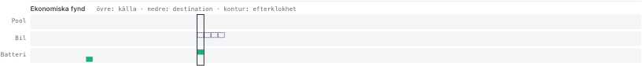

# Planner rule cleanup: 24-case impact, 10 October 2026

Compared the committed baseline `dbb1815` with the cleanup, using the same 24 captured case revisions, oracle/nominal lane, 17,200 W import limit and frozen work grant. The baseline was rebuilt from current committed Rust source before editing. The final run uses the rebuilt, source-verified WASM artifact. This is a local rerun; live deployments and the hosted bench database are unchanged.

Both runs use the same grid cash, 0.05 SEK/kWh battery wear, 3 SEK/start wear, and capped median-price end-store credit. Common net cost excludes the deleted rule deductions. Export remains at the declared benchmark limit of 13,200 W; the corrected import limit does not change that setting.

## Result

All 24 cases pass physical and required-service checks. The final plans have no service deductions and no EV supply-permission violations. Fourteen cases improve net cost, nine worsen, and one is unchanged.

| Across all cases | Before | After | Change |
|---|---:|---:|---:|
| Grid cash, SEK | 4,365.69 | 4,409.32 | +43.63 |
| Modelled wear, SEK | 231.72 | 239.67 | +7.95 |
| End-store credit, SEK | 1,453.12 | 1,511.91 | +58.80 |
| **Net cost, SEK** | **3,144.30** | **3,137.07** | **-7.22** |
| Heater starts | 59 | 62 | +3 |
| Physical / required-service failures | 0 / 0 | 0 / 0 | 0 |
| Old restart deductions, SEK | −20 | 0 | +20 |

Net cost improves by 7.22 SEK (0.23%). The grid cash bill rises by 43.63 SEK; more valuable energy left in the stores offsets it and the extra wear. This is not a 7.22 SEK reduction in immediate electricity purchases. The numerical score improves by 27.22 points, of which 20 comes from removing restart deductions and 7.22 from the common economic account.

Shortest completed heater run increases from 60 to 75 minutes; shortest interval between consecutive runs increases from 2.75 to 3 hours. These are measured outcomes, not new timing constraints. The 3 SEK/start cost remains the economic incentive against needless cycling.

## Each case

Negative Δ net is better. Savings are the independent audit’s additional demonstrated opportunities in the final plan, not savings already achieved by the cleanup. All cases pass.

| Case | Before net, SEK | After net, SEK | Δ net, SEK | Starts before → after | Further audit saving, SEK |
|---|---:|---:|---:|---:|---:|
| C-0103 | 602.65 | 602.63 | -0.02 | 2 → 2 | 0.21 |
| C-0217 | 646.40 | 646.42 | +0.02 | 2 → 2 | 0.97 |
| C-0327 | 98.42 | 98.36 | -0.06 | 3 → 3 | 0.00 |
| C-0401 | 124.78 | 124.72 | -0.06 | 3 → 4 | 0.16 |
| C-0523 | -11.92 | -11.74 | +0.18 | 3 → 3 | 3.04 |
| C-0616 | -61.85 | -61.64 | +0.20 | 3 → 3 | 0.73 |
| C-0627 | -20.78 | -21.14 | -0.36 | 2 → 2 | 0.54 |
| C-0717 | 28.21 | 28.16 | -0.05 | 3 → 3 | 0.06 |
| C-0810 | -28.05 | -29.17 | -1.11 | 3 → 3 | 0.97 |
| C-0816 | -51.41 | -52.77 | -1.35 | 2 → 3 | 1.42 |
| C-0822 | -14.61 | -14.41 | +0.19 | 2 → 2 | 2.75 |
| C-0827 | 60.27 | 56.27 | -4.00 | 4 → 3 | 0.13 |
| C-0905 | 8.59 | 9.10 | +0.51 | 3 → 3 | 2.79 |
| C-0912 | 13.21 | 13.03 | -0.18 | 2 → 2 | 3.09 |
| C-0919 | 74.86 | 74.24 | -0.62 | 2 → 2 | 7.69 |
| C-0920 | 79.67 | 80.54 | +0.87 | 2 → 2 | 4.61 |
| C-0924 | 186.41 | 184.59 | -1.82 | 3 → 4 | 2.55 |
| C-0927 | 102.75 | 102.77 | +0.02 | 4 → 4 | 1.59 |
| C-0928a | 151.37 | 151.35 | -0.02 | 3 → 3 | 1.86 |
| C-0928b | 144.57 | 143.97 | -0.61 | 3 → 3 | 4.06 |
| C-1005 | 67.89 | 68.59 | +0.70 | 2 → 2 | 0.84 |
| C-1011 | 135.20 | 135.15 | -0.05 | 1 → 1 | 0.26 |
| C-1123 | 619.14 | 619.14 | +0.00 | 1 → 1 | 0.00 |
| C-1219 | 188.55 | 188.92 | +0.37 | 1 → 2 | 0.00 |

**C-1005:** correcting the grid import limit already eliminates the former EV battery rule trigger in the baseline. The cleanup also has no EV permission violation, retains two heater starts, and raises net cost by 0.70 SEK; the audit identifies a further 0.84 SEK opportunity. The permission remains enforced even if future grid limits or prices make EV battery supply attractive.

## Audit and chart

The final independent audit finds **59 findings totalling 40.30 SEK**. All are known-price findings because this comparison supplies oracle prices; hindsight display is covered separately by tests. The bounded search does not establish optimality.

| Triggered economic family | Demonstrated saving, SEK |
|---|---:|
| `battery_headroom_solar` | 11.18 |
| `battery_preserve` | 0.80 |
| `battery_price_spread` | 8.26 |
| `ev_timing` | 0.11 |
| `high_value_export` | 18.83 |
| `pool_cheaper_heating` | 0.06 |
| `uneconomic_cycling` | 1.05 |

All eleven families remain available; four have no demonstrated finding in this run. Existing Rust causal witness searches still propose and accept economic repairs; the independent audit reports further feasible edits without charging their cost twice.

The score bar is replaced on the bench by three labeled audit lanes: Pool, Car and Battery. The upper half marks source quarters; the lower half marks destinations. Filled marks mean known prices, outlines mean hindsight. Selecting a quarter shows the actual audit family, one saving for the whole finding, and navigation to both endpoints. Comfort deductions stay in the detail and rule list; the production chart keeps its comfort strip.

UI preview below uses the E2E fixture to demonstrate known/hindsight markers; it is not one of the measured case results.

## Permission-only diagnostic

With the same cleaned solver but explicit EV battery permission enabled, aggregate net cost is 3133.80 SEK. Enforcing exclusion produces 3137.07 SEK, an observed +3.28 SEK difference. That allowed counterfactual contains 8 quarters exceeding the default non-EV eligibility bound. These are not violations under its explicitly enabled permission; they illustrate what the default exclusion prevents.

Proportional self-consumed PV attribution is the existing canonical scope semantics. The old rule used a different leftover-power attribution and a small deduction, so zero old EV rule triggers is not an enforcement guarantee. No claims are made about routing electrons on a shared bus.

## Validation and rollout

- Native Rust: 36 solver and 2 model tests passed, without warnings.
- Full `deno task test`: 1,659 passed.
- Full `npm run test:e2e:local`: 59 passed across all four mocked-backend suites.
- `npm run build` and `npm run typecheck`: passed; build reports the existing large-chunk warning.
- Full `npm run lint`: zero errors, 27 existing warnings.
- Migration timestamp uniqueness and migration preservation/trigger tests: passed.
- Real HA consumer fixtures regenerated with `deno task generate:ha-contract-fixture` and tested.
- Desktop audit markers and mobile detail inspected; keyboard selection and overflow checks passed.

Apply `20261010190000_remove_obsolete_planner_criteria.sql` before deploying the new runtime so saved obsolete overrides are removed once. Runtime rejects unknown rule keys; there is no ignored-rule compatibility path. Rebuilds must retain the checked-in generated WASM/manifest/runtime recipe and generated HA fixtures together. No Home Assistant code change is required: its existing selected supply scope applies the permission to live measured demand.

Final WASM SHA-256: `fc5fba81c5d09455b1b6548a82e1d49623c9139fa9e15a609a61db3954954632`.
Final planner identity: `wasm-v8:fd3d3fd5ee7bdb2b1e19fd331869b701574bac6572752a24139999fe20174819`.
